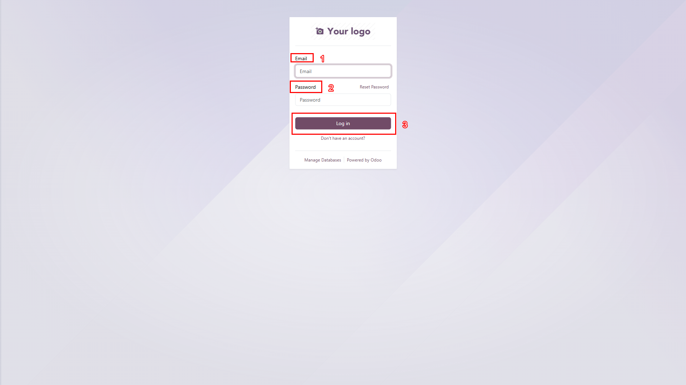
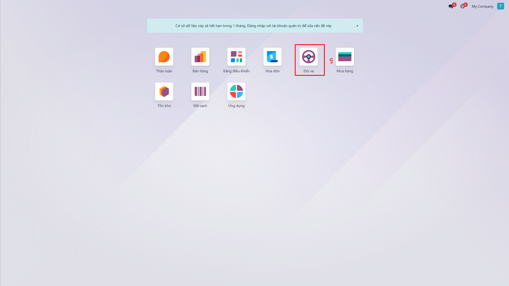
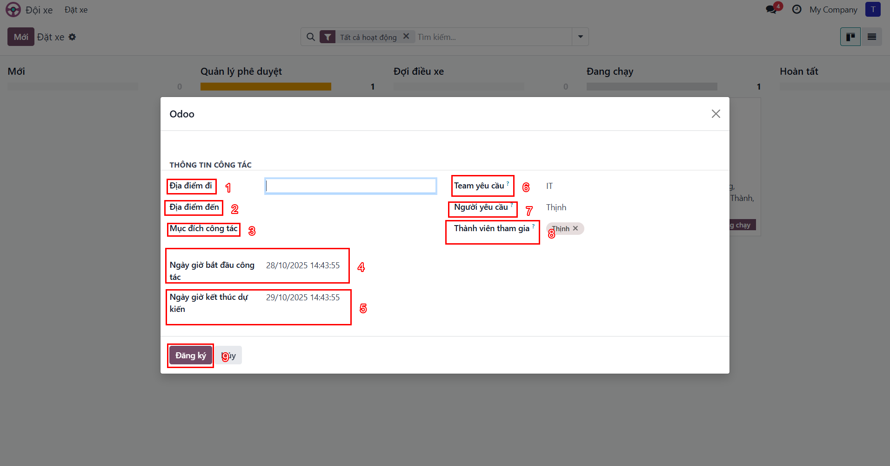
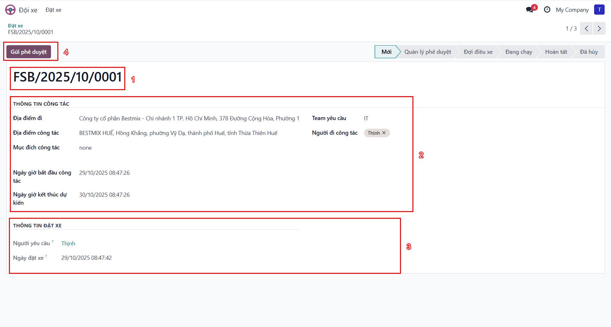
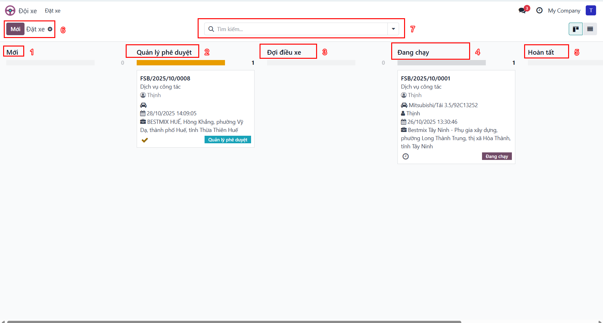
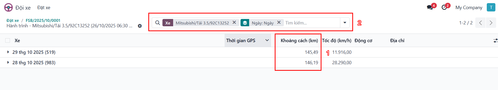
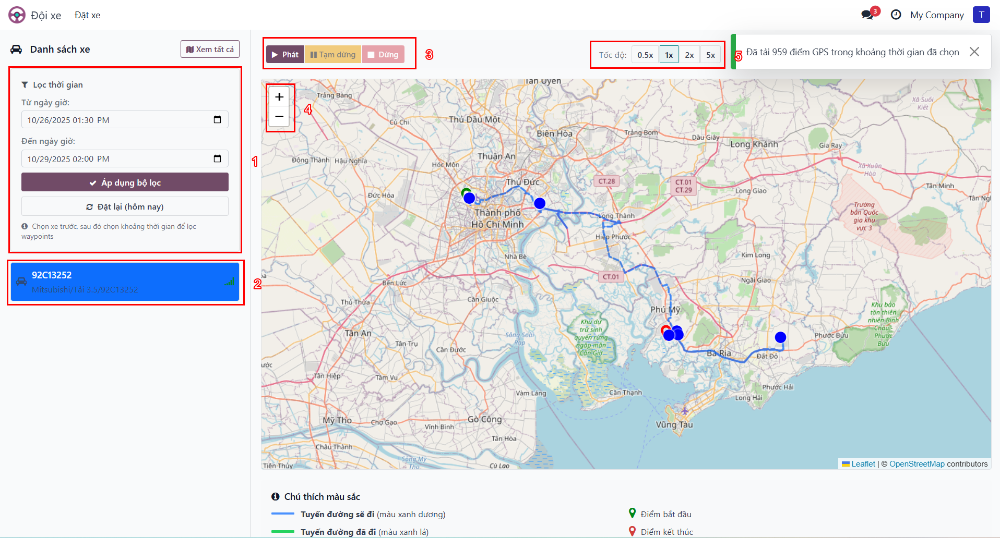

# Hướng dẫn Sử dụng Module Đội xe GPS - DÀNH CHO NHÂN VIÊN

**Phiên bản**: 18.0.9.0.0
**Công ty**: BESTMIX
**Ngày cập nhật**: Tháng 10/2025
**Đối tượng**: Nhân viên (Fleet User)

---

## Mục lục

### [Phần I: Giới thiệu](#phần-i-giới-thiệu)
- [1.1 Tổng quan Module](#11-tổng-quan-module)
- [1.2 Tính năng chính](#12-tính-năng-chính)
- [1.3 Lợi ích cho doanh nghiệp](#13-lợi-ích-cho-doanh-nghiệp)
- [1.4 Đối tượng sử dụng](#14-đối-tượng-sử-dụng)

### [Phần II: Bắt đầu](#phần-ii-bắt-đầu)
- [2.1 Đăng nhập hệ thống](#21-đăng-nhập-hệ-thống)
- [2.2 Giao diện Bảng điều khiển](#22-giao-diện-dashboard)
- [2.3 Điều hướng cơ bản](#23-điều-hướng-cơ-bản)

### [Phần III: Hướng dẫn Sử dụng](#phần-iii-hướng-dẫn-sử-dụng)
- [3.1 Truy cập Module Đội xe](#31-truy-cập-module-đội-xe)
- [3.2 Tạo đơn đặt xe mới](#32-tạo-đơn-đặt-xe-mới)
- [3.3 Quản lý đơn đặt xe](#33-quản-lý-đơn-đặt-xe)
- [3.4 Xem hành trình GPS](#34-xem-hành-trình-gps)

### [Phần IV: Quy trình Nghiệp vụ](#phần-iv-quy-trình-nghiệp-vụ)
- [4.1 Quy trình Đặt xe cơ bản](#41-quy-trình-đặt-xe-cơ-bản)
- [4.2 Các trường hợp đặc biệt](#42-các-trường-hợp-đặc-biệt)

### [Phần V: Tính năng Nâng cao](#phần-v-tính-năng-nâng-cao)
- [5.1 Tìm kiếm và Lọc](#51-tìm-kiếm-và-lọc)
- [5.2 Thông báo và Hoạt động](#52-thông-báo-và-activities)
- [5.3 Mẹo và Thủ thuật](#53-mẹo-và-thủ-thuật)

### [Phần VI: Câu hỏi thường gặp và Xử lý sự cố](#phần-vi-faq-và-troubleshooting)
- [6.1 Câu hỏi thường gặp](#61-câu-hỏi-thường-gặp)
- [6.2 Xử lý lỗi thường gặp](#62-xử-lý-lỗi-thường-gặp)

### [Phụ lục](#phụ-lục)
- [Phụ lục A: Bảng thuật ngữ](#phụ-lục-a-bảng-thuật-ngữ)
- [Phụ lục B: Bảng trạng thái và màu sắc](#phụ-lục-b-bảng-trạng-thái-và-màu-sắc)
- [Phụ lục C: Quyền truy cập theo vai trò](#phụ-lục-c-quyền-truy-cập-theo-vai-trò)

---

# Phần I: Giới thiệu

## 1.1 Tổng quan Module

Module **Đội xe GPS** (BM Fleet GPS Tracking) là giải pháp quản lý đội xe toàn diện được tích hợp với hệ thống GPS ADSUN, giúp doanh nghiệp:

- **Theo dõi vị trí xe** theo thời gian thực
- **Quản lý yêu cầu đặt xe** với quy trình phê duyệt chặt chẽ
- **Điều phối xe** hiệu quả cho các công tác và giao nhận
- **Giám sát hành trình** với dữ liệu GPS chi tiết
- **Tối ưu hóa** việc sử dụng tài nguyên xe

Module được thiết kế theo tiêu chuẩn Odoo 18, tích hợp sâu với hệ thống Quản lý Đội xe và Mail Activity.

## 1.2 Tính năng chính

### 🚗 Quản lý Yêu cầu Đặt xe

- **Tạo đơn nhanh**: Cửa sổ tạo đơn với giao diện thân thiện
- **Gợi ý địa chỉ thông minh**: Tích hợp OpenMap.vn cho địa chỉ Việt Nam
- **Lịch sử địa chỉ**: Ghi nhớ và gợi ý địa chỉ thường dùng
- **Quy trình phê duyệt**: Workflow tự động với 6 trạng thái

### 📍 Theo dõi GPS Real-time

- **Vị trí hiện tại**: Cập nhật vị trí xe theo thời gian thực
- **Trạng thái xe**: Phân biệt Offline / Idle / Running
- **Hành trình chi tiết**: Waypoints với timestamp, tọa độ, tốc độ
- **Thống kê**: Tổng quãng đường, tốc độ trung bình, thời gian chạy

### 🗺️ Bản đồ Hành trình

- **Bản đồ tương tác**: Sử dụng Leaflet.js + OpenStreetMap
- **Hiển thị tuyến đường**: Đường đi với điểm bắt đầu/kết thúc
- **Clustering**: Nhóm xe theo khu vực khi zoom out
- **Lọc nâng cao**: Theo xe, ngày, booking

### ✅ Quy trình Phê duyệt

1. **Mới** - Nhân viên tạo đơn
2. **Quản lý phê duyệt** - Chờ Quản lý duyệt
3. **Đợi điều xe** (Chờ điều xe) - Chờ Sale Admin phân xe
4. **Đang chạy** - Xe đã được điều phối
5. **Hoàn tất** (Hoàn tất) - Công tác hoàn thành
6. **Đã hủy** (Đã hủy) - Đơn bị từ chối

### 🔔 Thông báo Tự động

- **Thông báo công việc**: Thông báo cho người phê duyệt
- **Mail tracking**: Ghi lại lịch sử thay đổi
- **Khu vực trao đổi**: Trao đổi và ghi chú trong đơn

## 1.3 Lợi ích cho doanh nghiệp

| Lợi ích | Mô tả |
|---------|-------|
| **Minh bạch** | Theo dõi toàn bộ quá trình từ yêu cầu đến hoàn thành |
| **Tiết kiệm** | Tối ưu hóa việc sử dụng xe, giảm chi phí vận hành |
| **An toàn** | Giám sát hành trình, kiểm soát tốc độ và vi phạm |
| **Hiệu quả** | Quy trình phê duyệt tự động, giảm thời gian xử lý |
| **Chính xác** | Dữ liệu GPS thời gian thực, báo cáo chi tiết |

## 1.4 Đối tượng sử dụng

Module được thiết kế cho 3 vai trò chính:

### 👤 Nhân viên (VAI TRÒ CỦA BẠN)

**Quyền hạn**:
- ✅ Tạo yêu cầu đặt xe cho công tác
- ✅ Xem đơn đặt xe của mình
- ✅ Theo dõi trạng thái phê duyệt
- ✅ Xem hành trình GPS sau khi xe được điều phối

**Nhóm quyền**: `Người dùng BM Fleet`

### 👔 Quản lý

**Quyền hạn**:
- Tất cả quyền của Nhân viên
- Phê duyệt/Từ chối đơn đặt xe của team
- Tạo đơn đặt xe thay nhân viên
- Xem đơn của toàn bộ team

**Nhóm quyền**: `Người dùng BM Fleet` (với quyền Manager)

💡 **Lưu ý**: Để biết thêm về quy trình phê duyệt, xem *Hướng dẫn dành cho Quản lý*

### 🔧 Sale Admin

**Quyền hạn**:
- Tất cả quyền của Manager
- Điều phối xe và tài xế
- Cấu hình thiết bị GPS
- Xem bản đồ tất cả xe
- Quản lý xe và kiểm tra phạt nguội
- Hoàn thành đơn đặt xe

**Nhóm quyền**: `Sale Admin BM Fleet`

💡 **Lưu ý**: Để biết thêm về điều xe và quản lý GPS, xem *Hướng dẫn dành cho Sale Admin*

---

# Phần II: Bắt đầu

## 2.1 Đăng nhập hệ thống

### Các bước đăng nhập

1. Mở trình duyệt web và truy cập địa chỉ hệ thống Odoo
2. Nhập thông tin đăng nhập:
   - **Email/Login**: Tài khoản được cấp bởi Admin
   - **Password**: Mật khẩu của bạn
3. Nhấn nút **Đăng nhập**



**Các thành phần trên màn hình**:
- ❶ Trường **Email/Login**: Nhập tài khoản
- ❷ Trường **Password**: Nhập mật khẩu
- ❸ Nút **Đăng nhập**: Đăng nhập vào hệ thống

💡 **Mẹo**:
- Nếu quên mật khẩu, nhấn **Đặt lại mật khẩu** để nhận email khôi phục
- Hỗ trợ đăng nhập bằng Google/Microsoft nếu được cấu hình

⚠️ **Cảnh báo**:
- Không chia sẻ thông tin đăng nhập với người khác
- Sau 5 lần nhập sai, tài khoản sẽ bị khóa tạm thời

## 2.2 Giao diện Bảng điều khiển

Sau khi đăng nhập thành công, bạn sẽ thấy Bảng điều khiển chính của Odoo với các module được cài đặt.

### Bảng điều khiển theo vai trò

Giao diện Bảng điều khiển sẽ khác nhau tùy theo vai trò:

#### Nhân viên (VAI TRÒ CỦA BẠN)

- **Module hiển thị**: Đội xe, Discuss, Calendar
- **Menu chính**: Đội xe → Đặt xe
- **Truy cập**: Chỉ xem được đơn của mình



#### Quản lý

- **Module hiển thị**: Đội xe, Discuss, Calendar, Approvals
- **Menu chính**: Đội xe → Đặt xe, Phê duyệt
- **Truy cập**: Xem đơn của team và đơn cần phê duyệt

#### Sale Admin

- **Module hiển thị**: Đội xe, Xe, Hành trình, Cấu hình
- **Menu chính**: Tất cả menu trong module
- **Truy cập**: Toàn bộ dữ liệu

## 2.3 Điều hướng cơ bản

### Cấu trúc Menu Module Đội xe

```
📦 Đội xe
├── 📋 Đặt xe
│   ├── Tất cả đơn đặt xe
│   └── Tạo đơn mới (Nút "Mới")
├── 🚗 Xe (Sale Admin only)
│   ├── Danh sách xe
│   └── Cấu hình GPS
├── 🗺️ Hành trình (Sale Admin only)
│   ├── Bản đồ
│   ├── Danh sách Waypoints
│   └── Báo cáo
└── ⚙️ Cấu hình (Sale Admin only)
    ├── Loại dịch vụ
    └── Cài đặt API
```

💡 **Lưu ý**: Với vai trò Nhân viên, bạn chỉ có thể truy cập menu **Đặt xe**.

### Các thành phần giao diện Odoo

| Thành phần | Vị trí | Chức năng |
|------------|--------|-----------|
| **Menu ứng dụng** | Góc trên bên trái | Chuyển đổi giữa các module |
| **Breadcrumb** | Trên cùng, giữa | Hiển thị vị trí hiện tại |
| **Thanh tìm kiếm** | Góc trên bên phải | Tìm kiếm nhanh |
| **Menu người dùng** | Góc trên bên phải | Thông tin user, đăng xuất |
| **Nút tạo mới** | Dưới breadcrumb | Tạo mới đơn (Nút "Mới") |
| **Bảng lọc** | Bên trái | Bộ lọc và nhóm dữ liệu |
| **Chuyển đổi giao diện** | Góc phải | Chuyển đổi giữa Giao diện thẻ/List/Form |

### Phím tắt hữu ích

| Phím tắt | Chức năng |
|----------|-----------|
| `Alt + N` hoặc `Ctrl + Alt + N` | Tạo mới đơn |
| `Alt + E` hoặc `Ctrl + Alt + E` | Chỉnh sửa đơn |
| `Alt + S` hoặc `Ctrl + Alt + S` | Lưu đơn |
| `Alt + D` hoặc `Ctrl + Alt + D` | Hủy chỉnh sửa |
| `Alt + J` | Mở khu vực trao đổi |
| `Ctrl + K` | Command palette (tìm kiếm nhanh) |

📝 **Lưu ý**: Phím tắt có thể khác nhau trên macOS (Cmd thay vì Ctrl)

---

# Phần III: Hướng dẫn Sử dụng

Phần này hướng dẫn chi tiết cho **Nhân viên** (Employee) cách sử dụng module để tạo và quản lý yêu cầu đặt xe.

## 3.1 Truy cập Module Đội xe

### Các bước truy cập

1. Từ Bảng điều khiển chính, click vào icon **Đội xe**
2. Hoặc sử dụng menu trên cùng: **Đội xe** → **Đặt xe**


✅ **Kết quả**: Bạn sẽ thấy màn hình **Giao diện thẻ** với các đơn đặt xe

## 3.2 Tạo đơn đặt xe mới

Có 2 cách để tạo đơn đặt xe:

### Cách 1: Sử dụng Tạo nhanh (Khuyến nghị)

Đây là cách nhanh nhất để tạo đơn đặt xe mới.

#### Các bước thực hiện

1. Tại màn hình Giao diện thẻ, nhấn nút **Mới** (hoặc nhấn `Alt + N`)
2. Cửa sổ **Tạo nhanh** xuất hiện
3. Điền thông tin cần thiết:



**Các trường thông tin**:

| Số | Trường | Bắt buộc | Mô tả |
|----|--------|----------|-------|
| ❶ | **Địa điểm đi** | ✅ Có | Nhập địa chỉ khởi hành (tối thiểu 3 ký tự để có gợi ý) |
| ❷ | **Địa điểm đến** | ✅ Có | Nhập địa chỉ đích đến (tối thiểu 3 ký tự để có gợi ý) |
| ❸ | **Mục đích công tác** | ✅ Có | Mô tả ngắn gọn mục đích chuyến đi |
| ❹ | **Ngày giờ bắt đầu công tác** | ✅ Có | Chọn ngày và giờ dự kiến khởi hành |
| ❺ | **Ngày giờ kết thúc dự kiến** | ✅ Có | Chọn ngày và giờ dự kiến kết thúc |
| ❻ | **Team yêu cầu** | ✅ Có | Chọn phòng ban/team của bạn |
| ❼ | **Người yêu cầu** | Auto | Tự động điền = người đang đăng nhập |
| ❽ | **Thành viên tham gia** | ⭕ Không | Chọn thêm người đi cùng (nếu có) |
| ❾ | **Nút Đăng ký** | - | Nhấn để tạo đơn |

4. Nhấn nút **Đăng ký** (Lưu)

✅ **Kết quả**: Đơn đặt xe được tạo với trạng thái **Mới**

### Tính năng Gợi ý Địa chỉ Thông minh

Module tích hợp OpenMap.vn API để hỗ trợ nhập địa chỉ:

💡 **Cách sử dụng**:
1. Nhập tối thiểu 3 ký tự vào trường địa chỉ
2. Hệ thống hiển thị danh sách gợi ý
3. Click chọn địa chỉ từ danh sách

**Ưu tiên gợi ý**:
- ⭐ **Địa chỉ thường dùng**: Địa chỉ bạn đã sử dụng trước đó
- 🌐 **Địa chỉ OpenMap**: Địa chỉ từ cơ sở dữ liệu quốc gia

⚠️ **Lưu ý**:
- Nên chọn từ danh sách gợi ý để có tọa độ GPS chính xác
- Nếu không tìm thấy, có thể nhập tự do nhưng có thể ảnh hưởng độ chính xác bản đồ

### Cách 2: Sử dụng Form đầy đủ

Nếu cần nhập thêm thông tin chi tiết:

1. Nhấn nút **Mới**
2. Tại Tạo nhanh, nhấn nút **Chỉnh sửa chi tiết** (hoặc `Alt + E`)
3. Màn hình chi tiết đầy đủ xuất hiện:



**Thông tin bổ sung có thể nhập**:
- **Ghi chú**: Thông tin thêm về chuyến đi
- **Tài liệu đính kèm**: Upload file liên quan

4. Nhấn **Lưu** khi hoàn tất

## 3.3 Quản lý đơn đặt xe

### Xem danh sách đơn đặt xe

Sau khi tạo đơn, bạn có thể xem và quản lý đơn qua **Giao diện thẻ**.



### Các cột trạng thái

Đơn đặt xe sẽ di chuyển qua các cột theo quy trình:

| Cột | Trạng thái | Màu sắc | Mô tả |
|-----|------------|---------|-------|
| **Mới** | `new` | Xám | Đơn vừa tạo, chưa gửi phê duyệt |
| **Quản lý phê duyệt** | `pending_manager` | Xanh dương | Chờ Quản lý phê duyệt |
| **Đợi điều xe** | `pending_dispatch` | Cam | Quản lý đã duyệt, chờ Sale Admin điều xe |
| **Đang chạy** | `running` | Tím | Xe đã được điều phối, đang thực hiện |
| **Hoàn tất** | `done` | Xanh lá | Chuyến đi hoàn thành |

📝 **Lưu ý**: Cột **Đã hủy** (Đã hủy) không hiển thị mặc định. Sử dụng bộ lọc để xem.

### Gửi đơn để phê duyệt

Sau khi tạo đơn ở trạng thái **Mới**, bạn cần gửi đi phê duyệt:

1. Click vào đơn đặt xe để mở
2. Kiểm tra lại thông tin
3. Nhấn nút **Gửi phê duyệt** (Gửi phê duyệt)

✅ **Kết quả**:
- Đơn chuyển sang trạng thái **Quản lý phê duyệt**
- Hệ thống tự động tạo thông báo công việc cho Quản lý
- Quản lý nhận thông báo

💡 **Lưu ý**: Sau khi gửi phê duyệt, bạn không thể chỉnh sửa đơn nữa. Nếu cần sửa, hãy liên hệ Quản lý để đặt lại đơn về trạng thái **Mới**.

### Theo dõi trạng thái đơn

Để biết đơn đang ở đâu trong quy trình:

**Cách 1: Xem trên Giao diện thẻ**
- Đơn của bạn xuất hiện ở cột tương ứng với trạng thái

**Cách 2: Xem chi tiết trong Form**
- Mở đơn → Xem **Thanh trạng thái** ở trên cùng
- Các trạng thái đã qua sẽ được highlight

**Cách 3: Theo dõi Thông báo công việc**
- Chuông thông báo ở góc phải trên
- Số đỏ hiển thị số thông báo chưa đọc

### Chỉnh sửa đơn đang chờ

⚠️ **Quan trọng**: Chỉ có thể chỉnh sửa đơn khi ở trạng thái **Mới**

Nếu cần sửa đơn đã gửi phê duyệt:
1. Liên hệ Quản lý để **Đặt lại** đơn về trạng thái **Mới**
2. Sau đó bạn có thể chỉnh sửa
3. Gửi lại phê duyệt

💡 **Mẹo**: Kiểm tra kỹ thông tin trước khi gửi phê duyệt để tránh phải sửa lại.

## 3.4 Xem hành trình GPS

Sau khi đơn ở trạng thái **Đang chạy** hoặc **Hoàn tất**, bạn có thể xem hành trình GPS.

### Xem danh sách Hành trình

1. Mở đơn đặt xe đã được điều xe
2. Click vào **Nút thông minh Hành trình**



✅ **Kết quả**: Danh sách các điểm GPS (waypoints) hiển thị với:
- Thời gian
- Tọa độ (Latitude/Longitude)
- Địa chỉ (nếu có)
- Tốc độ (km/h)
- Quãng đường (km)

### Xem Bản đồ Tuyến đường

1. Mở đơn đặt xe đã được điều xe
2. Click vào **Nút thông minh Tuyến đường**



✅ **Kết quả**: Bản đồ hiển thị:
- **Đường đi thực tế**: Đường nối các waypoints GPS
- **Điểm bắt đầu**: Marker màu xanh lá
- **Điểm kết thúc**: Marker màu đỏ
- **Thông tin chi tiết**: Click vào marker để xem

💡 **Mẹo**:
- Zoom in/out để xem chi tiết
- Click vào các điểm trên đường để xem thời gian đi qua
- Sử dụng bộ lọc để xem theo khoảng thời gian

---

# Phần IV: Quy trình Nghiệp vụ

## 4.1 Quy trình Đặt xe cơ bản

### Sơ đồ Quy trình

```
     ┌─────────────┐
     │     Mới     │
     │    (Mới)    │
     └─────────────┘
           │
           │ Gửi phê duyệt
           ▼
     ┌─────────────┐
     │   Quản lý   │
     │  phê duyệt  │
     └─────────────┘
           │
           │ Phê duyệt
           ▼
     ┌─────────────┐
     │ Đợi điều xe │
     │ (Chờ điều xe)   │
     └─────────────┘
           │
           │ Điều xe (Sale Admin)
           ▼
     ┌─────────────┐
     │  Đang chạy  │
     │  (Running)  │
     └─────────────┘
           │
           │ Hoàn thành (Sale Admin)
           ▼
     ┌─────────────┐
     │   Hoàn tất  │
     │   (Hoàn tất)    │
     └─────────────┘
```

💡 **Lưu ý**: Đơn có thể bị **Từ chối** ở bất kỳ giai đoạn nào và chuyển sang trạng thái **Đã hủy**.

### Chi tiết từng Giai đoạn (Dành cho Nhân viên)

#### Giai đoạn 1: Tạo đơn

**Người thực hiện**: Nhân viên (Bạn)
**Thời gian**: 2-5 phút

**Các bước**:
1. Nhân viên đăng nhập hệ thống
2. Truy cập Module Đội xe
3. Tạo đơn đặt xe mới (Tạo nhanh hoặc Form đầy đủ)
4. Điền thông tin:
   - Địa điểm đi/đến
   - Mục đích công tác
   - Thời gian
   - Team và thành viên
5. Lưu đơn → Trạng thái **Mới**

**Kết quả**:
- Đơn được lưu nhưng chưa gửi phê duyệt
- Nhân viên có thể chỉnh sửa thoải mái

💡 **Mẹo**: Kiểm tra kỹ thông tin trước khi chuyển sang giai đoạn tiếp theo.

#### Giai đoạn 2: Gửi phê duyệt

**Người thực hiện**: Nhân viên (Bạn)
**Thời gian**: Vài giây

**Các bước**:
1. Nhân viên kiểm tra lại thông tin đơn
2. Nhấn nút **Gửi phê duyệt**
3. Đơn chuyển sang trạng thái **Quản lý phê duyệt**

**Kết quả**:
- Hệ thống tạo thông báo công việc cho Quản lý
- Quản lý nhận thông báo qua email và in-app
- Nhân viên không thể chỉnh sửa đơn nữa

**Thời gian chờ**: Tùy Quản lý, thường 1-24 giờ

💡 **Lưu ý**: Sau bước này, bạn chỉ có thể theo dõi và chờ Quản lý xử lý. Xem phần [Theo dõi trạng thái đơn](#theo-dõi-trạng-thái-đơn) để biết cách theo dõi.

#### Giai đoạn tiếp theo

💡 **Thông tin**: Sau khi bạn gửi phê duyệt, Quản lý sẽ xử lý đơn. Nếu được duyệt, Sale Admin sẽ điều xe và bạn sẽ nhận được thông báo khi xe được phân công.

Để biết chi tiết về các giai đoạn phê duyệt và điều xe, xem:
- *Hướng dẫn dành cho Quản lý, Phần 4* - Quy trình Phê duyệt
- *Hướng dẫn dành cho Sale Admin, Phần 5* - Quy trình Điều xe

## 4.2 Các trường hợp đặc biệt

### Đặt lại đơn đã Từ chối

**Khi nào**: Nhân viên muốn sửa đơn đã bị từ chối

**Các bước**:
1. Nhân viên mở đơn ở trạng thái **Đã hủy**
2. Nhấn nút **Đặt lại**
3. Đơn quay về trạng thái **Mới**
4. Nhân viên chỉnh sửa theo góp ý
5. Gửi lại phê duyệt

**Lưu ý**:
- Chỉ người tạo đơn hoặc Manager có thể Đặt lại
- Nên đọc kỹ lý do từ chối trước khi sửa
- Kiểm tra lại các thông tin cần điều chỉnh

💡 **Mẹo**: Lý do từ chối thường được ghi trong khu vực trao đổi hoặc email thông báo. Đọc kỹ để biết cần sửa gì.

### Hủy đơn chưa gửi phê duyệt

**Khi nào**: Bạn tạo nhầm hoặc không cần xe nữa

**Các bước**:
1. Mở đơn ở trạng thái **Mới**
2. Click nút **Action** → **Xóa**
3. Xác nhận xóa

✅ **Kết quả**: Đơn bị xóa khỏi hệ thống

### Hủy đơn đã gửi phê duyệt

**Khi nào**: Công tác bị hủy sau khi đã gửi phê duyệt

**Các bước**:
1. Liên hệ Quản lý hoặc Sale Admin (tùy trạng thái)
2. Thông báo lý do hủy
3. Quản lý/Sale Admin sẽ xử lý việc hủy đơn

⚠️ **Lưu ý**:
- Nếu đơn đang ở trạng thái **Đang chạy**, việc hủy có thể phát sinh chi phí
- Nên thông báo sớm nhất có thể để tránh lãng phí tài nguyên

---

# Phần V: Tính năng Nâng cao

## 5.1 Tìm kiếm và Lọc

### Tìm kiếm Nhanh

Tại màn hình danh sách đơn đặt xe, sử dụng thanh tìm kiếm:

**Có thể tìm theo**:
- Mã đơn (FSB/2025/10/0001)
- Địa điểm đến
- Tên xe
- Tên tài xế
- Người yêu cầu

**Cú pháp**:
- Nhập từ khóa → Tự động tìm
- Dùng dấu ngoặc kép cho cụm từ: `"Hồ Chí Minh"`

### Bộ lọc

Click vào **Bộ lọc** để mở bảng lọc:

**Bộ lọc theo Trạng thái**:
- **Tất cả hoạt động**: Tất cả đơn đang hoạt động
- **Mới tạo**: Đơn mới tạo
- **Chờ phê duyệt**: Chờ phê duyệt
- **Chờ điều xe**: Chờ điều xe
- **Đang chạy**: Đang chạy
- **Hoàn tất**: Hoàn tất
- **Đã hủy**: Đã hủy

**Bộ lọc theo Thời gian**:
- **Hôm nay**: Hôm nay
- **Tuần này**: Tuần này
- **Tháng này**: Tháng này
- **7 ngày qua**: 7 ngày qua
- **30 ngày qua**: 30 ngày qua

**Bộ lọc theo Người**:
- **Đơn của tôi**: Đơn của tôi
- **Được gán cho tôi**: Đơn được gán cho tôi

💡 **Mẹo**: Có thể kết hợp nhiều bộ lọc cùng lúc để tìm chính xác đơn cần xem.

### Nhóm theo

Sử dụng **Nhóm theo** để tổ chức dữ liệu:

**Nhóm theo**:
- **State**: Theo trạng thái
- **Team**: Theo phòng ban
- **Vehicle**: Theo xe
- **Date**: Theo ngày

**Ví dụ**:
- Nhóm theo State → Thấy rõ số đơn ở mỗi trạng thái
- Nhóm theo Date → Xem đơn theo thời gian

### Yêu thích

Lưu các bộ lọc thường dùng:

1. Thiết lập bộ lọc + group by
2. Click **Yêu thích** → **Lưu current search**
3. Đặt tên (ví dụ: "Đơn của tôi tháng này")
4. Click **Lưu**

✅ **Kết quả**: Lần sau chỉ cần click vào Favorite đã lưu

## 5.2 Thông báo và Activities

### Loại Thông báo

Module gửi 3 loại thông báo:

| Loại | Kênh | Đối tượng | Khi nào |
|------|------|-----------|---------|
| **Thông báo công việc** | In-app | Quản lý/Sale Admin | Có đơn cần xử lý |
| **Email** | Email | Tất cả người liên quan | Thay đổi trạng thái quan trọng |
| **Khu vực trao đổi** | In-app | Người theo dõi | Mọi thay đổi |

### Quản lý Hoạt động

#### Xem Thông báo của mình

1. Click icon **Chuông** (bell) ở góc phải trên
2. Danh sách thông báo hiển thị
3. Click vào thông báo để xem chi tiết

💡 **Mẹo**: Số đỏ trên icon chuông cho biết số thông báo chưa đọc.

#### Đánh dấu đã đọc

1. Mở thông báo
2. Click vào thông báo để mở đơn liên quan
3. Thông báo tự động được đánh dấu đã đọc

### Theo dõi Đơn

Để nhận thông báo về đơn cụ thể:

1. Mở đơn đặt xe
2. Trong khu vực trao đổi, click **Theo dõi**
3. Chọn **Subtypes** (loại thông báo muốn nhận)
4. Click **Follow**

✅ **Kết quả**: Bạn nhận email mỗi khi đơn có thay đổi

💡 **Lưu ý**: Mặc định, bạn tự động theo dõi các đơn do mình tạo.

## 5.3 Mẹo và Thủ thuật

### Cho Nhân viên

💡 **Đặt xe sớm**: Đặt trước ít nhất 1 ngày để đảm bảo có xe
💡 **Mô tả rõ ràng**: Mục đích càng chi tiết, càng dễ được duyệt
💡 **Dùng địa chỉ gợi ý**: Chọn từ danh sách để có GPS chính xác
💡 **Check status thường xuyên**: Kiểm tra notification để biết tiến độ
💡 **Lưu địa chỉ thường dùng**: Hệ thống sẽ gợi ý lần sau
💡 **Liên hệ sớm**: Nếu có vấn đề, liên hệ Quản lý/Sale Admin ngay
💡 **Đọc email thông báo**: Theo dõi email để không bỏ lỡ cập nhật quan trọng

### Phím tắt hữu ích

📌 **Xem danh sách đầy đủ các phím tắt tại [Phần II, mục 2.3](#phím-tắt-hữu-ích)**

**Các phím tắt thường dùng nhất**:
- `Alt + N`: Tạo đơn mới
- `Ctrl + K`: Tìm kiếm nhanh
- `Alt + J`: Mở khu vực trao đổi
- `F5`: Refresh trang

---

# Phần VI: Câu hỏi thường gặp và Xử lý sự cố

## 6.1 Câu hỏi thường gặp

### Câu hỏi chung

**Q1: Tôi có thể đặt xe cho người khác không?**

**A**:
- **Nhân viên**: Không, chỉ đặt cho mình
- **Manager**: Có, có thể tạo đơn thay cho nhân viên trong team
- **Sale Admin**: Có, có thể tạo cho bất kỳ ai

**Q2: Mất bao lâu để đơn được phê duyệt?**

**A**:
- **SLA chuẩn**: 1 ngày làm việc
- **Khẩn cấp**: Có thể trong 2 giờ (cần liên hệ Manager trực tiếp)
- **Thực tế**: Phụ thuộc vào Manager và workload

💡 **Mẹo**: Đặt xe sớm để có thời gian xử lý phê duyệt.

**Q3: Tôi có thể hủy đơn đã gửi không?**

**A**:
- **Trạng thái Mới**: Có, delete trực tiếp
- **Trạng thái Chờ duyệt**: Liên hệ Manager để reset
- **Trạng thái Đang chạy**: Liên hệ Sale Admin, có thể phát sinh phí

⚠️ **Lưu ý**: Hủy đơn muộn có thể gây lãng phí tài nguyên và ảnh hưởng đến uy tín.

**Q4: GPS không cập nhật phải làm sao?**

**A**:
- Kiểm tra xe có GPS device không (hỏi Sale Admin)
- Đợi 5-10 phút (sync interval)
- Liên hệ Sale Admin nếu vẫn không được

**Q5: Tôi quên mật khẩu, làm thế nào?**

**A**:
- Tại màn hình login, click **Đặt lại mật khẩu**
- Nhập email đăng ký
- Check email để nhận link reset
- Click link và đặt mật khẩu mới

### Câu hỏi về Quy trình

**Q6: Tại sao đơn của tôi bị từ chối?**

**A**:
- Xem lý do trong khu vực trao đổi hoặc email thông báo
- Liên hệ Manager để làm rõ
- Sửa theo góp ý và gửi lại

💡 **Mẹo**: Đọc kỹ lý do từ chối để hiểu rõ vấn đề và sửa đúng điểm.

**Q7: Tôi có thể thay đổi địa điểm sau khi Manager duyệt không?**

**A**:
- **Không trực tiếp**, vì đã qua giai đoạn phê duyệt
- **Giải pháp**: Liên hệ Sale Admin để note lại thay đổi
- **Hoặc**: Hủy đơn cũ và tạo đơn mới (nếu chưa dispatch)

**Q8: Xe đến muộn, tôi nên làm gì?**

**A**:
- Check GPS để xem xe đang ở đâu
- Liên hệ tài xế qua số điện thoại (xem trong đơn đặt xe)
- Thông báo cho Sale Admin nếu muộn quá 30 phút

**Q9: Tôi có thể gia hạn thời gian sử dụng xe không?**

**A**:
- Liên hệ Sale Admin trước khi hết giờ
- Sale Admin kiểm tra lịch xe
- Nếu xe không bận chuyến sau, có thể gia hạn

⚠️ **Lưu ý**: Liên hệ sớm để Sale Admin có thời gian điều chỉnh lịch.

**Q10: Làm sao biết xe nào đang rảnh?**

**A**:
- **Nhân viên**: Không thấy được, hãy để Sale Admin quyết định
- Bạn chỉ cần tạo đơn với thông tin chi tiết, Sale Admin sẽ chọn xe phù hợp

### Câu hỏi Kỹ thuật

**Q11: Tôi không thấy module Đội xe?**

**A**:
- Kiểm tra quyền truy cập (liên hệ Admin)
- Refresh trình duyệt (`Ctrl + F5`)
- Đăng xuất và đăng nhập lại

**Q12: Gợi ý địa chỉ không hoạt động?**

**A**:
- Kiểm tra kết nối Internet
- Đảm bảo nhập ít nhất 3 ký tự
- Thử refresh trang
- Có thể nhập thủ công nếu gợi ý không khả dụng

**Q13: Bản đồ không load?**

**A**:
- Kiểm tra Internet connection
- Disable browser extensions (AdBlock, etc.)
- Thử trình duyệt khác (Chrome khuyến nghị)
- Clear browser cache

**Q14: Tôi muốn xuất báo cáo nhưng không thấy nút Xuất?**

**A**:
- Chuyển sang **Giao diện danh sách** (icon list)
- Chọn ít nhất 1 đơn
- Nút **Action** → **Xuất** sẽ xuất hiện

**Q15: Upload file đính kèm bị lỗi?**

**A**:
- Kiểm tra kích thước file (< 25MB)
- Kiểm tra định dạng (PDF, DOC, XLS, PNG, JPG allowed)
- Thử file khác để test

## 6.2 Xử lý lỗi thường gặp

### Lỗi Đăng nhập

#### Lỗi: "Invalid username or password"

**Nguyên nhân**:
- Sai email/username
- Sai mật khẩu
- Account bị khóa

**Giải pháp**:
1. Kiểm tra Caps Lock
2. Copy-paste username/password để tránh typo
3. Đặt lại password nếu quên
4. Liên hệ Admin nếu account bị khóa

#### Lỗi: "Database not found"

**Nguyên nhân**: URL sai hoặc database không tồn tại

**Giải pháp**:
1. Kiểm tra lại URL
2. Liên hệ Admin để xác nhận database name

### Lỗi Tạo đơn

#### Lỗi: "Required field missing"

**Nguyên nhân**: Chưa điền đủ thông tin bắt buộc

**Giải pháp**:
- Kiểm tra các trường có dấu `*` (bắt buộc)
- Điền đầy đủ thông tin
- Thử lại

#### Lỗi: "Validation Error: End date must be after start date"

**Nguyên nhân**: Ngày kết thúc trước ngày bắt đầu

**Giải pháp**:
- Kiểm tra lại **Ngày giờ bắt đầu** và **Ngày giờ kết thúc**
- Đảm bảo logic đúng
- Lưu lại

#### Lỗi: "You don't have permission to create"

**Nguyên nhân**: Không có quyền tạo đơn

**Giải pháp**:
- Kiểm tra vai trò của bạn
- Liên hệ Admin để cấp quyền `Người dùng BM Fleet`

### Lỗi GPS

#### Lỗi: "GPS data not available"

**Nguyên nhân**:
- GPS device chưa được cấu hình
- GPS Serial sai
- Xe đang offline

**Giải pháp**:
1. Liên hệ Sale Admin để kiểm tra cấu hình GPS
2. Đợi 5-10 phút
3. Thử xem lại

💡 **Lưu ý**: Với vai trò Nhân viên, bạn không thể tự cấu hình GPS. Hãy liên hệ Sale Admin để được hỗ trợ.

#### Lỗi: "No journey data found"

**Nguyên nhân**:
- Xe chưa chạy (chưa có waypoints)
- Chưa đến thời gian bắt đầu
- GPS chưa sync

**Giải pháp**:
- Đợi đến khi xe bắt đầu chạy
- Check lại sau 10-15 phút
- Verify GPS đang hoạt động (liên hệ Sale Admin nếu cần)

### Lỗi Bản đồ

#### Lỗi: Map không hiển thị (blank screen)

**Nguyên nhân**:
- JavaScript error
- Browser không tương thích
- Extensions chặn

**Giải pháp**:
1. Mở **Bảng điều khiển nhà phát triển** (`F12`)
2. Xem tab **Console** có lỗi không
3. Disable extensions (đặc biệt AdBlock)
4. Thử trình duyệt khác (Chrome khuyến nghị)
5. Clear cache và refresh

#### Lỗi: Markers không hiển thị

**Nguyên nhân**:
- Không có dữ liệu GPS
- Bộ lọc quá hẹp
- Zoom level quá xa

**Giải pháp**:
- Bỏ tất cả bộ lọc
- Zoom out để xem toàn bộ
- Chọn date range rộng hơn

### Lỗi Performance

#### Lỗi: Trang load chậm

**Nguyên nhân**:
- Quá nhiều dữ liệu
- Internet chậm
- Server busy

**Giải pháp**:
1. Sử dụng bộ lọc để giảm số dữ liệu
2. Kiểm tra Internet speed
3. Thử vào giờ khác (tránh giờ cao điểm)
4. Liên hệ Admin nếu liên tục chậm

#### Lỗi: Timeout khi xuất báo cáo

**Nguyên nhân**: Quá nhiều dữ liệu

**Giải pháp**:
- Giảm số dữ liệu (sử dụng bộ lọc)
- Xuất theo từng tháng thay vì cả năm
- Chọn ít trường hơn để export

### Liên hệ Hỗ trợ

Nếu vẫn gặp lỗi sau khi thử các giải pháp trên:

**Thông tin cần cung cấp khi báo lỗi**:
- Username/Email
- Vai trò (Nhân viên)
- Mô tả lỗi chi tiết
- Các bước tái hiện lỗi
- Screenshot (nếu có)
- Thời gian xảy ra lỗi

**Kênh liên hệ**:
- Email: support@bestmix.vn
- Hoặc tạo ticket trong hệ thống

---

# Phụ lục

## Phụ lục A: Bảng thuật ngữ

| Thuật ngữ Tiếng Việt | Thuật ngữ Tiếng Anh | Mô tả |
|---------------------|---------------------|-------|
| **Đội xe** | Fleet GPS | Tên module |
| **Đặt xe** | Booking | Tạo yêu cầu sử dụng xe |
| **Phê duyệt** | Approval | Xác nhận đồng ý yêu cầu |
| **Điều xe** | Dispatch | Phân công xe và tài xế |
| **Hành trình** | Journey | Tuyến đường xe đi |
| **Waypoint** | Waypoint | Điểm GPS trên hành trình |
| **Địa điểm đi** | Departure Location | Điểm khởi hành |
| **Địa điểm đến** | Destination | Điểm đích đến |
| **Mục đích công tác** | Work Purpose | Lý do sử dụng xe |
| **Người yêu cầu** | Requester | Người tạo đơn đặt xe |
| **Người phê duyệt** | Approver | Quản lý phê duyệt đơn |
| **Người điều xe** | Dispatcher | Sale Admin điều phối xe |
| **Tài xế** | Driver | Người lái xe |
| **Team yêu cầu** | Requesting Team | Phòng ban của người yêu cầu |
| **Thành viên tham gia** | Participants | Người đi cùng |
| **Trạng thái** | State/Status | Giai đoạn hiện tại của đơn |
| **Thông báo công việc** | Activity | Thông báo cần xử lý |
| **Khu vực trao đổi** | Chatter | Khu vực trao đổi, ghi chú |
| **Nút thông minh** | Smart Button | Nút thống kê/liên kết |
| **Giao diện thẻ** | Kanban View | Giao diện dạng thẻ |
| **Giao diện danh sách** | List View | Giao diện dạng bảng |
| **Màn hình chi tiết** | Form View | Giao diện chi tiết |
| **GPS Serial** | GPS Device Serial | Số serial thiết bị GPS |
| **Company ID** | Company ID | Mã công ty trên hệ thống GPS |
| **Latitude** | Latitude | Vĩ độ |
| **Longitude** | Longitude | Kinh độ |
| **Geocoding** | Geocoding | Chuyển tọa độ thành địa chỉ |
| **Đồng bộ** | Sync | Đồng bộ dữ liệu |
| **Bộ lọc** | Filter | Lọc dữ liệu |
| **Nhóm theo** | Group By | Nhóm dữ liệu |
| **Xuất** | Export | Xuất dữ liệu |

## Phụ lục B: Bảng trạng thái và màu sắc

### Trạng thái Đơn đặt xe

| Trạng thái (VI) | Trạng thái (EN) | Mã | Màu sắc | Biểu tượng | Mô tả |
|-----------------|-----------------|-----|---------|-----------| ------|
| **Mới** | New | `new` | Xám (secondary) | ⚪ | Đơn vừa tạo, chưa gửi |
| **Quản lý phê duyệt** | Pending Manager | `pending_manager` | Xanh dương (info) | 🔵 | Chờ Manager duyệt |
| **Đợi điều xe** | Pending Dispatch | `pending_dispatch` | Cam (warning) | 🟠 | Manager đã duyệt, chờ điều xe |
| **Đang chạy** | Running | `running` | Tím (primary) | 🟣 | Xe đang thực hiện |
| **Hoàn tất** | Done | `done` | Xanh lá (success) | 🟢 | Hoàn thành |
| **Đã hủy** | Cancelled | `cancelled` | Đỏ (danger) | 🔴 | Bị từ chối |

### Trạng thái GPS Xe

| Trạng thái | Điều kiện | Màu sắc | Ý nghĩa |
|------------|-----------|---------|---------|
| **Offline** | > 30 phút không có dữ liệu | Xám | Xe tắt máy hoặc GPS lỗi |
| **Idle** | Có dữ liệu, tốc độ = 0 | Vàng | Xe đang dừng |
| **Running** | Có dữ liệu, tốc độ > 0 | Xanh lá | Xe đang chạy |

### Màu sắc trong Giao diện thẻ/List

| Decoration | Trạng thái | Màu nền | Text color |
|------------|------------|---------|------------|
| `decoration-muted` | new | Xám nhạt | Xám đậm |
| `decoration-info` | pending_manager | Xanh dương nhạt | Xanh dương đậm |
| `decoration-warning` | pending_dispatch | Cam nhạt | Cam đậm |
| `decoration-primary` | running | Tím nhạt | Tím đậm |
| `decoration-success` | done | Xanh lá nhạt | Xanh lá đậm |
| `decoration-danger` | cancelled | Đỏ nhạt | Đỏ đậm |

## Phụ lục C: Quyền truy cập theo vai trò

### Ma trận Quyền hạn

| Chức năng | Nhân viên (BẠN) | Manager | Sale Admin |
|-----------|-----------------|---------|------------|
| **Tạo đơn đặt xe** | ✅ Cho mình | ✅ Cho team | ✅ Cho tất cả |
| **Xem đơn đặt xe** | ✅ Của mình | ✅ Của team | ✅ Tất cả |
| **Chỉnh sửa đơn** | ✅ Khi ở trạng thái Mới | ✅ Khi ở trạng thái Mới | ✅ Mọi lúc |
| **Gửi phê duyệt** | ✅ Có | ✅ Có | ✅ Có |
| **Phê duyệt đơn** | ❌ Không | ✅ Đơn của team | ✅ Tất cả đơn |
| **Từ chối đơn** | ❌ Không | ✅ Đơn của team | ✅ Tất cả đơn |
| **Điều xe** | ❌ Không | ❌ Không | ✅ Có |
| **Hoàn thành đơn** | ❌ Không | ❌ Không | ✅ Có |
| **Xem hành trình GPS** | ✅ Đơn của mình | ✅ Đơn của team | ✅ Tất cả |
| **Xem bản đồ** | ❌ Không | ❌ Không | ✅ Có |
| **Quản lý xe** | ❌ Không | ❌ Không | ✅ Có |
| **Cấu hình GPS** | ❌ Không | ❌ Không | ✅ Có |
| **Kiểm tra phạt nguội** | ❌ Không | ❌ Không | ✅ Có |
| **Xuất báo cáo** | ✅ Đơn của mình | ✅ Đơn của team | ✅ Tất cả |

💡 **Ghi chú**: Các chức năng đánh dấu ❌ không dành cho vai trò Nhân viên. Nếu cần hỗ trợ, hãy liên hệ Quản lý hoặc Sale Admin.

---

## Kết luận

Tài liệu này cung cấp hướng dẫn toàn diện về việc sử dụng Module **Đội xe GPS** trong Odoo 18 dành cho **Nhân viên**.

**Các điểm chính**:
- ✅ Quy trình đặt xe đơn giản, dễ sử dụng
- ✅ Theo dõi trạng thái đơn real-time
- ✅ Giao diện thân thiện, trực quan
- ✅ Thông báo tự động về tiến độ
- ✅ Hỗ trợ gợi ý địa chỉ thông minh

**Quy trình cơ bản**:
1. Tạo đơn đặt xe với thông tin chi tiết
2. Gửi phê duyệt cho Quản lý
3. Theo dõi trạng thái qua thông báo
4. Xem hành trình GPS khi xe đã được điều phối

Nếu có thắc mắc hoặc cần hỗ trợ thêm, vui lòng liên hệ:

📧 **Email**: support@bestmix.vn
🌐 **Website**: https://www.bestmix.vn

Hoặc liên hệ:
- **Quản lý trực tiếp** của bạn: Để được hỗ trợ về quy trình phê duyệt
- **Sale Admin**: Để được hỗ trợ về điều xe và GPS

---

**Phát triển bởi**: BESTMIX IT Team
**Bản quyền**: © 2025 BESTMIX Company
**Giấy phép**: LGPL-3

---

*Cảm ơn bạn đã sử dụng Module Đội xe GPS!*
