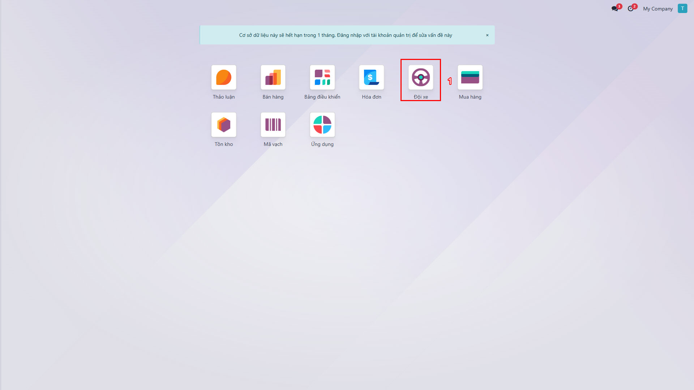
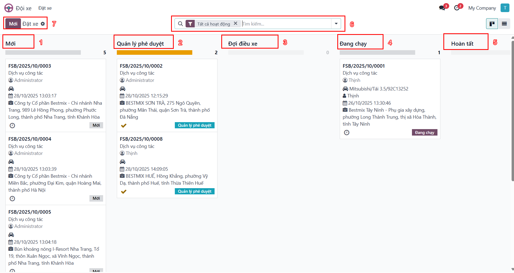
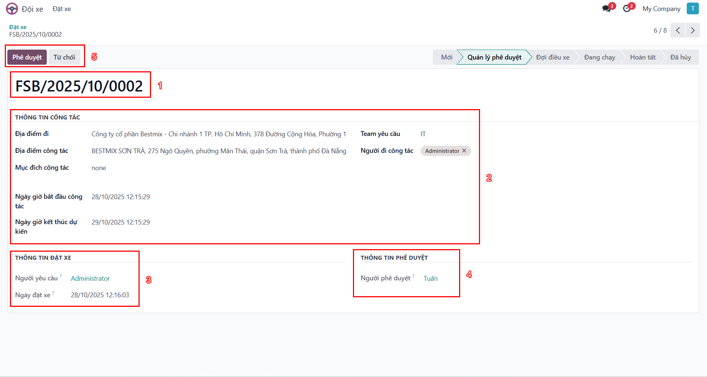
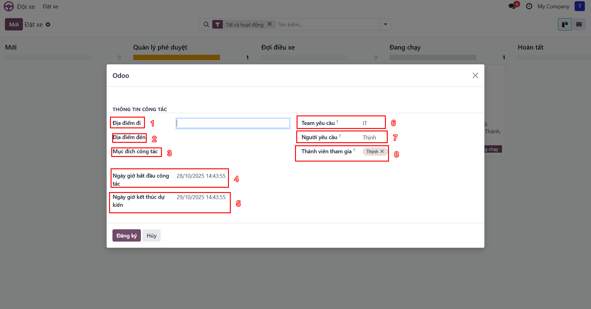
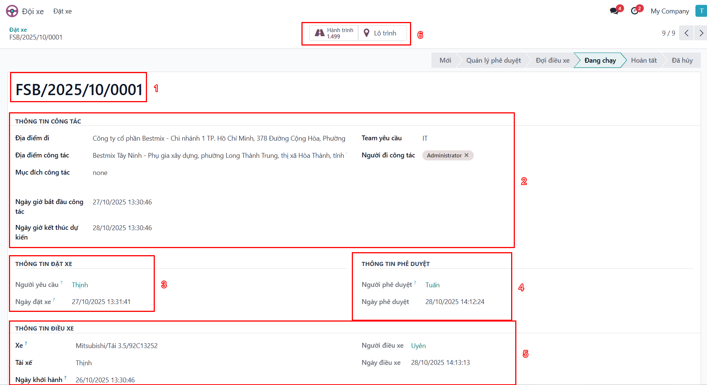
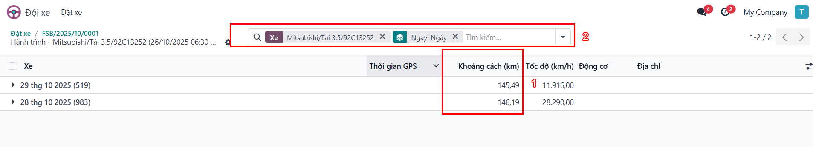
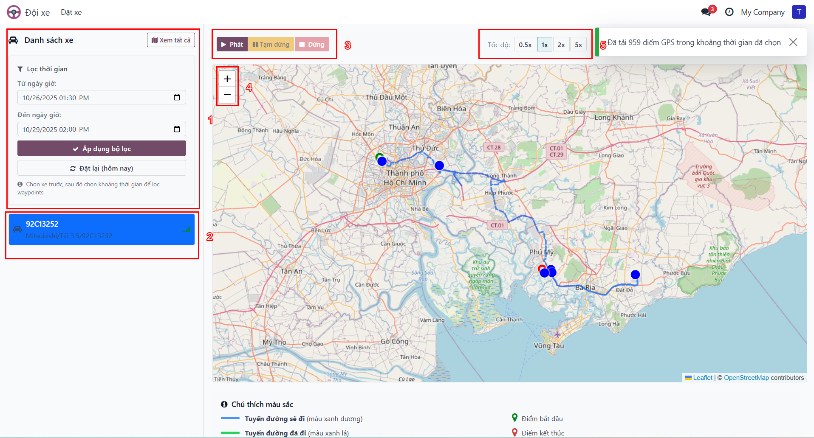

# Hướng dẫn Sử dụng Module Đội xe GPS - DÀNH CHO QUẢN LÝ

**Phiên bản**: 18.0.9.0.0
**Công ty**: BESTMIX
**Đối tượng**: Quản lý (Manager)
**Ngày cập nhật**: Tháng 10/2025

---

## Mục lục

### [Phần I: Giới thiệu](#phần-i-giới-thiệu)
- [1.1 Tổng quan Module](#11-tổng-quan-module)
- [1.2 Tính năng chính](#12-tính-năng-chính)
- [1.3 Lợi ích cho doanh nghiệp](#13-lợi-ích-cho-doanh-nghiệp)
- [1.4 Vai trò Quản lý](#14-vai-trò-quản-lý)

### [Phần II: Bắt đầu](#phần-ii-bắt-đầu)
- [2.1 Đăng nhập hệ thống](#21-đăng-nhập-hệ-thống)
- [2.2 Giao diện Bảng điều khiển Quản lý](#22-giao-diện-bảng-điều-khiển-quản-lý)
- [2.3 Điều hướng cơ bản](#23-điều-hướng-cơ-bản)

### [Phần III: Chức năng Cơ bản](#phần-iii-chức-năng-cơ-bản)
- [3.1 Tổng quan về Quản lý Đơn đặt xe](#31-tổng-quan-về-quản-lý-đơn-đặt-xe)
- [3.2 Tham khảo Hướng dẫn Nhân viên](#32-tham-khảo-hướng-dẫn-nhân-viên)

### [Phần IV: Chức năng Phê duyệt](#phần-iv-chức-năng-phê-duyệt)
- [4.1 Bảng điều khiển Quản lý](#41-bảng-điều-khiển-quản-lý)
- [4.2 Xử lý đơn đặt xe chờ phê duyệt](#42-xử-lý-đơn-đặt-xe-chờ-phê-duyệt)
- [4.3 Tạo đơn đặt xe thay nhân viên](#43-tạo-đơn-đặt-xe-thay-nhân-viên)
- [4.4 Theo dõi đơn đã duyệt](#44-theo-dõi-đơn-đã-duyệt)

### [Phần V: Quy trình Nghiệp vụ](#phần-v-quy-trình-nghiệp-vụ)
- [5.1 Quy trình Đặt xe cơ bản](#51-quy-trình-đặt-xe-cơ-bản)
- [5.2 Quy trình Phê duyệt](#52-quy-trình-phê-duyệt)
- [5.3 Các trường hợp đặc biệt](#53-các-trường-hợp-đặc-biệt)

### [Phần VI: Tính năng Nâng cao](#phần-vi-tính-năng-nâng-cao)
- [6.1 Tìm kiếm và Lọc](#61-tìm-kiếm-và-lọc)
- [6.2 Xuất báo cáo](#62-xuất-báo-cáo)
- [6.3 Thông báo và Hoạt động](#63-thông-báo-và-hoạt-động)
- [6.4 Mẹo và Thủ thuật](#64-mẹo-và-thủ-thuật)

### [Phần VII: Câu hỏi thường gặp và Xử lý sự cố](#phần-vii-câu-hỏi-thường-gặp-và-xử-lý-sự-cố)
- [7.1 Câu hỏi thường gặp](#71-câu-hỏi-thường-gặp)
- [7.2 Xử lý lỗi thường gặp](#72-xử-lý-lỗi-thường-gặp)

### [Phụ lục](#phụ-lục)
- [Phụ lục A: Bảng thuật ngữ](#phụ-lục-a-bảng-thuật-ngữ)
- [Phụ lục B: Bảng trạng thái và màu sắc](#phụ-lục-b-bảng-trạng-thái-và-màu-sắc)
- [Phụ lục C: Quyền truy cập theo vai trò](#phụ-lục-c-quyền-truy-cập-theo-vai-trò)

---

# Phần I: Giới thiệu

## 1.1 Tổng quan Module

Module **Đội xe GPS** (BM Fleet GPS Tracking) là giải pháp quản lý đội xe toàn diện được tích hợp với hệ thống GPS ADSUN, giúp doanh nghiệp:

- **Theo dõi vị trí xe** theo thời gian thực
- **Quản lý yêu cầu đặt xe** với quy trình phê duyệt chặt chẽ
- **Điều phối xe** hiệu quả cho các công tác và giao nhận
- **Giám sát hành trình** với dữ liệu GPS chi tiết
- **Tối ưu hóa** việc sử dụng tài nguyên xe

Module được thiết kế theo tiêu chuẩn Odoo 18, tích hợp sâu với hệ thống Quản lý Đội xe và Mail Activity.

## 1.2 Tính năng chính

### 🚗 Quản lý Yêu cầu Đặt xe

- **Tạo đơn nhanh**: Cửa sổ tạo đơn với giao diện thân thiện
- **Gợi ý địa chỉ thông minh**: Tích hợp OpenMap.vn cho địa chỉ Việt Nam
- **Lịch sử địa chỉ**: Ghi nhớ và gợi ý địa chỉ thường dùng
- **Quy trình phê duyệt**: Workflow tự động với 6 trạng thái

### 📍 Theo dõi GPS Real-time

- **Vị trí hiện tại**: Cập nhật vị trí xe theo thời gian thực
- **Trạng thái xe**: Phân biệt Offline / Idle / Running
- **Hành trình chi tiết**: Waypoints với timestamp, tọa độ, tốc độ
- **Thống kê**: Tổng quãng đường, tốc độ trung bình, thời gian chạy

### 🗺️ Bản đồ Hành trình

- **Bản đồ tương tác**: Sử dụng Leaflet.js + OpenStreetMap
- **Hiển thị tuyến đường**: Đường đi với điểm bắt đầu/kết thúc
- **Lọc nâng cao**: Theo xe, ngày, booking

### ✅ Quy trình Phê duyệt

1. **Mới** - Nhân viên tạo đơn
2. **Quản lý phê duyệt** - Chờ Quản lý duyệt
3. **Đợi điều xe** - Chờ Sale Admin phân xe
4. **Đang chạy** - Xe đã được điều phối
5. **Hoàn tất** - Công tác hoàn thành
6. **Đã hủy** - Đơn bị từ chối

### 🔔 Thông báo Tự động

- **Thông báo công việc**: Thông báo cho người phê duyệt
- **Mail tracking**: Ghi lại lịch sử thay đổi
- **Khu vực trao đổi**: Trao đổi và ghi chú trong đơn

## 1.3 Lợi ích cho doanh nghiệp

| Lợi ích | Mô tả |
|---------|-------|
| **Minh bạch** | Theo dõi toàn bộ quá trình từ yêu cầu đến hoàn thành |
| **Tiết kiệm** | Tối ưu hóa việc sử dụng xe, giảm chi phí vận hành |
| **An toàn** | Giám sát hành trình, kiểm soát tốc độ và vi phạm |
| **Hiệu quả** | Quy trình phê duyệt tự động, giảm thời gian xử lý |
| **Chính xác** | Dữ liệu GPS thời gian thực, báo cáo chi tiết |

## 1.4 Vai trò Quản lý

Với vai trò **Quản lý** (Manager), bạn đóng vai trò quan trọng trong việc kiểm soát và phê duyệt các yêu cầu sử dụng xe của team.

### 👔 Quyền hạn của Quản lý

**Quyền hạn đầy đủ**:
- ✅ **Tất cả quyền của Nhân viên**: Tạo đơn, xem đơn của mình, theo dõi trạng thái
- ✅ **Phê duyệt/Từ chối đơn**: Quyết định các yêu cầu đặt xe của team
- ✅ **Tạo đơn thay nhân viên**: Tạo đơn đặt xe thay cho nhân viên trong team
- ✅ **Xem đơn của toàn bộ team**: Theo dõi tất cả hoạt động sử dụng xe
- ✅ **Xem hành trình GPS**: Theo dõi hành trình thực tế sau khi xe được điều phối

**Nhóm quyền**: `Người dùng BM Fleet` (với quyền Manager)

### Vai trò trong Quy trình

Quản lý là **cầu nối** giữa Nhân viên và Sale Admin:

```
Nhân viên → Tạo đơn → Manager (PHÊ DUYỆT) → Sale Admin → Điều xe
```

**Trách nhiệm chính**:
1. **Đánh giá tính hợp lý** của yêu cầu đặt xe
2. **Kiểm soát ngân sách** sử dụng xe của team
3. **Đảm bảo hiệu quả** trong việc phân bổ tài nguyên
4. **Quản lý SLA**: Phản hồi yêu cầu trong thời gian quy định

---

# Phần II: Bắt đầu

## 2.1 Đăng nhập hệ thống

### Các bước đăng nhập

1. Mở trình duyệt web và truy cập địa chỉ hệ thống Odoo
2. Nhập thông tin đăng nhập:
   - **Email/Login**: Tài khoản được cấp bởi Admin
   - **Password**: Mật khẩu của bạn
3. Nhấn nút **Đăng nhập**


**Các thành phần trên màn hình**:
- ❶ Trường **Email/Login**: Nhập tài khoản
- ❷ Trường **Password**: Nhập mật khẩu
- ❸ Nút **Đăng nhập**: Đăng nhập vào hệ thống

💡 **Mẹo**:
- Nếu quên mật khẩu, nhấn **Đặt lại mật khẩu** để nhận email khôi phục
- Hỗ trợ đăng nhập bằng Google/Microsoft nếu được cấu hình

⚠️ **Cảnh báo**:
- Không chia sẻ thông tin đăng nhập với người khác
- Sau 5 lần nhập sai, tài khoản sẽ bị khóa tạm thời

## 2.2 Giao diện Bảng điều khiển Quản lý

Sau khi đăng nhập thành công, bạn sẽ thấy Bảng điều khiển chính với các module được cài đặt.

### Giao diện dành cho Quản lý



**Điểm khác biệt so với Nhân viên**:
- ✅ **Xem tất cả đơn của team**: Không chỉ đơn của mình
- ✅ **Có nút Phê duyệt/Từ chối**: Quyền xử lý yêu cầu
- ✅ **Nhận thông báo công việc**: Khi có đơn chờ duyệt
- ✅ **Tạo đơn thay người khác**: Tạo đơn cho nhân viên trong team

### Các thành phần chính

| Thành phần | Mô tả | Ý nghĩa cho Quản lý |
|------------|-------|---------------------|
| **Thanh menu trên** | Menu các module Odoo | Truy cập nhanh vào Đội xe |
| **Biểu tượng chuông** | Thông báo công việc | Số đơn chờ phê duyệt |
| **Biểu tượng đồng hồ** | Hoạt động | Danh sách công việc cần xử lý |
| **Giao diện thẻ** | Kanban view | Xem tổng quan trạng thái đơn |

## 2.3 Điều hướng cơ bản

### Truy cập Module Đội xe

**Cách 1: Từ Menu chính**
1. Click vào **menu 9 ô vuông** ở góc trái trên
2. Tìm và click vào **Đội xe**

**Cách 2: Từ Thanh menu**
- Click **Đội xe** trên thanh menu ngang

### Các phím tắt hữu ích

| Phím tắt | Chức năng |
|----------|-----------|
| `Alt + H` | Về trang chủ |
| `Alt + Q` | Tìm kiếm nhanh |
| `/` | Focus vào thanh tìm kiếm |
| `Ctrl + K` | Menu commands |
| `F5` | Refresh trang |

---

# Phần III: Chức năng Cơ bản

## 3.1 Tổng quan về Quản lý Đơn đặt xe

Với vai trò Quản lý, bạn có thể thực hiện tất cả chức năng của Nhân viên, bao gồm:

### Tạo đơn đặt xe

Quản lý có thể tạo đơn cho chính mình hoặc thay cho nhân viên trong team.

**Các bước cơ bản**:
1. Truy cập **Đội xe** → **Đặt xe**
2. Nhấn nút **Mới**
3. Điền thông tin:
   - Địa điểm đi/đến
   - Mục đích công tác
   - Thời gian
   - **Người yêu cầu**: Chọn nhân viên (nếu tạo thay)
   - Team và thành viên
4. Nhấn **Đăng ký** để lưu

### Xem và quản lý đơn

**Phạm vi xem**:
- ✅ Tất cả đơn của team
- ✅ Đơn được gán cho mình phê duyệt
- ✅ Đơn của chính mình

**Các view có sẵn**:
- **Giao diện thẻ**: Xem theo trạng thái (Kanban)
- **Giao diện danh sách**: Xem dạng bảng
- **Calendar**: Xem theo lịch

### Xem hành trình GPS

Sau khi đơn được điều xe, Quản lý có thể xem hành trình GPS để:
- Theo dõi tiến trình công tác
- Xác minh quãng đường thực tế
- Review hiệu quả sử dụng xe

## 3.2 Tham khảo Hướng dẫn Nhân viên

💡 **Tham khảo**: Quản lý có thể thực hiện tất cả chức năng của Nhân viên.

Để biết chi tiết về các chức năng cơ bản như:
- Cách tạo đơn đặt xe mới với giao diện tạo nhanh
- Cách chỉnh sửa và quản lý đơn đã tạo
- Cách xem hành trình GPS và bản đồ tuyến đường
- Các mẹo và thủ thuật khi sử dụng

**Vui lòng tham khảo**: *Hướng dẫn Sử dụng Module Đội xe GPS - Dành cho Nhân viên*, **Phần III: Hướng dẫn cho Nhân viên**

Phần tiếp theo sẽ tập trung vào các chức năng **đặc thù của Quản lý**: phê duyệt, từ chối, và quản lý team.

---

# Phần IV: Chức năng Phê duyệt

Phần này hướng dẫn chi tiết các chức năng **đặc thù của Quản lý**: phê duyệt đơn đặt xe, tạo đơn thay nhân viên, và theo dõi đơn của team.

## 4.1 Bảng điều khiển Quản lý

Với vai trò Quản lý, bạn có dashboard với các tính năng mở rộng.


### Điểm nổi bật

**So với Nhân viên, Quản lý có thêm**:
- ✅ **Xem được tất cả đơn của team**: Không giới hạn chỉ đơn của mình
- ✅ **Có nút Phê duyệt/Từ chối**: Ở góc trên bên trái form đơn
- ✅ **Nhận thông báo công việc**: Khi có đơn chờ duyệt
- ✅ **Tạo đơn thay người khác**: Trong trường "Người yêu cầu"

### Thông báo công việc

Quản lý nhận **Thông báo công việc** (Activity) khi:
- Có đơn mới chờ phê duyệt
- Có đơn bị Đặt lại cần duyệt lại

**Cách xem thông báo**:
1. Click biểu tượng **chuông** ở góc phải trên
2. Danh sách thông báo hiển thị
3. Click vào thông báo để xem chi tiết đơn

## 4.2 Xử lý đơn đặt xe chờ phê duyệt

### Xem danh sách đơn chờ duyệt

Có 3 cách để xem đơn cần phê duyệt:

#### Cách 1: Từ Giao diện thẻ

1. Truy cập **Đội xe** → **Đặt xe**
2. Xem cột **Quản lý phê duyệt**



**Các cột trạng thái**:
- **Mới**: Đơn vừa tạo, chưa gửi
- **Quản lý phê duyệt**: Đơn chờ bạn duyệt
- **Đợi điều xe**: Đã duyệt, chờ Sale Admin
- **Đang chạy**: Xe đang thực hiện
- **Hoàn tất**: Hoàn thành

#### Cách 2: Từ Thông báo công việc

1. Click biểu tượng **chuông** ở góc phải trên
2. Chọn thông báo "Yêu cầu phê duyệt"
3. Hệ thống mở form đơn cần duyệt

#### Cách 3: Sử dụng Bộ lọc

1. Tại màn hình **Đặt xe**
2. Click **Bộ lọc**
3. Chọn **Chờ phê duyệt**

### Phê duyệt đơn đặt xe

Khi nhận được yêu cầu phê duyệt:

#### Các bước phê duyệt

**Bước 1: Mở đơn cần phê duyệt**
- Click vào đơn trong cột **Quản lý phê duyệt**
- Hoặc click vào thông báo công việc

**Bước 2: Kiểm tra thông tin**

Đánh giá các tiêu chí sau:

| Tiêu chí | Câu hỏi kiểm tra |
|----------|------------------|
| **Tính hợp lý** | Mục đích có phù hợp với công việc? |
| **Tính khẩn cấp** | Có cần xe ngay không? Có thể dùng phương tiện khác? |
| **Thời gian** | Thời gian có hợp lý? Có trùng lịch quan trọng? |
| **Ngân sách** | Chi phí dự kiến có trong ngân sách? |
| **Thành viên** | Người tham gia có liên quan đến công tác? |

**Bước 3: Thực hiện Phê duyệt**

1. Nếu đơn hợp lý, click nút **Phê duyệt**



**Các thành phần trên màn hình**:
- ❶ **Mã đơn đặt xe**: Mã tự động (FSB/2025/10/XXXX)
- ❷ **Thông tin công tác**: Địa điểm, mục đích, thời gian
- ❸ **Thông tin đặt xe**: Người yêu cầu, ngày đặt
- ❹ **Thông tin phê duyệt**: Người phê duyệt, ngày phê duyệt
- ❺ **Nút Phê duyệt/Từ chối**: Ở góc trên bên trái

✅ **Kết quả sau khi Phê duyệt**:
- Đơn chuyển sang trạng thái **Đợi điều xe**
- Thông báo công việc cho Quản lý được đóng
- Hệ thống tạo thông báo mới cho Sale Admin
- Nhân viên nhận thông báo đơn đã được duyệt
- Đơn xuất hiện trong cột **Đợi điều xe**

### Từ chối đơn đặt xe

Nếu đơn không hợp lý hoặc cần điều chỉnh:

#### Các bước từ chối

**Bước 1: Mở đơn cần từ chối**

**Bước 2: Click nút Từ chối**
1. Click nút **Từ chối** ở góc trên bên trái
2. **Hộp thoại xác nhận từ chối** xuất hiện

**Bước 3: Nhập lý do từ chối**
1. Nhập **Lý do từ chối** (bắt buộc)
2. Mô tả rõ ràng, cụ thể vấn đề
3. Click **Xác nhận**

✅ **Kết quả sau khi Từ chối**:
- Đơn chuyển sang trạng thái **Đã hủy**
- Lý do từ chối được ghi lại trong hệ thống
- Nhân viên nhận thông báo và xem được lý do từ chối
- Nhân viên có thể **Đặt lại** đơn để chỉnh sửa và gửi lại

💡 **Mẹo khi Từ chối**:
- Nên mô tả rõ lý do từ chối để nhân viên biết cần sửa gì
- Ví dụ: "Từ chối - Vui lòng làm rõ nội dung công tác"
- Có thể chat trực tiếp trong khu vực trao đổi để trao đổi thêm
- Đề xuất phương án thay thế nếu có

### Các lý do từ chối phổ biến

| Lý do | Ví dụ | Đề xuất |
|-------|-------|---------|
| **Mục đích không rõ** | "Đi công tác" | "Từ chối - Vui lòng làm rõ nội dung công tác" |
| **Thời gian không hợp lý** | Đặt xe 23h đêm cho sáng hôm sau | "Từ chối - Thời gian quá gấp, vui lòng đặt trước ít nhất 1 ngày" |
| **Có phương tiện khác** | Quãng đường ngắn, có xe bus | "Từ chối - Đề nghị sử dụng phương tiện công cộng" |
| **Vượt ngân sách** | Hết hạn mức tháng này | "Từ chối - Hết ngân sách tháng này, vui lòng chờ tháng sau" |

## 4.3 Tạo đơn đặt xe thay nhân viên

Quản lý có thể tạo đơn thay cho nhân viên trong team khi:
- Nhân viên không có quyền truy cập hệ thống
- Tạo đơn khẩn cấp cho nhân viên đang bận
- Nhân viên yêu cầu hỗ trợ

### Các bước thực hiện

**Bước 1: Truy cập Module Đặt xe**
1. Truy cập **Đội xe** → **Đặt xe**
2. Nhấn nút **Mới**

**Bước 2: Điền thông tin đơn**



**Thông tin cần điền**:

| Trường | Bắt buộc | Lưu ý khi tạo thay |
|--------|----------|---------------------|
| **Người yêu cầu** | ✅ Có | **Chọn nhân viên**, không phải chính Quản lý |
| **Team yêu cầu** | ✅ Có | Chọn đúng team của nhân viên |
| **Địa điểm đi** | ✅ Có | Nhập và chọn từ gợi ý |
| **Địa điểm đến** | ✅ Có | Nhập và chọn từ gợi ý |
| **Mục đích công tác** | ✅ Có | Mô tả rõ ràng, chi tiết |
| **Ngày giờ bắt đầu** | ✅ Có | Thời gian khởi hành |
| **Ngày giờ kết thúc** | ✅ Có | Thời gian dự kiến về |
| **Thành viên** | ⭕ Không | Người đi cùng |

**Lưu ý quan trọng**:
- ⚠️ **Chọn đúng Người yêu cầu**: Không phải chính Quản lý
- ⚠️ **Chọn đúng Team**: Team của người yêu cầu
- ⚠️ **Điền đầy đủ thông tin**: Để Sale Admin dễ điều xe

**Bước 3: Lưu đơn**
1. Nhấn **Đăng ký** để lưu
2. Đơn được tạo ở trạng thái **Mới**

**Bước 4: Phê duyệt (tùy chọn)**

Quản lý có thể:
- **Để ở trạng thái Mới**: Để nhân viên xem lại và gửi phê duyệt
- **Tự phê duyệt luôn**: Click **Gửi phê duyệt** → sau đó click **Phê duyệt**

💡 **Mẹo**:
- Nên thông báo cho nhân viên khi tạo đơn thay
- Sử dụng khu vực trao đổi để **tag nhân viên** và giải thích
- Có thể tạo nháp để nhân viên xem lại trước khi gửi

### Quy trình tạo đơn thay

```
Manager tạo đơn → Chọn Người yêu cầu → Điền thông tin
                                    ↓
                          Trạng thái "Mới"
                                    ↓
                    ┌───────────────┴───────────────┐
                    ↓                               ↓
        Manager tự phê duyệt luôn      Nhân viên xem lại → Gửi phê duyệt
                    ↓                               ↓
                    └───────────────┬───────────────┘
                                    ↓
                          Chờ Sale Admin điều xe
```

## 4.4 Theo dõi đơn đã duyệt

Sau khi phê duyệt, Quản lý vẫn có thể theo dõi tiến trình đơn.

### Xem trạng thái điều xe

**Cách 1: Từ Giao diện thẻ**
1. Truy cập **Đội xe** → **Đặt xe**
2. Xem các cột:
   - **Đợi điều xe**: Đã duyệt, chờ Sale Admin
   - **Đang chạy**: Xe đang thực hiện
   - **Hoàn tất**: Hoàn thành



**Cách 2: Mở chi tiết đơn**

Mở form đơn để xem:
- **Xe được gán**: Xe nào đang thực hiện
- **Tài xế**: Ai đang lái
- **Ngày điều xe**: Khi nào được dispatch
- **Thông tin hành trình**: Quãng đường, thời gian

### Xem hành trình GPS

Quản lý có thể xem hành trình GPS giống như nhân viên để:
- Theo dõi tiến trình công tác
- Xác minh quãng đường thực tế
- Review hiệu quả sử dụng xe

#### Xem danh sách Hành trình

1. Mở đơn đặt xe đã được điều xe (trạng thái **Đang chạy** hoặc **Hoàn tất**)
2. Click vào **Nút thông minh Hành trình**



✅ **Kết quả**: Danh sách các điểm GPS (waypoints) hiển thị với:
- Thời gian
- Tọa độ (Latitude/Longitude)
- Địa chỉ (nếu có)
- Tốc độ (km/h)
- Quãng đường (km)

#### Xem Bản đồ Tuyến đường

1. Mở đơn đặt xe đã được điều xe
2. Click vào **Nút thông minh Tuyến đường**



✅ **Kết quả**: Bản đồ hiển thị:
- **Đường đi thực tế**: Đường nối các waypoints GPS
- **Điểm bắt đầu**: Marker màu xanh lá
- **Điểm kết thúc**: Marker màu đỏ
- **Thông tin chi tiết**: Click vào marker để xem

💡 **Mẹo theo dõi**:
- Sử dụng tính năng **Nhóm theo** để xem theo Team
- Xuất báo cáo định kỳ để review việc sử dụng xe
- Thiết lập **Yêu thích** cho các bộ lọc thường dùng
- Theo dõi **Thông báo công việc** để không bỏ sót đơn nào

---

# Phần V: Quy trình Nghiệp vụ

Phần này mô tả chi tiết các quy trình nghiệp vụ từ góc độ **Quản lý**.

## 5.1 Quy trình Đặt xe cơ bản

### Sơ đồ Quy trình Tổng quát

```
┌─────────────┐
│  Nhân viên  │
│  Tạo đơn    │
└──────┬──────┘
       │
       ▼
┌─────────────┐
│    Mới      │ ◄─── Đặt lại (nếu bị từ chối)
│   (New)     │
└──────┬──────┘
       │ Gửi phê duyệt
       ▼
┌─────────────┐
│ QUẢN LÝ PHÊ │ ◄── VAI TRÒ CỦA BẠN
│   DUYỆT     │
│(Pending Mgr)│
└──────┬──────┘
       │
       ├─── Phê duyệt ───┐
       │               ▼
       │         ┌─────────────┐
       │         │ Đợi điều xe │
       │         │(Pending     │
       │         │ Dispatch)   │
       │         └──────┬──────┘
       │                │
       │                ├─── Sale Admin Dispatch ──┐
       │                │                           ▼
       │                │                     ┌─────────────┐
       │                │                     │ Đang chạy   │
       │                │                     │  (Running)  │
       │                │                     └──────┬──────┘
       │                │                            │ Hoàn tất
       │                │                            ▼
       │                │                      ┌─────────────┐
       │                │                      │  Hoàn tất   │
       │                │                      │   (Done)    │
       │                │                      └─────────────┘
       │                │
       │                └─── Từ chối (Sale Admin) ──┐
       │                                            │
       └─── Từ chối (Quản lý) ─────────────────────┤
                                                   ▼
                                             ┌─────────────┐
                                             │   Đã hủy    │
                                             │ (Cancelled) │
                                             └─────────────┘
```

### Chi tiết từng Giai đoạn

#### Giai đoạn 1: Nhân viên Tạo đơn

**Người thực hiện**: Nhân viên
**Thời gian**: 2-5 phút

**Các bước**:
1. Nhân viên đăng nhập hệ thống
2. Truy cập Module Đội xe
3. Tạo đơn đặt xe mới
4. Điền thông tin: địa điểm, mục đích, thời gian, team
5. Lưu đơn → Trạng thái **Mới**

**Kết quả**:
- Đơn được lưu nhưng chưa gửi phê duyệt
- Nhân viên có thể chỉnh sửa

#### Giai đoạn 2: Nhân viên Gửi phê duyệt

**Người thực hiện**: Nhân viên
**Thời gian**: Vài giây

**Các bước**:
1. Nhân viên kiểm tra lại thông tin
2. Nhấn nút **Gửi phê duyệt**
3. Đơn chuyển sang trạng thái **Quản lý phê duyệt**

**Kết quả**:
- Hệ thống tạo **Thông báo công việc** cho Quản lý
- Quản lý nhận thông báo qua email và in-app
- Nhân viên không thể chỉnh sửa đơn nữa

**Thời gian chờ**: Tùy Quản lý, thường 1-24 giờ

#### Giai đoạn 3: QUẢN LÝ PHÊ DUYỆT (VAI TRÒ CỦA BẠN)

**Người thực hiện**: Quản lý (BẠN)
**Thời gian**: 5-10 phút
**SLA**: 1 ngày làm việc (khẩn cấp: 2 giờ)

**Các bước**:

1. **Nhận thông báo**
   - Email thông báo
   - Thông báo công việc (biểu tượng chuông)
   - Badge số trên cột **Quản lý phê duyệt**

2. **Mở đơn để xem chi tiết**
   - Click vào thông báo hoặc đơn trong cột

3. **Kiểm tra thông tin**
   - Mục đích có hợp lý?
   - Ngân sách có đủ?
   - Thời gian có phù hợp?
   - Thành viên có liên quan?

4. **Quyết định**

   **Nếu PHÊ DUYỆT**:
   - Click nút **Phê duyệt**
   - Đơn chuyển sang **Đợi điều xe**

   **Nếu TỪ CHỐI**:
   - Click nút **Từ chối**
   - Nhập **Lý do từ chối** (bắt buộc)
   - Click **Xác nhận**
   - Đơn chuyển sang **Đã hủy**

**Kết quả (nếu phê duyệt)**:
- Thông báo công việc cho Quản lý được đóng
- Hệ thống tạo thông báo mới cho Sale Admin
- Nhân viên nhận thông báo đơn đã được duyệt

**Kết quả (nếu từ chối)**:
- Đơn chuyển sang **Đã hủy**
- Nhân viên nhận thông báo với lý do từ chối
- Nhân viên có thể **Đặt lại** để sửa và gửi lại

#### Giai đoạn 4: Sale Admin Điều xe

**Người thực hiện**: Sale Admin
**Thời gian**: 10-30 phút

**Các bước**:
1. Sale Admin nhận thông báo
2. Xem danh sách xe khả dụng
3. Chọn xe và tài xế phù hợp
4. Nhấn **Điều xe**
5. Đơn chuyển sang **Đang chạy**

**Quản lý có thể**:
- Xem trạng thái điều xe
- Theo dõi xe nào được gán
- Xem hành trình GPS khi xe đang chạy

#### Giai đoạn 5: Hoàn thành

**Người thực hiện**: Sale Admin
**Thời gian**: Vài giây

**Các bước**:
1. Sau khi công tác hoàn thành
2. Sale Admin nhấn **Hoàn tất**
3. Đơn chuyển sang **Hoàn tất**

**Quản lý có thể**:
- Xem hành trình GPS đầy đủ
- Xuất báo cáo
- Review việc sử dụng xe

## 5.2 Quy trình Phê duyệt

### Vai trò Quản lý trong Quy trình

Quản lý là **Gatekeeper** giữa yêu cầu và điều xe:

```
Nhân viên YÊU CẦU → Quản lý KIỂM SOÁT → Sale Admin THỰC HIỆN
```

**Trách nhiệm**:
1. Đảm bảo tính hợp lý của yêu cầu
2. Kiểm soát ngân sách team
3. Phản hồi trong thời gian SLA
4. Giao tiếp rõ ràng khi từ chối

### Tiêu chí Phê duyệt

Manager cần xem xét các tiêu chí sau:

| Tiêu chí | Câu hỏi kiểm tra | Hành động nếu không đạt |
|----------|------------------|-------------------------|
| **Tính hợp lý** | Mục đích có phù hợp với công việc? | Từ chối, yêu cầu làm rõ |
| **Tính khẩn cấp** | Có cần xe ngay không? Có thể dùng phương tiện khác? | Đề xuất phương án thay thế |
| **Thời gian** | Thời gian có hợp lý? Có trùng lịch quan trọng khác? | Từ chối, yêu cầu điều chỉnh |
| **Ngân sách** | Chi phí dự kiến có trong ngân sách? | Từ chối nếu vượt ngân sách |
| **Thành viên** | Người tham gia có liên quan đến công tác? | Yêu cầu giải thích |

### Thời gian Phản hồi (SLA)

**Service Level Agreement**:
- **Khẩn cấp**: Phản hồi trong 2 giờ
- **Bình thường**: Phản hồi trong 1 ngày làm việc
- **Không khẩn**: Phản hồi trong 2 ngày làm việc

**Best practices**:
- Xử lý thông báo công việc hàng ngày
- Không để đơn tồn đọng quá 24 giờ
- Liên hệ trực tiếp nhân viên nếu cần làm rõ
- Phê duyệt theo batch nếu có nhiều đơn

### Các trường hợp Từ chối

**Lý do từ chối phổ biến**:

#### 1. Mục đích không rõ ràng
- **Ví dụ**: "Đi công tác" → Cần cụ thể hơn
- **Đề xuất**: "Từ chối - Vui lòng làm rõ nội dung công tác: gặp khách hàng nào, tại đâu, mục đích gì"

#### 2. Thời gian không hợp lý
- **Ví dụ**: Đặt xe vào 23h đêm cho công tác sáng hôm sau
- **Đề xuất**: "Từ chối - Thời gian quá gấp, vui lòng đặt trước ít nhất 1 ngày"

#### 3. Có thể dùng phương tiện khác
- **Ví dụ**: Quãng đường ngắn, có xe bus
- **Đề xuất**: "Từ chối - Quãng đường ngắn, đề nghị sử dụng phương tiện công cộng hoặc taxi"

#### 4. Vượt ngân sách
- **Ví dụ**: Tổng chi phí xe tháng này đã đạt hạn mức
- **Đề xuất**: "Từ chối - Hết ngân sách xe tháng này, vui lòng chờ tháng sau hoặc sử dụng phương tiện cá nhân"

#### 5. Thành viên không liên quan
- **Ví dụ**: Quá nhiều người tham gia cho công tác đơn giản
- **Đề xuất**: "Từ chối - Vui lòng giải thích lý do cần nhiều người tham gia"

### Best Practices cho Quản lý

💡 **Khi Phê duyệt**:
- Phản hồi nhanh để không làm chậm công việc
- Xem xét cân bằng giữa hiệu quả và tiết kiệm
- Ghi chú trong chatter nếu có điều kiện đặc biệt

💡 **Khi Từ chối**:
- Giải thích rõ ràng, cụ thể lý do
- Đề xuất phương án thay thế
- Communicate trực tiếp với nhân viên nếu cần
- Hướng dẫn cách sửa để được duyệt

💡 **Quản lý Ngân sách**:
- Theo dõi tổng chi phí xe hàng tháng
- Thiết lập hạn mức cho từng loại công tác
- Review định kỳ để tối ưu hóa

💡 **Communication**:
- Thông báo SLA xử lý với team
- Hướng dẫn nhân viên cách tạo đơn đúng
- Chia sẻ best practices trong team meetings

## 5.3 Các trường hợp đặc biệt

### Đặt lại đơn đã Từ chối

**Khi nào**: Nhân viên muốn sửa đơn đã bị từ chối

**Quy trình**:

1. **Nhân viên thực hiện**:
   - Mở đơn ở trạng thái **Đã hủy**
   - Nhấn nút **Đặt lại**
   - Đơn quay về trạng thái **Mới**
   - Chỉnh sửa theo góp ý
   - Gửi lại phê duyệt

2. **Quản lý thực hiện**:
   - Nhận thông báo công việc mới
   - Xem lại đơn đã được sửa
   - Phê duyệt hoặc từ chối lần nữa

**Lưu ý**:
- Chỉ người tạo đơn hoặc Manager có thể Đặt lại
- Nên đọc kỹ lý do từ chối trước khi sửa
- Quản lý có thể chat trực tiếp để hướng dẫn

### Hủy đơn đang Chờ phê duyệt

**Khi nào**: Nhân viên muốn hủy đơn đang chờ duyệt

**Quy trình**:

1. **Nhân viên liên hệ Quản lý**:
   - Chat trong chatter của đơn
   - Hoặc liên hệ trực tiếp

2. **Quản lý thực hiện**:
   - Mở đơn chờ phê duyệt
   - Click nút **Đặt lại** để đưa về trạng thái **Mới**
   - Nhân viên có thể xóa hoặc chỉnh sửa

**Hoặc**:
- Quản lý có thể **Từ chối** với lý do "Theo yêu cầu nhân viên"

### Chỉnh sửa thông tin sau khi Phê duyệt

**Khi nào**: Nhân viên muốn đổi địa điểm/thời gian sau khi Manager duyệt

**Quy trình**:

1. **Nếu chưa Dispatch** (còn ở **Đợi điều xe**):
   - Nhân viên liên hệ Quản lý
   - Quản lý đánh giá thay đổi
   - Nếu thay đổi lớn: **Từ chối** và yêu cầu tạo đơn mới
   - Nếu thay đổi nhỏ: Ghi chú trong chatter, thông báo Sale Admin

2. **Nếu đã Dispatch** (đang **Đang chạy**):
   - Liên hệ Sale Admin để note lại thay đổi
   - Sale Admin cập nhật thông tin

**Best practice**:
- Khuyến khích nhân viên kiểm tra kỹ trước khi gửi phê duyệt
- Thay đổi lớn nên hủy và tạo đơn mới
- Thay đổi nhỏ ghi chú trong chatter

### Phê duyệt Khẩn cấp

**Khi nào**: Đơn cần xe gấp (trong vài giờ)

**Quy trình nhanh**:

1. Nhân viên gọi điện/chat trực tiếp Quản lý
2. Quản lý kiểm tra thông tin qua điện thoại
3. Phê duyệt ngay trên hệ thống (mobile app nếu cần)
4. Thông báo Sale Admin qua điện thoại để ưu tiên

**Lưu ý**:
- Vẫn cần kiểm tra tính hợp lý
- Ghi chú "KHẨN CẤP" trong chatter
- Follow up với Sale Admin để đảm bảo dispatch kịp

### Phê duyệt Ngoài giờ

**Khi nào**: Nhận yêu cầu ngoài giờ làm việc

**Quy trình**:

1. **Có mobile app**: Phê duyệt ngay trên điện thoại
2. **Không có app**:
   - Phản hồi sáng hôm sau
   - Hoặc xử lý qua web browser trên mobile

**Best practice**:
- Thiết lập quy định về giờ gửi yêu cầu
- Yêu cầu nhân viên đặt trước ít nhất 1 ngày
- Chỉ chấp nhận khẩn cấp thật sự ngoài giờ

---

# Phần VI: Tính năng Nâng cao

## 6.1 Tìm kiếm và Lọc

### Tìm kiếm Nhanh

Tại màn hình danh sách đơn đặt xe, sử dụng thanh tìm kiếm:

**Có thể tìm theo**:
- Mã đơn (FSB/2025/10/0001)
- Địa điểm đến
- Tên xe
- Tên tài xế
- Người yêu cầu
- Team

**Cú pháp**:
- Nhập từ khóa → Tự động tìm
- Dùng dấu ngoặc kép cho cụm từ: `"Hồ Chí Minh"`

**Ví dụ tìm kiếm hữu ích cho Quản lý**:
- Tìm tất cả đơn của team "Sales": nhập `Sales`
- Tìm đơn đến địa điểm cụ thể: nhập `"Công ty ABC"`
- Tìm đơn của nhân viên: nhập tên nhân viên

### Bộ lọc

Click vào **Bộ lọc** để mở bảng lọc:

#### Bộ lọc theo Trạng thái

- **Tất cả hoạt động**: Tất cả đơn đang hoạt động
- **Mới tạo**: Đơn mới tạo
- **Chờ phê duyệt**: Đơn chờ bạn duyệt (QUAN TRỌNG)
- **Chờ điều xe**: Đơn đã duyệt, chờ Sale Admin
- **Đang chạy**: Xe đang thực hiện
- **Hoàn tất**: Hoàn thành
- **Đã hủy**: Bị từ chối

#### Bộ lọc theo Thời gian

- **Hôm nay**: Đơn hôm nay
- **Tuần này**: Tuần này
- **Tháng này**: Tháng này
- **7 ngày qua**: 7 ngày qua
- **30 ngày qua**: 30 ngày qua

#### Bộ lọc theo Người

- **Đơn của tôi**: Đơn của chính Quản lý
- **Đơn của nhóm**: Tất cả đơn của team
- **Được gán cho tôi**: Đơn chờ phê duyệt (QUAN TRỌNG)

💡 **Mẹo**: Có thể kết hợp nhiều bộ lọc cùng lúc

**Ví dụ bộ lọc hữu ích cho Quản lý**:
- **Chờ phê duyệt** + **Hôm nay**: Đơn cần duyệt hôm nay
- **Đơn của nhóm** + **Tháng này**: Review usage của team
- **Đã hủy** + **7 ngày qua**: Xem đơn bị từ chối gần đây

### Nhóm theo

Sử dụng **Nhóm theo** để tổ chức dữ liệu:

**Nhóm theo**:
- **State**: Theo trạng thái (mặc định)
- **Team**: Theo phòng ban (HỮU ÍCH)
- **Requester**: Theo người yêu cầu
- **Vehicle**: Theo xe
- **Date**: Theo ngày

**Ví dụ hữu ích cho Quản lý**:
- **Nhóm theo State**: Thấy rõ số đơn ở mỗi trạng thái
- **Nhóm theo Team**: So sánh usage giữa các team (nếu quản lý nhiều team)
- **Nhóm theo Requester**: Xem ai sử dụng xe nhiều nhất

### Yêu thích

Lưu các bộ lọc thường dùng:

1. Thiết lập bộ lọc + group by
2. Click **Yêu thích** → **Lưu current search**
3. Đặt tên (ví dụ: "Đơn chờ duyệt của team")
4. Click **Lưu**

✅ **Kết quả**: Lần sau chỉ cần click vào Favorite đã lưu

**Gợi ý Favorites cho Quản lý**:
- "Đơn chờ phê duyệt hôm nay"
- "Đơn của team tháng này"
- "Đơn bị từ chối tuần này"
- "Đơn đang chạy của team"

## 6.2 Xuất báo cáo

### Xuất danh sách

Quản lý có thể xuất báo cáo để:
- Review việc sử dụng xe của team
- Báo cáo lên cấp trên
- Phân tích xu hướng

#### Các bước xuất

1. Tại màn hình danh sách **Đặt xe**
2. Áp dụng bộ lọc (ví dụ: "Đơn của nhóm" + "Tháng này")
3. Chọn các đơn cần xuất (hoặc **Chọn tất cả**)
4. Click **Action** → **Xuất**
5. Chọn các trường cần xuất
6. Chọn định dạng: **Excel (.xlsx)** hoặc **CSV**
7. Click **Xuất**

#### Các trường nên xuất cho Quản lý

**Thông tin cơ bản**:
- Booking Code (Mã đơn)
- Date (Ngày đặt)
- Requester (Người yêu cầu)
- Team (Phòng ban)
- State (Trạng thái)

**Thông tin công tác**:
- Departure Location (Địa điểm đi)
- Destination (Địa điểm đến)
- Work Purpose (Mục đích)
- Start Date/Time (Thời gian bắt đầu)
- End Date/Time (Thời gian kết thúc)

**Thông tin điều xe** (nếu có):
- Vehicle (Xe)
- Driver (Tài xế)
- Distance (Quãng đường)
- Duration (Thời gian)

**Thông tin phê duyệt**:
- Approved By (Người phê duyệt)
- Approved Date (Ngày phê duyệt)
- Rejection Reason (Lý do từ chối, nếu có)

### Tạo Báo cáo Tùy chỉnh

Bạn có thể tạo các báo cáo phân tích bằng view **Pivot** hoặc **Graph**:

#### Sử dụng Pivot View

1. Tại danh sách **Đặt xe**
2. Áp dụng bộ lọc cần thiết
3. Chuyển sang view **Pivot** (biểu tượng bảng)
4. Cấu hình:
   - **Rows**: Team, Requester
   - **Columns**: State
   - **Measures**: Count (số đơn)
5. Click **Download** → **Excel** để xuất

#### Sử dụng Graph View

1. Chuyển sang view **Graph** (biểu tượng biểu đồ)
2. Chọn loại biểu đồ:
   - **Bar**: So sánh số đơn
   - **Line**: Xu hướng theo thời gian
   - **Pie**: Tỷ lệ phần trăm
3. Cấu hình trục X, Y
4. Click **Download** để xuất

### Các báo cáo phổ biến cho Quản lý

#### 1. Báo cáo Sử dụng Xe theo Team

**Mục đích**: So sánh usage giữa các team

**Cấu hình**:
- Bộ lọc: "Tháng này"
- Nhóm theo: "Team"
- View: Pivot hoặc Graph (Bar)

#### 2. Báo cáo Tỷ lệ Phê duyệt

**Mục đích**: Xem tỷ lệ đơn được duyệt/từ chối

**Cấu hình**:
- Bộ lọc: "Đơn của nhóm" + "Tháng này"
- Nhóm theo: "State"
- View: Graph (Pie)

#### 3. Báo cáo Top Người dùng

**Mục đích**: Xem ai sử dụng xe nhiều nhất

**Cấu hình**:
- Bộ lọc: "Đơn của nhóm" + "30 ngày qua"
- Nhóm theo: "Requester"
- View: Graph (Bar)

#### 4. Báo cáo Xu hướng theo Thời gian

**Mục đích**: Phân tích xu hướng sử dụng xe

**Cấu hình**:
- Bộ lọc: "Đơn của nhóm" + "3 tháng qua"
- Nhóm theo: "Date" (theo tháng)
- View: Graph (Line)

💡 **Mẹo**:
- Xuất báo cáo định kỳ (hàng tuần/tháng)
- Chia sẻ báo cáo trong team meetings
- Sử dụng để tối ưu hóa việc sử dụng xe
- Phân tích để đề xuất cải tiến quy trình

## 6.3 Thông báo và Hoạt động

### Loại Thông báo

Module gửi 3 loại thông báo:

| Loại | Kênh | Đối tượng | Khi nào |
|------|------|-----------|---------|
| **Thông báo công việc** | In-app | Quản lý | Có đơn cần phê duyệt |
| **Email** | Email | Quản lý | Thay đổi trạng thái quan trọng |
| **Khu vực trao đổi** | In-app | Người theo dõi | Mọi thay đổi |

### Quản lý Hoạt động

#### Xem Hoạt động của mình

1. Click icon **Clock** (đồng hồ) ở góc phải trên
2. Danh sách activities hiển thị
3. Click vào thông báo công việc để xem chi tiết

**Quản lý thấy**:
- Số đơn chờ phê duyệt
- Deadline (nếu có)
- Người yêu cầu

#### Đánh dấu Hoàn tất

Thông báo công việc tự động đóng khi:
- Phê duyệt đơn
- Hoặc từ chối đơn

#### Tạm hoãn thông báo

Nếu chưa thể xử lý ngay:

1. Mở thông báo công việc
2. Click **Schedule**
3. Chọn thời gian nhắc lại (ví dụ: "Chiều nay")
4. Click **Lưu**

### Theo dõi Đơn

Để nhận thông báo về đơn cụ thể:

1. Mở đơn đặt xe
2. Trong khu vực trao đổi, click **Theo dõi**
3. Chọn **Subtypes** (loại thông báo muốn nhận)
4. Click **Follow**

✅ **Kết quả**: Bạn nhận email mỗi khi đơn có thay đổi

**Khi nào nên Follow**:
- Đơn đặc biệt quan trọng
- Đơn có vấn đề cần theo dõi sát
- Đơn của ban lãnh đạo

### Giao tiếp trong Chatter

Sử dụng khu vực trao đổi để:

1. **Trao đổi với nhân viên**:
   - @tag nhân viên để yêu cầu làm rõ
   - Gửi câu hỏi về mục đích công tác
   - Đề xuất điều chỉnh

2. **Ghi chú nội bộ**:
   - Ghi lý do phê duyệt đặc biệt
   - Note điều kiện phê duyệt
   - Lưu lại quyết định

3. **Thông báo Sale Admin**:
   - @tag Sale Admin về yêu cầu đặc biệt
   - Thông báo thay đổi thông tin
   - Yêu cầu ưu tiên

💡 **Mẹo**:
- Sử dụng @mention để tag người cụ thể
- Phân biệt **Message** (public) và **Log note** (internal)
- Attach file nếu cần (ví dụ: email phê duyệt đặc biệt)

## 6.4 Mẹo và Thủ thuật

### Cho Quản lý

#### Xử lý Phê duyệt Hiệu quả

💡 **Xử lý thông báo công việc hàng ngày**:
- Dành 15-30 phút mỗi sáng/chiều để xử lý
- Không để đơn tồn đọng quá 24 giờ
- Sử dụng mobile app để xử lý ngoài giờ (nếu cần)

💡 **Phê duyệt theo batch**:
- Xử lý nhiều đơn cùng lúc nếu có thể
- Sử dụng bộ lọc "Chờ phê duyệt" để tập trung
- Check tất cả đơn một lượt, sau đó duyệt/từ chối

💡 **Communicate rõ ràng**:
- Nếu từ chối, giải thích cụ thể lý do và cách sửa
- Sử dụng chatter để trao đổi trực tiếp
- Đề xuất phương án thay thế

💡 **Set expectations với team**:
- Thông báo SLA xử lý (ví dụ: "Duyệt trong 1 ngày")
- Hướng dẫn cách tạo đơn đúng để tránh từ chối
- Chia sẻ tiêu chí phê duyệt trong team meetings

💡 **Review định kỳ**:
- Xuất báo cáo usage hàng tháng
- Phân tích xu hướng để tối ưu hóa
- Chia sẻ insights với team và cấp trên

#### Quản lý Ngân sách

💡 **Theo dõi chi phí**:
- Xuất báo cáo định kỳ để xem tổng usage
- Thiết lập hạn mức cho từng loại công tác
- Cân nhắc chi phí khi phê duyệt

💡 **Tối ưu hóa**:
- Khuyến khích gộp chuyến cùng hướng
- Đề xuất phương tiện thay thế cho quãng đường ngắn
- Review hiệu quả sử dụng xe để cải tiến

#### Sử dụng Công nghệ

💡 **Mobile App**:
- Cài đặt Odoo mobile để phê duyệt mọi lúc
- Nhận push notification cho đơn khẩn cấp
- Xem hành trình GPS trên điện thoại

💡 **Yêu thích và Phím tắt**:
- Tạo Favorites cho các bộ lọc thường dùng
- Sử dụng phím tắt để tăng tốc độ
- Bookmark trang Đội xe để truy cập nhanh

💡 **Integration**:
- Đồng bộ calendar Odoo với Google/Outlook
- Thiết lập email notification cho thông báo công việc
- Sử dụng webhook cho automation (nếu có)

#### Best Practices

💡 **Quy trình chuẩn**:
1. Check thông báo công việc 2 lần/ngày (sáng, chiều)
2. Xử lý đơn khẩn cấp ngay
3. Đơn bình thường trong 1 ngày
4. Từ chối kèm lý do rõ ràng
5. Follow up đơn quan trọng

💡 **Communication**:
- Phản hồi nhanh để không làm chậm công việc
- Sử dụng chatter thay vì email riêng
- @tag người liên quan để đảm bảo họ thấy
- Ghi chú nội bộ cho quyết định quan trọng

💡 **Quality Control**:
- Kiểm tra kỹ thông tin trước khi phê duyệt
- Xác minh ngân sách còn đủ
- Verify không trùng lịch với đơn khác
- Review lại đơn bị từ chối trước đó

💡 **Team Management**:
- Chia sẻ best practices trong team
- Hướng dẫn nhân viên cách tạo đơn đúng
- Tổ chức training cho nhân viên mới
- Thu thập feedback để cải tiến quy trình

#### Phím tắt hữu ích

| Phím tắt | Chức năng |
|----------|-----------|
| `Alt + H` | Về trang chủ |
| `Alt + Q` | Tìm kiếm nhanh |
| `/` | Focus vào thanh tìm kiếm |
| `Ctrl + K` | Menu commands |
| `F5` | Refresh trang |

---

# Phần VII: Câu hỏi thường gặp và Xử lý sự cố

## 7.1 Câu hỏi thường gặp

### Câu hỏi về Quyền hạn

**Q1: Tôi có thể đặt xe cho người khác không?**

**A**:
Có, với vai trò Quản lý bạn có thể:
- Tạo đơn cho bất kỳ nhân viên nào trong team
- Chọn "Người yêu cầu" khác khi tạo đơn
- Lưu ý chọn đúng team và thông báo cho nhân viên

**Q2: Tôi có thể xem đơn của team khác không?**

**A**:
- **Nếu chỉ quản lý 1 team**: Chỉ xem đơn của team mình
- **Nếu quản lý nhiều team**: Xem được tất cả đơn của các team mình quản lý
- **Sale Admin**: Xem được tất cả đơn

**Q3: Tôi có thể điều xe không?**

**A**:
Không, Quản lý không có quyền điều xe. Chỉ có Sale Admin mới có quyền:
- Chọn xe và tài xế
- Nhấn nút **Điều xe**
- Hoàn thành đơn

**Q4: Tôi có thể xem bản đồ tất cả xe không?**

**A**:
Không, chỉ Sale Admin mới xem được bản đồ tất cả xe. Quản lý chỉ có thể:
- Xem hành trình của đơn đã được điều xe
- Xem từng tuyến đường cụ thể

### Câu hỏi về Phê duyệt

**Q5: Mất bao lâu để tôi phải phê duyệt đơn?**

**A**:
- **SLA chuẩn**: 1 ngày làm việc
- **Khẩn cấp**: Phản hồi trong 2 giờ
- **Best practice**: Xử lý trong ngày nếu có thể
- **Lưu ý**: Đừng để đơn tồn đọng quá 24 giờ

**Q6: Tại sao tôi nên từ chối một đơn?**

**A**:
Các lý do chính đáng để từ chối:
- Mục đích không rõ ràng hoặc không hợp lý
- Thời gian quá gấp, không đặt trước đủ
- Có phương tiện thay thế hiệu quả hơn
- Vượt ngân sách hoặc hạn mức
- Thành viên tham gia không liên quan

**Q7: Nếu tôi từ chối, nhân viên có thể gửi lại không?**

**A**:
Có, nhân viên có thể:
1. Xem lý do từ chối
2. Nhấn nút **Đặt lại** để đưa đơn về trạng thái **Mới**
3. Chỉnh sửa theo góp ý
4. Gửi lại phê duyệt
5. Bạn sẽ nhận thông báo công việc mới

**Q8: Tôi có thể hủy phê duyệt đã thực hiện không?**

**A**:
- **Nếu chưa dispatch**: Liên hệ Sale Admin để **Đặt lại** về **Đợi điều xe**
- **Nếu đã dispatch**: Không thể hủy, chỉ có thể hủy chuyến (liên hệ Sale Admin)
- **Best practice**: Kiểm tra kỹ trước khi phê duyệt

### Câu hỏi về Quy trình

**Q9: Nhân viên có thể thay đổi thông tin sau khi tôi duyệt không?**

**A**:
Không trực tiếp. Các trường hợp:
- **Nếu chưa dispatch**: Bạn có thể **Đặt lại** để nhân viên sửa
- **Nếu đã dispatch**: Liên hệ Sale Admin để note thay đổi
- **Nếu thay đổi lớn**: Nên hủy và tạo đơn mới

**Q10: Tôi phê duyệt rồi, xe đến bao giờ?**

**A**:
Sau khi phê duyệt:
1. Đơn chuyển sang **Đợi điều xe**
2. Sale Admin sẽ phân xe (thường trong vài giờ đến 1 ngày)
3. Khi dispatch, trạng thái chuyển sang **Đang chạy**
4. Nhân viên và bạn nhận thông báo

**Q11: Làm sao biết đơn nào đang chờ tôi duyệt?**

**A**:
Có 3 cách:
1. **Thông báo chuông**: Số badge hiển thị số đơn chờ
2. **Cột Kanban**: Xem cột **Quản lý phê duyệt**
3. **Bộ lọc**: Chọn "Được gán cho tôi" hoặc "Chờ phê duyệt"

**Q12: Tôi có thể phê duyệt hàng loạt không?**

**A**:
Hiện tại không có tính năng phê duyệt hàng loạt (bulk approve). Bạn cần:
- Mở từng đơn
- Kiểm tra thông tin
- Phê duyệt/Từ chối từng đơn

**Workaround**: Mở nhiều tab cùng lúc để xử lý nhanh hơn

### Câu hỏi Kỹ thuật

**Q13: Tôi không nhận được thông báo công việc?**

**A**:
Kiểm tra:
1. **Email notification**: Settings → Preferences → Notification
2. **Activity settings**: Đảm bảo activity types enabled
3. **Browser notification**: Cho phép browser gửi notification
4. **Spam folder**: Check email spam

**Q14: Tôi không thấy nút Phê duyệt/Từ chối?**

**A**:
Kiểm tra:
1. **Quyền hạn**: Liên hệ Admin xác nhận quyền Manager
2. **Trạng thái đơn**: Nút chỉ hiện ở trạng thái **Quản lý phê duyệt**
3. **Browser**: Thử refresh (`Ctrl + F5`)
4. **Trình duyệt khác**: Thử Chrome

**Q15: GPS không cập nhật phải làm sao?**

**A**:
Với vai trò Quản lý, bạn chỉ có thể:
- Xem hành trình sau khi dispatch
- Báo cho Sale Admin nếu GPS không hoạt động
- Sale Admin sẽ kiểm tra và sửa

**Q16: Tôi muốn xuất báo cáo nhưng không thấy nút Xuất?**

**A**:
1. Chuyển sang **Giao diện danh sách** (icon list)
2. Chọn ít nhất 1 đơn (checkbox)
3. Nút **Action** → **Xuất** sẽ xuất hiện
4. Nếu vẫn không thấy: Kiểm tra quyền export

### Câu hỏi về Best Practices

**Q17: Bao nhiêu đơn chờ duyệt là quá nhiều?**

**A**:
- **Lý tưởng**: < 5 đơn chờ trong 1 ngày
- **Chấp nhận được**: 5-10 đơn
- **Quá nhiều**: > 10 đơn → Cần xử lý nhanh

**Tips**:
- Xử lý 2 lần/ngày (sáng, chiều)
- Ưu tiên đơn khẩn cấp
- Duyệt theo batch

**Q18: Tôi nên từ chối bao nhiêu % đơn?**

**A**:
Không có con số cụ thể, nhưng:
- **< 10%**: Tốt, quy trình hiệu quả
- **10-20%**: Bình thường, có thể cải thiện
- **> 20%**: Cao, cần review:
  - Tiêu chí phê duyệt có quá khắt?
  - Nhân viên có hiểu quy trình?
  - Cần training thêm?

**Q19: Làm sao để team tạo đơn đúng từ đầu?**

**A**:
- **Training**: Hướng dẫn cách tạo đơn đúng
- **Checklist**: Chia sẻ checklist thông tin cần thiết
- **Best practices**: Chia sẻ ví dụ đơn tốt
- **Feedback**: Giải thích rõ khi từ chối
- **FAQ**: Tạo tài liệu FAQ cho team

**Q20: Tôi có thể ủy quyền phê duyệt không?**

**A**:
Tùy vào cấu hình hệ thống:
- **Nếu có tính năng delegation**: Settings → Users → Delegate
- **Nếu không có**: Phải xử lý thủ công hoặc liên hệ Admin
- **Best practice**: Lên kế hoạch trước khi vắng mặt

## 7.2 Xử lý lỗi thường gặp

### Lỗi Đăng nhập

#### Lỗi: "Invalid username or password"

**Nguyên nhân**:
- Sai email/username
- Sai mật khẩu
- Account bị khóa

**Giải pháp**:
1. Kiểm tra Caps Lock
2. Copy-paste username/password để tránh typo
3. Đặt lại password nếu quên
4. Liên hệ Admin nếu account bị khóa

### Lỗi Phê duyệt

#### Lỗi: "You don't have permission to approve"

**Nguyên nhân**: Không có quyền Manager

**Giải pháp**:
1. Kiểm tra vai trò trong Settings → Users
2. Liên hệ Admin để cấp quyền `Người dùng BM Fleet` với vai trò Manager
3. Đăng xuất và đăng nhập lại sau khi được cấp quyền

#### Lỗi: Nút Phê duyệt/Từ chối không hiện

**Nguyên nhân**:
- Đơn không ở trạng thái **Quản lý phê duyệt**
- Không có quyền
- Lỗi giao diện

**Giải pháp**:
1. Kiểm tra trạng thái đơn
2. Refresh trang (`F5`)
3. Clear browser cache
4. Thử trình duyệt khác

### Lỗi Thông báo

#### Lỗi: Không nhận được thông báo công việc

**Nguyên nhân**:
- Settings notification chưa đúng
- Email spam filter
- Activity bị tắt

**Giải pháp**:
1. Settings → Preferences → Check notification settings
2. Ensure "Handle activities" is enabled
3. Kiểm tra email spam folder
4. Cho phép browser notification

#### Lỗi: Nhận quá nhiều email notification

**Nguyên nhân**: Settings notification quá rộng

**Giải pháp**:
1. Settings → Preferences → Notification
2. Chọn **Chỉ Handle activities** thay vì **Tất cả messages**
3. Unfollow các đơn không quan trọng

### Lỗi Xem dữ liệu

#### Lỗi: Không xem được đơn của team

**Nguyên nhân**:
- Quyền truy cập chưa đủ
- Record rules giới hạn

**Giải pháp**:
1. Kiểm tra vai trò Manager đã được cấp
2. Liên hệ Admin xác nhận record rules
3. Đảm bảo bạn là Manager của team đó

#### Lỗi: "No journey data found"

**Nguyên nhân**:
- Xe chưa chạy (chưa có waypoints)
- Chưa đến thời gian bắt đầu
- GPS chưa sync

**Giải pháp**:
- Đợi đến khi xe bắt đầu chạy
- Check lại sau 10-15 phút
- Liên hệ Sale Admin để verify GPS

### Lỗi Xuất báo cáo

#### Lỗi: "Export failed" hoặc Timeout

**Nguyên nhân**: Quá nhiều dữ liệu

**Giải pháp**:
1. Giảm số dữ liệu (sử dụng bộ lọc)
2. Xuất theo từng tháng thay vì cả năm
3. Chọn ít trường hơn để export
4. Thử vào giờ khác (tránh giờ cao điểm)

### Lỗi Performance

#### Lỗi: Trang load chậm

**Nguyên nhân**:
- Quá nhiều dữ liệu
- Internet chậm
- Server busy

**Giải pháp**:
1. Sử dụng bộ lọc để giảm số dữ liệu
2. Kiểm tra Internet speed
3. Thử vào giờ khác (tránh giờ cao điểm)
4. Clear browser cache
5. Liên hệ Admin nếu liên tục chậm

### Liên hệ Hỗ trợ

Nếu vẫn gặp lỗi sau khi thử các giải pháp trên:

**Thông tin cần cung cấp khi báo lỗi**:
- Username/Email
- Vai trò: Quản lý (Manager)
- Team quản lý
- Mô tả lỗi chi tiết
- Các bước tái hiện lỗi
- Screenshot (nếu có)
- Thời gian xảy ra lỗi
- Browser và phiên bản

**Kênh liên hệ**:
- 📧 Email: support@bestmix.vn
- 🎫 Hoặc tạo ticket trong hệ thống

---

# Phụ lục

## Phụ lục A: Bảng thuật ngữ

| Thuật ngữ Tiếng Việt | Thuật ngữ Tiếng Anh | Mô tả |
|---------------------|---------------------|-------|
| **Đội xe** | Fleet GPS | Tên module |
| **Đặt xe** | Booking | Tạo yêu cầu sử dụng xe |
| **Phê duyệt** | Approval | Xác nhận đồng ý yêu cầu |
| **Từ chối** | Reject | Không chấp thuận yêu cầu |
| **Điều xe** | Dispatch | Phân công xe và tài xế |
| **Hành trình** | Journey | Tuyến đường xe đi |
| **Waypoint** | Waypoint | Điểm GPS trên hành trình |
| **Địa điểm đi** | Departure Location | Điểm khởi hành |
| **Địa điểm đến** | Destination | Điểm đích đến |
| **Mục đích công tác** | Work Purpose | Lý do sử dụng xe |
| **Người yêu cầu** | Requester | Người tạo đơn đặt xe |
| **Người phê duyệt** | Approver | Quản lý phê duyệt đơn |
| **Tài xế** | Driver | Người lái xe |
| **Team yêu cầu** | Requesting Team | Phòng ban của người yêu cầu |
| **Thành viên tham gia** | Participants | Người đi cùng |
| **Trạng thái** | State/Status | Giai đoạn hiện tại của đơn |
| **Thông báo công việc** | Activity | Thông báo cần xử lý |
| **Khu vực trao đổi** | Chatter | Khu vực trao đổi, ghi chú |
| **Nút xem** | Smart Button | Nút thống kê/liên kết |
| **Giao diện thẻ** | Kanban View | Giao diện dạng thẻ |
| **Giao diện danh sách** | List View | Giao diện dạng bảng |
| **Màn hình chi tiết** | Form View | Giao diện chi tiết |
| **Bộ lọc** | Filter | Lọc dữ liệu |
| **Nhóm theo** | Group By | Nhóm dữ liệu |
| **Xuất** | Export | Xuất dữ liệu |
| **SLA** | Service Level Agreement | Thời gian cam kết xử lý |

## Phụ lục B: Bảng trạng thái và màu sắc

### Trạng thái Đơn đặt xe

| Trạng thái (VI) | Trạng thái (EN) | Mã | Màu sắc | Biểu tượng | Mô tả |
|-----------------|-----------------|-----|---------|-----------| ------|
| **Mới** | New | `new` | Xám (secondary) | ⚪ | Đơn vừa tạo, chưa gửi |
| **Quản lý phê duyệt** | Pending Manager | `pending_manager` | Xanh dương (info) | 🔵 | Chờ Manager duyệt |
| **Đợi điều xe** | Pending Dispatch | `pending_dispatch` | Cam (warning) | 🟠 | Manager đã duyệt, chờ điều xe |
| **Đang chạy** | Running | `running` | Tím (primary) | 🟣 | Xe đang thực hiện |
| **Hoàn tất** | Done | `done` | Xanh lá (success) | 🟢 | Hoàn thành |
| **Đã hủy** | Cancelled | `cancelled` | Đỏ (danger) | 🔴 | Bị từ chối |

### Trạng thái GPS Xe

| Trạng thái | Điều kiện | Màu sắc | Ý nghĩa |
|------------|-----------|---------|---------|
| **Offline** | > 30 phút không có dữ liệu | Xám | Xe tắt máy hoặc GPS lỗi |
| **Idle** | Có dữ liệu, tốc độ = 0 | Vàng | Xe đang dừng |
| **Running** | Có dữ liệu, tốc độ > 0 | Xanh lá | Xe đang chạy |

### Màu sắc trong Giao diện thẻ/List

| Decoration | Trạng thái | Màu nền | Text color |
|------------|------------|---------|------------|
| `decoration-muted` | new | Xám nhạt | Xám đậm |
| `decoration-info` | pending_manager | Xanh dương nhạt | Xanh dương đậm |
| `decoration-warning` | pending_dispatch | Cam nhạt | Cam đậm |
| `decoration-primary` | running | Tím nhạt | Tím đậm |
| `decoration-success` | done | Xanh lá nhạt | Xanh lá đậm |
| `decoration-danger` | cancelled | Đỏ nhạt | Đỏ đậm |

## Phụ lục C: Quyền truy cập theo vai trò

### Ma trận Quyền hạn

| Chức năng | Nhân viên | **Quản lý** | Sale Admin |
|-----------|-----------|---------|------------|
| **Tạo đơn đặt xe** | ✅ Cho mình | ✅ **Cho team** | ✅ Cho tất cả |
| **Xem đơn đặt xe** | ✅ Của mình | ✅ **Của team** | ✅ Tất cả |
| **Chỉnh sửa đơn** | ✅ Khi ở trạng thái Mới | ✅ **Khi ở trạng thái Mới** | ✅ Mọi lúc |
| **Gửi phê duyệt** | ✅ Có | ✅ **Có** | ✅ Có |
| **Phê duyệt đơn** | ❌ Không | ✅ **Đơn của team** | ✅ Tất cả đơn |
| **Từ chối đơn** | ❌ Không | ✅ **Đơn của team** | ✅ Tất cả đơn |
| **Điều xe** | ❌ Không | ❌ **Không** | ✅ Có |
| **Hoàn thành đơn** | ❌ Không | ❌ **Không** | ✅ Có |
| **Xem hành trình GPS** | ✅ Đơn của mình | ✅ **Đơn của team** | ✅ Tất cả |
| **Xem bản đồ** | ❌ Không | ❌ **Không** | ✅ Có |
| **Quản lý xe** | ❌ Không | ❌ **Không** | ✅ Có |
| **Cấu hình GPS** | ❌ Không | ❌ **Không** | ✅ Có |
| **Kiểm tra phạt nguội** | ❌ Không | ❌ **Không** | ✅ Có |
| **Xuất báo cáo** | ✅ Đơn của mình | ✅ **Đơn của team** | ✅ Tất cả |

### Điểm nổi bật của Quản lý

**So với Nhân viên, Quản lý có thêm**:
- ✅ Phê duyệt/Từ chối đơn của team
- ✅ Tạo đơn thay cho nhân viên
- ✅ Xem tất cả đơn của team
- ✅ Xem hành trình GPS của đơn team

**So với Sale Admin, Quản lý không có**:
- ❌ Quyền điều xe
- ❌ Quyền quản lý xe
- ❌ Quyền xem bản đồ tất cả xe
- ❌ Quyền cấu hình GPS

---

## Kết luận

Tài liệu này cung cấp hướng dẫn toàn diện về việc sử dụng Module **Đội xe GPS** dành cho **Quản lý** (Manager) trong Odoo 18.

**Các điểm chính dành cho Quản lý**:
- ✅ Quy trình phê duyệt rõ ràng, hiệu quả
- ✅ Kiểm soát chặt chẽ việc sử dụng xe của team
- ✅ Công cụ báo cáo và phân tích mạnh mẽ
- ✅ Giao diện thân thiện, dễ sử dụng
- ✅ Tích hợp sâu với workflow Odoo

**Trách nhiệm của Quản lý**:
1. Phản hồi yêu cầu trong SLA (1 ngày)
2. Đảm bảo tính hợp lý của yêu cầu
3. Kiểm soát ngân sách team
4. Hướng dẫn nhân viên sử dụng đúng
5. Review định kỳ để tối ưu hóa

Nếu có thắc mắc hoặc cần hỗ trợ thêm, vui lòng liên hệ:

📧 **Email**: support@bestmix.vn
🌐 **Website**: https://www.bestmix.vn

---

**Phát triển bởi**: BESTMIX IT Team
**Bản quyền**: © 2025 BESTMIX Company
**Giấy phép**: LGPL-3

---

*Cảm ơn bạn đã sử dụng Module Đội xe GPS!*
