# Hướng dẫn Sử dụng Module Đội xe GPS - DÀNH CHO SALE ADMIN

**Phiên bản**: 18.0.9.0.0
**Công ty**: BESTMIX
**Ngày cập nhật**: Tháng 10/2025
**Vai trò**: Sale Admin (Quản trị viên)

---

## Giới thiệu về tài liệu

Tài liệu này cung cấp hướng dẫn chi tiết cho **Sale Admin** - vai trò có quyền truy cập cao nhất trong module Đội xe GPS. Với vai trò này, bạn có toàn quyền:

- ✅ Quản lý danh sách xe và cấu hình GPS
- ✅ Điều phối xe và tài xế cho các đơn đặt xe
- ✅ Theo dõi hành trình GPS của toàn bộ đội xe
- ✅ Xem bản đồ và phân tích dữ liệu GPS
- ✅ Cấu hình hệ thống và tích hợp API
- ✅ Hoàn tất đơn đặt xe sau khi công tác kết thúc

💡 **Gợi ý**: Để hiểu đầy đủ quy trình nghiệp vụ, bạn nên tham khảo thêm:
- *Hướng dẫn Nhân viên* - Hiểu cách nhân viên tạo đơn
- *Hướng dẫn Quản lý* - Hiểu quy trình phê duyệt

---

## Mục lục

### [Phần I: Giới thiệu](#phần-i-giới-thiệu)
- [1.1 Tổng quan Module](#11-tổng-quan-module)
- [1.2 Tính năng chính](#12-tính-năng-chính)
- [1.3 Lợi ích cho doanh nghiệp](#13-lợi-ích-cho-doanh-nghiệp)
- [1.4 Vai trò Sale Admin](#14-vai-trò-sale-admin)

### [Phần II: Bắt đầu](#phần-ii-bắt-đầu)
- [2.1 Đăng nhập hệ thống](#21-đăng-nhập-hệ-thống)
- [2.2 Bảng điều khiển Sale Admin](#22-bảng-điều-khiển-sale-admin)
- [2.3 Điều hướng nâng cao](#23-điều-hướng-nâng-cao)

### [Phần III: Tổng quan Quy trình Người dùng](#phần-iii-tổng-quan-quy-trình-người-dùng)
- [3.1 Quy trình Nhân viên](#31-quy-trình-nhân-viên)
- [3.2 Quy trình Quản lý](#32-quy-trình-quản-lý)

### [Phần IV: Chức năng Sale Admin](#phần-iv-chức-năng-sale-admin)
- [4.1 Bảng điều khiển Sale Admin](#41-bảng-điều-khiển-sale-admin)
- [4.2 Quản lý Xe](#42-quản-lý-xe)
- [4.3 Điều xe (Vehicle Dispatch)](#43-điều-xe-vehicle-dispatch)
- [4.4 Theo dõi GPS và Bản đồ](#44-theo-dõi-gps-và-bản-đồ)
- [4.5 Cấu hình GPS Device](#45-cấu-hình-gps-device)
- [4.6 Hoàn tất Đơn đặt xe](#46-hoàn-tất-đơn-đặt-xe)

### [Phần V: Quy trình Nghiệp vụ](#phần-v-quy-trình-nghiệp-vụ)
- [5.1 Quy trình Đặt xe Hoàn chỉnh](#51-quy-trình-đặt-xe-hoàn-chỉnh)
- [5.2 Quy trình Điều xe Chi tiết](#52-quy-trình-điều-xe-chi-tiết)
- [5.3 Quy trình Theo dõi GPS](#53-quy-trình-theo-dõi-gps)
- [5.4 Các trường hợp đặc biệt](#54-các-trường-hợp-đặc-biệt)

### [Phần VI: Tính năng Nâng cao](#phần-vi-tính-năng-nâng-cao)
- [6.1 Tìm kiếm và Lọc Nâng cao](#61-tìm-kiếm-và-lọc-nâng-cao)
- [6.2 Xuất báo cáo GPS](#62-xuất-báo-cáo-gps)
- [6.3 Phân tích Dữ liệu](#63-phân-tích-dữ-liệu)
- [6.4 Tích hợp API](#64-tích-hợp-api)

### [Phần VII: Câu hỏi thường gặp và Xử lý sự cố](#phần-vii-faq-và-troubleshooting)
- [7.1 Câu hỏi chung](#71-câu-hỏi-chung)
- [7.2 Câu hỏi về GPS](#72-câu-hỏi-về-gps)
- [7.3 Xử lý lỗi kỹ thuật](#73-xử-lý-lỗi-kỹ-thuật)

### [Phụ lục](#phụ-lục)
- [Phụ lục A: Bảng thuật ngữ](#phụ-lục-a-bảng-thuật-ngữ)
- [Phụ lục B: Bảng trạng thái và màu sắc](#phụ-lục-b-bảng-trạng-thái-và-màu-sắc)
- [Phụ lục C: Quyền truy cập Sale Admin](#phụ-lục-c-quyền-truy-cập-sale-admin)

---

# Phần I: Giới thiệu

## 1.1 Tổng quan Module

Module **Đội xe GPS** (BM Fleet GPS Tracking) là giải pháp quản lý đội xe toàn diện được tích hợp với hệ thống GPS ADSUN, giúp doanh nghiệp:

- **Theo dõi vị trí xe** theo thời gian thực qua GPS
- **Quản lý yêu cầu đặt xe** với quy trình phê duyệt chặt chẽ
- **Điều phối xe** hiệu quả cho các công tác và giao nhận
- **Giám sát hành trình** với dữ liệu GPS chi tiết (tọa độ, tốc độ, thời gian)
- **Tối ưu hóa** việc sử dụng tài nguyên xe và kiểm soát chi phí vận hành

Module được thiết kế theo tiêu chuẩn Odoo 18, tích hợp sâu với:
- **Fleet Management** (Quản lý Đội xe Odoo)
- **Mail Activity** (Thông báo và Workflow)
- **ADSUN GPS API** (Tích hợp GPS real-time)
- **OpenMap.vn** (Gợi ý địa chỉ Việt Nam)

## 1.2 Tính năng chính

### 🚗 Quản lý Yêu cầu Đặt xe

- **Tạo đơn nhanh**: Cửa sổ tạo đơn với giao diện thân thiện
- **Gợi ý địa chỉ thông minh**: Tích hợp OpenMap.vn cho địa chỉ Việt Nam
- **Lịch sử địa chỉ**: Ghi nhớ và gợi ý địa chỉ thường dùng
- **Quy trình phê duyệt**: Workflow tự động với 6 trạng thái
- **Điều xe linh hoạt**: Phân xe và tài xế cho từng đơn

### 📍 Theo dõi GPS Real-time

- **Vị trí hiện tại**: Cập nhật vị trí xe theo thời gian thực từ ADSUN API
- **Trạng thái xe**: Phân biệt Offline / Idle (Đang đỗ) / Running (Đang chạy)
- **Hành trình chi tiết**: Waypoints với timestamp, tọa độ GPS, tốc độ
- **Thống kê tự động**: Tổng quãng đường (km), tốc độ trung bình, thời gian chạy

### 🗺️ Bản đồ Hành trình

- **Bản đồ tương tác**: Sử dụng Leaflet.js + OpenStreetMap
- **Hiển thị tuyến đường**: Đường đi với điểm bắt đầu/kết thúc được đánh dấu
- **Clustering**: Nhóm xe theo khu vực khi zoom out (tránh overlap)
- **Lọc nâng cao**: Theo xe, ngày, booking, trạng thái

### ✅ Quy trình Phê duyệt 6 Bước

1. **Draft (Mới)** - Nhân viên tạo đơn
2. **Pending Manager (Quản lý phê duyệt)** - Chờ Quản lý duyệt
3. **Pending Dispatch (Đợi điều xe)** - Chờ Sale Admin phân xe
4. **Running (Đang chạy)** - Xe đã được điều phối, đang thực hiện
5. **Done (Hoàn tất)** - Công tác hoàn thành
6. **Cancelled (Đã hủy)** - Đơn bị từ chối hoặc hủy

### 🔧 Quản lý Xe & GPS Device

- **Danh sách xe**: Quản lý thông tin xe (biển số, loại xe, tải trọng)
- **Cấu hình GPS**: Liên kết xe với Device ID của ADSUN
- **Kiểm tra phạt nguội**: Tích hợp kiểm tra vi phạm theo biển số
- **Trạng thái xe**: Theo dõi xe Available / In Use / Maintenance

### 🔔 Thông báo Tự động

- **Thông báo công việc**: Tạo Activity cho người phê duyệt tại từng bước
- **Mail tracking**: Ghi lại toàn bộ lịch sử thay đổi trong Chatter
- **Khu vực trao đổi**: Cho phép trao đổi và ghi chú trực tiếp trong đơn

## 1.3 Lợi ích cho doanh nghiệp

| Lợi ích | Mô tả | Giá trị cho Sale Admin |
|---------|-------|------------------------|
| **Minh bạch** | Theo dõi toàn bộ quá trình từ yêu cầu đến hoàn thành | Kiểm soát toàn diện quy trình điều xe |
| **Tiết kiệm** | Tối ưu hóa việc sử dụng xe, giảm chi phí vận hành | Phân bổ xe hiệu quả, giảm xe chạy không |
| **An toàn** | Giám sát hành trình, kiểm soát tốc độ và vi phạm | Phát hiện lái xe không an toàn, vi phạm tốc độ |
| **Hiệu quả** | Quy trình phê duyệt tự động, giảm thời gian xử lý | Điều xe nhanh, giảm thời gian chờ |
| **Chính xác** | Dữ liệu GPS thời gian thực, báo cáo chi tiết | Báo cáo quãng đường chính xác, đối soát chi phí |

## 1.4 Vai trò Sale Admin

### Đặc quyền của Sale Admin

Là vai trò cao nhất trong module, **Sale Admin** có toàn quyền:

✅ **Quyền của Nhân viên**:
- Tạo yêu cầu đặt xe
- Xem đơn đặt xe của mình
- Theo dõi trạng thái phê duyệt

✅ **Quyền của Quản lý**:
- Phê duyệt/Từ chối đơn đặt xe
- Tạo đơn đặt xe thay nhân viên
- Xem đơn của toàn bộ team

✅ **Quyền đặc biệt của Sale Admin**:
- **Quản lý Xe**: Tạo, sửa, xóa thông tin xe
- **Cấu hình GPS**: Liên kết Device ID với xe
- **Điều xe**: Phân xe và tài xế cho đơn đã được phê duyệt
- **Theo dõi GPS**: Xem vị trí real-time của tất cả xe
- **Bản đồ**: Xem bản đồ hành trình của toàn bộ đội xe
- **Hoàn tất đơn**: Đánh dấu đơn đặt xe là Hoàn tất
- **Cấu hình hệ thống**: Cài đặt API ADSUN, OpenMap

### Nhóm quyền hệ thống

- **Nhóm quyền**: `Sale Admin BM Fleet` (fleet_booking.group_sale_admin)
- **Quyền truy cập**: Full CRUD trên tất cả models
- **Menu hiển thị**: Tất cả menu trong module Đội xe

### Trách nhiệm chính

1. **Điều phối xe hiệu quả**: Phân xe phù hợp với yêu cầu (tải trọng, quãng đường)
2. **Giám sát hành trình**: Theo dõi xe đang chạy, đảm bảo an toàn
3. **Duy trì cấu hình GPS**: Đảm bảo tất cả xe được cấu hình Device ID đúng
4. **Hỗ trợ xử lý sự cố**: Xử lý các vấn đề kỹ thuật về GPS, API
5. **Hoàn tất quy trình**: Đóng đơn sau khi công tác hoàn thành

---

# Phần II: Bắt đầu

## 2.1 Đăng nhập hệ thống

### Các bước đăng nhập

1. Mở trình duyệt web và truy cập địa chỉ hệ thống Odoo
2. Nhập thông tin đăng nhập:
   - **Email/Login**: Tài khoản được cấp với quyền Sale Admin
   - **Password**: Mật khẩu của bạn
3. Nhấn nút **Đăng nhập**


💡 **Mẹo cho Sale Admin**:
- Sử dụng trình duyệt Chrome/Edge để có trải nghiệm tốt nhất với Leaflet Map
- Đảm bảo kết nối Internet ổn định để nhận dữ liệu GPS real-time
- Nếu quên mật khẩu, liên hệ System Admin để reset

⚠️ **Cảnh báo**:
- Tài khoản Sale Admin có quyền cao, không chia sẻ cho người khác
- Sau 5 lần nhập sai, tài khoản sẽ bị khóa tạm thời 15 phút

## 2.2 Bảng điều khiển Sale Admin

Sau khi đăng nhập với quyền Sale Admin, bạn sẽ thấy Bảng điều khiển đầy đủ với nhiều module và menu.

### Module hiển thị

Sale Admin có quyền truy cập đầy đủ các module:

- 📦 **Đội xe**: Module chính để quản lý đặt xe và GPS
- 🚗 **Fleet** (nếu cài): Module Fleet gốc của Odoo (tùy chọn)
- 💬 **Discuss**: Trò chuyện và thông báo
- 📅 **Calendar**: Lịch làm việc
- ⚙️ **Settings**: Cấu hình hệ thống (nếu là Admin)

### Cấu trúc Menu Module Đội xe

Với vai trò Sale Admin, bạn có quyền truy cập **tất cả menu**:

```
📦 Đội xe
├── 📋 Đặt xe
│   ├── Tất cả đơn đặt xe (Full access)
│   ├── Chờ điều xe (Pending Dispatch)
│   ├── Đang chạy (Running)
│   └── Tạo đơn mới (Nút "Mới")
│
├── 🚗 Xe
│   ├── Danh sách xe
│   ├── Cấu hình GPS Device
│   └── Kiểm tra phạt nguội
│
├── 🗺️ Hành trình
│   ├── Bản đồ (Map View)
│   ├── Danh sách Waypoints
│   └── Báo cáo GPS
│
└── ⚙️ Cấu hình
    ├── Loại dịch vụ (Service Types)
    ├── Cài đặt API (ADSUN, OpenMap)
    └── Nhóm quyền (Security Groups)
```

### Dashboard Sale Admin


**Các thành phần chính**:

1. **❶ Menu ứng dụng**: Chuyển đổi giữa các module Odoo
2. **❷ Menu Đội xe**: Truy cập nhanh các chức năng chính
3. **❸ Đơn chờ điều xe**: Danh sách đơn đã được Quản lý duyệt, cần phân xe
4. **❹ Đơn đang chạy**: Danh sách đơn đã điều xe, đang trong quá trình thực hiện
5. **❺ Thống kê**: Số lượng đơn theo trạng thái (Draft/Pending/Running/Done)
6. **❻ Bản đồ tổng quan**: Hiển thị vị trí tất cả xe (nếu có widget)

💡 **Sử dụng hiệu quả Dashboard**:
- Kiểm tra **Đơn chờ điều xe** mỗi buổi sáng để điều xe kịp thời
- Theo dõi **Đơn đang chạy** để đảm bảo xe đang thực hiện đúng lịch trình
- Sử dụng **Bản đồ** để xem vị trí real-time của tất cả xe trong đội

## 2.3 Điều hướng nâng cao

### Phím tắt cho Sale Admin

| Phím tắt | Chức năng | Sử dụng khi |
|----------|-----------|-------------|
| `Alt + N` hoặc `Ctrl + Alt + N` | Tạo mới đơn | Tạo đơn đặt xe nhanh |
| `Alt + E` hoặc `Ctrl + Alt + E` | Chỉnh sửa đơn | Cập nhật thông tin đơn |
| `Alt + S` hoặc `Ctrl + Alt + S` | Lưu đơn | Lưu thay đổi |
| `Alt + D` hoặc `Ctrl + Alt + D` | Hủy chỉnh sửa | Hủy thay đổi chưa lưu |
| `Alt + J` | Mở Chatter | Xem lịch sử và ghi chú |
| `Ctrl + K` | Command palette | Tìm kiếm nhanh menu/đơn |
| `Ctrl + /` | Hiển thị help | Xem hướng dẫn shortcuts |

### Tìm kiếm nâng cao

Sale Admin có thể sử dụng các bộ lọc nâng cao:

**Bộ lọc theo trạng thái**:
- 🔍 **Chờ điều xe**: Lọc nhanh đơn cần phân xe
- 🔍 **Đang chạy**: Lọc đơn đang thực hiện
- 🔍 **Xe chưa cấu hình GPS**: Tìm xe chưa có Device ID

**Bộ lọc theo thời gian**:
- 📅 **Hôm nay**: Đơn có ngày đi là hôm nay
- 📅 **Tuần này**: Đơn trong tuần
- 📅 **Tháng này**: Đơn trong tháng

**Nhóm dữ liệu**:
- 👥 **Theo người tạo**: Xem đơn của từng nhân viên
- 🚗 **Theo xe**: Xem đơn của từng xe
- 📅 **Theo ngày**: Nhóm theo ngày đặt xe

### Chuyển đổi giao diện

Sale Admin có thể xem dữ liệu ở nhiều dạng:

| Giao diện | Icon | Mô tả | Sử dụng khi |
|-----------|------|-------|-------------|
| **Kanban** (Thẻ) | 🔲 | Hiển thị dạng thẻ theo trạng thái | Xem tổng quan, kéo thả đơn |
| **List** (Danh sách) | ☰ | Hiển thị dạng bảng | Xem nhiều đơn, so sánh |
| **Calendar** (Lịch) | 📅 | Hiển thị theo ngày tháng | Lên kế hoạch điều xe |
| **Map** (Bản đồ) | 🗺️ | Hiển thị trên bản đồ | Xem vị trí GPS real-time |
| **Pivot** (Phân tích) | 📊 | Bảng pivot phân tích | Báo cáo thống kê |
| **Graph** (Biểu đồ) | 📈 | Biểu đồ cột/tròn | Trực quan hóa dữ liệu |

💡 **Gợi ý**:
- Sử dụng **Kanban** để điều xe nhanh (kéo thả từ "Chờ điều xe" sang "Đang chạy")
- Sử dụng **Map** để kiểm tra vị trí xe real-time
- Sử dụng **Calendar** để lên kế hoạch sử dụng xe hàng tuần

---

# Phần III: Tổng quan Quy trình Người dùng

Phần này giúp Sale Admin hiểu tổng quan về quy trình mà Nhân viên và Quản lý thực hiện, để có thể hỗ trợ và xử lý hiệu quả.

## 3.1 Quy trình Nhân viên

### Các bước cơ bản

1. **Tạo đơn đặt xe** (Phần 3.2 trong *Hướng dẫn Nhân viên*)
   - Nhân viên truy cập module Đội xe
   - Nhấn nút **Mới** để tạo đơn nhanh
   - Điền thông tin: Địa điểm đi/đến, Ngày giờ, Mục đích, Người đi
   - Gửi đơn → Trạng thái chuyển sang **Pending Manager**

2. **Theo dõi trạng thái** (Phần 3.3 trong *Hướng dẫn Nhân viên*)
   - Xem đơn của mình trong danh sách
   - Nhận thông báo khi Quản lý duyệt/từ chối
   - Xem thông tin xe sau khi được điều phối

3. **Xem hành trình GPS** (Phần 3.4 trong *Hướng dẫn Nhân viên*)
   - Sau khi xe được điều phối, xem vị trí xe trên bản đồ
   - Xem lịch sử waypoints và thống kê quãng đường

### Điểm cần lưu ý cho Sale Admin

⚠️ **Hỗ trợ Nhân viên**:
- Nhân viên chỉ thấy đơn của mình
- Nhân viên không thể tự điều xe hoặc hoàn tất đơn
- Nếu Nhân viên cần sửa đơn đã gửi, họ phải hủy và tạo lại
- Nhân viên có thể xem GPS nhưng không thể cấu hình

💡 **Tham khảo chi tiết**: Xem *Hướng dẫn Nhân viên, Phần III* để hiểu đầy đủ quy trình

## 3.2 Quy trình Quản lý

### Các bước cơ bản

1. **Phê duyệt đơn** (Phần 4.2 trong *Hướng dẫn Quản lý*)
   - Quản lý nhận thông báo khi có đơn mới từ team
   - Mở đơn và xem chi tiết (mục đích, lịch trình, người đi)
   - Quyết định: **Duyệt** (→ Pending Dispatch) hoặc **Từ chối** (→ Cancelled)

2. **Tạo đơn thay nhân viên** (Phần 4.3 trong *Hướng dẫn Quản lý*)
   - Quản lý có thể tạo đơn trực tiếp cho nhân viên
   - Tự phê duyệt đơn (không cần chờ approval)

3. **Theo dõi đơn đã duyệt** (Phần 4.4 trong *Hướng dẫn Quản lý*)
   - Xem danh sách đơn đã duyệt của team
   - Theo dõi quá trình điều xe của Sale Admin
   - Xem hành trình GPS sau khi xe đã chạy

### Điểm cần lưu ý cho Sale Admin

⚠️ **Phối hợp với Quản lý**:
- Quản lý chỉ duyệt/từ chối, không điều xe
- Sau khi Quản lý duyệt, đơn chuyển sang **Pending Dispatch** → Sale Admin điều xe
- Nếu đơn khẩn cấp, Quản lý có thể liên hệ trực tiếp Sale Admin để ưu tiên

💡 **Tham khảo chi tiết**: Xem *Hướng dẫn Quản lý, Phần IV* để hiểu đầy đủ quy trình phê duyệt

---

# Phần IV: Chức năng Sale Admin

Phần này hướng dẫn chi tiết các chức năng chuyên biệt của Sale Admin.

## 4.1 Bảng điều khiển Sale Admin

Với vai trò Sale Admin, bạn có toàn quyền quản lý module.

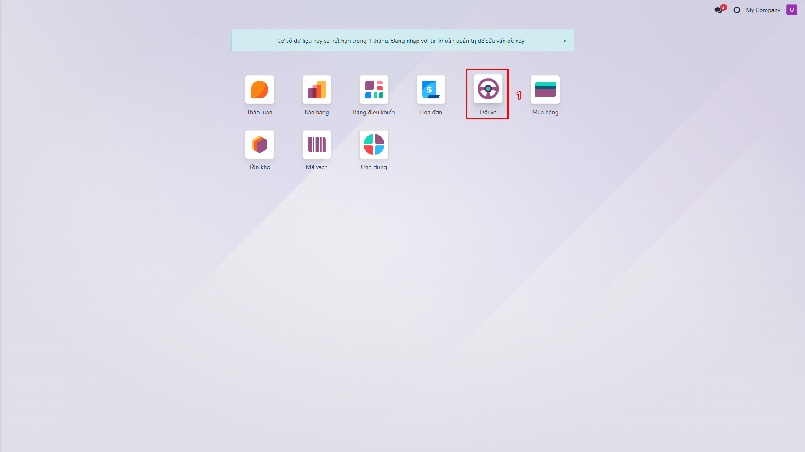

**Quyền hạn của Sale Admin**:
- ✅ Quản lý danh sách xe và thông tin xe
- ✅ Cấu hình thiết bị GPS cho từng xe
- ✅ Điều phối xe và tài xế cho các đơn đặt xe
- ✅ Xem bản đồ và vị trí real-time của tất cả xe
- ✅ Hoàn thành đơn đặt xe sau khi công tác kết thúc
- ✅ Kiểm tra phạt nguội qua API Cục CSGT
- ✅ Cấu hình hệ thống và tích hợp API

## 4.2 Quản lý Xe

### Xem danh sách Xe

1. Truy cập **Đội xe** → **Xe** (hoặc từ menu trên: **Xe** → **Xe**)
2. Giao diện thẻ hiển thị danh sách xe

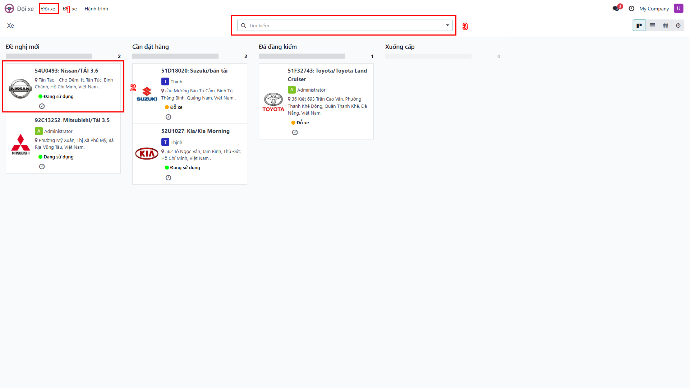

**Thông tin hiển thị trên card**:
- **Tên xe / Biển số**: Định danh xe
- **Trạng thái GPS**: Badge màu - Offline (Xám) / Idle (Vàng) / Running (Xanh)
- **Vị trí hiện tại**: Vị trí GPS gần nhất (nếu có)
- **Tài xế được gán**: Người lái xe hiện tại
- **Device ID**: Số serial GPS (nếu đã cấu hình)

### Xem và Chỉnh sửa Thông tin Xe

1. Click vào card xe cần xem
2. Màn hình chi tiết hiển thị đầy đủ thông tin

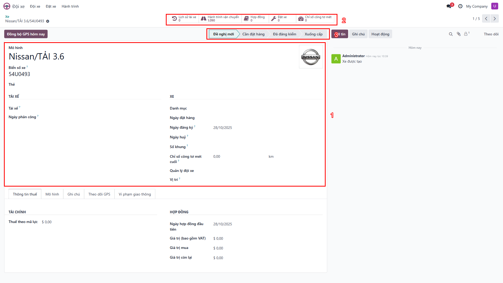

**Các tab thông tin**:

| Tab | Nội dung |
|-----|----------|
| **Thông tin chung** | Tên xe, biển số, model, năm sản xuất, màu sắc |
| **Driver** | Tài xế được gán mặc định cho xe |
| **GPS Tracking** | Cấu hình thiết bị GPS (Device Serial, Company ID) |
| **Vi phạm giao thông** | Thông tin phạt nguội, kiểm tra vi phạm |
| **Contracts** | Hợp đồng bảo hiểm, đăng kiểm, thuê xe |
| **Services** | Lịch sử bảo dưỡng, sửa chữa |

### Tạo Xe mới

1. Tại danh sách xe, nhấn nút **Mới**
2. Điền thông tin cần thiết:

**Thông tin bắt buộc**:
- ✅ **License Plate** (Biển số): Ví dụ: 51G-12345
- ✅ **Model**: Chọn model xe (ví dụ: Toyota Fortuner)
- ✅ **Company**: Chọn công ty sở hữu

**Thông tin tùy chọn**:
- **VIN**: Số khung
- **Driver**: Tài xế mặc định
- **Seats**: Số chỗ ngồi
- **Horsepower**: Công suất (HP)
- **Tag**: Phân loại xe (SUV, Truck, Sedan...)

3. Click **Lưu**

💡 **Mẹo**:
- Sử dụng Tag để phân loại xe theo mục đích sử dụng
- Cập nhật thông tin bảo dưỡng định kỳ để quản lý tốt hơn

## 4.3 Cấu hình GPS Device

Để xe có thể theo dõi GPS, **bắt buộc** phải cấu hình thiết bị GPS.

### Tab GPS Tracking

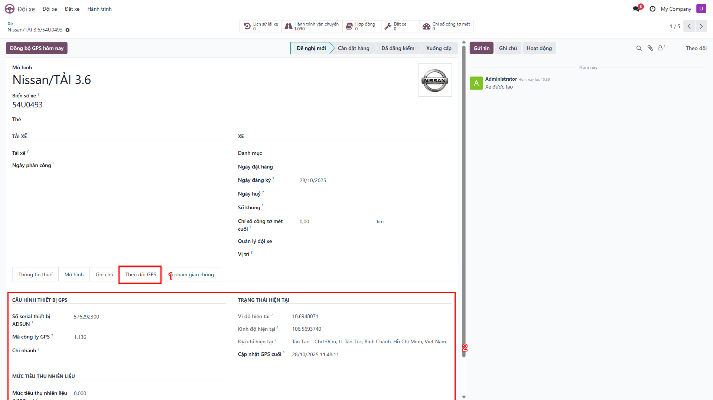

**Các trường cấu hình**:

| Trường | Bắt buộc | Mô tả | Ví dụ |
|--------|----------|-------|-------|
| **GPS Device Serial** | ✅ Có | Số serial thiết bị GPS ADSUN | 579324495 |
| **GPS Company ID** | ✅ Có | Mã công ty trên hệ thống ADSUN | 1136 |
| **Branch** | ⭕ Không | Chi nhánh quản lý xe | HCM / HN / DN |
| **Vị trí hiện tại** | Auto | Vị trí GPS gần nhất (tự động) | "Quận 1, TP.HCM" |
| **Lần đồng bộ cuối** | Auto | Timestamp đồng bộ cuối (tự động) | 2025-10-15 14:30:00 |

### Các bước cấu hình GPS

#### Bước 1: Lấy GPS Device Serial

Có 3 cách để lấy Device Serial:

**Cách 1: Tìm tự động** (Khuyến nghị)
1. Nhấn nút **Tìm số serial GPS**
2. Hệ thống tìm kiếm device dựa trên biển số xe
3. Nếu tìm thấy, Device Serial được điền tự động

**Cách 2: Tra cứu thủ công**
1. Truy cập ADSUN Portal: https://adsun.vn
2. Đăng nhập với tài khoản công ty
3. Tìm xe theo biển số → Sao chép Device ID

**Cách 3: Liên hệ đơn vị lắp đặt**
- Gọi cho đơn vị lắp thiết bị GPS
- Cung cấp biển số xe để tra cứu

#### Bước 2: Nhập thông tin GPS

1. Mở form xe cần cấu hình
2. Chuyển đến tab **GPS Tracking**
3. Nhập **GPS Device Serial** (ví dụ: 579324495)
4. Nhập **GPS Company ID** (mặc định: 1136 cho BESTMIX)
5. Chọn **Branch** (tùy chọn)
6. Click **Lưu**

#### Bước 3: Kiểm tra kết nối

1. Sau khi lưu, nhấn nút **Đồng bộ dữ liệu GPS**
2. Hệ thống kết nối ADSUN API để lấy vị trí hiện tại
3. Kiểm tra kết quả:

✅ **Thành công**:
- Trường "Vị trí hiện tại" được cập nhật
- Trường "Lần đồng bộ cuối" hiển thị timestamp
- Badge trạng thái GPS chuyển sang Idle hoặc Running

❌ **Thất bại**:
- Thông báo lỗi: "Không thể kết nối GPS" hoặc "Device ID không tồn tại"
- Kiểm tra lại Device Serial và Company ID
- Đảm bảo thiết bị GPS đang hoạt động

💡 **Mẹo cấu hình GPS**:
- Test ngay sau khi cấu hình để đảm bảo đúng Device ID
- Nếu GPS Serial không đúng, waypoints sẽ không được ghi lại
- Cập nhật cấu hình khi thay thiết bị GPS mới

⚠️ **Cảnh báo quan trọng**:
- GPS Serial phải chính xác 100%, nhập sai = không có dữ liệu GPS
- Không cấu hình GPS Serial của xe khác cho xe này
- Kiểm tra kỹ trước khi dispatch xe để tránh mất dữ liệu hành trình

## 4.4 Kiểm tra Phạt nguội

Sale Admin có thể kiểm tra phạt nguội cho từng xe qua tích hợp API Cục CSGT.

### Tab Vi phạm giao thông

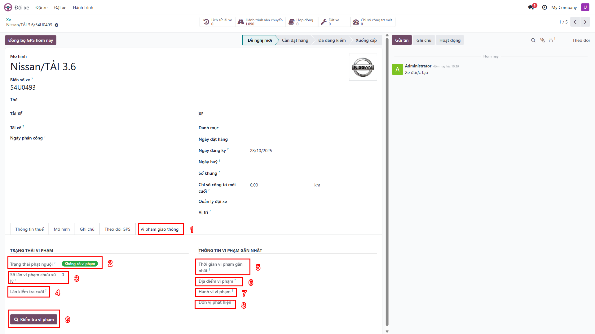

**Ảnh trên đã gán nhãn các phần tử giao diện (1-9)** để dễ dàng tra cứu.

### Cấu trúc Tab

#### 1. TRẠNG THÁI VI PHẠM (bên trái)

| Số | Trường thông tin | Mô tả |
|---|---|---|
| 2 | **Trạng thái phạt nguội** | Badge màu: "Không có vi phạm" (🟢 xanh) / "Có vi phạm" (🔴 đỏ) |
| 3 | **Số lần vi phạm chưa xử lý** | Số lượng vi phạm chưa được xử lý (chưa đóng phạt) |
| 4 | **Lần kiểm tra cuối** | Thời gian kiểm tra phạt nguội gần nhất qua API |

#### 2. THÔNG TIN VI PHẠM GẦN NHẤT (bên phải)

| Số | Trường thông tin | Mô tả |
|---|---|---|
| 5 | **Thời gian vi phạm** | Ngày giờ xảy ra vi phạm giao thông |
| 6 | **Địa điểm vi phạm** | Vị trí địa lý nơi phát hiện vi phạm (camera, trạm cân...) |
| 7 | **Hành vi vi phạm** | Mô tả chi tiết hành vi vi phạm (theo quy định pháp luật) |
| 8 | **Đơn vị phát hiện** | Cơ quan CSGT phát hiện và lập biên bản |

#### 3. NÚT THAO TÁC

| Số | Nút | Mô tả |
|---|---|---|
| 9 | **Kiểm tra vi phạm** | Kết nối API iphatnguoi.com để lấy dữ liệu phạt nguội mới nhất |

### Cách sử dụng

1. Mở form xe cần kiểm tra
2. Chuyển đến tab **Vi phạm giao thông**
3. Nhấn nút **Kiểm tra vi phạm** (số 9)
4. Chờ hệ thống kết nối API (5-30 giây)
5. Kết quả hiển thị:

✅ **Không có vi phạm**:
- Badge hiển thị 🟢 "Không có vi phạm"
- Số lần vi phạm = 0
- Các trường thông tin vi phạm để trống

⚠️ **Có vi phạm**:
- Badge hiển thị 🔴 "Có vi phạm"
- Số lần vi phạm > 0 (ví dụ: 2)
- Thông tin vi phạm gần nhất được hiển thị đầy đủ

### Lưu ý quan trọng

- ✅ **Cần kết nối Internet**: API yêu cầu kết nối mạng ổn định để truy vấn
- ⏱️ **Thời gian phản hồi**: API có thể chậm vào giờ cao điểm (30-60s), hãy kiên nhẫn
- 💾 **Cache 24 giờ**: Dữ liệu được lưu tạm 24 giờ, nhấn lại nút để cập nhật mới
- 🔄 **Tự động cập nhật**: Khi có vi phạm mới, badge và số lượng sẽ tự động cập nhật sau lần kiểm tra tiếp theo
- 📋 **Xử lý vi phạm**: Thông báo cho tài xế và theo dõi việc đóng phạt

💡 **Gợi ý sử dụng**:
- Kiểm tra phạt nguội định kỳ mỗi tuần cho toàn bộ đội xe
- Trước khi dispatch xe, kiểm tra để đảm bảo xe không có vi phạm chưa xử lý
- Tạo quy trình yêu cầu tài xế giải trình khi có vi phạm mới

## 4.5 Điều xe (Vehicle Dispatch)

Đây là nhiệm vụ quan trọng nhất của Sale Admin: điều phối xe cho các đơn đặt xe đã được phê duyệt.

### Xem danh sách đơn chờ điều xe

1. Truy cập **Đội xe** → **Đặt xe**
2. Giao diện Kanban hiển thị các cột trạng thái

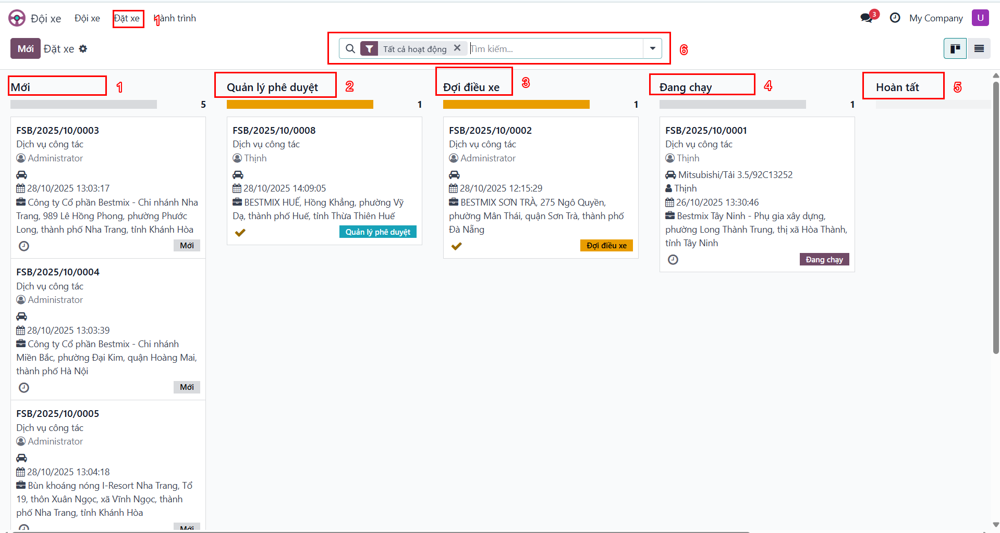

**Lưu ý**: Sale Admin thấy tất cả 6 cột, bao gồm **Đợi điều xe** (Pending Dispatch)

**Ý nghĩa các cột**:
- **Mới**: Đơn mới tạo, chưa gửi phê duyệt
- **Quản lý phê duyệt**: Chờ Quản lý duyệt
- **Đợi điều xe**: ⭐ Đơn đã được Quản lý duyệt, chờ Sale Admin phân xe
- **Đang chạy**: Đã điều xe, xe đang thực hiện chuyến đi
- **Hoàn tất**: Chuyến đi đã hoàn thành
- **Đã hủy**: Đơn bị từ chối hoặc hủy

### Phân công Xe và Tài xế

Khi có đơn ở cột **Đợi điều xe**:

#### Bước 1: Mở đơn cần điều xe

1. Click vào card đơn trong cột **Đợi điều xe**
2. Màn hình chi tiết hiển thị đầy đủ thông tin

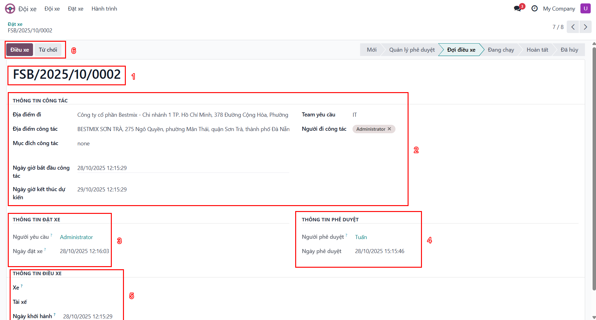

#### Bước 2: Xem thông tin đơn

Kiểm tra kỹ các thông tin:
- **Người yêu cầu**: Nhân viên tạo đơn
- **Địa điểm đi/đến**: Tuyến đường cần thực hiện
- **Ngày giờ đi**: Thời gian bắt đầu chuyến
- **Người đi**: Danh sách người tham gia (số lượng)
- **Mục đích**: Lý do sử dụng xe (công tác, giao hàng, đón khách...)
- **Ghi chú**: Yêu cầu đặc biệt (nếu có)

#### Bước 3: Chọn Xe phù hợp

Scroll xuống phần **Thông tin điều xe**:

1. Click vào dropdown **Vehicle** (Xe)
2. Danh sách xe hiển thị với thông tin:
   - Tên xe / Biển số
   - Trạng thái GPS (Idle/Running/Offline)
   - Tài xế hiện tại

**Tiêu chí chọn xe**:
- ✅ Xe đang **Idle** (không chạy)
- ✅ Xe có **số chỗ phù hợp** với số người đi
- ✅ Xe **gần điểm xuất phát** (giảm thời gian di chuyển)
- ✅ Xe đã **cấu hình GPS** (có Device Serial)
- ❌ Tránh xe **Offline** (không có tín hiệu GPS)
- ❌ Tránh xe **Running** (đang chạy chuyến khác)

3. Click chọn xe phù hợp

#### Bước 4: Chọn Tài xế

1. Click vào dropdown **Driver** (Tài xế)
2. Chọn tài xế từ danh sách
   - Hoặc để trống nếu chủ xe tự lái

💡 **Mẹo chọn tài xế**:
- Ưu tiên tài xế quen tuyến đường
- Kiểm tra lịch trình tài xế (nếu có)
- Gọi điện xác nhận trước khi dispatch

#### Bước 5: Nhập thông tin bổ sung

1. **Ngày điều xe**: Mặc định là ngày hiện tại, có thể điều chỉnh nếu dispatch trước
2. **Ghi chú** (Notes): Nhập ghi chú nếu cần (tùy chọn)
   - Ví dụ: "Xe cần đổ xăng trước khi đi", "Tài xế gọi nhân viên khi đến"

#### Bước 6: Xác nhận Điều xe

1. Click nút **Điều xe** (Dispatch Vehicle)
2. Hệ thống xác nhận

✅ **Kết quả**:
- Đơn chuyển sang trạng thái **Đang chạy**
- Card đơn di chuyển sang cột **Đang chạy**
- Thông báo công việc (Activity) được đóng tự động
- Nhân viên và Quản lý nhận thông báo email
- Xe và tài xế được gán cho chuyến đi
- Bắt đầu ghi lại hành trình GPS (nếu xe có cấu hình GPS)

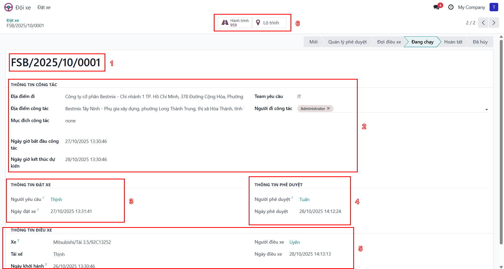

💡 **Mẹo điều xe hiệu quả**:
- Kiểm tra lịch xe trước khi điều để tránh trùng lịch
- Ưu tiên xe gần địa điểm khởi hành để tiết kiệm thời gian
- Gọi điện xác nhận với tài xế trước khi dispatch
- Kiểm tra GPS Device đã cấu hình chưa để đảm bảo có dữ liệu hành trình
- Dispatch ngay trong ngày để tài xế có thời gian chuẩn bị

⚠️ **Cảnh báo**:
- Không dispatch xe đang chạy chuyến khác
- Không dispatch xe offline (không có GPS signal)
- Đảm bảo xe đã kiểm tra phạt nguội và bảo dưỡng định kỳ

### Từ chối Điều xe

Nếu không thể điều xe (không có xe trống, điều kiện thời tiết, xe hỏng...):

1. Mở đơn cần từ chối
2. Click nút **Từ chối** (Reject)
3. Popup hiển thị yêu cầu nhập lý do
4. Nhập **Lý do từ chối** (bắt buộc)
   - Ví dụ: "Không có xe trống", "Thời tiết xấu không an toàn", "Xe bảo dưỡng"
5. Click **Xác nhận**

✅ **Kết quả**:
- Đơn chuyển sang trạng thái **Đã hủy**
- Nhân viên và Quản lý nhận thông báo email với lý do từ chối
- Activity được đóng với ghi chú từ chối

💡 **Gợi ý**:
- Luôn ghi rõ lý do từ chối để người yêu cầu hiểu và tạo đơn mới phù hợp hơn
- Liên hệ trực tiếp với Quản lý nếu từ chối đơn quan trọng
- Đề xuất giải pháp thay thế (ví dụ: đổi thời gian, thuê xe ngoài...)

## 4.6 Hoàn tất Đơn đặt xe

Sau khi chuyến đi hoàn thành, Sale Admin cần đánh dấu đơn là **Hoàn tất**.

### Các bước hoàn tất đơn

1. Truy cập **Đội xe** → **Đặt xe**
2. Mở đơn đang ở trạng thái **Đang chạy**
3. Xác nhận công tác đã hoàn thành:
   - Xe đã trở về
   - Tài xế xác nhận hoàn thành
   - Không có vấn đề phát sinh
4. Click nút **Hoàn tất** (Mark as Done)

✅ **Kết quả**:
- Đơn chuyển sang trạng thái **Hoàn tất**
- Xe và tài xế được giải phóng (có thể dispatch cho đơn khác)
- Hành trình GPS được khóa (không cập nhật nữa)
- Có thể xuất báo cáo quãng đường và chi phí

💡 **Lưu ý**:
- Kiểm tra hành trình GPS trước khi hoàn tất để đảm bảo dữ liệu đã đồng bộ đầy đủ
- Cập nhật ghi chú nếu có phát sinh chi phí (xăng, phí đường, sửa chữa...)
- Đánh giá hiệu suất tài xế (nếu có module đánh giá)

### Xem Tuyến đường đã điều xe

Sau khi dispatch, có thể xem tuyến đường và thống kê GPS:

1. Mở đơn đã điều xe
2. Click **Nút thông minh Tuyến đường** ở góc trên

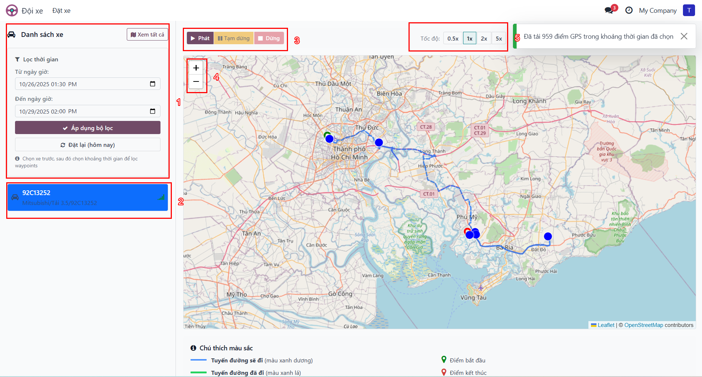

3. Bản đồ hiển thị tuyến đường chi tiết với waypoints

**Thông tin hiển thị**:
- Tuyến đường đã đi (đường màu xanh)
- Điểm bắt đầu (marker xanh lá)
- Điểm kết thúc (marker đỏ)
- Các waypoints dọc đường
- Thống kê: Tổng quãng đường, thời gian, tốc độ trung bình

## 4.7 Theo dõi GPS và Bản đồ

Sale Admin có quyền xem tất cả xe trên bản đồ real-time.

### Truy cập Bản đồ Hành trình

1. Từ menu trên: **Đội xe** → **Hành trình** → **Bản đồ hành trình**

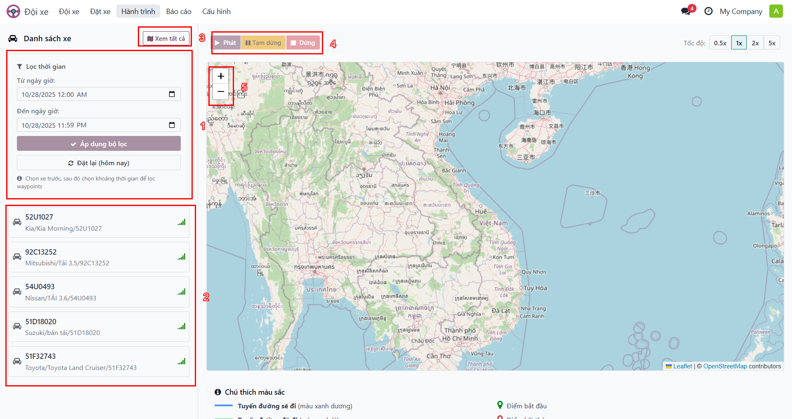

2. Bản đồ hiển thị vị trí tất cả xe

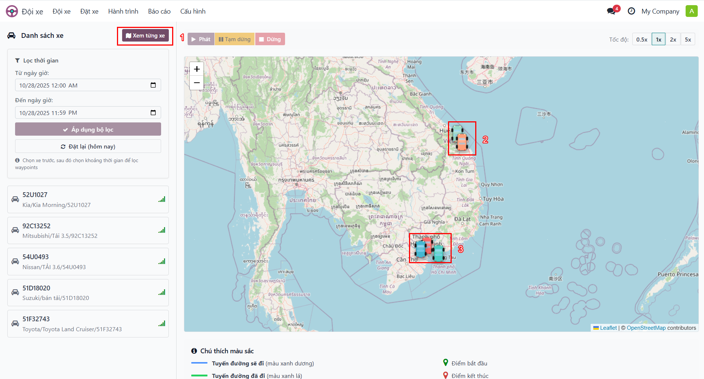

**Các thành phần trên bản đồ**:

| Số | Thành phần | Chức năng |
|----|-----------|-----------|
| ❶ | **Nút Xem từng xe** | Chuyển đổi giữa xem tất cả/từng xe |
| ❷ | **Điểm nhóm (Cluster)** | Nhóm xe theo khu vực, số hiển thị số lượng xe trong nhóm |
| ❸ | **Điểm xe đơn lẻ** | Vị trí xe riêng lẻ (khi zoom in) |

### Các tính năng Bản đồ

#### Zoom và Navigation

- **Phóng to/Thu nhỏ**: Nút +/- ở góc trái hoặc scroll chuột
- **Pan**: Click và kéo bản đồ
- **Center**: Double-click để center tại điểm đó
- **Fit bounds**: Click "Fit All" để hiển thị tất cả xe trong view

#### Xem chi tiết Xe

1. Click vào marker của xe (hoặc cluster để zoom in)
2. Popup hiển thị thông tin:
   - **Tên xe / Biển số**
   - **Tài xế** (nếu có)
   - **Vị trí hiện tại** (địa chỉ hoặc tọa độ)
   - **Thời gian cập nhật**: Timestamp GPS gần nhất
   - **Trạng thái**: Idle (Đang đỗ) / Running (Đang chạy) / Offline (Mất kết nối)
   - **Tốc độ hiện tại** (km/h)

#### Xem Hành trình Chi tiết

1. Click vào marker xe trên bản đồ
2. Trong popup, click link **Xem hành trình** hoặc nút **View Route**
3. Bản đồ hiển thị tuyến đường chi tiết

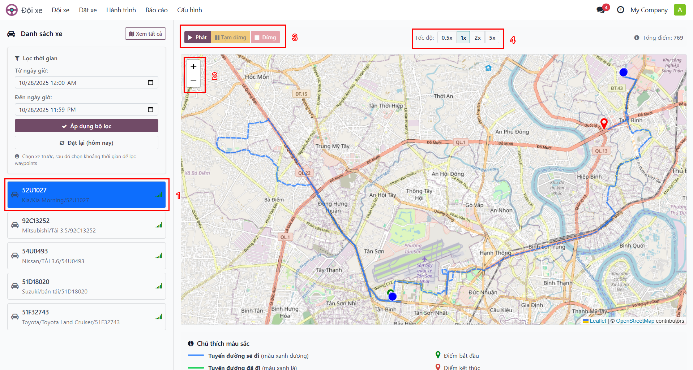

**Hiển thị**:
- **Đường đi (Polyline)**: Đường nối các waypoints (màu xanh)
- **Marker xanh lá**: Điểm bắt đầu chuyến đi
- **Marker đỏ**: Điểm kết thúc chuyến đi
- **Markers dọc đường**: Các điểm dừng/chuyển hướng (waypoints)
- **Thống kê**: Panel bên trái hiển thị tổng quãng đường, thời gian, tốc độ TB

#### Lọc và Tìm kiếm

Sử dụng panel bên trái để lọc:

**Lọc theo xe**:
- Dropdown **Vehicle**: Chọn xe cụ thể
- Hiển thị chỉ hành trình của xe đó

**Lọc theo thời gian**:
- **Date From / Date To**: Chọn khoảng thời gian
- Hiển thị hành trình trong khoảng đó

**Lọc theo trạng thái**:
- **Đang chạy**: Xe đang di chuyển (có tốc độ > 0)
- **Đang đỗ**: Xe dừng (tốc độ = 0)
- **Mất kết nối**: Xe không có tín hiệu GPS

**Lọc theo booking**:
- Chọn đơn đặt xe cụ thể
- Hiển thị hành trình của chuyến đó

💡 **Mẹo sử dụng bản đồ**:
- Sử dụng clustering để xem tổng quan nhanh toàn bộ đội xe
- Zoom in để xem chi tiết từng xe
- Lọc theo date range để phân tích xu hướng sử dụng xe theo tuần/tháng
- Export hành trình sang Excel để báo cáo chi tiết

### Danh sách Waypoints

Ngoài bản đồ, có thể xem dạng danh sách chi tiết:

1. Từ menu: **Đội xe** → **Hành trình** → **Hành trình vận tải**
2. Giao diện danh sách hiển thị tất cả waypoints

**Thông tin hiển thị**:
- **Xe**: Tên xe / Biển số
- **Thời gian**: Timestamp GPS (ngày giờ)
- **Vị trí**: Lat/Long (tọa độ GPS)
- **Địa chỉ**: Địa chỉ đã geocoding (nếu có)
- **Tốc độ**: km/h
- **Quãng đường tích lũy**: km từ điểm bắt đầu

**Sử dụng**:
- **Xuất Excel**: Click nút Export để xuất toàn bộ waypoints
- **Tìm kiếm**: Tìm waypoint theo xe, ngày, vị trí
- **So sánh**: So sánh quãng đường giữa các xe
- **Phân tích**: Phân tích tốc độ trung bình, thời gian di chuyển

---

# Phần V: Quy trình Nghiệp vụ

Phần này mô tả chi tiết các quy trình nghiệp vụ hoàn chỉnh từ góc nhìn Sale Admin.

## 5.1 Quy trình Đặt xe Hoàn chỉnh

### Sơ đồ Quy trình Tổng quát

```
┌─────────────┐
│  Nhân viên  │
│  Tạo đơn    │
└──────┬──────┘
       │
       ▼
┌─────────────┐
│    Mới      │ ◄─── Đặt lại (nếu bị từ chối)
│   (Draft)   │
└──────┬──────┘
       │ Gửi phê duyệt
       ▼
┌─────────────┐
│ Quản lý phê │
│   duyệt     │
│(Pending Mgr)│
└──────┬──────┘
       │
       ├─── Phê duyệt ───┐
       │               ▼
       │         ┌─────────────┐
       │         │ Đợi điều xe │ ⭐ Sale Admin xử lý
       │         │(Pending     │
       │         │ Dispatch)   │
       │         └──────┬──────┘
       │                │
       │                ├─── Dispatch ──┐ ⭐ Sale Admin điều xe
       │                │                ▼
       │                │          ┌─────────────┐
       │                │          │ Đang chạy   │
       │                │          │  (Running)  │
       │                │          └──────┬──────┘
       │                │                 │ Hoàn tất ⭐ Sale Admin đóng đơn
       │                │                 ▼
       │                │           ┌─────────────┐
       │                │           │  Hoàn tất   │
       │                │           │   (Done)    │
       │                │           └─────────────┘
       │                │
       │                └─── Từ chối ──┐ ⭐ Sale Admin có thể từ chối
       │                               │
       └─── Từ chối ────────────────────┤
                                       ▼
                                 ┌─────────────┐
                                 │   Đã hủy    │
                                 │ (Cancelled) │
                                 └─────────────┘
```

**⭐ Vai trò Sale Admin**: Xử lý giai đoạn điều xe, hoàn tất đơn, và có quyền từ chối nếu không điều xe được.

### Chi tiết từng Giai đoạn

#### Giai đoạn 1-2: Nhân viên tạo và gửi đơn

**Người thực hiện**: Nhân viên
**Thời gian**: 2-5 phút
**Vai trò Sale Admin**: Không tham gia, chỉ theo dõi

💡 **Tham khảo**: Xem *Hướng dẫn Nhân viên, Phần 3.2* để hiểu cách nhân viên tạo đơn

#### Giai đoạn 3: Phê duyệt bởi Quản lý

**Người thực hiện**: Quản lý
**Thời gian**: 5-10 phút
**Vai trò Sale Admin**: Không tham gia, chỉ theo dõi

**Kết quả quan trọng cho Sale Admin**:
- ✅ **Nếu được duyệt**: Đơn chuyển sang **Pending Dispatch** → Sale Admin nhận thông báo Activity
- ❌ **Nếu bị từ chối**: Đơn chuyển sang **Cancelled**, Sale Admin không cần xử lý

💡 **Tham khảo**: Xem *Hướng dẫn Quản lý, Phần 4.2* để hiểu tiêu chí phê duyệt

#### Giai đoạn 4: Điều xe (Trách nhiệm chính của Sale Admin)

**Người thực hiện**: Sale Admin
**Thời gian**: 10-30 phút
**Thời gian chờ tối đa**: SLA khuyến nghị là 4 giờ làm việc

**Các bước chi tiết**:

1. **Nhận thông báo**:
   - Activity mới xuất hiện trong inbox
   - Email thông báo có đơn chờ điều xe
   - Dashboard hiển thị đơn trong cột "Pending Dispatch"

2. **Đánh giá yêu cầu**:
   - Mở đơn và đọc kỹ thông tin
   - Kiểm tra: Địa điểm, thời gian, số người, mục đích

3. **Chọn xe phù hợp** (tiêu chí ưu tiên):
   - ✅ **Xe Idle**: Không bận chuyến khác
   - ✅ **Gần địa điểm**: Tiết kiệm thời gian di chuyển
   - ✅ **Đủ chỗ ngồi**: Phù hợp với số người đi
   - ✅ **GPS hoạt động**: Đã cấu hình Device Serial
   - ✅ **Bảo dưỡng đầy đủ**: Đăng kiểm, bảo hiểm còn hạn
   - ✅ **Không có phạt nguội**: Hoặc đã xử lý xong

4. **Chọn tài xế**:
   - Ưu tiên tài xế quen tuyến đường
   - Xác nhận tài xế có sẵn (gọi điện)
   - Hoặc để trống nếu chủ xe tự lái

5. **Xác nhận điều xe**:
   - Nhấn nút **Dispatch Vehicle**
   - Hệ thống tự động:
     - Chuyển trạng thái sang **Running**
     - Gán xe và tài xế
     - Đóng Activity
     - Thông báo cho Nhân viên và Quản lý
     - Bắt đầu ghi hành trình GPS

**Kết quả**:
- Đơn chuyển sang trạng thái **Running**
- Xe và tài xế được gán cho chuyến đi
- GPS bắt đầu tracking (waypoints được ghi mỗi 5 phút)
- Nhân viên và Quản lý nhận thông báo

**Trong quá trình chạy**:
- GPS cập nhật vị trí mỗi 5 phút
- Sale Admin có thể xem real-time trên bản đồ
- Tốc độ, quãng đường được ghi lại tự động

**Nếu không thể điều xe**:
- Nhấn nút **Reject**
- Nhập lý do từ chối (bắt buộc)
- Đơn chuyển sang **Cancelled**
- Nhân viên và Quản lý nhận thông báo với lý do

#### Giai đoạn 5: Hoàn thành đơn (Trách nhiệm của Sale Admin)

**Người thực hiện**: Sale Admin
**Thời gian**: Vài giây
**Thời điểm**: Sau khi nhân viên hoàn tất công tác và xe trở về

**Các bước**:
1. Xác nhận với tài xế hoặc nhân viên rằng chuyến đi đã hoàn tất
2. Mở đơn ở trạng thái **Running**
3. Kiểm tra hành trình GPS đã sync đầy đủ chưa
4. Nhấn nút **Mark as Done**

**Kết quả**:
- Đơn chuyển sang trạng thái **Done**
- Xe và tài xế được giải phóng (có thể dispatch cho đơn khác)
- Hành trình GPS được khóa (không cập nhật nữa)
- Báo cáo có thể được xuất để đối soát chi phí

💡 **Mẹo hoàn tất đơn**:
- Kiểm tra waypoints cuối cùng để đảm bảo xe đã về đích
- Cập nhật ghi chú nếu có phát sinh chi phí (xăng, phí đường, sửa chữa...)
- Export hành trình GPS trước khi đóng đơn để lưu trữ

## 5.2 Quy trình Điều xe Chi tiết

### Nguyên tắc Điều xe Hiệu quả

Sale Admin cần tuân thủ các nguyên tắc sau khi điều xe:

#### 1. Ưu tiên

| Mức độ | Tiêu chí | Thời gian phản hồi |
|--------|----------|-------------------|
| **Khẩn cấp** | Đơn có ghi chú "Khẩn cấp" hoặc từ ban lãnh đạo | < 2 giờ |
| **Cao** | Đơn trong ngày, công tác quan trọng | < 4 giờ |
| **Trung bình** | Đơn ngày mai, công tác thường xuyên | < 1 ngày |
| **Thấp** | Đơn từ 2 ngày trở lên | < 2 ngày |

#### 2. Tối ưu hóa

**Gộp chuyến**:
- Nếu 2 đơn cùng hướng, cùng thời gian → Cân nhắc gộp lại dùng 1 xe
- Tiết kiệm chi phí và xe

**Cân đối tải**:
- Phân bổ công việc đều cho các xe
- Tránh xe nào quá bận, xe nào nhàn rỗi

**Tối ưu quãng đường**:
- Chọn xe gần điểm xuất phát nhất
- Giảm thời gian và chi phí di chuyển đón khách

#### 3. An toàn

**Kiểm tra trước khi dispatch**:
- ❌ Không dispatch xe **Offline** (không có tín hiệu GPS)
- ❌ Không dispatch xe quá **giờ làm việc** tài xế (> 8h/ngày)
- ❌ Không dispatch xe **hết đăng kiểm** hoặc **bảo hiểm**
- ❌ Không dispatch xe có **phạt nguội chưa xử lý** (nếu chính sách yêu cầu)

### Checklist Trước khi Điều xe

Sử dụng checklist này để đảm bảo điều xe an toàn và hiệu quả:

**Kiểm tra Xe**:
- [ ] Xe có GPS hoạt động? (Badge màu xanh hoặc vàng, không xám)
- [ ] Xe không bận chuyến khác? (Không có booking Running khác)
- [ ] Đăng kiểm còn hạn? (Check tab Contracts)
- [ ] Bảo hiểm còn hạn? (Check tab Contracts)
- [ ] Xe không có phạt nguội chưa xử lý? (Check tab Vi phạm giao thông)
- [ ] Nhiên liệu đủ cho chuyến đi? (Xác nhận với tài xế)

**Kiểm tra Tài xế**:
- [ ] Tài xế có sẵn sàng? (Gọi điện xác nhận)
- [ ] Tài xế quen tuyến đường? (Ưu tiên nếu đi xa)
- [ ] Tài xế không quá giờ làm việc? (< 8h/ngày)

**Kiểm tra Đơn**:
- [ ] Thời gian hợp lý? (Không quá gấp)
- [ ] Địa điểm rõ ràng? (Nhân viên đã nhập đúng)
- [ ] Số người phù hợp với xe? (Xe đủ chỗ ngồi)

### Xử lý Xung đột Lịch trình

**Trường hợp**: 2 đơn cùng thời gian, chỉ có 1 xe

**Giải pháp**:

1. **Đánh giá mức độ ưu tiên**:
   - So sánh mức độ khẩn cấp
   - So sánh vị trí trong tổ chức (lãnh đạo > nhân viên)
   - So sánh tính chất công việc (khách hàng > nội bộ)

2. **Liên hệ các bên**:
   - Gọi điện cho cả 2 nhân viên/quản lý
   - Giải thích tình huống
   - Hỏi xem ai có thể dịch thời gian

3. **Tìm xe thay thế**:
   - Kiểm tra xe chi nhánh khác
   - Cân nhắc thuê xe ngoài (nếu ngân sách cho phép)
   - Mượn xe từ đối tác

4. **Quyết định cuối cùng**:
   - Ưu tiên đơn được duyệt trước
   - Hoặc ưu tiên theo chính sách công ty
   - Từ chối đơn còn lại với lý do rõ ràng

### Xử lý Trường hợp Đặc biệt

#### Thay đổi Xe/Tài xế Giữa chừng

**Khi nào**: Xe hỏng, tài xế bận đột xuất, yêu cầu thay đổi

**Các bước**:
1. Liên hệ với nhân viên đang sử dụng xe để thông báo
2. Mở đơn đang ở trạng thái **Running**
3. Nhấn **Edit** để sửa
4. Thay đổi trường **Vehicle** hoặc **Driver**
5. **Lưu** thay đổi
6. Gọi tài xế mới để xác nhận
7. Cập nhật ghi chú trong Chatter về lý do thay đổi

**Lưu ý quan trọng**:
- Hành trình GPS mới sẽ ghi dưới xe mới
- Hành trình cũ vẫn giữ nguyên với xe cũ
- Cập nhật rõ ràng trong ghi chú để tránh nhầm lẫn khi đối soát

## 5.3 Quy trình Theo dõi GPS

### Đồng bộ GPS Tự động

**Cơ chế hoạt động**:
1. **Thiết bị GPS** trên xe gửi dữ liệu lên ADSUN server mỗi 5 phút
2. **Odoo** tự động gọi ADSUN API mỗi 10 phút để lấy waypoints mới
3. **Waypoints** được lưu vào database với thông tin:
   - Timestamp (ngày giờ)
   - Tọa độ (Latitude, Longitude)
   - Tốc độ (km/h)
   - Quãng đường tích lũy (km)

**Job tự động**:
- **Scheduled Action**: `fleet_gps_sync_all_vehicles`
- **Tần suất**: Mỗi 10 phút
- **Điều kiện**: Chỉ sync xe đang có booking **Running**

### Theo dõi Real-time

**Cách theo dõi**:
1. Truy cập **Đội xe** → **Hành trình** → **Bản đồ hành trình**
2. Xem tất cả xe đang Running trên bản đồ
3. Click vào marker xe để xem chi tiết:
   - Vị trí hiện tại
   - Tốc độ hiện tại
   - Thời gian cập nhật cuối
   - Trạng thái (Idle/Running)

**Khi nào cần theo dõi**:
- Khi nhân viên báo xe đến muộn
- Khi cần xác nhận xe đã đến điểm hẹn
- Khi kiểm tra tài xế có đi đúng tuyến không
- Khi theo dõi tốc độ để đảm bảo an toàn

### Xử lý Sự cố GPS

#### Sự cố: GPS không cập nhật

**Dấu hiệu**:
- Trạng thái xe hiển thị **Offline** (xám)
- "Lần đồng bộ cuối" đã quá 30 phút
- Bản đồ không hiển thị vị trí mới

**Các bước xử lý**:
1. **Kiểm tra cấu hình**:
   - Mở form xe
   - Tab **GPS Tracking**
   - Verify **GPS Device Serial** và **Company ID** đúng

2. **Test đồng bộ thủ công**:
   - Nhấn nút **Sync GPS Data**
   - Nếu thành công → Device Serial đúng, chỉ là tạm thời offline
   - Nếu lỗi → Device Serial sai hoặc thiết bị GPS có vấn đề

3. **Liên hệ tài xế**:
   - Gọi điện xác nhận vị trí hiện tại
   - Hỏi xem có tắt máy xe không
   - Yêu cầu khởi động lại xe để GPS reset

4. **Liên hệ nhà cung cấp GPS**:
   - Nếu vẫn không được, liên hệ ADSUN
   - Cung cấp Device Serial và biển số xe
   - Yêu cầu kiểm tra từ phía server ADSUN

#### Sự cố: Tọa độ GPS sai

**Dấu hiệu**:
- Bản đồ hiển thị xe ở vị trí lạ (giữa biển, nước ngoài...)
- Tọa độ (0, 0) hoặc giá trị bất thường

**Nguyên nhân**:
- Thiết bị GPS lỗi
- Tín hiệu GPS yếu (trong hầm, nhà cao tầng)
- Lỗi API ADSUN

**Xử lý**:
- Xóa waypoint sai (nếu có quyền)
- Hoặc báo cáo cho Admin để xóa
- Kiểm tra thiết bị GPS

## 5.4 Các trường hợp đặc biệt

### Hủy đơn đang Chạy

**Khi nào**: Công tác bị hủy đột xuất, nhân viên bị bệnh, thời tiết xấu...

**Các bước**:
1. Nhận thông báo từ Nhân viên hoặc Quản lý
2. Liên hệ tài xế ngay lập tức để báo hủy chuyến
3. Mở đơn đang **Running**
4. **Cách 1** (nếu có Developer Mode):
   - Bật Developer Mode: Settings → Activate Developer Mode
   - Sửa trường `state` thành `cancelled`
5. **Cách 2** (nếu không có Developer Mode):
   - Liên hệ System Admin để hủy
6. Cập nhật ghi chú trong Chatter về lý do hủy
7. Thông báo lại cho Nhân viên và Quản lý

**Hậu quả**:
- Hành trình GPS vẫn được ghi lại (không xóa được)
- Xe và tài xế được giải phóng ngay
- Có thể phát sinh chi phí hủy chuyến (xăng đã đổ, phí cầu đường...)
- Cần cập nhật rõ ràng để đối soát sau này

### Đặt lại đơn đã Từ chối

**Khi nào**: Nhân viên muốn sửa đơn đã bị từ chối và gửi lại

**Quyền hạn**:
- Chỉ người tạo đơn hoặc Manager có thể **Reset to Draft**
- Sale Admin không thể reset (trừ khi có quyền cao hơn)

**Các bước (từ phía Nhân viên/Manager)**:
1. Mở đơn ở trạng thái **Cancelled**
2. Nhấn nút **Reset to Draft**
3. Đơn quay về trạng thái **Draft**
4. Chỉnh sửa theo góp ý của Manager
5. Gửi lại phê duyệt

**Vai trò Sale Admin**:
- Không tham gia trực tiếp
- Nhưng có thể tư vấn cho Nhân viên về cách sửa (ví dụ: chọn địa điểm rõ ràng hơn)

### Gia hạn Thời gian Sử dụng Xe

**Khi nào**: Nhân viên cần dùng xe lâu hơn dự kiến, công tác kéo dài

**Các bước**:
1. Nhân viên liên hệ Sale Admin (gọi điện hoặc Chatter)
2. Sale Admin kiểm tra:
   - Xe có booking khác liền sau không?
   - Tài xế có vượt giờ làm việc không?
3. **Nếu OK**:
   - Thông báo cho Nhân viên: "Được phép gia hạn đến X giờ"
   - Cập nhật ghi chú trong đơn
   - Không cần sửa trường "Departure Date Time" / "Return Date Time"
4. **Nếu không OK**:
   - Giải thích lý do
   - Đề xuất giải pháp thay thế (ví dụ: đổi xe khác)

**Lưu ý**:
- Luôn cập nhật ghi chú rõ ràng về gia hạn
- Thông báo cho booking tiếp theo nếu bị ảnh hưởng

---

# Phần VI: Tính năng Nâng cao

Phần này hướng dẫn các tính năng nâng cao dành riêng cho Sale Admin.

## 6.1 Tìm kiếm và Lọc Nâng cao

### Tìm kiếm Nhanh

Tại màn hình danh sách đơn đặt xe, sử dụng thanh tìm kiếm ở góc trên bên phải:

**Có thể tìm theo**:
- **Mã đơn**: FSB/2025/10/0001
- **Địa điểm đến**: "Bến Tre", "Quận 1"
- **Tên xe**: "Toyota Fortuner", "51G-12345"
- **Tên tài xế**: "Nguyễn Văn A"
- **Người yêu cầu**: Tên nhân viên

**Cú pháp**:
- Nhập từ khóa → Tự động tìm (live search)
- Dùng dấu ngoặc kép cho cụm từ: `"Hồ Chí Minh"`
- Kết hợp với bộ lọc để thu hẹp kết quả

### Bộ lọc Chi tiết

Click vào **Filters** (hoặc icon phễu) để mở bảng lọc:

**Bộ lọc theo Trạng thái** (Quan trọng nhất cho Sale Admin):
- **Chờ điều xe** (`pending_dispatch`): Đơn cần Sale Admin xử lý
- **Đang chạy** (`running`): Đơn đang theo dõi GPS
- **Hoàn tất** (`done`): Đơn đã đóng
- **Đã hủy** (`cancelled`): Đơn bị từ chối

**Bộ lọc theo Thời gian**:
- **Hôm nay**: Đơn có departure date = hôm nay
- **Tuần này**: 7 ngày từ đầu tuần
- **Tháng này**: Từ ngày 1 đến cuối tháng
- **30 ngày qua**: Để xem báo cáo tháng
- **Custom**: Chọn khoảng From Date - To Date

**Bộ lọc theo Xe**:
- **Chưa điều xe**: Đơn chưa có Vehicle assigned
- **Theo xe cụ thể**: Chọn xe từ dropdown

**Bộ lọc theo Team**:
- **Theo phòng ban**: Xem đơn của từng team

💡 **Mẹo cho Sale Admin**:
- Lưu bộ lọc "Chờ điều xe + Hôm nay" làm **Favorite** để truy cập nhanh
- Kết hợp nhiều bộ lọc: "Chờ điều xe + Tuần này + Team Sales" để ưu tiên

### Nhóm theo (Group By)

Sử dụng **Group By** để tổ chức dữ liệu theo nhiều chiều:

**Nhóm theo Trạng thái** (`state`):
- Xem rõ số đơn ở mỗi giai đoạn
- Dễ dàng kéo thả giữa các cột (Kanban view)

**Nhóm theo Xe** (`vehicle_id`):
- Xem xe nào được dùng nhiều nhất
- Phát hiện xe nào ít được dùng
- Cân đối tải giữa các xe

**Nhóm theo Tài xế** (`driver_id`):
- Xem tài xế nào bận nhất
- Đánh giá hiệu suất tài xế

**Nhóm theo Ngày** (`departure_date`):
- Xem lịch trình theo ngày
- Phát hiện ngày nào nhiều đơn để chuẩn bị

**Nhóm theo Team** (`team_id`):
- So sánh usage giữa các phòng ban
- Phân bổ tài nguyên xe hợp lý

💡 **Ví dụ sử dụng**:
- Nhóm theo State + Vehicle → Xem xe nào đang Running, xe nào Idle
- Nhóm theo Date + Team → Lên kế hoạch điều xe cho tuần

### Yêu thích (Favorites)

Lưu các bộ lọc thường dùng để truy cập nhanh:

**Các bước**:
1. Thiết lập bộ lọc + group by như mong muốn
2. Click **Favorites** → **Save current search**
3. Đặt tên ý nghĩa (ví dụ: "Chờ điều xe tuần này")
4. Chọn **Default filter** nếu muốn làm mặc định
5. Chọn **Share with all users** nếu muốn chia sẻ cho team
6. Click **Save**

**Gợi ý Favorites cho Sale Admin**:
- "Chờ điều xe hôm nay"
- "Đang chạy - Cần theo dõi GPS"
- "Hoàn tất tháng này - Đối soát"
- "Xe 51G-12345 - Tất cả lịch sử"

## 6.2 Xuất báo cáo GPS

### Xuất danh sách Đơn đặt xe

**Các bước**:
1. Tại màn hình danh sách (**List view**)
2. Sử dụng bộ lọc để chọn đơn cần xuất (ví dụ: "Hoàn tất + Tháng này")
3. Click checkbox **☑** ở đầu bảng để chọn tất cả (hoặc chọn từng đơn)
4. Click **Action** → **Export**
5. Chọn các trường cần xuất:

**Các trường nên xuất cho báo cáo quãng đường**:
- ✅ **Booking Code** (Mã đơn)
- ✅ **Departure Date** (Ngày đi)
- ✅ **Requester** (Người yêu cầu)
- ✅ **Team** (Phòng ban)
- ✅ **Departure Location** (Điểm đi)
- ✅ **Destination** (Điểm đến)
- ✅ **Vehicle** (Xe)
- ✅ **Driver** (Tài xế)
- ✅ **State** (Trạng thái)
- ✅ **GPS Distance (km)** (Quãng đường GPS)
- ✅ **Average Speed (km/h)** (Tốc độ TB)
- ✅ **Duration (hours)** (Thời gian chạy)

6. Chọn định dạng: **Excel (.xlsx)** (khuyến nghị) hoặc **CSV**
7. Click **Export**
8. File sẽ được download về máy

💡 **Mẹo**:
- Sắp xếp theo Departure Date trước khi export để dễ đọc
- Export theo từng tháng thay vì cả năm để tránh quá nhiều dữ liệu

### Xuất Waypoints Chi tiết

**Khi nào cần**: Khi cần phân tích chi tiết hành trình, kiểm tra tốc độ từng đoạn

**Các bước**:
1. Truy cập **Đội xe** → **Hành trình** → **Hành trình vận tải** (Waypoints)
2. Sử dụng bộ lọc:
   - **Vehicle**: Chọn xe cần phân tích
   - **Date**: Chọn khoảng thời gian
   - **Booking**: Chọn đơn cụ thể (nếu cần)
3. Chuyển sang **List view**
4. Chọn tất cả waypoints
5. Click **Action** → **Export**
6. Chọn các trường:
   - Vehicle
   - Timestamp
   - Latitude / Longitude
   - Address (nếu có geocoding)
   - Speed (km/h)
   - Distance Accumulated (km)
7. Export Excel

**Sử dụng data**:
- Mở file Excel
- Tạo biểu đồ tốc độ theo thời gian
- Tìm các đoạn tốc độ bất thường (>100 km/h)
- Phân tích thời gian dừng đỗ

## 6.3 Phân tích Dữ liệu

### Sử dụng Pivot Table

**Các bước**:
1. Tại danh sách đơn đặt xe
2. Chuyển sang **Pivot view** (icon bảng pivot)
3. Cấu hình:
   - **Rows**: Team, Vehicle
   - **Columns**: State
   - **Measures**: Count (số đơn), GPS Distance (tổng km)
4. Kết quả: Bảng pivot hiển thị số đơn và tổng km theo Team và Xe

**Ví dụ phân tích**:

| Team / Vehicle | Running | Done | Total Bookings | Total KM |
|----------------|---------|------|----------------|----------|
| Sales Team     | 2       | 15   | 17             | 1,250    |
| - Toyota Fortuner | 1    | 8    | 9              | 650      |
| - Honda CRV    | 1       | 7    | 8              | 600      |
| IT Team        | 0       | 10   | 10             | 800      |

**Insights**:
- Sales Team dùng xe nhiều nhất
- Toyota Fortuner được ưa chuộng hơn

### Sử dụng Graph View

**Các bước**:
1. Chuyển sang **Graph view** (icon biểu đồ)
2. Chọn loại biểu đồ:
   - **Bar Chart**: So sánh giữa các team/xe
   - **Line Chart**: Xu hướng theo thời gian
   - **Pie Chart**: Tỷ lệ phần trăm

**Ví dụ**:
- Biểu đồ cột: Số đơn theo Team (tháng này)
- Biểu đồ tròn: Tỷ lệ sử dụng theo Xe
- Biểu đồ đường: Số đơn hoàn tất theo tuần (trend)

### Tạo Dashboard Tùy chỉnh

**Các KPI quan trọng cho Sale Admin**:

| KPI | Cách tính | Mục tiêu |
|-----|-----------|----------|
| **Tỷ lệ sử dụng xe** | Số ngày xe Running / Tổng số ngày | > 60% |
| **Thời gian phản hồi** | Thời gian từ Pending Dispatch → Running | < 4 giờ |
| **Tỷ lệ hoàn thành** | Số đơn Done / Tổng số đơn | > 90% |
| **Quãng đường trung bình** | Tổng km / Số đơn Done | Tùy ngành |
| **Chi phí trung bình/km** | Tổng chi phí / Tổng km | Giảm dần |

💡 **Gợi ý**:
- Tạo báo cáo hàng tuần gửi cho Ban Giám đốc
- So sánh KPI theo tháng để thấy xu hướng
- Phát hiện xe nào hiệu quả nhất (km/đơn cao, chi phí/km thấp)

## 6.4 Tích hợp API

### Cấu hình ADSUN GPS API

**Truy cập cấu hình**:
1. Vào **Settings** → **Technical** → **System Parameters**
2. Tìm các key:
   - `fleet_gps.adsun_api_url`: URL endpoint ADSUN
   - `fleet_gps.adsun_company_id`: Company ID mặc định (1136)

**Kiểm tra kết nối**:
1. Vào form một xe đã cấu hình GPS
2. Nhấn **Sync GPS Data**
3. Nếu thành công → API hoạt động tốt
4. Nếu lỗi → Check lại URL và Company ID

### Cấu hình OpenMap.vn API

**Chức năng**: Gợi ý địa chỉ khi nhập địa điểm

**Cấu hình**:
1. Vào **Settings** → **Technical** → **System Parameters**
2. Key: `fleet_gps.openmap_api_key`
3. Value: API Key từ OpenMap.vn (nếu có)

**Lưu ý**:
- OpenMap.vn có free tier (giới hạn requests)
- Nếu không có API key, hệ thống vẫn hoạt động nhưng gợi ý kém chính xác

### Scheduled Actions (Cron Jobs)

**Xem các job tự động**:
1. Vào **Settings** → **Technical** → **Automation** → **Scheduled Actions**
2. Tìm các job liên quan:
   - `Fleet GPS: Sync All Vehicles` (Mỗi 10 phút)
   - `Fleet GPS: Clean Old Waypoints` (Hàng ngày)

**Quản lý**:
- Có thể tạm dừng job nếu cần (Uncheck "Active")
- Xem lịch sử chạy (tab "Executions")
- Điều chỉnh tần suất (Interval Number + Interval Type)

💡 **Cảnh báo**: Không tắt job sync GPS khi có xe đang Running

---

# Phần VII: Câu hỏi thường gặp và Xử lý sự cố

## 7.1 Câu hỏi chung

### Q1: Tôi có thể đặt xe cho người khác không?

**A**: Có, Sale Admin có thể tạo đơn cho bất kỳ ai. Chỉ cần chọn **Requester** là người cần đặt xe khi tạo đơn.

### Q2: Tôi có thể sửa đơn đang Running không?

**A**: Có, Sale Admin có quyền sửa đơn ở mọi trạng thái. Tuy nhiên:
- Nên cẩn thận khi sửa thông tin quan trọng (xe, tài xế, thời gian)
- Luôn cập nhật ghi chú về lý do sửa
- Thông báo cho các bên liên quan

### Q3: Làm sao biết xe nào đang rảnh?

**A**:
- **Cách 1**: Xem bản đồ real-time → Xe Idle (màu vàng) là rảnh
- **Cách 2**: Tại dropdown Vehicle khi điều xe, xe Idle sẽ ưu tiên hiển thị đầu
- **Cách 3**: Nhóm đơn theo Vehicle → Xe không có đơn Running là rảnh

### Q4: Tôi có thể điều 1 xe cho nhiều đơn cùng lúc không?

**A**: Không khuyến khích. Hệ thống cho phép nhưng sẽ gây nhầm lẫn trong theo dõi GPS. Nên:
- Hoặc gộp 2 đơn thành 1 đơn chung
- Hoặc điều 2 xe khác nhau
- Hoặc điều xe theo thứ tự (đơn 1 xong mới đơn 2)

### Q5: Đơn đã Done có thể chuyển về Running để sửa không?

**A**: Không trực tiếp. Cần:
- Bật Developer Mode
- Sửa trường `state` về `running`
- Hoặc liên hệ System Admin

Tuy nhiên, **không khuyến khích** vì sẽ ảnh hưởng đến tính toàn vẹn dữ liệu. Nên tạo ghi chú chi tiết thay vì sửa trạng thái.

## 7.2 Câu hỏi về GPS

### Q6: GPS không cập nhật phải làm sao?

**A - Checklist xử lý**:
1. ✅ Kiểm tra **GPS Device Serial** đã đúng chưa (tab GPS Tracking)
2. ✅ Nhấn **Sync GPS Data** để force sync
3. ✅ Đợi 5-10 phút (sync interval là 10 phút)
4. ✅ Kiểm tra xe có đang chạy không (gọi tài xế)
5. ✅ Kiểm tra Scheduled Action `Sync All Vehicles` có đang Active không
6. ✅ Nếu vẫn không được → Liên hệ ADSUN support

### Q7: Làm sao để xóa waypoint sai?

**A**:
- Sale Admin không thể xóa waypoint trực tiếp qua giao diện
- Cần bật **Developer Mode** → **Technical** → **Database Structure** → **Ir Model Data**
- Hoặc liên hệ System Admin
- **Khuyến nghị**: Để nguyên, chỉ ghi chú là waypoint lỗi

### Q8: Tại sao bản đồ hiển thị xe ở giữa biển (tọa độ 0, 0)?

**A**:
- **Nguyên nhân**: Thiết bị GPS gửi tọa độ (0, 0) khi mất tín hiệu
- **Xử lý**:
  - Bỏ qua waypoint đó
  - Đợi waypoint tiếp theo
  - Liên hệ tài xế kiểm tra GPS device

### Q9: Làm sao để xuất bản đồ hành trình ra file PDF?

**A**:
- Mở bản đồ hành trình của đơn
- Sử dụng chức năng **Print** của trình duyệt (`Ctrl + P`)
- Chọn **Save as PDF**
- Hoặc chụp màn hình (Screenshot) để lưu

### Q10: GPS có ghi lại tốc độ tối đa không?

**A**: Có. Mỗi waypoint có trường `speed` (km/h). Để tìm tốc độ tối đa:
- Export waypoints ra Excel
- Sắp xếp cột Speed giảm dần
- Waypoint đầu tiên là tốc độ max

💡 **Gợi ý**: Tạo báo cáo tuần để phát hiện tài xế chạy quá tốc độ (>90 km/h)

## 7.3 Xử lý lỗi kỹ thuật

### Lỗi Điều xe

#### Lỗi: "Vehicle is already assigned to another booking"

**Nguyên nhân**: Xe đang được điều cho đơn khác (trạng thái Running)

**Giải pháp**:
1. Kiểm tra đơn đang Running của xe đó
2. Nếu đơn đó đã xong → Hoàn tất đơn trước
3. Hoặc chọn xe khác
4. Hoặc đợi đơn kia xong rồi mới dispatch

#### Lỗi: "No GPS device configured for this vehicle"

**Nguyên nhân**: Xe chưa cấu hình GPS Device Serial

**Giải pháp**:
1. Mở form xe
2. Tab **GPS Tracking**
3. Nhập **GPS Device Serial**
4. Lưu và thử lại

**Lưu ý**: Có thể dispatch xe chưa có GPS, nhưng sẽ không có dữ liệu hành trình.

### Lỗi GPS Sync

#### Lỗi: "ADSUN API connection failed"

**Nguyên nhân**:
- Không có kết nối Internet
- ADSUN API down
- API URL sai

**Giải pháp**:
1. Kiểm tra Internet connection
2. Ping `api.adsun.vn` để test
3. Kiểm tra System Parameters: `fleet_gps.adsun_api_url`
4. Liên hệ ADSUN để xác nhận API status

#### Lỗi: "Invalid GPS Device Serial"

**Nguyên nhân**: GPS Serial không tồn tại trên hệ thống ADSUN

**Giải pháp**:
1. Kiểm tra lại GPS Serial (có thể nhập sai)
2. Đăng nhập ADSUN Portal để verify
3. Liên hệ đơn vị lắp GPS để lấy serial đúng

### Lỗi Bản đồ

#### Lỗi: Map không hiển thị (blank screen)

**Nguyên nhân**:
- JavaScript error
- Browser không tương thích
- Extensions (AdBlock) chặn

**Giải pháp**:
1. Mở **Developer Tools** (`F12`)
2. Xem tab **Console** có lỗi gì không
3. **Disable extensions** (đặc biệt AdBlock)
4. Thử trình duyệt khác (Chrome khuyến nghị)
5. Clear browser cache: `Ctrl + Shift + Del`

#### Lỗi: Markers không hiển thị trên bản đồ

**Nguyên nhân**:
- Không có dữ liệu GPS (xe chưa chạy)
- Bộ lọc quá hẹp
- Zoom level quá xa

**Giải pháp**:
- Bỏ tất cả bộ lọc (Filters → Clear All)
- Zoom out để xem toàn bộ (nút -)
- Chọn date range rộng hơn
- Kiểm tra xe có waypoints không (menu Waypoints)

### Lỗi Performance

#### Lỗi: Trang load chậm khi xem bản đồ

**Nguyên nhân**: Quá nhiều waypoints (>10,000 điểm)

**Giải pháp**:
- Sử dụng bộ lọc **Date Range** hẹp hơn (chỉ 1 ngày)
- Chọn **Vehicle** cụ thể thay vì All
- Chọn **Booking** cụ thể

#### Lỗi: Timeout khi xuất báo cáo lớn

**Nguyên nhân**: Quá nhiều dữ liệu (>50,000 dòng)

**Giải pháp**:
- Giảm số dữ liệu: Sử dụng bộ lọc tháng thay vì năm
- Xuất theo từng xe hoặc team
- Chọn ít trường hơn (chỉ 5-7 trường cần thiết)
- Liên hệ System Admin để tăng timeout limit

### Liên hệ Hỗ trợ

Nếu vẫn gặp lỗi sau khi thử các giải pháp trên:

**Thông tin cần cung cấp khi báo lỗi**:
- ✅ Username/Email của bạn
- ✅ Vai trò: Sale Admin
- ✅ Mô tả lỗi chi tiết (màn hình nào, thao tác gì)
- ✅ Các bước tái hiện lỗi (Step 1, 2, 3...)
- ✅ Screenshot (nếu có) - Nhấn `Ctrl + Shift + 4` (Windows)
- ✅ Thời gian xảy ra lỗi (ngày giờ cụ thể)
- ✅ Browser đang dùng (Chrome, Firefox, Edge...)

**Kênh liên hệ**:
- 📧 Email: support@bestmix.vn
- 📞 Hotline: (028) 1234 5678
- 💬 Hoặc tạo ticket trong module **Helpdesk** (nếu có)

---

# Phụ lục

## Phụ lục A: Bảng thuật ngữ

| Thuật ngữ Tiếng Việt | Thuật ngữ Tiếng Anh | Mô tả |
|---------------------|---------------------|-------|
| **Đội xe** | Fleet GPS | Tên module |
| **Đặt xe** | Booking | Tạo yêu cầu sử dụng xe |
| **Phê duyệt** | Approval | Xác nhận đồng ý yêu cầu |
| **Điều xe** | Dispatch | Phân công xe và tài xế |
| **Hành trình** | Journey | Tuyến đường xe đi |
| **Waypoint** | Waypoint | Điểm GPS trên hành trình (tọa độ, tốc độ, thời gian) |
| **Địa điểm đi** | Departure Location | Điểm khởi hành |
| **Địa điểm đến** | Destination | Điểm đích đến |
| **Mục đích công tác** | Work Purpose | Lý do sử dụng xe |
| **Người yêu cầu** | Requester | Người tạo đơn đặt xe |
| **Người phê duyệt** | Approver | Quản lý phê duyệt đơn |
| **Người điều xe** | Dispatcher | Sale Admin điều phối xe |
| **Tài xế** | Driver | Người lái xe |
| **Team yêu cầu** | Requesting Team | Phòng ban của người yêu cầu |
| **Thành viên tham gia** | Participants | Người đi cùng |
| **Trạng thái** | State/Status | Giai đoạn hiện tại của đơn |
| **Thông báo công việc** | Activity | Thông báo cần xử lý |
| **Khu vực trao đổi** | Chatter | Khu vực trao đổi, ghi chú |
| **Smart Button** | Smart Button | Nút thống kê/liên kết (số lượng kèm icon) |
| **Kanban View** | Kanban View | Giao diện dạng thẻ (cards) |
| **List View** | List View | Giao diện dạng bảng |
| **Form View** | Form View | Giao diện chi tiết |
| **GPS Serial** | GPS Device Serial | Số serial thiết bị GPS (ví dụ: 579324495) |
| **Company ID** | Company ID | Mã công ty trên hệ thống GPS ADSUN (ví dụ: 1136) |
| **Latitude** | Latitude | Vĩ độ (Lat) |
| **Longitude** | Longitude | Kinh độ (Long) |
| **Geocoding** | Geocoding | Chuyển tọa độ thành địa chỉ |
| **Sync** | Sync | Đồng bộ dữ liệu |
| **Filters** | Filters | Bộ lọc |
| **Group By** | Group By | Nhóm theo |
| **Export** | Export | Xuất dữ liệu (Excel, CSV) |
| **Cluster** | Cluster | Nhóm marker trên bản đồ |
| **Polyline** | Polyline | Đường nối các waypoints trên bản đồ |
| **Marker** | Marker | Điểm đánh dấu trên bản đồ |
| **SLA** | Service Level Agreement | Cam kết mức độ dịch vụ (thời gian phản hồi) |

## Phụ lục B: Bảng trạng thái và màu sắc

### Trạng thái Đơn đặt xe

| Trạng thái (VI) | Trạng thái (EN) | Mã | Màu sắc | Biểu tượng | Mô tả | Vai trò Sale Admin |
|-----------------|-----------------|-----|---------|-----------| ------|--------------------|
| **Mới** | Draft | `draft` | Xám (secondary) | ⚪ | Đơn vừa tạo, chưa gửi | Không xử lý |
| **Quản lý phê duyệt** | Pending Manager | `pending_manager` | Xanh dương (info) | 🔵 | Chờ Manager duyệt | Không xử lý |
| **Đợi điều xe** | Pending Dispatch | `pending_dispatch` | Cam (warning) | 🟠 | Manager đã duyệt, chờ điều xe | ⭐ **Xử lý chính** |
| **Đang chạy** | Running | `running` | Tím (primary) | 🟣 | Xe đang thực hiện | Theo dõi GPS |
| **Hoàn tất** | Done | `done` | Xanh lá (success) | 🟢 | Hoàn thành | Đóng đơn |
| **Đã hủy** | Cancelled | `cancelled` | Đỏ (danger) | 🔴 | Bị từ chối | Có thể từ chối nếu không điều xe được |

### Trạng thái GPS Xe

| Trạng thái | Điều kiện | Màu sắc | Biểu tượng | Ý nghĩa | Hành động của Sale Admin |
|------------|-----------|---------|-----------|---------|-------------------------|
| **Offline** | > 30 phút không có dữ liệu | Xám | ⚫ | Xe tắt máy hoặc GPS lỗi | ❌ Không nên dispatch |
| **Idle** | Có dữ liệu, tốc độ = 0 | Vàng | 🟡 | Xe đang dừng, sẵn sàng | ✅ OK để dispatch |
| **Running** | Có dữ liệu, tốc độ > 0 | Xanh lá | 🟢 | Xe đang chạy | ❌ Không dispatch (đang bận) |

### Màu sắc trong Kanban/List View

| Decoration | Trạng thái | Màu nền | Text color | CSS Class |
|------------|------------|---------|------------|-----------|
| Muted | draft | Xám nhạt | Xám đậm | `decoration-muted` |
| Info | pending_manager | Xanh dương nhạt | Xanh dương đậm | `decoration-info` |
| Warning | pending_dispatch | Cam nhạt | Cam đậm | `decoration-warning` |
| Primary | running | Tím nhạt | Tím đậm | `decoration-primary` |
| Success | done | Xanh lá nhạt | Xanh lá đậm | `decoration-success` |
| Danger | cancelled | Đỏ nhạt | Đỏ đậm | `decoration-danger` |

## Phụ lục C: Quyền truy cập Sale Admin

### Ma trận Quyền hạn Đầy đủ

| Chức năng | Nhân viên | Manager | Sale Admin |
|-----------|-----------|---------|------------|
| **Đơn đặt xe** |
| Tạo đơn đặt xe | ✅ Cho mình | ✅ Cho team | ✅ Cho tất cả |
| Xem đơn đặt xe | ✅ Của mình | ✅ Của team | ✅ **Tất cả** |
| Chỉnh sửa đơn | ✅ Khi Draft | ✅ Khi Draft | ✅ **Mọi lúc** |
| Xóa đơn | ✅ Khi Draft | ✅ Khi Draft | ✅ **Mọi lúc** |
| Gửi phê duyệt | ✅ Có | ✅ Có | ✅ Có |
| Phê duyệt đơn | ❌ Không | ✅ Đơn của team | ✅ **Tất cả đơn** |
| Từ chối đơn | ❌ Không | ✅ Đơn của team | ✅ **Tất cả đơn** |
| Điều xe | ❌ Không | ❌ Không | ✅ **Có** |
| Hoàn thành đơn | ❌ Không | ❌ Không | ✅ **Có** |
| Reset to Draft | ❌ Không | ✅ Đơn của team | ✅ **Tất cả đơn** |
| **GPS & Hành trình** |
| Xem hành trình GPS | ✅ Đơn của mình | ✅ Đơn của team | ✅ **Tất cả** |
| Xem bản đồ | ❌ Không | ❌ Không | ✅ **Có** |
| Xem waypoints | ❌ Không | ❌ Không | ✅ **Có** |
| Sync GPS Data | ❌ Không | ❌ Không | ✅ **Có** |
| **Quản lý Xe** |
| Xem danh sách xe | ❌ Không | ❌ Không | ✅ **Có** |
| Tạo/Sửa/Xóa xe | ❌ Không | ❌ Không | ✅ **Có** |
| Cấu hình GPS | ❌ Không | ❌ Không | ✅ **Có** |
| Kiểm tra phạt nguội | ❌ Không | ❌ Không | ✅ **Có** |
| **Báo cáo** |
| Xuất báo cáo đơn | ✅ Đơn của mình | ✅ Đơn của team | ✅ **Tất cả** |
| Xuất waypoints | ❌ Không | ❌ Không | ✅ **Có** |
| Pivot/Graph view | ✅ Đơn của mình | ✅ Đơn của team | ✅ **Tất cả** |
| **Cấu hình Hệ thống** |
| System Parameters | ❌ Không | ❌ Không | ✅ Có (nếu là Admin) |
| Scheduled Actions | ❌ Không | ❌ Không | ✅ Có (nếu là Admin) |

### Điểm nổi bật của Sale Admin

**Sale Admin có toàn quyền trong module**:
- ✅ Tất cả quyền của Nhân viên và Quản lý
- ✅ Điều phối xe và tài xế
- ✅ Quản lý danh sách xe và cấu hình GPS
- ✅ Xem bản đồ và theo dõi tất cả xe real-time
- ✅ Hoàn tất đơn đặt xe
- ✅ Cấu hình hệ thống và API

💡 **Lưu ý**: Sale Admin là vai trò cao nhất, có quyền truy cập đầy đủ vào mọi chức năng của module.

---

## Kết luận

Tài liệu này cung cấp hướng dẫn toàn diện cho **Sale Admin** về việc sử dụng Module **Đội xe GPS** trong Odoo 18.

**Tóm tắt trách nhiệm chính của Sale Admin**:
1. ✅ **Điều xe**: Phân xe và tài xế cho đơn đã được phê duyệt
2. ✅ **Theo dõi GPS**: Giám sát hành trình xe real-time
3. ✅ **Quản lý xe**: Cấu hình GPS, kiểm tra phạt nguội, bảo dưỡng
4. ✅ **Hoàn tất đơn**: Đóng đơn sau khi chuyến đi hoàn thành
5. ✅ **Báo cáo**: Xuất và phân tích dữ liệu quãng đường, chi phí

**Các điểm mạnh của Module**:
- ✅ Quy trình đặt xe rõ ràng, tự động với workflow 6 bước
- ✅ Theo dõi GPS real-time chính xác từ ADSUN API
- ✅ Quyền hạn phân cấp hợp lý (Nhân viên/Manager/Sale Admin)
- ✅ Giao diện thân thiện, dễ sử dụng, responsive
- ✅ Tích hợp sâu với workflow Odoo (Activity, Chatter, Mail)
- ✅ Báo cáo và phân tích dữ liệu mạnh mẽ (Pivot, Graph, Export)

**Lời khuyên cho Sale Admin**:
- 📝 Luôn cập nhật ghi chú rõ ràng cho mọi thao tác
- 🚗 Kiểm tra GPS cấu hình đầy đủ trước khi dispatch
- ⏱️ Điều xe nhanh (< 4 giờ) để không làm chậm quy trình
- 📊 Sử dụng bản đồ để theo dõi xe real-time
- 📈 Xuất báo cáo định kỳ để tối ưu hóa sử dụng xe

Nếu có thắc mắc hoặc cần hỗ trợ thêm, vui lòng liên hệ:

📧 **Email**: support@bestmix.vn
📞 **Hotline**: (028) 1234 5678
🌐 **Website**: https://www.bestmix.vn

---

**Phát triển bởi**: BESTMIX IT Team
**Bản quyền**: © 2025 BESTMIX Company
**Giấy phép**: LGPL-3

---

*Cảm ơn bạn đã sử dụng Module Đội xe GPS!*

