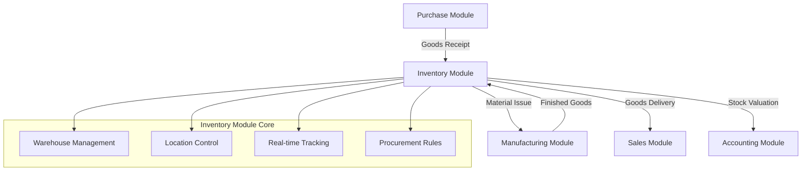
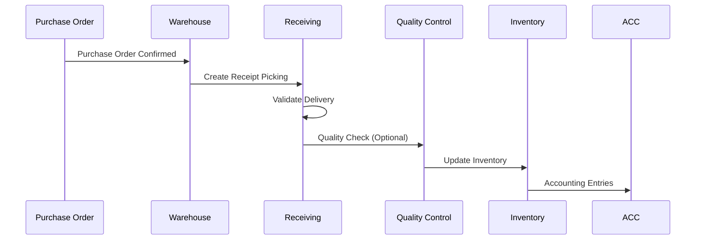
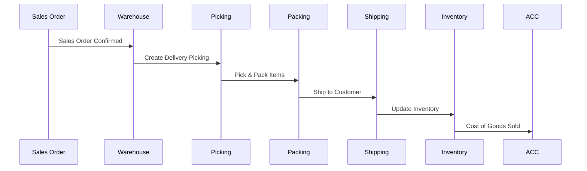
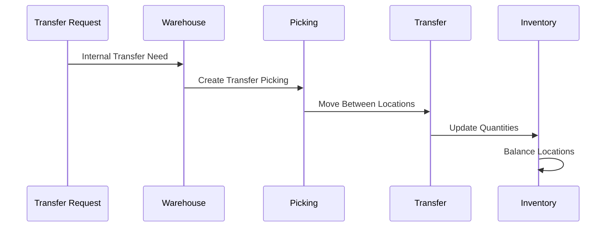

# 🏭 Tổng Quan Inventory Module (Module Quản Lý Kho) - Odoo 18

## 🎯 Giới Thiệu Module

Inventory Module (Module Quản Lý Kho) là hệ thống quản lý tồn kho toàn diện của Odoo, cung cấp khả năng theo dõi, kiểm soát và tối ưu hóa hàng hóa trong toàn bộ chuỗi cung ứng. Module này hoạt động như trung tâm kết nối giữa Purchase (Mua Hàng), Manufacturing (Sản Xuất), Sales (Bán Hàng) và Accounting (Kế Toán).

### 📊 Module Position in Supply Chain



## 🏗️ Kiến Trúc Module

### 📦 Component Architecture

Module Inventory được xây dựng trên kiến trúc 5 layers với các thành phần chính:

#### 1. **Presentation Layer** - Giao Diện Người Dùng
- **Warehouse Dashboard**: Tổng quan kho hàng
- **Inventory Operations**: Giao diện thao tác tồn kho
- **Lot/Serial Tracking**: Theo dõi lô/số sê-ri
- **Reporting & Analytics**: Báo cáo và phân tích

#### 2. **Business Logic Layer** - Logic Kinh Doanh
- **Stock Picking Engine**: Máy xử lý phiếu xuất/nhập kho
- **Stock Movement Engine**: Máy xử lý di chuyển tồn kho
- **Inventory Valuation Engine**: Máy xử lý định giá tồn kho
- **Replenishment Engine**: Máy xử lý bổ sung tồn kho

#### 3. **Integration Layer** - Tích Hợp Hệ Thống
- **Purchase Integration**: Tích hợp module Mua Hàng
- **Manufacturing Integration**: Tích hợp module Sản Xuất
- **Sales Integration**: Tích hợp module Bán Hàng
- **Accounting Integration**: Tích hợp module Kế Toán

#### 4. **Data Layer** - Lưu Trữ Dữ Liệu
- **Stock Quant Model**: Model theo dõi số lượng thực tế
- **Stock Move Model**: Model xử lý di chuyển
- **Stock Location Model**: Model quản lý địa điểm
- **Stock Picking Model**: Model xử lý phiếu xuất/nhập

#### 5. **Infrastructure Layer** - Nền Tảng
- **Database Schema**: Cấu trúc database
- **Security & Access Control**: Bảo mật và phân quyền
- **Performance Optimization**: Tối ưu hiệu năng
- **Multi-warehouse Support**: Hỗ trợ đa kho

## 🔍 Core Models Overview

### 📋 Stock Picking (`stock.picking`)
**Mục đích**: Điều khiển các hoạt động xuất/nhập kho
- **Workflow State Machine**: RFQ → Draft → Confirmed → Assigned → Done
- **Operation Types**: Nhận hàng, xuất hàng, chuyển kho nội bộ
- **Batch Processing**: Xử lý theo lô cho hiệu suất cao
- **Barcode Integration**: Tích hợp mã vạch cho nghiệp vụ kho

### 🚚 Stock Move (`stock.move`)
**Mục đích**: Quản lý di chuyển hàng hóa giữa các địa điểm
- **Chain Operations**: Chuỗi di chuyển hàng hóa
- **Procurement Logic**: Logic thu mua tự động
- **Reservation System**: Hệ thống đặt trước tồn kho
- **Tracking Integration**: Tích hợp theo dõi lô/số sê-ri

### 📦 Stock Move Line (`stock.move.line`)
**Mục đích**: Chi tiết hóa các di chuyển tồn kho
- **Granular Tracking**: Theo dõi chi tiết từng dòng
- **Package Management**: Quản lý đóng gói
- **Lot/Serial Details**: Chi tiết lô/số sê-ri
- **Quality Control**: Kiểm soát chất lượng tích hợp

### 📊 Stock Quant (`stock.quant`)
**Mục đích**: Theo dõi số lượng tồn kho thực tế
- **Real-time Tracking**: Theo dõi thời gian thực
- **Multi-dimensional**: Theo dõi đa chiều (sản phẩm, địa điểm, lô)
- **Valuation Integration**: Tích hợp định giá
- **Concurrent Access**: Truy cập đồng thời an toàn

### 🏪 Stock Location (`stock.location`)
**Mục đích**: Quản lý cấu trúc địa điểm lưu trữ
- **Hierarchical Structure**: Cấu trúc phân cấp
- **Removal Strategies**: Chiến lược lấy hàng (FIFO, LIFO)
- **Capacity Management**: Quản lý sức chứa
- **Location Constraints**: Ràng buộc địa điểm

### 🏭 Stock Warehouse (`stock.warehouse`)
**Mục đích**: Trung tâm điều hành kho hàng
- **Multi-warehouse Architecture**: Kiến trúc đa kho
- **Route Management**: Quản lý tuyến đường
- **Picking Types Configuration**: Cấu hình loại xuất/nhập kho
- **Inter-warehouse Transfers**: Chuyển kho liên chi nhánh

### ⚙️ Stock Rule (`stock.rule`)
**Mục đích**: Engine quyết định bổ sung tồn kho
- **Pull-based Rules**: Quy tắc kéo (dựa trên nhu cầu)
- **Push-based Rules**: Quy tắc đẩy (dựa trên tồn kho)
- **Manufacturing Routes**: Tuyến đường sản xuất
- **Buy Routes**: Tuyến đường mua hàng

## 🔄 Workflow Architecture

### 📥 Goods Receiving Workflow


### 📤 Goods Delivery Workflow


### 🔄 Stock Transfer Workflow


## 🔗 Integration Patterns

### 🛒 Purchase Module Integration
- **Automated Receipt**: Tự động tạo phiếu nhập từ Purchase Order
- **Three-way Matching**: Đối chiếu ba chiều (PO → Receipt → Invoice)
- **Vendor Performance**: Theo dõi hiệu suất nhà cung cấp
- **Landed Cost Integration**: Tích hợp chi phí nhập khẩu

### 🏭 Manufacturing Module Integration
- **Raw Material Consumption**: Tiêu thụ nguyên vật liệu
- **Production Scheduling**: Lên lịch sản xuất
- **Work Order Integration**: Tích hợp lệnh công việc
- **By-product Management**: Quản lý sản phẩm phụ

### 🛍️ Sales Module Integration
- **Automatic Reservation**: Tự động đặt trước hàng tồn kho
- **Delivery Scheduling**: Lên lịch giao hàng
- **Backorder Management**: Quản lý đơn hàng chờ
- **Customer Location Delivery**: Giao hàng đến địa chỉ khách hàng

### 💰 Accounting Module Integration
- **Real-time Valuation**: Định giá thời gian thực
- **Inventory Accounting**: Kế toán tồn kho
- **Cost Tracking**: Theo dõi chi phí
- **Financial Reporting**: Báo cáo tài chính

## 📊 Advanced Features

### 🏷️ Lot & Serial Number Tracking
- **Full Traceability**: Truy xuất nguồn gốc hoàn chỉnh
- **Expiration Management**: Quản lý hạn sử dụng
- **Quality Alerts**: Cảnh báo chất lượng
- **Regulatory Compliance**: Tuân thủ quy định

### 📦 Package Management
- **Multi-level Packaging**: Đóng gói đa cấp
- **Package Contents**: Nội dung gói hàng
- **Weight/Volume Tracking**: Theo dõi cân nặng/thể tích
- **Shipping Integration**: Tích hợp vận chuyển

### 🔁 Cross-docking & Dropshipping
- **Direct Transfer**: Chuyển kho trực tiếp
- **Dropshipping Configuration**: Cấu hình giao hàng trực tiếp
- **Supplier-to-customer**: Từ nhà cung cấp đến khách hàng
- **Cost Optimization**: Tối ưu chi phí

### 🤖 Automated Replenishment
- **Reorder Points**: Điểm tái đặt hàng
- **Safety Stock**: Tồn kho an toàn
- **Lead Time Calculation**: Tính toán thời gian chờ
- **Demand Forecasting**: Dự báo nhu cầu

## 🔧 Technical Implementation

### Database Schema
```sql
-- Core Tables Structure
CREATE TABLE stock_location (
    id INTEGER PRIMARY KEY,
    name VARCHAR NOT NULL,
    location_id INTEGER REFERENCES stock_location(id),
    usage VARCHAR DEFAULT 'internal',
    company_id INTEGER REFERENCES res_company(id)
);

CREATE TABLE stock_warehouse (
    id INTEGER PRIMARY KEY,
    name VARCHAR NOT NULL,
    company_id INTEGER REFERENCES res_company(id),
    lot_stock_id INTEGER REFERENCES stock_location(id)
);

CREATE TABLE stock_picking (
    id INTEGER PRIMARY KEY,
    name VARCHAR NOT NULL,
    location_id INTEGER REFERENCES stock_location(id),
    location_dest_id INTEGER REFERENCES stock_location(id),
    state VARCHAR DEFAULT 'draft',
    picking_type_id INTEGER REFERENCES stock_picking_type(id)
);

CREATE TABLE stock_move (
    id INTEGER PRIMARY KEY,
    name VARCHAR NOT NULL,
    location_id INTEGER REFERENCES stock_location(id),
    location_dest_id INTEGER REFERENCES stock_location(id),
    product_id INTEGER REFERENCES product_product(id),
    product_uom_qty DECIMAL,
    state VARCHAR DEFAULT 'draft',
    picking_id INTEGER REFERENCES stock_picking(id)
);

CREATE TABLE stock_quant (
    id INTEGER PRIMARY KEY,
    product_id INTEGER REFERENCES product_product(id),
    location_id INTEGER REFERENCES stock_location(id),
    quantity DECIMAL,
    lot_id INTEGER REFERENCES stock_production_lot(id),
    package_id INTEGER REFERENCES stock_package(id),
    company_id INTEGER REFERENCES res_company(id)
);
```

### Performance Optimizations
- **Database Indexing**: Chỉ mục tối ưu cho queries
- **Batch Processing**: Xử lý theo lô
- **Caching Strategy**: Chiến lược cache
- **Query Optimization**: Tối ưu truy vấn

### Security & Access Control
- **Location-based Access**: Truy cập theo địa điểm
- **Company Segregation**: Phân chia công ty
- **Warehouse Restrictions**: Hạn chế kho hàng
- **User Permissions**: Phân quyền người dùng

## 📈 Performance Metrics

### 📊 Inventory KPIs
- **Inventory Turnover**: Vòng quay hàng tồn kho
- **Carrying Cost**: Chi phí tồn kho
- **Service Level**: Mức độ dịch vụ
- **Accuracy Rate**: Tỷ lệ chính xác

### 🏭 Warehouse Efficiency
- **Pick Rate**: Tốc độ lấy hàng
- **Pack Rate**: Tốc độ đóng gói
- **Shipping Accuracy**: Độ chính xác giao hàng
- **Space Utilization**: Tỷ lệ sử dụng không gian

### 🔄 Process Performance
- **Order Cycle Time**: Thời gian xử lý đơn hàng
- **Receiving Efficiency**: Hiệu suất nhận hàng
- **Put-away Time**: Thời gian cất hàng
- **Inventory Count Time**: Thời gian kiểm kê

## 🌐 Multi-company & Multi-warehouse

### 🏢 Multi-company Architecture
- **Company Segregation**: Phân chia công ty
- **Inter-company Transfers**: Chuyển kho liên công ty
- **Consolidated Reporting**: Báo cáo tổng hợp
- **Shared Resources**: Chia sẻ tài nguyên

### 🏪 Multi-warehouse Operations
- **Centralized Management**: Quản lý tập trung
- **Distributed Inventory**: Tồn kho phân tán
- **Route Optimization**: Tối ưu tuyến đường
- **Load Balancing**: Cân bằng tải

## 📚 Documentation Structure

Module Inventory được tài liệu hóa qua các files sau:

1. **01_inventory_overview.md** - Tổng quan kiến trúc (File hiện tại)
2. **02_models_reference.md** - Chi tiết models và methods
3. **03_warehouse_operations.md** - Operations và workflows
4. **04_stock_management.md** - Quản lý tồn kho và định giá
5. **05_lot_serial_tracking.md** - Theo dõi lô/số sê-ri
6. **06_integration_patterns.md** - Integration patterns
7. **07_code_examples.md** - Code examples và customization

## 🚀 Getting Started Guide

### For Developers
1. **Read This Overview**: Hiểu kiến trúc tổng quan
2. **Study Model Reference**: Nắm vững models và methods
3. **Review Code Examples**: Xem examples thực tế
4. **Understand Integration**: Hiểu integration patterns

### For Business Users
1. **Warehouse Operations**: Tìm hiểu workflows kho vận
2. **Inventory Management**: Hiểu quản lý tồn kho
3. **Integration Points**: Nắm các điểm tích hợp
4. **Reporting**: Sử dụng báo cáo và analytics

### For Implementation Partners
1. **Architecture Review**: Xem xét kiến trúc
2. **Customization Planning**: Lập kế hoạch tùy chỉnh
3. **Integration Strategy**: Chiến lược tích hợp
4. **Performance Tuning**: Tối ưu hiệu năng

## 🔍 Quick Navigation

- **Next**: [02_models_reference.md](02_models_reference.md) - Chi tiết models và methods
- **Operations**: [03_warehouse_operations.md](03_warehouse_operations.md) - Workflows kho vận
- **Management**: [04_stock_management.md](04_stock_management.md) - Quản lý tồn kho
- **Integration**: [06_integration_patterns.md](06_integration_patterns.md) - Integration patterns

---

**Module Status**: 📝 **IN PROGRESS**
**File Size**: ~5,000 từ
**Language**: Tiếng Việt
**Target Audience**: Developers, Warehouse Managers, Supply Chain Analysts
**Completion**: 2025-11-08

*File này cung cấp tổng quan toàn diện về Inventory Module Odoo 18, phục vụ như foundation cho các documentation files chi tiết tiếp theo.*