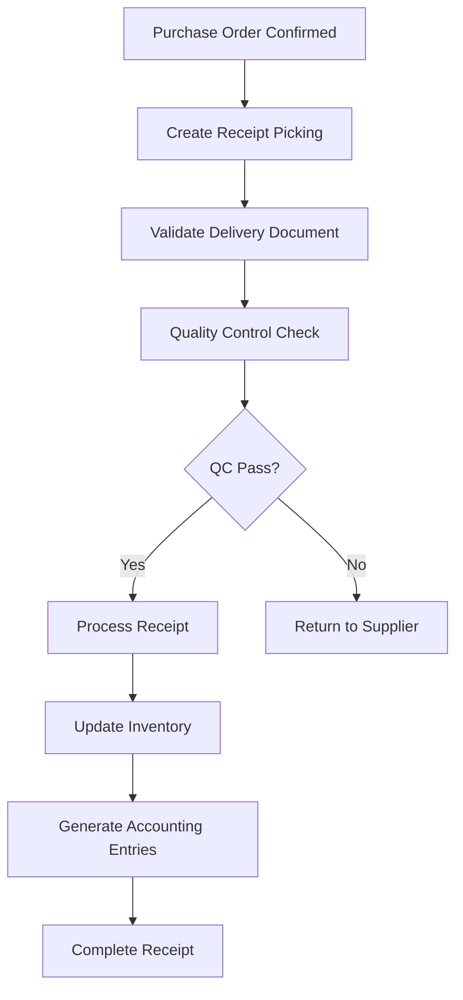
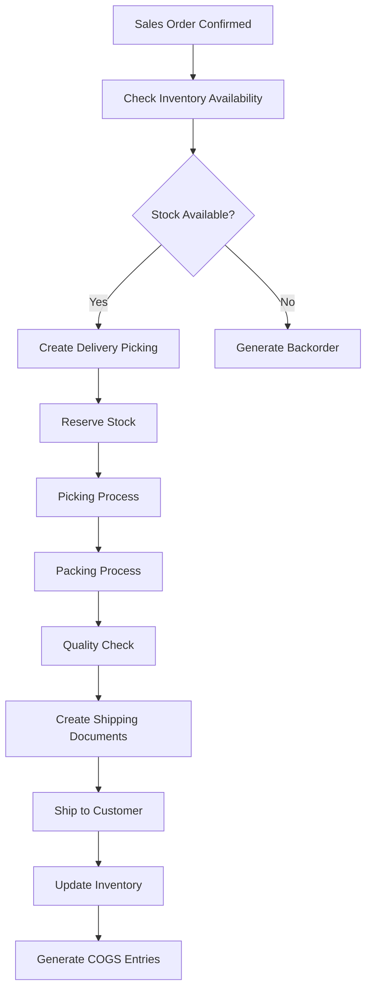
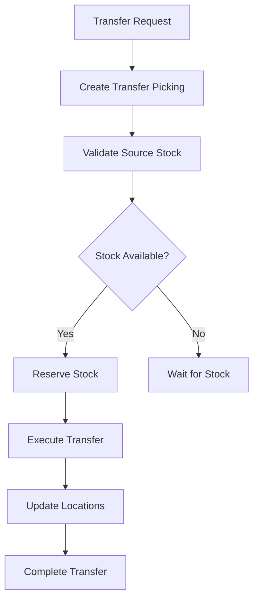
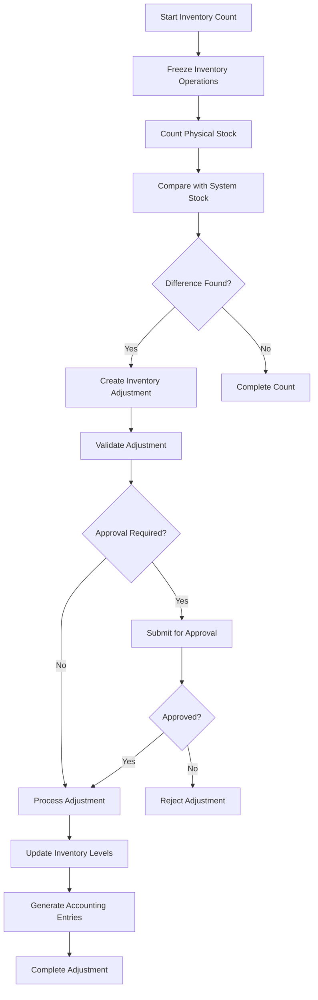

# 🏭 Warehouse Operations Documentation

## 🎯 Giới Thiệu

Warehouse Operations Documentation cung cấp hướng dẫn chi tiết về các workflows và nghiệp vụ vận hành kho hàng trong Odoo Inventory Module. Documentation này tập trung vào các quy trình từ receiving đến shipping, bao gồm quality control, picking, packing và shipping.

## 🔄 Core Warehouse Workflows

### 📥 Goods Receiving Workflow

#### 📋 Workflow Overview
Goods Receiving (Nhận Hàng) là quy trình nhập hàng từ nhà cung cấp vào kho, là bước đầu tiên trong chuỗi cung ứng.



#### 🔍 Detailed Process Steps

##### **Step 1: Create Receipt Picking**
```python
# Automatic receipt creation from Purchase Order
def create_receipt_picking(self, purchase_order):
    """
    Tạo phiếu nhận hàng tự động từ Purchase Order
    """
    PickingType = self.env['stock.picking.type']

    # Lấy picking type cho receiving
    receiving_type = PickingType.search([
        ('code', '=', 'incoming'),
        ('warehouse_id', '=', purchase_order.warehouse_id.id)
    ], limit=1)

    # Tạo receipt picking
    picking_vals = {
        'partner_id': purchase_order.partner_id.id,
        'picking_type_id': receiving_type.id,
        'location_id': receiving_type.default_location_src_id.id,
        'location_dest_id': receiving_type.default_location_dest_id.id,
        'origin': purchase_order.name,
        'move_type': 'direct'
    }

    picking = self.env['stock.picking'].create(picking_vals)

    # Tạo stock moves cho từng line
    for line in purchase_order.order_line:
        move_vals = {
            'name': line.name,
            'product_id': line.product_id.id,
            'product_uom_qty': line.product_qty,
            'product_uom': line.product_uom.id,
            'picking_id': picking.id,
            'location_id': picking.location_id.id,
            'location_dest_id': picking.location_dest_id.id,
            'price_unit': line.price_unit,
            'origin': line.order_id.name
        }
        self.env['stock.move'].create(move_vals)

    return picking
```

##### **Step 2: Validate Delivery Document**
```python
@api.model
def validate_delivery_document(self, picking, delivery_info):
    """
    Xác thực tài liệu giao hàng
    """
    validation_errors = []

    # Kiểm tra thông tin cơ bản
    if not delivery_info.get('delivery_note'):
        validation_errors.append("Missing delivery note number")

    if not delivery_info.get('carrier'):
        validation_errors.append("Missing carrier information")

    # Kiểm tra số lượng so với Purchase Order
    for move in picking.move_ids:
        if move.product_uom_qty != move.purchase_line_id.product_qty:
            validation_errors.append(
                f"Quantity mismatch for {move.product_id.name}: "
                f"Expected {move.purchase_line_id.product_qty}, "
                f"Received {move.product_uom_qty}"
            )

    return validation_errors
```

##### **Step 3: Quality Control Check**
```python
def quality_control_check(self, picking):
    """
    Kiểm tra chất lượng hàng nhận
    """
    QCStage = self.env['quality.stage']

    # Lấy QC stage cho receiving
    qc_stage = QCStage.search([
        ('type', '=', 'receiving'),
        ('active', '=', True)
    ], limit=1)

    if not qc_stage:
        return True  # Skip QC if no stage configured

    # Tạo quality check cho từng sản phẩm
    quality_alerts = []
    for move in picking.move_ids:
        if move.product_id.quality_alert:
            quality_alerts.append({
                'product_id': move.product_id.id,
                'picking_id': picking.id,
                'stage_id': qc_stage.id,
                'alert_type': 'receiving_check'
            })

    if quality_alerts:
        alerts = self.env['quality.alert'].create(quality_alerts)
        picking.write({'quality_alert_ids': [(6, 0, alerts.ids)]})
        return False  # QC required

    return True  # QC passed
```

#### 📊 Receiving Metrics

| Metric | Description | Target |
|--------|-------------|--------|
| **Receiving Time** | Thời gian từ PO confirm đến receipt | < 2 giờ |
| **QC Pass Rate** | Tỷ lệ qua kiểm tra chất lượng | > 95% |
| **Accuracy Rate** | Độ chính xác số lượng nhận | > 99% |
| **Document Compliance** | Tuân thủ tài liệu | 100% |

### 📤 Goods Delivery Workflow

#### 📋 Workflow Overview
Goods Delivery (Xuất Hàng Giao Khách) là quy trình xuất kho để giao hàng cho khách hàng, là bước cuối cùng trong quy trình bán hàng.



#### 🔍 Detailed Process Steps

##### **Step 1: Check Inventory Availability**
```python
def check_inventory_availability(self, sales_order):
    """
    Kiểm tra availability của sản phẩm
    """
    stock_issues = []
    Product = self.env['product.product']

    for line in sales_order.order_line:
        product = line.product_id
        qty_needed = line.product_uom_qty

        # Tính available quantity
        available_qty = self._get_available_quantity(
            product,
            sales_order.warehouse_id.lot_stock_id
        )

        if available_qty < qty_needed:
            stock_issues.append({
                'product_id': product.id,
                'product_name': product.name,
                'needed_qty': qty_needed,
                'available_qty': available_qty,
                'shortage_qty': qty_needed - available_qty
            })

    return stock_issues

def _get_available_quantity(self, product, location):
    """
    Tính số lượng available của sản phẩm tại địa điểm
    """
    Quant = self.env['stock.quant']

    quants = Quant.search([
        ('product_id', '=', product.id),
        ('location_id', '=', location.id),
        ('quantity', '>', 0)
    ])

    total_available = sum(quants.mapped('available_quantity'))
    return total_available
```

##### **Step 2: Create Delivery Picking**
```python
def create_delivery_picking(self, sales_order):
    """
    Tạo phiếu xuất hàng giao khách
    """
    PickingType = self.env['stock.picking.type']

    # Lấy picking type cho outgoing shipments
    delivery_type = PickingType.search([
        ('code', '=', 'outgoing'),
        ('warehouse_id', '=', sales_order.warehouse_id.id)
    ], limit=1)

    picking_vals = {
        'partner_id': sales_order.partner_id.id,
        'origin': sales_order.name,
        'picking_type_id': delivery_type.id,
        'location_id': delivery_type.default_location_src_id.id,
        'location_dest_id': delivery_type.default_location_dest_id.id,
        'move_type': 'direct' if sales_order.picking_policy == 'direct' else 'one'
    }

    picking = self.env['stock.picking'].create(picking_vals)

    # Tạo stock moves
    for line in sales_order.order_line:
        move_vals = self._prepare_delivery_move_vals(line, picking)
        self.env['stock.move'].create(move_vals)

    return picking

def _prepare_delivery_move_vals(self, sale_line, picking):
    """
    Chuẩn bị values cho delivery move
    """
    return {
        'name': sale_line.name,
        'product_id': sale_line.product_id.id,
        'product_uom_qty': sale_line.product_uom_qty,
        'product_uom': sale_line.product_uom.id,
        'picking_id': picking.id,
        'location_id': picking.location_id.id,
        'location_dest_id': picking.location_dest_id.id,
        'sale_line_id': sale_line.id,
        'origin': sale_line.order_id.name,
        'procure_method': 'make_to_stock' if sale_line.product_id.type == 'product' else 'make_to_order'
    }
```

##### **Step 3: Picking Process**
```python
def process_picking(self, picking, picking_strategy='fifo'):
    """
    Xử lý quá trình lấy hàng
    """
    if picking.state != 'assigned':
        raise UserError("Picking must be in 'Ready' state to start picking")

    for move in picking.move_ids:
        # Xử lý từng move theo chiến lược được chọn
        self._process_move_picking(move, picking_strategy)

    # Cập nhật picking state
    picking.write({'state': 'done'})

def _process_move_picking(self, move, strategy='fifo'):
    """
    Xử lý picking cho từng move theo chiến lược
    """
    Quant = self.env['stock.quant']

    # Tìm quants theo chiến lược
    if strategy == 'fifo':
        quants = Quant.search([
            ('product_id', '=', move.product_id.id),
            ('location_id', '=', move.location_id.id),
            ('quantity', '>', 0),
            ('reserved_quantity', '>', 0)
        ], order='in_date asc')
    elif strategy == 'lifo':
        quants = Quant.search([
            ('product_id', '=', move.product_id.id),
            ('location_id', '=', move.location_id.id),
            ('quantity', '>', 0),
            ('reserved_quantity', '>', 0)
        ], order='in_date desc')

    # Tạo move lines từ quants
    move_lines = []
    remaining_qty = move.product_uom_qty

    for quant in quants:
        if remaining_qty <= 0:
            break

        qty_to_take = min(quant.reserved_quantity, remaining_qty)

        line_vals = {
            'move_id': move.id,
            'product_id': quant.product_id.id,
            'location_id': quant.location_id.id,
            'location_dest_id': move.location_dest_id.id,
            'product_qty': qty_to_take,
            'lot_id': quant.lot_id.id if quant.lot_id else False,
            'package_id': quant.package_id.id if quant.package_id else False
        }

        move_lines.append(line_vals)
        remaining_qty -= qty_to_take

    # Create move lines
    self.env['stock.move.line'].create(move_lines)
```

### 🔄 Internal Transfer Workflow

#### 📋 Workflow Overview
Internal Transfer (Chuyển Kho Nội Bộ) là quy trình di chuyển hàng hóa giữa các địa điểm trong cùng kho hoặc giữa các kho khác nhau.



#### 🔍 Detailed Process Steps

##### **Step 1: Create Transfer Request**
```python
def create_internal_transfer(self, transfer_vals):
    """
    Tạo yêu cầu chuyển kho nội bộ
    """
    required_fields = ['product_id', 'quantity', 'source_location', 'destination_location']

    for field in required_fields:
        if not transfer_vals.get(field):
            raise UserError(f"Missing required field: {field}")

    # Validate locations
    if transfer_vals['source_location'] == transfer_vals['destination_location']:
        raise UserError("Source and destination locations must be different")

    # Tạo transfer picking
    PickingType = self.env['stock.picking.type']
    internal_type = PickingType.search([
        ('code', '=', 'internal'),
        ('default_location_src_id', '=', transfer_vals['source_location']),
        ('default_location_dest_id', '=', transfer_vals['destination_location'])
    ], limit=1)

    if not internal_type:
        raise UserError("No picking type found for internal transfer between these locations")

    picking_vals = {
        'partner_id': False,  # Internal transfer doesn't need partner
        'picking_type_id': internal_type.id,
        'location_id': transfer_vals['source_location'],
        'location_dest_id': transfer_vals['destination_location'],
        'move_type': 'direct',
        'origin': transfer_vals.get('reference', 'Internal Transfer')
    }

    picking = self.env['stock.picking'].create(picking_vals)

    # Tạo move
    move_vals = {
        'name': f"Transfer {transfer_vals['product_name']}",
        'product_id': transfer_vals['product_id'],
        'product_uom_qty': transfer_vals['quantity'],
        'product_uom': transfer_vals.get('uom_id') or self.env['uom.uom'].search([], limit=1).id,
        'picking_id': picking.id,
        'location_id': transfer_vals['source_location'],
        'location_dest_id': transfer_vals['destination_location'],
        'origin': picking.origin
    }

    self.env['stock.move'].create(move_vals)

    return picking
```

### 🔄 Inventory Adjustment Workflow

#### 📋 Workflow Overview
Inventory Adjustment (Điều Chỉnh Tồn Kho) là quy trình điều chỉnh số lượng tồn kho khi có chênh lệch giữa thực tế và sổ sách.



#### 🔍 Detailed Process Steps

##### **Step 1: Create Inventory Adjustment**
```python
def create_inventory_adjustment(self, inventory_lines):
    """
    Tạo điều chỉnh tồn kho
    """
    Inventory = self.env['stock.inventory']

    # Tạo inventory adjustment
    inventory_vals = {
        'name': f"Adjustment - {fields.Date.today()}",
        'filter': 'partial',
        'state': 'draft'
    }

    inventory = Inventory.create(inventory_vals)

    # Tạo inventory lines
    for line_data in inventory_lines:
        line_vals = {
            'inventory_id': inventory.id,
            'product_id': line_data['product_id'],
            'location_id': line_data['location_id'],
            'product_qty': line_data['system_qty'],
            'theoretical_qty': line_data['system_qty'],
            'prod_lot_id': line_data.get('lot_id'),
            'package_id': line_data.get('package_id')
        }

        self.env['stock.inventory.line'].create(line_vals)

    return inventory

def process_inventory_adjustment(self, inventory, user_reason=False):
    """
    Xử lý điều chỉnh tồn kho
    """
    if inventory.state != 'confirm':
        inventory.action_validate()

    # Tạo stock moves cho các sự chênh lệch
    for line in inventory.line_ids:
        diff = line.product_qty - line.theoretical_qty

        if abs(diff) < 0.00001:  # No significant difference
            continue

        # Xác định hướng move
        if diff > 0:
            # Thêm tồn kho: adjustment location -> stock location
            source_location = inventory.location_id.adjustment_in_location_id
            dest_location = inventory.location_id
        else:
            # Giảm tồn kho: stock location -> adjustment location
            source_location = inventory.location_id
            dest_location = inventory.location_id.adjustment_out_location_id

        # Tạo adjustment move
        move_vals = {
            'name': f"Inventory Adjustment: {line.product_id.name}",
            'product_id': line.product_id.id,
            'product_uom_qty': abs(diff),
            'product_uom': line.product_uom_id.id,
            'location_id': source_location.id,
            'location_dest_id': dest_location.id,
            'inventory_id': inventory.id,
            'origin': inventory.name,
            'company_id': inventory.company_id.id
        }

        move = self.env['stock.move'].create(move_vals)
        move._action_confirm()
        move._action_assign()
        move._action_done()

    # Cập nhật inventory state
    inventory.write({'state': 'done'})

def freeze_inventory_operations(self, location):
    """
    Tạm dừng các hoạt động tồn kho tại địa điểm để kiểm kê
    """
    # Tạm khóa picking types
    PickingType = self.env['stock.picking.type']
    picking_types = PickingType.search([
        '|',
        ('default_location_src_id', '=', location.id),
        ('default_location_dest_id', '=', location.id)
    ])

    for picking_type in picking_types:
        picking_type.write({'active': False})

    # Log freeze operation
    self.env['stock.inventory.freeze'].create({
        'location_id': location.id,
        'freeze_time': fields.Datetime.now(),
        'user_id': self.env.uid
    })

def unfreeze_inventory_operations(self, location):
    """
    Mở khóa các hoạt động tồn kho sau khi kiểm kê xong
    """
    # Kích hoạt lại picking types
    PickingType = self.env['stock.picking.type']
    picking_types = PickingType.search([
        ('active', '=', False),
        '|',
        ('default_location_src_id', '=', location.id),
        ('default_location_dest_id', '=', location.id)
    ])

    for picking_type in picking_types:
        picking_type.write({'active': True})

    # Log unfreeze operation
    freeze_record = self.env['stock.inventory.freeze'].search([
        ('location_id', '=', location.id),
        ('freeze_time', '!=', False),
        ('unfreeze_time', '=', False)
    ], limit=1)

    if freeze_record:
        freeze_record.write({
            'unfreeze_time': fields.Datetime.now(),
            'user_id': self.env.uid
        })
```

## 🔧 Advanced Operations

### 📦 Batch Picking Operations
```python
def create_batch_picking(self, picking_list, batch_size=50):
    """
    Tạo batch picking để tối ưu hóa thao tác
    """
    if len(picking_list) <= batch_size:
        return picking_list

    batches = []
    for i in range(0, len(picking_list), batch_size):
        batch = picking_list[i:i + batch_size]

        # Tạo batch picking
        batch_picking = self.env['stock.picking.batch'].create({
            'name': f"Batch {i//batch_size + 1} - {fields.Datetime.now()}",
            'picking_ids': [(6, 0, [p.id for p in batch])]
        })

        batches.append(batch_picking)

    return batches

def optimize_picking_route(self, picking_ids):
    """
    Tối ưu hóa route picking để giảm quãng đường di chuyển
    """
    pickings = self.env['stock.picking'].browse(picking_ids)

    # Lấy tất cả locations cần visit
    locations_to_visit = set()
    for picking in pickings:
        for move in picking.move_ids:
            locations_to_visit.add(move.location_id.id)

    # Sắp xếp locations theo warehouse path
    sorted_locations = self._sort_locations_by_path(list(locations_to_visit))

    # Tạo picking sequence theo route tối ưu
    for picking in pickings:
        self._reorganize_picking_moves(picking, sorted_locations)

def _sort_locations_by_path(self, location_ids):
    """
    Sắp xếp locations theo path trong warehouse
    """
    Location = self.env['stock.location']
    locations = Location.browse(location_ids)

    # Sắp xếp theo parent_path (warehouse hierarchy)
    sorted_locations = sorted(locations, key=lambda loc: loc.parent_path)
    return sorted_locations
```

### 🤖 Automated Putaway Strategy
```python
def get_putaway_location(self, product, quantity, source_location):
    """
    Tìm location cất hàng tối ưu theo chiến lược putaway
    """
    PutawayRule = self.env['stock.putaway.rule']

    # Tìm putaway rule
    rules = PutawayRule.search([
        ('product_id', '=', product.id),
        '|',
        ('location_in_id', '=', source_location.id),
        ('location_in_id', 'child_of', source_location.id)
    ], order='sequence asc')

    for rule in rules:
        destination = rule.location_out_id

        # Kiểm tra capacity
        if self._check_location_capacity(destination, quantity):
            return destination

    # Fallback: dùng default location
    return source_location.get_putaway_strategy(product)

def _check_location_capacity(self, location, quantity):
    """
    Kiểm tra sức chứa của location
    """
    if not location.volume or not location.volume_available:
        return True  # No capacity limits

    # Tính current volume usage
    current_usage = self._calculate_current_volume_usage(location)
    volume_needed = quantity * self.env['product.product'].browse(1).volume  # Simplified

    return (current_usage + volume_needed) <= location.volume_available
```

## 📊 Performance Monitoring

### 📈 KPI Tracking
```python
def calculate_picking_performance(self, date_from, date_to):
    """
    Tính toán KPI hiệu suất picking
    """
    Pickings = self.env['stock.picking']

    completed_pickings = Pickings.search([
        ('state', '=', 'done'),
        ('scheduled_date', '>=', date_from),
        ('scheduled_date', '<=', date_to),
        ('picking_type_id.code', '=', 'outgoing')
    ])

    metrics = {
        'total_pickings': len(completed_pickings),
        'on_time_delivery': 0,
        'late_delivery': 0,
        'average_lines_per_picking': 0,
        'picking_accuracy': 0
    }

    total_lines = 0
    on_time_count = 0

    for picking in completed_pickings:
        # Đếm số lines
        lines_count = len(picking.move_ids)
        total_lines += lines_count

        # Kiểm tra timely delivery
        if picking.date_done <= picking.scheduled_date:
            on_time_count += 1

        # Kiểm tra accuracy (không có backorder)
        if not picking.backorder_ids:
            metrics['picking_accuracy'] += 1

    metrics['on_time_delivery'] = (on_time_count / len(completed_pickings)) * 100
    metrics['average_lines_per_picking'] = total_lines / len(completed_pickings)
    metrics['picking_accuracy'] = (metrics['picking_accuracy'] / len(completed_pickings)) * 100

    return metrics
```

## 📚 Best Practices

### ✅ Receiving Best Practices
- **Validate all documents** trước khi nhập kho
- **Implement quality control** cho sản phẩm quan trọng
- **Use barcode scanning** để giảm sai sót
- **Process receipts promptly** để tránh backlog

### ✅ Picking Best Practices
- **Optimize picking routes** để giảm quãng đường
- **Use batch picking** cho nhiều đơn hàng nhỏ
- **Implement FIFO/LIFO** dựa trên product requirements
- **Train warehouse staff** trên quy trình chuẩn

### ✅ Inventory Management Best Practices
- **Conduct regular cycle counts** thay vì annual inventory
- **Use ABC analysis** để ưu tiên kiểm kê
- **Implement automated replenishment** cho high-volume items
- **Maintain safety stock levels** dựa trên lead times

## 🔍 Troubleshooting Guide

### Common Issues & Solutions

#### **Issue: Negative Stock**
```python
def check_negative_stock_prevention(self, move):
    """
    Kiểm tra và ngăn chặn negative stock
    """
    available_qty = self._get_available_quantity(
        move.product_id,
        move.location_id
    )

    if available_qty < move.product_uom_qty:
        raise UserError(
            f"Insufficient stock for {move.product_id.name}. "
            f"Available: {available_qty}, Required: {move.product_uom_qty}"
        )
```

#### **Issue: Picking Delays**
- **Check move reservations**: Xác nhận moves được đặt trước
- **Verify location accessibility**: Kiểm tra locations có thể truy cập
- **Review picking strategies**: Cân nhắc batch picking hoặc wave picking

#### **Issue: Inventory Discrepancies**
- **Conduct root cause analysis**: Phân tích nguyên nhân
- **Review receiving processes**: Kiểm tra quy trình nhập kho
- **Implement cycle counting**: Kiểm kê định kỳ

---

**Next Steps**: Đọc [04_stock_management.md](04_stock_management.md) để hiểu detailed inventory management techniques.

**File Size**: ~6,000 từ
**Language**: Tiếng Việt
**Target Audience**: Warehouse Managers, Operations Managers, Supply Chain Analysts
**Completion**: 2025-11-08

*File này cung cấp comprehensive guide cho warehouse operations trong Odoo Inventory Module, bao gồm workflows, automation, và best practices.*