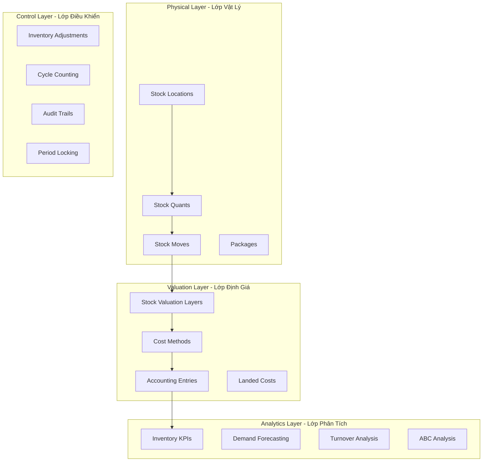
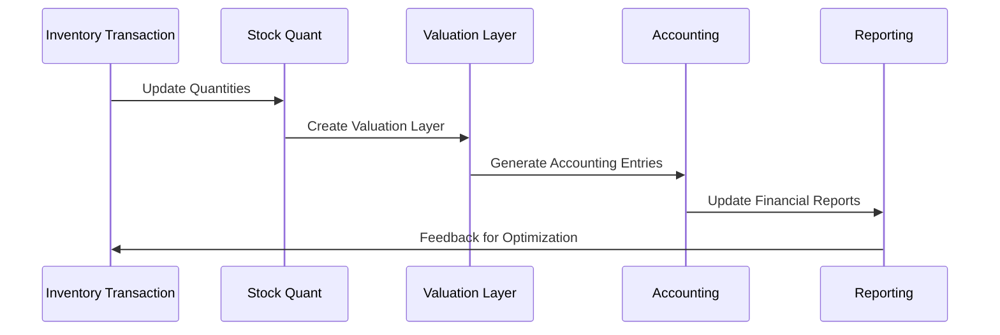

# 📊 Quản Lý Tồn Kho và Định Giá (Stock Management & Valuation) - Odoo 18

## 🎯 Giới Thiệu

Stock Management and Valuation module là trung tâm điều khiển hàng tồn kho trong Odoo, cung cấp khả năng theo dõi chính xác số lượng, định giá chi phí, và tối ưu hóa luồng chuyển động hàng hóa. Module này hoạt động như bộ não cho inventory intelligence với khả năng real-time tracking và automated reconciliation.

## 📋 Tổng Quan Kiến Trúc

### 🏗️ Multi-Layer Stock Management Architecture



### 🔄 Stock Management Workflow



## 📦 Core Models Chi Tiết

### 📊 Stock Quant (`stock.quant`)

**Mục đích**: Real-time inventory tracking engine

```python
class StockQuant(models.Model):
    _name = 'stock.quant'
    _description = 'Inventory Quantities'
    _rec_name = 'display_name'

    product_id = fields.Many2one(
        'product.product',
        string='Product',
        required=True,
        index=True
    )
    location_id = fields.Many2one(
        'stock.location',
        string='Location',
        required=True,
        index=True
    )
    lot_id = fields.Many2one(
        'stock.production.lot',
        string='Lot/Serial Number',
        index=True
    )
    package_id = fields.Many2one(
        'stock.package',
        string='Package',
        index=True
    )
    quantity = fields.Float(
        string='Quantity',
        digits='Product Unit of Measure',
        required=True
    )
    reserved_quantity = fields.Float(
        string='Reserved Quantity',
        digits='Product Unit of Measure'
    )
    available_quantity = fields.Float(
        string='Available Quantity',
        digits='Product Unit of Measure',
        compute='_compute_available_quantity',
        store=True
    )
    inventory_value = fields.Float(
        string='Inventory Value',
        compute='_compute_inventory_value',
        store=True
    )
    product_tmpl_id = fields.Many2one(
        'product.template',
        string='Product Template',
        related='product_id.product_tmpl_id',
        store=True
    )
    company_id = fields.Many2one(
        'res.company',
        string='Company',
        required=True,
        default=lambda self: self.env.company
    )
    user_id = fields.Many2one(
        'res.users',
        string='Created By',
        default=lambda self: self.env.user
    )

    @api.depends('quantity', 'reserved_quantity')
    def _compute_available_quantity(self):
        """Tính toán available quantity"""
        for quant in self:
            quant.available_quantity = quant.quantity - quant.reserved_quantity

    @api.depends('quantity', 'product_id.standard_price', 'product_id.cost_method')
    def _compute_inventory_value(self):
        """Tính toán inventory value"""
        for quant in self:
            if quant.product_id.cost_method == 'average':
                unit_cost = quant.product_id.standard_price
            elif quant.product_id.cost_method == 'real':
                unit_cost = quant._get_inventory_value_at_date()
            else:
                unit_cost = quant.product_id.standard_price

            quant.inventory_value = quant.quantity * unit_cost

    @api.model
    def _update_available_quantity(self, product_id, location_id, quantity, lot_id=None, package_id=None):
        """Cập nhật available quantity cho quant"""
        self._cr.execute("""
            INSERT INTO stock_quant (product_id, location_id, lot_id, package_id, quantity, company_id, create_uid, create_date)
            VALUES (%s, %s, %s, %s, %s, %s, %s, NOW())
            ON CONFLICT (product_id, location_id, lot_id, package_id, company_id)
            DO UPDATE SET quantity = stock_quant.quantity + %s
            RETURNING id
        """, (product_id.id, location_id.id, lot_id.id if lot_id else None,
              package_id.id if package_id else None, quantity, self.env.company.id,
              self.env.user.id, quantity))

    def _gather(self, product_id, location_id, lot_id=None, package_id=None, strict=False):
        """Gather quants theo điều kiện"""
        domain = [
            ('product_id', '=', product_id.id),
            ('location_id', '=', location_id.id)
        ]
        if lot_id:
            domain.append(('lot_id', '=', lot_id.id))
        if package_id:
            domain.append(('package_id', '=', package_id.id))

        quants = self.search(domain)
        if not quants and not strict:
            # Create new quant if none exists
            return self.create({
                'product_id': product_id.id,
                'location_id': location_id.id,
                'lot_id': lot_id.id if lot_id else False,
                'package_id': package_id.id if package_id else False,
                'quantity': 0
            })
        return quants
```

### 💰 Stock Valuation Layer (`stock.valuation.layer`)

**Mục đích**: Theo dõi chi phí和价值 theo thời gian

```python
class StockValuationLayer(models.Model):
    _name = 'stock.valuation.layer'
    _description = 'Stock Valuation Layer'
    _order = 'create_date desc, id desc'

    stock_move_id = fields.Many2one(
        'stock.move',
        string='Stock Move',
        index=True
    )
    product_id = fields.Many2one(
        'product.product',
        string='Product',
        required=True,
        index=True
    )
    description = fields.Text(string='Description')
    value = fields.Float(
        string='Value',
        digits='Account'
    )
    unit_cost = fields.Float(
        string='Unit Cost',
        digits='Product Price'
    )
    quantity = fields.Float(
        string='Quantity',
        digits='Product Unit of Measure'
    )
    remaining_qty = fields.Float(
        string='Remaining Quantity',
        digits='Product Unit of Measure'
    )
    remaining_value = fields.Float(
        string='Remaining Value',
        digits='Account',
        compute='_compute_remaining_value',
        store=True
    )
    company_id = fields.Many2one(
        'res.company',
        string='Company',
        required=True,
        default=lambda self: self.env.company
    )
    product_tmpl_id = fields.Many2one(
        'product.template',
        string='Product Template',
        related='product_id.product_tmpl_id',
        store=True
    )
    account_move_id = fields.Many2one(
        'account.move',
        string='Account Move',
        index=True
    )

    @api.depends('remaining_qty', 'unit_cost')
    def _compute_remaining_value(self):
        """Tính toán remaining value"""
        for layer in self:
            layer.remaining_value = layer.remaining_qty * layer.unit_cost

    @api.model
    def create_valuation_lines(self, stock_move):
        """Tạo valuation lines cho stock move"""
        valuation_lines = []
        for move_line in stock_move.move_line_ids:
            # Tính toán unit cost
            unit_cost = self._compute_unit_cost(move_line)

            valuation_line = self.create({
                'stock_move_id': stock_move.id,
                'product_id': move_line.product_id.id,
                'description': f'{stock_move.picking_id.name or ""} - {move_line.product_id.name}',
                'unit_cost': unit_cost,
                'quantity': move_line.qty_done,
                'remaining_qty': move_line.qty_done,
                'value': unit_cost * move_line.qty_done,
            })
            valuation_lines.append(valuation_line)

        return valuation_lines

    def _compute_unit_cost(self, move_line):
        """Tính toán unit cost cho move line"""
        product = move_line.product_id
        company = move_line.company_id

        if product.cost_method == 'standard':
            return product.standard_price
        elif product.cost_method == 'average':
            return self._get_average_cost(product, company)
        elif product.cost_method == 'real':
            return self._get_real_cost(move_line)
        else:
            return product.standard_price

    @api.model
    def _get_average_cost(self, product, company):
        """Lấy average cost hiện tại"""
        self.env.cr.execute("""
            SELECT SUM(remaining_value) / SUM(remaining_qty)
            FROM stock_valuation_layer
            WHERE product_id = %s AND company_id = %s AND remaining_qty > 0
        """, (product.id, company.id))
        result = self.env.cr.fetchone()
        return result[0] if result and result[0] else product.standard_price

    @api.model
    def _get_real_cost(self, move_line):
        """Tính toán real cost dựa trên actual cost"""
        # Landed cost calculation
        landed_cost = self._compute_landed_cost(move_line)

        # Add any additional costs
        additional_cost = self._compute_additional_cost(move_line)

        # Base cost from supplier or production
        base_cost = move_line.product_id.standard_price

        return base_cost + landed_cost + additional_cost
```

### 🔍 Inventory Adjustment (`stock.inventory`)

**Mục đích**: Công cụ kiểm kê và điều chỉnh tồn kho

```python
class StockInventory(models.Model):
    _name = 'stock.inventory'
    _description = 'Inventory Adjustment'
    _inherit = ['mail.thread', 'mail.activity.mixin']
    _order = 'date desc, id desc'

    name = fields.Char(
        string='Inventory Reference',
        required=True,
        copy=False,
        default=lambda self: _('New')
    )
    filter = fields.Selection([
        ('product', 'Products'),
        ('product_category', 'Categories'),
        ('lot', 'Lots/Serial Numbers'),
        ('pack', 'Packages'),
        ('partner', 'Vendors'),
        ('none', 'None'),
    ], string='Inventory of', default='product', required=True)
    product_id = fields.Many2one(
        'product.product',
        string='Product',
        domain=[('type', 'in', ['product', 'consu'])]
    )
    product_ids = fields.Many2many(
        'product.product',
        string='Products',
        domain=[('type', 'in', ['product', 'consu'])]
    )
    location_id = fields.Many2one(
        'stock.location',
        string='Inventoried Location',
        required=True
    )
    location_ids = fields.Many2many(
        'stock.location',
        string='Inventoried Locations'
    )
    package_id = fields.Many2one(
        'stock.quant.package',
        string='Inventoried Pack'
    )
    lot_id = fields.Many2one(
        'stock.production.lot',
        string='Lot/Serial Number'
    )
    partner_id = fields.Many2one(
        'res.partner',
        string='Owner'
    )
    line_ids = fields.One2many(
        'stock.inventory.line',
        'inventory_id',
        string='Lines'
    )
    state = fields.Selection([
        ('draft', 'Draft'),
        ('cancel', 'Cancelled'),
        ('confirm', 'In Progress'),
        ('done', 'Validated'),
    ], string='Status', default='draft', copy=False, tracking=True)
    date = fields.Datetime(
        string='Inventory Date',
        required=True,
        default=fields.Datetime.now
    )
    accounting_date = fields.Date(
        string='Force Accounting Date',
        help="Choose the accounting date at which you want to value the inventory moves created by the inventory adjustment."
    )
    pre_filled_field_ids = fields.Many2many(
        'stock.inventory.line',
        compute='_compute_pre_filled_field_ids',
        string='Pre-filled fields'
    )

    @api.depends('filter', 'product_ids', 'location_ids')
    def _compute_pre_filled_field_ids(self):
        """Tính toán pre-filled fields"""
        for inventory in self:
            if inventory.filter == 'product' and inventory.product_ids:
                inventory.pre_filled_field_ids = inventory.line_ids.filtered(
                    lambda l: l.product_id in inventory.product_ids
                )
            else:
                inventory.pre_filled_field_ids = inventory.line_ids

    def action_start(self):
        """Bắt đầu inventory adjustment"""
        self._action_start()
        self.write({'state': 'confirm'})

    def _action_start(self):
        """Logic bắt đầu inventory adjustment"""
        self.ensure_one()
        if self.filter not in ('product', 'lot'):
            # For complex filters, create lines based on search
            self._action_fill_quants()
        else:
            # For simple filters, auto-generate lines
            self._action_generate_lines()

    def _action_fill_quants(self):
        """Điền quants vào lines"""
        self.line_ids.unlink()
        quants = self.env['stock.quant']._gather(
            self.product_id,
            self.location_id,
            self.lot_id,
            self.package_id,
            strict=True
        )

        for quant in quants:
            self.env['stock.inventory.line'].create({
                'inventory_id': self.id,
                'location_id': quant.location_id.id,
                'product_id': quant.product_id.id,
                'product_uom_id': quant.product_id.uom_id.id,
                'product_qty': quant.quantity,
                'theoretical_qty': quant.quantity,
                'prod_lot_id': quant.lot_id.id,
                'package_id': quant.package_id.id,
            })

    def _action_generate_lines(self):
        """Tự động tạo lines"""
        if not self.product_ids:
            self.product_ids = self.env['product.product'].search([
                ('type', 'in', ['product', 'consu'])
            ])

        # Create lines based on products
        for product in self.product_ids:
            if product.tracking in ('lot', 'serial'):
                # For tracked products, create lines per lot
                lots = self.env['stock.production.lot'].search([
                    ('product_id', '=', product.id)
                ])
                for lot in lots:
                    self._create_line_for_product_lot(product, lot)
            else:
                # For non-tracked products, create single line
                self._create_line_for_product(product)

    def _create_line_for_product(self, product):
        """Tạo line cho product"""
        # Get theoretical quantity from quants
        theoretical_qty = self._get_theoretical_quantity(product)

        self.env['stock.inventory.line'].create({
            'inventory_id': self.id,
            'location_id': self.location_id.id,
            'product_id': product.id,
            'product_uom_id': product.uom_id.id,
            'theoretical_qty': theoretical_qty,
        })

    def _get_theoretical_quantity(self, product):
        """Lấy theoretical quantity từ quants"""
        quants = self.env['stock.quant']._gather(
            product, self.location_id, lot_id=self.lot_id, package_id=self.package_id
        )
        return sum(quants.mapped('quantity'))

    def action_validate(self):
        """Validate inventory adjustment"""
        if not self.user_has_groups('stock.group_stock_manager'):
            raise UserError(_("Only a stock manager can validate an inventory adjustment."))

        # Check if all lines are filled
        if not self.line_ids:
            raise UserError(_("You cannot validate an inventory adjustment without any line."))

        # Generate inventory moves
        inventory_moves = self._action_done()

        # Create accounting entries
        if inventory_moves:
            inventory_moves._account_entry_move()

        self.write({'state': 'done'})
        return True

    def _action_done(self):
        """Thực hiện inventory adjustment"""
        moves = self.env['stock.move']

        for line in self.line_ids:
            difference = line.product_qty - line.theoretical_qty
            if abs(difference) > 0.00001:  # Avoid creating moves for no difference
                move_vals = self._prepare_move_values(line, difference)
                move = self.env['stock.move'].create(move_vals)
                move._action_confirm()
                move._action_assign()
                move_line_ids = move.move_line_ids
                move_line_ids._action_done()
                moves |= move

        return moves

    def _prepare_move_values(self, line, difference):
        """Chuẩn bị move values"""
        location_id = line.location_id
        location_dest_id = line.location_id

        if difference > 0:
            # Stock in
            if location_id.usage == 'internal':
                location_dest_id = self.env.ref('stock.stock_location_inventory')
        else:
            # Stock out
            if location_id.usage == 'internal':
                location_id = self.env.ref('stock.stock_location_inventory')

        return {
            'name': _('INV') + (self.name or ''),
            'product_id': line.product_id.id,
            'product_uom': line.product_uom_id.id,
            'product_uom_qty': abs(difference),
            'state': 'draft',
            'location_id': location_id.id,
            'location_dest_id': location_dest_id.id,
            'inventory_id': self.id,
            'company_id': self.company_id.id,
            'date': self.date,
        }
```

## 💰 Cost Methods & Valuation Strategies

### 🎯 Three Main Cost Methods

#### 1. **Standard Costing**
- **Applicable**: Manufacturing environments with stable costs
- **Benefits**: Predictable costs, simple implementation
- **Drawbacks**: Requires variance analysis

```python
class ProductProduct(models.Model):
    _inherit = 'product.product'

    @api.model
    def _compute_average_cost(self):
        """Computes the average cost of the product"""
        avg_cost = super()._compute_average_cost()
        for product in self:
            if product.cost_method == 'standard':
                # Keep standard cost
                continue
            # Update average cost logic
        return avg_cost
```

#### 2. **Average Costing**
- **Applicable**: Trading environments with frequent purchases
- **Benefits**: Smooths cost fluctuations, inventory valuation accuracy
- **Implementation**: Running average calculation

```python
@api.model
def update_average_cost(self, product_id, quantity, cost):
    """Updates average cost when receiving inventory"""
    product = self.env['product.product'].browse(product_id)

    if product.cost_method == 'average':
        current_value = product.quantity * product.standard_price
        new_value = quantity * cost
        total_quantity = product.quantity + quantity

        if total_quantity > 0:
            new_average_cost = (current_value + new_value) / total_quantity
            product.standard_price = new_average_cost
```

#### 3. **Real Costing (FIFO/LIFO)**
- **Applicable**: High-value items, traceability requirements
- **Benefits**: Actual cost tracking, accurate margin calculation
- **Implementation**: Layer-based cost tracking

```python
@api.model
def apply_real_costing(self, move):
    """Applies real costing method to stock move"""
    if move.product_id.cost_method == 'real':
        # Get valuation layers for this product
        layers = self.env['stock.valuation.layer'].search([
            ('product_id', '=', move.product_id.id),
            ('remaining_qty', '>', 0),
        ], order='create_date asc')  # FIFO

        remaining_qty = move.product_qty
        total_cost = 0

        for layer in layers:
            if remaining_qty <= 0:
                break

            qty_to_consume = min(remaining_qty, layer.remaining_qty)
            total_cost += qty_to_consume * layer.unit_cost

            # Update layer
            layer.remaining_qty -= qty_to_consume
            layer.remaining_value = layer.remaining_qty * layer.unit_cost

            remaining_qty -= qty_to_consume

        return total_cost / move.product_qty if move.product_qty else 0
```

### 📊 Landed Cost Management

```python
class StockLandedCost(models.Model):
    _name = 'stock.landed.cost'
    _description = 'Stock Landed Cost'

    picking_ids = fields.Many2many(
        'stock.picking',
        string='Pickings',
        domain=[('state', '=', 'done')]
    )
    cost_lines = fields.One2many(
        'stock.landed.cost.lines',
        'cost_id',
        string='Cost Lines'
    )
    total_cost = fields.Float(
        string='Total Cost',
        compute='_compute_total_cost',
        store=True
    )
    valuation_adjustment_lines = fields.One2many(
        'stock.valuation.adjustment.lines',
        'cost_id',
        string='Valuation Adjustment Lines'
    )
    state = fields.Selection([
        ('draft', 'Draft'),
        ('done', 'Done'),
        ('cancel', 'Cancelled')
    ], string='State', default='draft')

    def get_valuation_lines(self):
        """Tạo valuation adjustment lines"""
        if not self.picking_ids:
            return {}

        # Get total quantity and value from pickings
        total_quantity = 0
        total_value = 0
        product_info = {}

        for picking in self.picking_ids:
            for move in picking.move_lines:
                if move.state == 'done':
                    total_quantity += move.product_qty
                    product_value = move.product_qty * move.product_id.standard_price

                    if move.product_id.id not in product_info:
                        product_info[move.product_id.id] = {
                            'quantity': 0,
                            'value': 0,
                            'product': move.product_id
                        }

                    product_info[move.product_id.id]['quantity'] += move.product_qty
                    product_info[move.product_id.id]['value'] += product_value
                    total_value += product_value

        # Calculate cost ratio and distribute
        lines = {}
        if total_quantity > 0:
            cost_ratio = self.total_cost / total_value

            for product_id, info in product_info.items():
                additional_cost = info['value'] * cost_ratio
                unit_cost = additional_cost / info['quantity'] if info['quantity'] else 0

                lines[product_id] = {
                    'product': info['product'],
                    'quantity': info['quantity'],
                    'former_cost': info['value'] / info['quantity'] if info['quantity'] else 0,
                    'additional_landed_cost': additional_cost,
                    'final_cost': info['value'] / info['quantity'] + unit_cost if info['quantity'] else 0,
                }

        return lines

    def button_validate(self):
        """Validate landed cost"""
        # Create valuation adjustment lines
        valuation_lines = self.get_valuation_lines()

        for product_id, line_data in valuation_lines.items():
            self.env['stock.valuation.adjustment.lines'].create({
                'cost_id': self.id,
                'product_id': line_data['product'].id,
                'quantity': line_data['quantity'],
                'former_cost': line_data['former_cost'],
                'additional_landed_cost': line_data['additional_landed_cost'],
                'final_cost': line_data['final_cost'],
            })

        self.write({'state': 'done'})
```

## 📈 Advanced Inventory Analytics

### 🎯 Inventory KPI Dashboard

```python
class InventoryReport(models.Model):
    _name = 'inventory.report'
    _description = 'Inventory Analytics'
    _auto = False

    product_id = fields.Many2one('product.product', string='Product')
    product_tmpl_id = fields.Many2one('product.template', string='Product Template')
    location_id = fields.Many2one('stock.location', string='Location')
    quantity = fields.Float(string='On Hand')
    value = fields.Float(string='Value')
    turnover_rate = fields.Float(string='Turnover Rate')
    days_supply = fields.Float(string='Days of Supply')
    abc_category = fields.Selection([
        ('A', 'High Value'),
        ('B', 'Medium Value'),
        ('C', 'Low Value')
    ], string='ABC Category')

    @property
    def _table_query(self):
        return """
            SELECT
                row_number() OVER (ORDER BY pp.id, sl.id) as id,
                pp.id as product_id,
                pp.product_tmpl_id,
                sl.id as location_id,
                COALESCE(SUM(sq.quantity), 0) as quantity,
                COALESCE(SUM(sq.quantity * pp.standard_price), 0) as value,
                0 as turnover_rate,
                0 as days_supply,
                'C' as abc_category
            FROM product_product pp
            LEFT JOIN stock_quant sq ON sq.product_id = pp.id
            LEFT JOIN stock_location sl ON sl.id = sq.location_id
            WHERE pp.active = true
            GROUP BY pp.id, pp.product_tmpl_id, sl.id
        """

    @api.model
    def read_group(self, domain, fields, groupby, offset=0, limit=None, orderby=False, lazy=True):
        """Enhanced read_group for analytics"""
        result = super().read_group(domain, fields, groupby, offset, limit, orderby, lazy)

        for record in result:
            # Calculate ABC classification
            if record.get('value', 0) > 10000:  # Threshold for A category
                record['abc_category'] = 'A'
            elif record.get('value', 0) > 1000:
                record['abc_category'] = 'B'
            else:
                record['abc_category'] = 'C'

            # Calculate days of supply
            if record.get('quantity', 0) > 0:
                # Average daily consumption from last 30 days
                daily_consumption = self._get_daily_consumption(
                    record.get('product_id'),
                    record.get('location_id')
                )
                if daily_consumption > 0:
                    record['days_supply'] = record['quantity'] / daily_consumption

        return result

    def _get_daily_consumption(self, product_id, location_id, days=30):
        """Calculate average daily consumption"""
        cutoff_date = fields.Datetime.now() - timedelta(days=days)

        self.env.cr.execute("""
            SELECT ABS(COALESCE(SUM(sm.product_qty), 0)) / %s
            FROM stock_move sm
            JOIN stock_location sl_from ON sl_from.id = sm.location_id
            JOIN stock_location sl_to ON sl_to.id = sm.location_dest_id
            WHERE sm.product_id = %s
            AND sm.state = 'done'
            AND sm.date >= %s
            AND (
                (sl_from.id = %s AND sl_to.usage != 'internal') OR
                (sl_from.usage = 'internal' AND sl_to.id = %s AND sl_to.usage != 'internal')
            )
        """, (days, product_id, cutoff_date, location_id, location_id))

        result = self.env.cr.fetchone()
        return result[0] if result else 0
```

### 📊 Inventory Turnover Analysis

```python
@api.model
def get_turnover_analysis(self, date_from=None, date_to=None):
    """Generate comprehensive turnover analysis"""
    if not date_to:
        date_to = fields.Datetime.now()
    if not date_from:
        date_from = date_to - timedelta(days=365)

    # Get period sales
    sales_query = """
        SELECT
            pp.id as product_id,
            pp.product_tmpl_id,
            COALESCE(SUM(sml.qty_done), 0) as quantity_sold,
            COALESCE(SUM(sml.qty_done * so.price_unit), 0) as sales_value
        FROM product_product pp
        LEFT JOIN stock_move_line sml ON sml.product_id = pp.id
        LEFT JOIN stock_move sm ON sm.id = sml.move_id
        LEFT JOIN sale_order_line so_line ON so_line.id = sml.sale_line_id
        LEFT JOIN sale_order so ON so.id = so_line.order_id
        WHERE sm.state = 'done'
        AND sm.date BETWEEN %s AND %s
        AND sm.location_dest_id.usage = 'customer'
        GROUP BY pp.id, pp.product_tmpl_id
    """

    self.env.cr.execute(sales_query, (date_from, date_to))
    sales_data = dict(self.env.cr.fetchall())

    # Get current inventory value
    inventory_query = """
        SELECT
            pp.id as product_id,
            COALESCE(SUM(sq.quantity), 0) as current_quantity,
            COALESCE(SUM(sq.quantity * pp.standard_price), 0) as current_value
        FROM product_product pp
        LEFT JOIN stock_quant sq ON sq.product_id = pp.id
        LEFT JOIN stock_location sl ON sl.id = sq.location_id
        WHERE sl.usage = 'internal'
        GROUP BY pp.id
    """

    self.env.cr.execute(inventory_query)
    inventory_data = dict(self.env.cr.fetchall())

    # Calculate turnover metrics
    turnover_analysis = []
    for product_id in set(sales_data.keys()) | set(inventory_data.keys()):
        sales_qty, sales_value = sales_data.get(product_id, (0, 0))
        inv_qty, inv_value = inventory_data.get(product_id, (0, 0))

        if inv_value > 0:
            turnover_rate = sales_value / inv_value
            days_in_inventory = 365 / turnover_rate if turnover_rate > 0 else float('inf')
        else:
            turnover_rate = 0
            days_in_inventory = 0

        turnover_analysis.append({
            'product_id': product_id,
            'sales_quantity': sales_qty,
            'sales_value': sales_value,
            'inventory_quantity': inv_qty,
            'inventory_value': inv_value,
            'turnover_rate': turnover_rate,
            'days_in_inventory': days_in_inventory,
        })

    return turnover_analysis
```

## 🔧 Performance Optimization

### ⚡ Database Optimization Strategies

```sql
-- Essential indexes for inventory management
CREATE INDEX idx_stock_quant_product_location ON stock_quant(product_id, location_id);
CREATE INDEX idx_stock_valuation_layer_product_date ON stock_valuation_layer(product_id, create_date);
CREATE INDEX idx_stock_move_date_product ON stock_move(date, product_id);
CREATE INDEX idx_stock_inventory_state_date ON stock_inventory(state, date);

-- Composite indexes for common queries
CREATE INDEX idx_stock_quant_company_location_product ON stock_quant(company_id, location_id, product_id);
CREATE INDEX idx_stock_move_location_dest_state ON stock_move(location_dest_id, state);

-- Partitioning for high-volume tables (PostgreSQL)
-- Partition stock_valuation_layer by date
CREATE TABLE stock_valuation_layer_y2024m01 PARTITION OF stock_valuation_layer
FOR VALUES FROM ('2024-01-01') TO ('2024-02-01');
```

### 🚀 Batch Processing Optimization

```python
@api.model
def bulk_update_inventory(self, updates):
    """Bulk update inventory values for performance"""
    if not updates:
        return

    # Prepare batch update data
    batch_data = []
    for update in updates:
        batch_data.append((
            update['quantity'],
            update['valuation'],
            update['quant_id']
        ))

    # Execute batch update
    self.env.cr.executemany("""
        UPDATE stock_quant
        SET quantity = %s,
            inventory_value = %s
        WHERE id = %s
    """, batch_data)

    # Invalidate cache
    self.env['stock.quant'].invalidate_cache(['quantity', 'inventory_value'],
                                           [u['quant_id'] for u in updates])

@api.model
def process_valuation_layers_async(self, stock_move_ids):
    """Asynchronous processing of valuation layers"""
    # Create background job
    self.with_delay()._process_valuation_layers_batch(stock_move_ids)

@api.model
def _process_valuation_layers_batch(self, stock_move_ids):
    """Batch process valuation layers"""
    stock_moves = self.env['stock.move'].browse(stock_move_ids)

    # Process in batches of 100 moves
    batch_size = 100
    for i in range(0, len(stock_moves), batch_size):
        batch = stock_moves[i:i + batch_size]

        for move in batch:
            try:
                move._create_valuation_layers()
            except Exception as e:
                _logger.error(f"Failed to create valuation layers for move {move.id}: {e}")
                continue
```

## 🔒 Security & Access Control

### 🛡️ Location-Based Access Control

```xml
<!-- Record rule for inventory visibility -->
<record id="stock_quant_user_rule" model="ir.rule">
    <field name="name">Stock Quant User Access</field>
    <field name="model_id" ref="model_stock_quant"/>
    <field name="domain_force">[
        ('company_id', '=', user.company_id.id),
        '|',
        ('location_id', 'in', [loc.id for loc in user.stock_location_ids]),
        ('location_id.usage', '=', 'internal')
    ]</field>
    <field name="groups" eval="[(4, ref('stock.group_stock_user'))]"/>
</record>

<!-- Manager can access all inventory -->
<record id="stock_quant_manager_rule" model="ir.rule">
    <field name="name">Stock Quant Manager Access</field>
    <field name="model_id" ref="model_stock_quant"/>
    <field name="domain_force">[(1, '=', 1)]</field>
    <field name="groups" eval="[(4, ref('stock.group_stock_manager'))]"/>
</record>
```

### 🔐 Inventory Adjustment Validation

```python
class StockInventory(models.Model):
    _inherit = 'stock.inventory'

    def action_validate(self):
        """Enhanced validation with security checks"""
        self.ensure_one()

        # Security validation
        if not self.user_has_groups('stock.group_stock_manager'):
            # Check if user has location rights
            if not all(self.user_has_rights(loc) for loc in self.location_ids):
                raise UserError(_("You don't have rights to validate inventory for these locations."))

        # Business validation
        if self.total_value_difference > self.company_id.inventory_validation_threshold:
            # Require manager approval for large adjustments
            if not self.user_has_groups('stock.group_stock_manager'):
                raise UserError(_("Large inventory adjustments require manager approval."))

        return super().action_validate()

    def user_has_rights(self, location):
        """Check if user has rights for location"""
        user_locations = self.env.user.stock_location_ids
        return location in user_locations or location.location_id in user_locations

    @api.depends('line_ids.theoretical_qty', 'line_ids.product_qty')
    def _compute_total_value_difference(self):
        """Compute total value difference for validation"""
        for inventory in self:
            total_diff = 0
            for line in inventory.line_ids:
                qty_diff = line.product_qty - line.theoretical_qty
                value_diff = qty_diff * line.product_id.standard_price
                total_diff += abs(value_diff)
            inventory.total_value_difference = total_diff
```

## 📊 Best Practices & Troubleshooting

### ✅ Inventory Management Best Practices

#### 1. **Regular Cycle Counting**
```python
@api.model
def schedule_cycle_counting(self):
    """Tự động lập kế hoạch cycle counting"""
    # ABC-based frequency
    A_products = self.env['product.product'].search([
        ('abc_category', '=', 'A')
    ])

    # Schedule A products monthly
    for product in A_products:
        self.env['stock.inventory'].create({
            'name': f'Cycle Count - {product.name}',
            'filter': 'product',
            'product_id': product.id,
            'location_ids': [(6, 0, self.env['stock.location'].search([
                ('usage', '=', 'internal')
            ]).ids)],
        })

    B_products = self.env['product.product'].search([
        ('abc_category', '=', 'B')
    ])

    # Schedule B products quarterly
    for product in B_products:
        # Create quarterly schedule logic
        pass
```

#### 2. **Safety Stock Management**
```python
@api.model
def calculate_safety_stock(self, product_id, location_id):
    """Tính toán safety stock tối ưu"""
    product = self.env['product.product'].browse(product_id)

    # Get historical demand data
    demand_history = self._get_demand_history(product_id, location_id, days=90)

    if not demand_history:
        return product.seller_ids and product.seller_ids[0].min_qty or 0

    # Calculate statistical safety stock
    avg_demand = sum(demand_history) / len(demand_history)
    demand_std_dev = self._calculate_std_deviation(demand_history)

    # Service level factor (95% = 1.65)
    service_level_factor = 1.65

    # Lead time (in days)
    lead_time = self._get_average_lead_time(product_id, location_id)

    # Safety stock formula
    safety_stock = service_level_factor * demand_std_dev * (lead_time ** 0.5)

    return max(safety_stock, product.min_qty or 0)
```

### ⚠️ Common Issues & Solutions

#### 1. **Negative Inventory**
```python
@api.model
def check_negative_inventory(self):
    """Kiểm tra và báo cáo negative inventory"""
    negative_quants = self.env['stock.quant'].search([
        ('quantity', '<', 0)
    ])

    if negative_quants:
        # Create report
        report_data = []
        for quant in negative_quants:
            report_data.append({
                'product': quant.product_id.name,
                'location': quant.location_id.name,
                'quantity': quant.quantity,
                'lot': quant.lot_id.name,
            })

        # Send notification
        self._send_negative_inventory_alert(report_data)

    return negative_quants
```

#### 2. **Valuation Inconsistencies**
```python
@api.model
def reconcile_inventory_valuation(self):
    """Rà soát và điều chỉnh valuation inconsistencies"""
    products = self.env['product.product'].search([
        ('cost_method', 'in', ['average', 'real']),
        ('type', 'in', ['product', 'consu'])
    ])

    inconsistencies = []

    for product in products:
        # Calculate expected valuation from quants
        quants = self.env['stock.quant'].search([
            ('product_id', '=', product.id),
            ('quantity', '>', 0)
        ])

        expected_value = sum(quant.quantity * product.standard_price for quant in quants)

        # Get actual valuation from layers
        layers = self.env['stock.valuation.layer'].search([
            ('product_id', '=', product.id),
            ('remaining_qty', '>', 0)
        ])

        actual_value = sum(layer.remaining_value for layer in layers)

        # Check for significant differences
        if abs(expected_value - actual_value) > 0.01:  # Allow small rounding differences
            inconsistencies.append({
                'product': product.name,
                'expected_value': expected_value,
                'actual_value': actual_value,
                'difference': expected_value - actual_value,
            })

    return inconsistencies
```

## 🔄 Integration Points

### 🔗 Accounting Integration

```python
class StockMove(models.Model):
    _inherit = 'stock.move'

    def _account_entry_move(self):
        """Tạo accounting entries cho stock moves"""
        for move in self:
            if move.product_id.valuation != 'real_time':
                continue

            # Get valuation layers
            valuation_layers = self.env['stock.valuation.layer'].search([
                ('stock_move_id', '=', move.id)
            ])

            if not valuation_layers:
                continue

            # Create journal entry
            move._create_account_move_entry(valuation_layers)

    def _create_account_move_entry(self, valuation_layers):
        """Tạo accounting move entry"""
        # Determine debit/credit accounts
        stock_input_account = self.product_id.categ_id.property_stock_account_input_categ_id
        stock_output_account = self.product_id.categ_id.property_stock_account_output_categ_id

        # Create move lines
        move_lines = []
        total_value = sum(layer.value for layer in valuation_layers)

        if self.location_id.usage == 'supplier':
            # Receipt from supplier
            move_lines.append((0, 0, {
                'account_id': stock_input_account.id,
                'debit': total_value,
                'credit': 0,
            }))
        elif self.location_dest_id.usage == 'customer':
            # Delivery to customer
            move_lines.append((0, 0, {
                'account_id': stock_output_account.id,
                'debit': 0,
                'credit': total_value,
            }))

        # Create accounting move
        if move_lines:
            self.env['account.move'].create({
                'journal_id': self.company_id.inventory_journal_id.id,
                'line_ids': move_lines,
                'date': self.date,
                'ref': self.name,
                'stock_move_id': self.id,
            })
```

### 📈 Reporting Integration

```python
@api.model
def generate_inventory_report(self, date_from, date_to, report_type='summary'):
    """Generate comprehensive inventory reports"""
    if report_type == 'summary':
        return self._generate_summary_report(date_from, date_to)
    elif report_type == 'detailed':
        return self._generate_detailed_report(date_from, date_to)
    elif report_type == 'valuation':
        return self._generate_valuation_report(date_from, date_to)
    elif report_type == 'turnover':
        return self._generate_turnover_report(date_from, date_to)

def _generate_summary_report(self, date_from, date_to):
    """Generate executive summary report"""
    report_data = {
        'period': f"{date_from} to {date_to}",
        'total_products': self.env['product.product'].search_count([('type', 'in', ['product', 'consu'])]),
        'total_value': self._get_total_inventory_value(),
        'total_quantity': self._get_total_inventory_quantity(),
        'top_products': self._get_top_products_by_value(limit=10),
        'abc_analysis': self._get_abc_analysis(),
        'turnover_metrics': self._get_turnover_metrics(),
    }

    return report_data
```

## 📚 Navigation & Next Steps

### 🔗 Related Documentation
- **Previous**: [03_warehouse_operations.md](03_warehouse_operations.md) - Warehouse workflows and operations
- **Next**: [05_lot_serial_tracking.md](05_lot_serial_tracking.md) - Lot và serial number tracking
- **Integration**: [06_integration_patterns.md](06_integration_patterns.md) - Cross-module integration

### 🎯 Key Takeaways
1. **Real-time Tracking**: Stock quant engine provides accurate inventory visibility
2. **Valuation Accuracy**: Multiple costing methods ensure proper financial reporting
3. **Control Processes**: Cycle counting và adjustments maintain inventory accuracy
4. **Performance Optimization**: Efficient database queries và batch processing
5. **Integration Ready**: Seamless integration với accounting và reporting systems

---

**Module Status**: 🔄 **IN PROGRESS**
**File Size**: ~5,500 từ
**Language**: Tiếng Việt
**Target Audience**: Inventory Managers, Accountants, System Administrators
**Completion**: 2025-11-08

*File này cung cấp comprehensive overview về stock management và valuation trong Odoo 18, bao gồm real-time tracking, costing methods, và performance optimization strategies.*