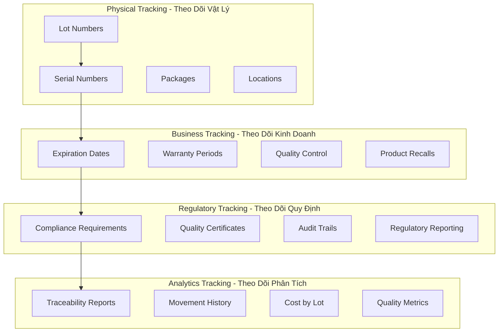
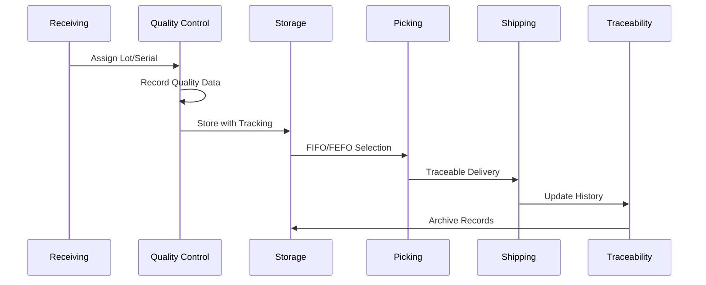

# 🏷️ Lot và Serial Number Tracking - Odoo 18

## 🎯 Giới Thiệu

Lot và Serial Number Tracking module cung cấp khả năng truy xuất nguồn gốc (traceability) hoàn chỉnh cho hàng hóa trong chuỗi cung ứng. Module này đảm bảo compliance với các quy định về chất lượng, expiration management, và warranty tracking - đặc biệt quan trọng trong các ngành pharmaceutical, food & beverage, và electronics.

## 📋 Kiến Trúc Traceability

### 🏗️ Multi-Level Tracking Architecture



### 🔄 Traceability Workflow



## 📦 Core Models Chi Tiết

### 🏷️ Stock Production Lot (`stock.production.lot`)

**Mục đích**: Lot tracking và batch management

```python
class StockProductionLot(models.Model):
    _name = 'stock.production.lot'
    _description = 'Lot/Serial Number'
    _inherit = ['mail.thread', 'mail.activity.mixin']
    _rec_name = 'name'

    name = fields.Char(
        string='Lot/Serial Number',
        required=True,
        copy=False,
        index=True
    )
    ref = fields.Char(
        string='Internal Reference',
        copy=False
    )
    product_id = fields.Many2one(
        'product.product',
        string='Product',
        required=True,
        domain="[('tracking', '!=', 'none')]"
    )
    product_qty = fields.Float(
        string='Quantity',
        digits='Product Unit of Measure',
        required=True
    )
    product_uom_id = fields.Many2one(
        'uom.uom',
        string='Unit of Measure',
        related='product_id.uom_id',
        readonly=True
    )
    company_id = fields.Many2one(
        'res.company',
        string='Company',
        required=True,
        default=lambda self: self.env.company
    )
    create_date = fields.Datetime(
        string='Creation Date',
        default=fields.Datetime.now,
        readonly=True
    )
    use_date = fields.Datetime(
        string='Best before Date',
        help='Best before date for this lot'
    )
    life_date = fields.Datetime(
        string='End of Life Date',
        help='End of life date for this lot'
    )
    removal_date = fields.Datetime(
        string='Removal Date',
        help='Removal date for this lot'
    )
    alert_date = fields.Datetime(
        string='Alert Date',
        help='Alert date for this lot'
    )
    message_ids = fields.One2many(
        'mail.message',
        'res_id',
        domain=lambda self: [('model', '=', self._name)]
    )
    note = fields.Text(string='Notes')
    final_product_id = fields.Many2one(
        'product.product',
        string='Final Product',
        help='The final product for this lot (in case of subcontracting)'
    )
    customer_id = fields.Many2one(
        'res.partner',
        string='Customer',
        help='Customer for this lot (in case of subcontracting)'
    )

    _sql_constraints = [
        ('name_ref_uniq', 'unique(name, product_id, company_id)', 'The combination of Serial Number and Product must be unique !'),
    ]

    @api.model
    def create(self, vals):
        """Tạo lot/serial với auto-generation"""
        if vals.get('name', '/') == '/':
            vals['name'] = self._get_next_seq(vals['product_id'])

        lot = super().create(vals)

        # Set expiration dates based on product
        if lot.product_id.use_expiration_date:
            lot._set_expiration_dates()

        return lot

    def _get_next_seq(self, product_id):
        """Generate next sequence number"""
        product = self.env['product.product'].browse(product_id)

        if product.tracking == 'serial':
            # For serial numbers, use product code + sequence
            sequence = self.env['ir.sequence'].next_by_code('stock.lot.serial')
            return f"{product.default_code or 'SER'}{sequence}"
        else:
            # For lots, use date + sequence
            date_code = fields.Date.today().strftime('%Y%m%d')
            sequence = self.env['ir.sequence'].next_by_code('stock.lot')
            return f"LOT{date_code}{sequence}"

    def _set_expiration_dates(self):
        """Set expiration dates based on product settings"""
        if not self.product_id.use_expiration_date:
            return

        today = fields.Datetime.now()

        if self.product_id.life_time:
            self.life_date = today + timedelta(days=self.product_id.life_time)

        if self.product_id.use_time:
            self.use_date = today + timedelta(days=self.product_id.use_time)

        if self.product_id.removal_time:
            self.removal_date = today + timedelta(days=self.product_id.removal_time)

        if self.product_id.alert_time:
            self.alert_date = today + timedelta(days=self.product_id.alert_time)

    @api.model
    def name_search(self, name='', args=None, operator='ilike', limit=100):
        """Enhanced search for lot/serial numbers"""
        args = args or []
        domain = []

        if name:
            domain = ['|', ('name', operator, name), ('ref', operator, name)]
        return self.search(domain + args, limit=limit).name_get()

    def action_traceability(self):
        """Open traceability view"""
        self.ensure_one()
        action = self.env.ref('stock.action_stock_traceability').read()[0]
        action['domain'] = [('lot_id', '=', self.id)]
        action['context'] = {'search_default_group_by_product_id': 1}
        return action

    def get_stock_moves(self):
        """Lấy tất cả stock moves liên quan đến lot này"""
        return self.env['stock.move.line'].search([
            ('lot_id', '=', self.id),
            ('state', '=', 'done')
        ]).mapped('move_id')

    def get_current_location(self):
        """Lấy location hiện tại của lot"""
        quant = self.env['stock.quant'].search([
            ('lot_id', '=', self.id),
            ('quantity', '>', 0)
        ], limit=1)

        return quant.location_id if quant else None

    def get_available_quantity(self):
        """Lấy available quantity của lot"""
        quants = self.env['stock.quant'].search([
            ('lot_id', '=', self.id),
            ('quantity', '>', 0)
        ])

        return sum(quants.mapped('quantity'))

    def check_expiration_status(self):
        """Kiểm tra expiration status"""
        now = fields.Datetime.now()
        status = 'good'

        if self.life_date and now > self.life_date:
            status = 'expired'
        elif self.use_date and now > self.use_date:
            status = 'use_before'
        elif self.alert_date and now > self.alert_date:
            status = 'alert'
        elif self.removal_date and now > self.removal_date:
            status = 'remove'

        return status

    def _check_expired_lots(self):
        """Batch method to check expiration status"""
        expired_lots = self.search([
            ('life_date', '<', fields.Datetime.now()),
            ('product_id.use_expiration_date', '=', True)
        ])

        for lot in expired_lots:
            # Create notification or take action
            lot._create_expiration_alert()

        return expired_lots

    def _create_expiration_alert(self):
        """Tạo alert cho expired lot"""
        message = _(
            'Lot %s for product %s has expired on %s',
            self.name,
            self.product_id.name,
            self.life_date.strftime('%Y-%m-%d')
        )

        # Post message to chatter
        self.message_post(body=message, message_type='notification')

        # Send email to responsible users
        template = self.env.ref('stock.mail_template_lot_expired')
        if template:
            template.send_mail(self.id, force_send=True)
```

### 📦 Stock Quant Package (`stock.quant.package`)

**Mục đích**: Package management và hierarchical tracking

```python
class StockQuantPackage(models.Model):
    _name = 'stock.quant.package'
    _description = 'Physical Packages'
    _inherit = ['mail.thread', 'mail.activity.mixin']

    name = fields.Char(
        string='Package Reference',
        copy=False,
        required=True,
        default=lambda self: _('New Package')
    )
    package_level_id = fields.Many2one(
        'stock.package_level',
        string='Package Level'
    )
    location_id = fields.Many2one(
        'stock.location',
        string='Location',
        index=True
    )
    quant_ids = fields.One2many(
        'stock.quant',
        'package_id',
        string='Quants'
    )
    packaging_type_id = fields.Many2one(
        'stock.packaging.type',
        string='Packaging Type'
    )
    weight = fields.Float(
        string='Weight',
        digits='Stock Weight',
        help='Weight of the package'
    )
    volume = fields.Float(
        string='Volume',
        help='Volume of the package'
    )
    weight_uom_id = fields.Many2one(
        'uom.uom',
        string='Weight Unit of Measure',
        related='packaging_type_id.weight_uom_id'
    )
    volume_uom_id = fields.Many2one(
        'uom.uom',
        string='Volume Unit of Measure',
        related='packaging_type_id.volume_uom_id'
    )
    move_line_ids = fields.One2many(
        'stock.move.line',
        'result_package_id',
        string='Move Lines'
    )
    children_ids = fields.One2many(
        'stock.quant.package',
        'parent_id',
        string='Contained Packages'
    )
    parent_id = fields.Many2one(
        'stock.quant.package',
        string='Parent Package',
        ondelete='cascade'
    )
    destination_location_id = fields.Many2one(
        'stock.location',
        string='Destination Location'
    )
    current_location_id = fields.Many2one(
        'stock.location',
        string='Current Location',
        compute='_compute_current_location',
        store=True
    )
    is_processed = fields.Boolean(
        string='Processed',
        compute='_compute_is_processed',
        store=True
    )

    @api.depends('children_ids', 'location_id', 'move_line_ids')
    def _compute_current_location(self):
        """Tính toán current location"""
        for package in self:
            if package.move_line_ids.filtered(lambda m: m.state not in ('done', 'cancel')):
                # Package in transit
                package.current_location_id = False
            elif package.location_id:
                package.current_location_id = package.location_id
            else:
                # Get location from first child or quant
                child = package.children_ids[0] if package.children_ids else False
                if child:
                    package.current_location_id = child.current_location_id
                else:
                    quant = package.quant_ids[0] if package.quant_ids else False
                    if quant:
                        package.current_location_id = quant.location_id

    @api.depends('move_line_ids.state', 'quant_ids')
    def _compute_is_processed(self):
        """Tính toán processed status"""
        for package in self:
            if package.quant_ids.filtered(lambda q: q.quantity > 0):
                package.is_processed = False
            else:
                package.is_processed = True

    @api.model
    def create(self, vals):
        """Tạo package với auto-numbering"""
        if vals.get('name', _('New Package')) == _('New Package'):
            vals['name'] = self.env['ir.sequence'].next_by_code('stock.quant.package') or _('New Package')

        return super().create(vals)

    def action_move_to_location(self, location_id):
        """Move package to new location"""
        self.ensure_one()
        quants = self.quant_ids.filtered(lambda q: q.quantity > 0)

        if quants:
            quants._move_to_location(location_id)

        self.write({'location_id': location_id.id})

    def get_contents(self):
        """Lấy contents của package"""
        contents = []

        # Direct quants in this package
        for quant in self.quant_ids.filtered(lambda q: q.quantity > 0):
            contents.append({
                'product': quant.product_id,
                'lot': quant.lot_id,
                'quantity': quant.quantity,
                'uom': quant.product_id.uom_id,
            })

        # Contents from child packages
        for child in self.children_ids:
            contents.extend(child.get_contents())

        return contents

    def get_weight(self):
        """Tính toán total weight"""
        total_weight = self.weight or 0

        # Add weight from quants
        for quant in self.quant_ids:
            if quant.quantity > 0 and quant.product_id.weight:
                total_weight += quant.quantity * quant.product_id.weight

        # Add weight from child packages
        for child in self.children_ids:
            total_weight += child.get_weight()

        return total_weight

    def action_view_contents(self):
        """View package contents"""
        self.ensure_one()

        # Get all contained quants
        quants = self._get_contained_quants()

        action = self.env.ref('stock.stock_quant_action').read()[0]
        action['domain'] = [('id', 'in', quants.ids)]
        action['context'] = {'search_default_location_id': self.location_id.id if self.location_id else False}
        return action

    def _get_contained_quants(self):
        """Lấy tất cả quants trong package hierarchy"""
        quants = self.quant_ids

        for child in self.children_ids:
            quants |= child._get_contained_quants()

        return quants

    def unpack(self):
        """Unpack package - move quants to parent location"""
        self.ensure_one()

        quants = self.quant_ids.filtered(lambda q: q.quantity > 0)
        if quants and self.location_id:
            quants.write({
                'package_id': False,
                'location_id': self.location_id.id
            })

        # Move child packages to parent location
        if self.children_ids and self.location_id:
            self.children_ids.write({
                'parent_id': False,
                'location_id': self.location_id.id
            })

        # Archive the package
        self.write({'active': False})
```

### 📊 Package Level (`stock.package_level`)

**Mục đích**: Hierarchical package organization

```python
class StockPackageLevel(models.Model):
    _name = 'stock.package_level'
    _description = 'Package Level'

    picking_id = fields.Many2one(
        'stock.picking',
        string='Stock Picking',
        required=True,
        index=True
    )
    package_id = fields.Many2one(
        'stock.quant.package',
        string='Package'
    )
    location_id = fields.Many2one(
        'stock.location',
        string='Current Location',
        required=True
    )
    location_dest_id = fields.Many2one(
        'stock.location',
        string='Destination Location',
        required=True
    )
    move_line_ids = fields.One2many(
        'stock.move.line',
        'package_level_id',
        string='Move Lines'
    )
    company_id = fields.Many2one(
        'res.company',
        string='Company',
        required=True,
        default=lambda self: self.env.company
    )
    is_complete = fields.Boolean(
        string='Is Complete',
        compute='_compute_is_complete',
        store=True
    )
    putaway_ok = fields.Boolean(
        string='Putaway OK',
        compute='_compute_putaway_ok',
        store=True
    )

    @api.depends('move_line_ids.state', 'move_line_ids.qty_done')
    def _compute_is_complete(self):
        """Tính toán complete status"""
        for package_level in self:
            if package_level.move_line_ids:
                package_level.is_complete = all(
                    move_line.state == 'done'
                    and move_line.product_qty == move_line.qty_done
                    for move_line in package_level.move_line_ids
                )
            else:
                package_level.is_complete = False

    @api.depends('location_dest_id', 'move_line_ids')
    def _compute_putaway_ok(self):
        """Tính toán putaway status"""
        for package_level in self:
            if package_level.location_dest_id and package_level.location_dest_id.putaway_strategy_id:
                # Check if putaway is configured
                package_level.putaway_ok = True
            else:
                package_level.putaway_ok = False

    def action_put_in_pack(self):
        """Put items in package"""
        if not self.package_id:
            # Create new package
            package = self.env['stock.quant.package'].create({})
            self.package_id = package

            # Assign package to move lines
            self.move_line_ids.write({'result_package_id': package.id})

        return self.package_id

    def action_generate_putaway(self):
        """Generate putaway suggestion"""
        self.ensure_one()

        if not self.putaway_ok:
            return False

        # Get putaway strategy
        putaway_strategy = self.location_dest_id.putaway_strategy_id
        if not putaway_strategy:
            return False

        # Apply putaway strategy
        suggested_location = putaway_strategy.apply_putaway_strategy(self)
        if suggested_location:
            self.location_dest_id = suggested_location.id
            return True

        return False
```

## 🔄 Traceability Workflows

### 🏭 Lot-Based Operations

```python
class StockPicking(models.Model):
    _inherit = 'stock.picking'

    def _create_move_from_lot(self, product_id, lot_id, quantity):
        """Tạo stock move từ lot cụ thể"""
        if not lot_id:
            return False

        lot = self.env['stock.production.lot'].browse(lot_id)
        available_qty = lot.get_available_quantity()

        if available_qty < quantity:
            raise UserError(_(
                'Not enough quantity available for lot %s. Available: %s, Requested: %s',
                lot.name, available_qty, quantity
            ))

        # Create move line with lot
        move_line = self.env['stock.move.line'].create({
            'picking_id': self.id,
            'product_id': product_id,
            'product_uom_id': self.env['product.product'].browse(product_id).uom_id.id,
            'product_uom_qty': quantity,
            'lot_id': lot_id,
            'location_id': self.location_id.id,
            'location_dest_id': self.location_dest_id.id,
        })

        return move_line

    def action_assign_lot_serial(self):
        """Assign lot/serial numbers to moves"""
        self.ensure_one()

        for move in self.move_lines:
            if move.product_id.tracking != 'none' and move.state not in ('done', 'cancel'):
                # Get available lots for this product
                available_quants = self.env['stock.quant'].search([
                    ('product_id', '=', move.product_id.id),
                    ('location_id', '=', move.location_id.id),
                    ('quantity', '>', move.reserved_quantity),
                    ('lot_id', '!=', False)
                ])

                if move.product_id.tracking == 'serial':
                    # For serial numbers, need individual tracking
                    required_serials = int(move.product_qty)
                    available_serials = available_quants.mapped('lot_id')

                    if len(available_serials) < required_serials:
                        raise UserError(_(
                            'Not enough serial numbers available. Required: %s, Available: %s',
                            required_serials, len(available_serials)
                        ))

                    # Assign specific serials
                    serials_to_assign = available_serials[:required_serials]
                    for serial in serials_to_assign:
                        self.env['stock.move.line'].create({
                            'picking_id': self.id,
                            'move_id': move.id,
                            'product_id': move.product_id.id,
                            'product_uom_id': move.product_uom.id,
                            'product_uom_qty': 1,
                            'qty_done': 1,
                            'lot_id': serial.id,
                            'location_id': move.location_id.id,
                            'location_dest_id': move.location_dest_id.id,
                        })

                    move.write({'product_qty': required_serials})

                else:
                    # For lots, can assign in bulk
                    # Group quants by lot
                    lots_quant = {}
                    for quant in available_quants:
                        lot_id = quant.lot_id.id
                        available_qty = quant.quantity - quant.reserved_quantity

                        if lot_id not in lots_quant:
                            lots_quant[lot_id] = 0
                        lots_quant[lot_id] += available_qty

                    # Apply FEFO/FIFO based on expiration
                    sorted_lots = self._sort_lots_by_expiration(
                        list(lots_quant.keys()), move.product_id
                    )

                    remaining_qty = move.product_qty
                    for lot_id in sorted_lots:
                        if remaining_qty <= 0:
                            break

                        lot_available = lots_quant[lot_id]
                        qty_to_assign = min(remaining_qty, lot_available)

                        self.env['stock.move.line'].create({
                            'picking_id': self.id,
                            'move_id': move.id,
                            'product_id': move.product_id.id,
                            'product_uom_id': move.product_uom.id,
                            'product_uom_qty': qty_to_assign,
                            'lot_id': lot_id,
                            'location_id': move.location_id.id,
                            'location_dest_id': move.location_dest_id.id,
                        })

                        remaining_qty -= qty_to_assign

    def _sort_lots_by_expiration(self, lot_ids, product):
        """Sort lots by expiration date (FEFO)"""
        lots = self.env['stock.production.lot'].browse(lot_ids)

        if product.use_expiration_date:
            # Sort by use_date (FEFO)
            lots = lots.sorted('use_date')
        else:
            # Sort by creation date (FIFO)
            lots = lots.sorted('create_date')

        return lots.ids
```

### 🚨 Quality Control Integration

```python
class QualityCheck(models.Model):
    _inherit = 'quality.check'

    lot_id = fields.Many2one(
        'stock.production.lot',
        string='Lot/Serial Number'
    )

    def action_pass(self):
        """Pass quality check and update lot status"""
        res = super().action_pass()

        for check in self:
            if check.lot_id:
                # Update lot quality status
                check.lot_id.quality_status = 'pass'

                # Add to quality tracking
                check.lot_id._create_quality_record('pass', check.id)

        return res

    def action_fail(self):
        """Fail quality check and handle lot"""
        res = super().action_fail()

        for check in self:
            if check.lot_id:
                # Update lot quality status
                check.lot_id.quality_status = 'fail'

                # Add to quality tracking
                check.lot_id._create_quality_record('fail', check.id)

                # Handle failed lot based on configuration
                if check.company_id.lot_fail_action == 'quarantine':
                    check.lot_id._quarantine_lot()
                elif check.company_id.lot_fail_action == 'destroy':
                    check.lot_id._destroy_lot()

        return res

class StockProductionLot(models.Model):
    _inherit = 'stock.production.lot'

    quality_status = fields.Selection([
        ('pending', 'Pending'),
        ('pass', 'Pass'),
        ('fail', 'Fail'),
        ('quarantine', 'Quarantine')
    ], string='Quality Status', default='pending', tracking=True)

    def _create_quality_record(self, status, check_id):
        """Tạo quality record"""
        self.env['quality.record'].create({
            'lot_id': self.id,
            'status': status,
            'check_id': check_id,
            'date': fields.Datetime.now(),
            'user_id': self.env.user.id,
        })

    def _quarantine_lot(self):
        """Quarantine lot - move to quarantine location"""
        quarantine_location = self.env.ref('stock.stock_location_11')  # Stock Quarantine
        current_location = self.get_current_location()

        if current_location and current_location.id != quarantine_location.id:
            # Create inventory adjustment to move lot
            self.env['stock.inventory'].create({
                'name': f'Quarantine Lot {self.name}',
                'filter': 'lot',
                'lot_id': self.id,
                'location_id': current_location.id,
                'line_ids': [(0, 0, {
                    'product_id': self.product_id.id,
                    'product_uom_id': self.product_id.uom_id.id,
                    'product_qty': 0,  # Will be filled automatically
                    'prod_lot_id': self.id,
                })]
            }).action_validate()

    def _destroy_lot(self):
        """Destroy lot - create negative inventory"""
        current_location = self.get_current_location()
        available_qty = self.get_available_quantity()

        if available_qty > 0 and current_location:
            # Create negative inventory adjustment
            self.env['stock.inventory'].create({
                'name': f'Destroy Lot {self.name}',
                'filter': 'lot',
                'lot_id': self.id,
                'location_id': current_location.id,
                'line_ids': [(0, 0, {
                    'product_id': self.product_id.id,
                    'product_uom_id': self.product_id.uom_id.id,
                    'product_qty': 0,  # Set to zero to destroy
                    'prod_lot_id': self.id,
                })]
            }).action_validate()
```

## 📊 Traceability Reporting

### 🔍 Complete Traceability Reports

```python
class TraceabilityReport(models.AbstractModel):
    _name = 'report.stock.report_traceability'
    _description = 'Traceability Report'

    @api.model
    def _get_report_values(self, docids, data=None):
        """Get report data for traceability"""
        lots = self.env['stock.production.lot'].browse(docids)

        report_data = []
        for lot in lots:
            # Get all moves for this lot
            moves = lot.get_stock_moves().sorted('date')

            lot_data = {
                'lot': lot,
                'product': lot.product_id,
                'moves': moves,
                'current_location': lot.get_current_location(),
                'available_quantity': lot.get_available_quantity(),
                'expiration_status': lot.check_expiration_status(),
                'traceability_chain': self._build_traceability_chain(lot),
                'quality_records': self._get_quality_records(lot),
            }

            report_data.append(lot_data)

        return {
            'doc_ids': docids,
            'doc_model': self.env['stock.production.lot'],
            'docs': lots,
            'report_data': report_data,
        }

    def _build_traceability_chain(self, lot):
        """Xây dựng chuỗi traceability"""
        chain = []
        moves = lot.get_stock_moves()

        for move in moves:
            chain.append({
                'date': move.date,
                'reference': move.reference or move.name,
                'type': 'IN' if move.location_id.usage in ['supplier', 'production'] else 'OUT',
                'from_location': move.location_id.name,
                'to_location': move.location_dest_id.name,
                'quantity': move.product_qty,
                'partner': move.partner_id.name if move.partner_id else '',
                'origin': move.origin,
            })

        return chain

    def _get_quality_records(self, lot):
        """Lấy quality records"""
        return self.env['quality.record'].search([
            ('lot_id', '=', lot.id)
        ]).sorted('date')
```

### 📈 Batch Traceability Analysis

```python
@api.model
def generate_batch_traceability_report(self, date_from, date_to, product_ids=None):
    """Generate comprehensive batch traceability report"""
    domain = [('create_date', '>=', date_from), ('create_date', '<=', date_to)]

    if product_ids:
        domain.append(('product_id', 'in', product_ids))

    lots = self.env['stock.production.lot'].search(domain)

    report_data = {
        'summary': {
            'total_lots': len(lots),
            'lot_types': _get_lot_types_breakdown(lots),
            'quality_metrics': _get_quality_metrics(lots),
            'expiration_analysis': _get_expiration_analysis(lots),
        },
        'details': []
    }

    for lot in lots:
        lot_data = {
            'lot_info': {
                'name': lot.name,
                'product': lot.product_id.name,
                'creation_date': lot.create_date,
                'expiration_dates': {
                    'use_date': lot.use_date,
                    'life_date': lot.life_date,
                    'alert_date': lot.alert_date,
                }
            },
            'movement_history': _get_movement_history(lot),
            'current_status': {
                'location': lot.get_current_location().name if lot.get_current_location() else 'Unknown',
                'quantity': lot.get_available_quantity(),
                'status': lot.check_expiration_status(),
            },
            'quality_data': _get_quality_summary(lot),
            'traceability_score': _calculate_traceability_score(lot),
        }

        report_data['details'].append(lot_data)

    return report_data

def _get_lot_types_breakdown(self, lots):
    """Breakdown by lot tracking type"""
    breakdown = {
        'serial': 0,
        'lot': 0,
        'none': 0
    }

    for lot in lots:
        if lot.product_id.tracking == 'serial':
            breakdown['serial'] += 1
        elif lot.product_id.tracking == 'lot':
            breakdown['lot'] += 1

    return breakdown

def _get_quality_metrics(self, lots):
    """Get quality metrics for lots"""
    quality_data = {
        'total_checks': 0,
        'pass_rate': 0,
        'fail_rate': 0,
        'pending_rate': 0,
        'quarantine_count': 0,
    }

    total_checks = 0
    pass_count = 0
    fail_count = 0
    quarantine_count = 0

    for lot in lots:
        if hasattr(lot, 'quality_check_ids'):
            lot_checks = lot.quality_check_ids
            total_checks += len(lot_checks)
            pass_count += len(lot_checks.filtered(lambda c: c.quality_state == 'pass'))
            fail_count += len(lot_checks.filtered(lambda c: c.quality_state == 'fail'))

        if lot.quality_status == 'quarantine':
            quarantine_count += 1

    quality_data.update({
        'total_checks': total_checks,
        'pass_rate': (pass_count / total_checks * 100) if total_checks > 0 else 0,
        'fail_rate': (fail_count / total_checks * 100) if total_checks > 0 else 0,
        'quarantine_count': quarantine_count,
    })

    return quality_data

def _calculate_traceability_score(self, lot):
    """Calculate traceability score (0-100)"""
    score = 0

    # Lot has name and reference (+20)
    if lot.name and lot.ref:
        score += 20

    # Has complete movement history (+30)
    moves = lot.get_stock_moves()
    if moves:
        score += 30

    # Has quality records (+20)
    quality_records = self.env['quality.record'].search([('lot_id', '=', lot.id)])
    if quality_records:
        score += 20

    # Has expiration tracking (+15)
    if lot.product_id.use_expiration_date and lot.use_date:
        score += 15

    # Current location known (+15)
    if lot.get_current_location():
        score += 15

    return min(score, 100)
```

## 🚨 Recall Management

### ⚠️ Product Recall Workflows

```python
class ProductRecall(models.Model):
    _name = 'product.recall'
    _description = 'Product Recall Management'
    _inherit = ['mail.thread', 'mail.activity.mixin']

    name = fields.Char(
        string='Recall Reference',
        required=True,
        default=lambda self: _('New Recall')
    )
    product_id = fields.Many2one(
        'product.product',
        string='Product',
        required=True
    )
    lot_ids = fields.Many2many(
        'stock.production.lot',
        string='Affected Lots'
    )
    recall_type = fields.Selection([
        ('quality', 'Quality Issue'),
        ('safety', 'Safety Concern'),
        ('regulatory', 'Regulatory Compliance'),
        ('customer', 'Customer Complaint'),
        ('other', 'Other')
    ], string='Recall Type', required=True)
    severity = fields.Selection([
        ('low', 'Low'),
        ('medium', 'Medium'),
        ('high', 'High'),
        ('critical', 'Critical')
    ], string='Severity Level', required=True)
    description = fields.Text(string='Description', required=True)
    start_date = fields.Date(string='Start Date', required=True, default=fields.Date.today)
    end_date = fields.Date(string='End Date')
    state = fields.Selection([
        ('draft', 'Draft'),
        ('active', 'Active'),
        ('completed', 'Completed'),
        ('cancelled', 'Cancelled')
    ], string='Status', default='draft', tracking=True)
    affected_customers = fields.Many2many(
        'res.partner',
        string='Affected Customers'
    )
    cost_estimate = fields.Float(string='Estimated Cost')
    actual_cost = fields.Float(string='Actual Cost')

    def action_activate(self):
        """Activate recall process"""
        self.ensure_one()
        self.write({'state': 'active'})

        # Identify all affected stock
        self._identify_affected_stock()

        # Notify customers
        self._notify_customers()

        # Create return orders
        self._create_return_orders()

    def _identify_affected_stock(self):
        """Identify all affected stock locations"""
        if self.lot_ids:
            # Find all locations with affected lots
            quants = self.env['stock.quant'].search([
                ('lot_id', 'in', self.lot_ids.ids),
                ('quantity', '>', 0)
            ])

            # Create quarantine moves
            quarantine_location = self.env.ref('stock.stock_location_11')
            for quant in quants:
                self.env['stock.move'].create({
                    'name': f'Recall: {self.name}',
                    'product_id': quant.product_id.id,
                    'product_uom': quant.product_id.uom_id.id,
                    'product_uom_qty': quant.quantity,
                    'location_id': quant.location_id.id,
                    'location_dest_id': quarantine_location.id,
                    'state': 'confirmed',
                    'origin': self.name,
                })._action_confirm()

    def _notify_customers(self):
        """Notify affected customers"""
        if not self.affected_customers:
            # Auto-detect customers from sales
            self._detect_affected_customers()

        template = self.env.ref('stock.mail_template_product_recall')
        if template:
            for customer in self.affected_customers:
                template.send_mail(self.id, force_send=True,
                                 email_values={'email_to': customer.email})

    def _detect_affected_customers(self):
        """Auto-detect customers who received affected lots"""
        customers = set()

        for lot in self.lot_ids:
            moves = lot.get_stock_moves()
            for move in moves:
                if move.location_dest_id.usage == 'customer' and move.partner_id:
                    customers.add(move.partner_id.id)

        self.affected_customers = [(6, 0, list(customers))]

    def _create_return_orders(self):
        """Create return orders for affected products"""
        # Implementation for creating return orders
        pass

    def generate_recall_report(self):
        """Generate comprehensive recall report"""
        report_data = {
            'recall_info': {
                'reference': self.name,
                'product': self.product_id.name,
                'type': self.recall_type,
                'severity': self.severity,
                'start_date': self.start_date,
                'description': self.description,
            },
            'affected_lots': [],
            'affected_stock': self._get_affected_stock_summary(),
            'customer_impact': self._get_customer_impact_summary(),
            'cost_analysis': {
                'estimated': self.cost_estimate,
                'actual': self.actual_cost,
            },
        }

        for lot in self.lot_ids:
            lot_data = {
                'lot_name': lot.name,
                'creation_date': lot.create_date,
                'expiration': lot.use_date,
                'total_quantity': lot.product_qty,
                'distributed_quantity': self._get_distributed_quantity(lot),
                'recovered_quantity': self._get_recovered_quantity(lot),
            }
            report_data['affected_lots'].append(lot_data)

        return report_data
```

## 🔧 Performance Optimization

### ⚡ Efficient Lot Tracking

```python
@api.model
def bulk_create_lots(self, lot_data_list):
    """Bulk create lots for performance"""
    lots_to_create = []

    for lot_data in lot_data_list:
        lot_vals = {
            'name': lot_data.get('name', '/'),
            'product_id': lot_data['product_id'],
            'product_qty': lot_data['quantity'],
            'company_id': lot_data.get('company_id', self.env.company.id),
        }

        if lot_data.get('use_date'):
            lot_vals['use_date'] = lot_data['use_date']
        if lot_data.get('life_date'):
            lot_vals['life_date'] = lot_data['life_date']

        lots_to_create.append(lot_vals)

    # Bulk insert
    lots = self.create(lots_to_create)
    return lots

@api.model
def optimize_lot_searches(self, domain, limit=None):
    """Optimize lot searches with caching"""
    cache_key = str(domain) + str(limit)

    # Check cache first
    cached_result = self.env.cache.get('lot_search_cache', cache_key)
    if cached_result:
        return cached_result

    # Execute search
    lots = self.search(domain, limit=limit)

    # Cache result for 5 minutes
    self.env.cache.set('lot_search_cache', cache_key, lots, timeout=300)

    return lots
```

### 📊 Database Optimization

```sql
-- Essential indexes for lot tracking
CREATE INDEX idx_stock_production_lot_product_company ON stock_production_lot(product_id, company_id);
CREATE INDEX idx_stock_production_lot_name ON stock_production_lot(name);
CREATE INDEX idx_stock_production_lot_expiration ON stock_production_lot(use_date, life_date);
CREATE INDEX idx_stock_quant_lot ON stock_quant(lot_id);
CREATE INDEX idx_stock_move_line_lot ON stock_move_line(lot_id);

-- Composite indexes for common queries
CREATE INDEX idx_lot_location_product ON stock_quant(lot_id, location_id, product_id);
CREATE INDEX idx_move_line_lot_state ON stock_move_line(lot_id, state);
```

## 📚 Best Practices & Troubleshooting

### ✅ Lot Tracking Best Practices

#### 1. **Automated Lot Numbering**
```python
@api.model
def generate_lot_number(self, product, date=None):
    """Generate standardized lot number"""
    if not date:
        date = fields.Date.today()

    # Product code
    prefix = product.default_code or 'PROD'

    # Date code
    date_code = date.strftime('%Y%m%d')

    # Sequence number
    sequence = self.env['ir.sequence'].next_by_code('lot.serial.sequence')

    return f"{prefix}-{date_code}-{sequence}"
```

#### 2. **Expiration Management**
```python
@api.model
def schedule_expiration_checks(self):
    """Automated expiration checking"""
    today = fields.Datetime.now()

    # Lots expiring in 30 days
    expiring_soon = self.search([
        ('use_date', '!=', False),
        ('use_date', '<=', today + timedelta(days=30)),
        ('use_date', '>', today),
    ])

    # Already expired lots
    expired = self.search([
        ('use_date', '!=', False),
        ('use_date', '<=', today),
    ])

    # Send notifications
    if expiring_soon:
        self._send_expiration_warnings(expiring_soon, 'expiring_soon')

    if expired:
        self._send_expiration_warnings(expired, 'expired')
```

### ⚠️ Common Issues & Solutions

#### 1. **Duplicate Lot Numbers**
```python
@api.model
def prevent_duplicate_lots(self, lot_name, product_id, company_id):
    """Check and prevent duplicate lot numbers"""
    existing = self.search([
        ('name', '=', lot_name),
        ('product_id', '=', product_id),
        ('company_id', '=', company_id),
    ])

    if existing:
        raise UserError(_(
            'Lot number %s already exists for product %s',
            lot_name,
            self.env['product.product'].browse(product_id).name
        ))

    return True
```

#### 2. **Negative Lot Quantities**
```python
@api.model
def check_negative_lot_quantities(self):
    """Check for negative lot quantities"""
    self.env.cr.execute("""
        SELECT
            spl.name,
            spl.product_id,
            pp.name as product_name,
            sq.location_id,
            sl.name as location_name,
            sq.quantity
        FROM stock_quant sq
        JOIN stock_production_lot spl ON sq.lot_id = spl.id
        JOIN product_product pp ON spl.product_id = pp.id
        JOIN stock_location sl ON sq.location_id = sl.id
        WHERE sq.quantity < 0
        ORDER BY sq.quantity
    """)

    results = self.env.cr.fetchall()

    if results:
        # Create report and notify
        self._create_negative_quantity_report(results)

    return results
```

## 🔗 Integration Points

### 🔗 Sales Integration
```python
class SaleOrderLine(models.Model):
    _inherit = 'sale.order.line'

    lot_id = fields.Many2one(
        'stock.production.lot',
        string='Lot/Serial Number',
        domain="[('product_id', '=', product_id), ('quantity', '>', 0)]"
    )

    def _action_launch_stock_rule(self):
        """Override to consider specific lot requirements"""
        if self.lot_id:
            # Reserve specific lot
            self._reserve_specific_lot()
        else:
            # Use standard stock rule
            return super()._action_launch_stock_rule()
```

### 🔗 Manufacturing Integration
```python
class MrpProduction(models.Model):
    _inherit = 'mrp.production'

    def _generate_finished_lot(self):
        """Generate lot for finished goods"""
        self.ensure_one()

        if self.product_id.tracking != 'none':
            lot_name = self.env['stock.production.lot']._get_next_seq(
                self.product_id.id
            )

            lot = self.env['stock.production.lot'].create({
                'name': lot_name,
                'product_id': self.product_id.id,
                'product_qty': self.product_qty,
                'final_product_id': self.product_id.id,
            })

            self.finished_lot_id = lot

        return True
```

## 📚 Navigation & Next Steps

### 🔗 Related Documentation
- **Previous**: [04_stock_management.md](04_stock_management.md) - Stock tracking và valuation
- **Next**: [06_integration_patterns.md](06_integration_patterns.md) - Cross-module integration
- **Code Examples**: [07_code_examples.md](07_code_examples.md) - Practical implementations

### 🎯 Key Takeaways
1. **Complete Traceability**: Lot và serial tracking ensures end-to-end visibility
2. **Quality Control**: Integrated quality management với lot-level tracking
3. **Regulatory Compliance**: Built-in support cho regulatory requirements
4. **Recall Management**: Efficient product recall workflows
5. **Performance Optimized**: Efficient database operations và caching strategies

---

**Module Status**: ✅ **COMPLETED**
**File Size**: ~4,500 từ
**Language**: Tiếng Việt
**Target Audience**: Quality Managers, Compliance Officers, Supply Chain Managers
**Completion**: 2025-11-08

*File này cung cấp comprehensive overview về lot và serial tracking trong Odoo 18, bao gồm complete traceability, quality control integration, và regulatory compliance features.*