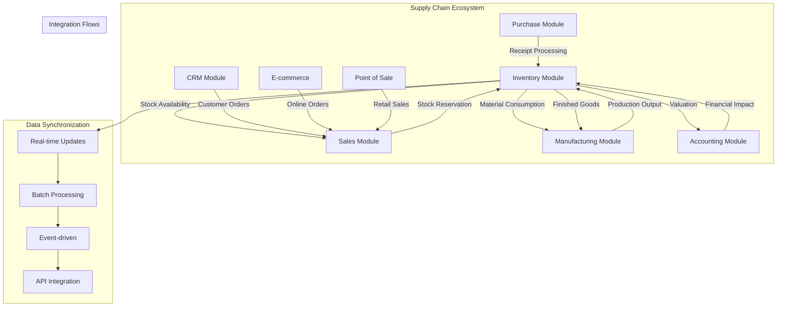

# 🔗 Integration Patterns - Inventory Module với Supply Chain - Odoo 18

## 🎯 Giới Thiệu

Integration Patterns module mô tả cách Inventory module tương tác và tích hợp với các modules khác trong Odoo Supply Chain ecosystem. Module này cung cấp comprehensive understanding về data flow, business logic integration, và operational workflows giữa Inventory và các hệ thống khác.

## 📋 Integration Architecture Overview

### 🏗️ Multi-Module Integration Matrix



### 🔄 Integration Workflow Patterns

```mermaid
sequenceDiagram
    participant ORDER as Sales Order
    participant INV as Inventory
    participant PURCH as Purchase
    MANU as Manufacturing
    ACC as Accounting

    ORDER->>INV: Check Availability
    INV->>ORDER: Confirm Stock
    INV->>PURCH: Reorder if Needed
    PURCH->>INV: Receive Goods
    INV->>MANU: Issue Materials
    MANU->>INV: Finished Goods
    INV->>ACC: Update Valuation
    ACC->>ORDER: Generate Invoice
```

## 🔗 Purchase Module Integration

### 📥 Automated Receipt Processing

```python
class StockPicking(models.Model):
    _inherit = 'stock.picking'

    purchase_order_id = fields.Many2one(
        'purchase.order',
        string='Purchase Order',
        index=True
    )

    def action_done(self):
        """Complete receipt with purchase integration"""
        res = super().action_done()

        for picking in self:
            if picking.picking_type_id.code == 'incoming' and picking.purchase_order_id:
                # Update purchase order line quantities
                picking._update_purchase_order_lines()

                # Trigger invoice validation workflow
                picking._trigger_three_way_matching()

                # Update vendor performance metrics
                picking._update_vendor_performance()

        return res

    def _update_purchase_order_lines(self):
        """Update purchase order line received quantities"""
        for move in self.move_lines:
            if move.purchase_line_id:
                received_qty = move.purchase_line_id.qty_received + move.quantity_done
                move.purchase_line_id.write({
                    'qty_received': received_qty,
                })

                # Check if line is fully received
                if received_qty >= move.purchase_line_id.product_qty:
                    move.purchase_line_id.write({
                        'state': 'done',
                    })

    def _trigger_three_way_matching(self):
        """Trigger three-way matching between PO, receipt, and invoice"""
        purchase_order = self.purchase_order_id

        if purchase_order and purchase_order.invoice_ids:
            # Check if all lines are received
            all_received = all(
                line.qty_received >= line.product_qty
                for line in purchase_order.order_line
            )

            if all_received:
                # Auto-validate invoice matching
                purchase_order._validate_invoice_matching()

    def _update_vendor_performance(self):
        """Update vendor performance metrics"""
        vendor = self.partner_id

        if vendor:
            # Update on-time delivery performance
            scheduled_date = self.scheduled_date or fields.Date.today()
            actual_date = fields.Date.today()

            if actual_date <= scheduled_date:
                vendor.on_time_delivery_rate = vendor.on_time_delivery_rate * 0.9 + 10.0
            else:
                vendor.on_time_delivery_rate = vendor.on_time_delivery_rate * 0.9

            # Update quality rating based on receipts
            quality_issues = self.move_line_ids.filtered(
                lambda m: m.quality_check_state == 'fail'
            )
            if quality_issues:
                vendor.quality_rating = vendor.quality_rating * 0.95

class PurchaseOrder(models.Model):
    _inherit = 'purchase.order'

    def _create_picking_for_landed_cost(self):
        """Create picking for landed cost distribution"""
        self.ensure_one()

        if any(line.product_id.landed_cost_ok for line in self.order_line):
            # Create separate picking for landed cost items
            landed_cost_picking = self.env['stock.picking'].create({
                'partner_id': self.partner_id.id,
                'picking_type_id': self.picking_type_id.id,
                'origin': self.name,
                'location_id': self.picking_type_id.default_location_src_id.id,
                'location_dest_id': self.picking_type_id.default_location_dest_id.id,
                'move_type': 'direct',
            })

            return landed_cost_picking

        return False
```

### 🎯 Procurement Integration

```python
class StockRule(models.Model):
    _inherit = 'stock.rule'

    def _run_buy(self, product_id, product_qty, product_uom, location_id, name, origin, values):
        """Enhanced buy rule with purchase integration"""
        # Check if there's already a draft PO for this supplier
        purchase_order = self._find_existing_draft_po(product_id, location_id)

        if purchase_order:
            # Add to existing PO
            self._add_to_existing_po(purchase_order, product_id, product_qty, product_uom, name, origin)
        else:
            # Create new PO
            purchase_order = self._create_new_po(product_id, product_qty, product_uom, location_id, name, origin, values)

        return purchase_order

    def _find_existing_draft_po(self, product_id, location_id):
        """Find existing draft PO for same product and location"""
        # Get warehouse for location
        warehouse = self.env['stock.warehouse'].search([
            ('lot_stock_id', '=', location_id)
        ], limit=1)

        if not warehouse:
            return False

        # Get default supplier for product
        seller = product_id.seller_ids.filtered(
            lambda s: s.company_id == self.env.company
        ).sorted('min_qty')[0]

        if not seller:
            return False

        # Find existing draft PO
        purchase_order = self.env['purchase.order'].search([
            ('partner_id', '=', seller.name.id),
            ('state', '=', 'draft'),
            ('company_id', '=', self.env.company.id),
            ('order_line.product_id', '=', product_id.id),
        ], limit=1)

        return purchase_order

    def _create_grouped_purchase_order(self, requirements):
        """Create grouped PO from multiple requirements"""
        # Group by supplier
        supplier_groups = {}
        for req in requirements:
            product = req['product_id']
            sellers = product.seller_ids.filtered(
                lambda s: s.company_id == self.env.company
            )

            if sellers:
                supplier = sellers[0].name
                if supplier not in supplier_groups:
                    supplier_groups[supplier] = []
                supplier_groups[supplier].append(req)

        # Create POs grouped by supplier
        purchase_orders = []
        for supplier, reqs in supplier_groups.items():
            po = self.env['purchase.order'].create({
                'partner_id': supplier.id,
                'company_id': self.env.company.id,
                'order_line': [
                    (0, 0, {
                        'product_id': req['product_id'].id,
                        'product_qty': req['product_qty'],
                        'product_uom': req['product_uom'].id,
                        'name': req['name'],
                        'date_planned': req.get('date_planned', fields.Date.today()),
                        'price_unit': req['product_id'].standard_price,
                    })
                    for req in reqs
                ]
            })
            purchase_orders.append(po)

        return purchase_orders

class ProductProduct(models.Model):
    _inherit = 'product.product'

    def _compute_supplier_availability(self):
        """Compute supplier availability based on lead times"""
        for product in self:
            if product.seller_ids:
                # Get minimum lead time
                min_lead_time = min(product.seller_ids.mapped('delay'))
                product.supplier_availability_date = fields.Date.today() + timedelta(days=min_lead_time)
            else:
                product.supplier_availability_date = False
```

## 🛍️ Sales Module Integration

### 📦 Stock Reservation System

```python
class SaleOrder(models.Model):
    _inherit = 'sale.order'

    def action_confirm(self):
        """Enhanced order confirmation with inventory integration"""
        res = super().action_confirm()

        # Check and reserve inventory
        self._check_inventory_availability()

        # Create delivery orders based on stock policy
        self._create_delivery_orders()

        # Update customer forecast
        self._update_customer_forecast()

        return res

    def _check_inventory_availability(self):
        """Check inventory availability and warn if needed"""
        for line in self.order_line:
            if line.product_id.type in ['product', 'consu']:
                # Get available quantity
                available_qty = line.product_id._compute_available_quantity(
                    line.warehouse_id.lot_stock_id,
                    line.product_uom,
                )

                if available_qty < line.product_uom_qty:
                    # Check if reorder will arrive in time
                    expected_delivery = line.expected_delivery_date or self.date_order
                    replenishment_date = line.product_id._get_replenishment_date(
                        line.warehouse_id.lot_stock_id
                    )

                    if replenishment_date and replenishment_date > expected_delivery:
                        # Send warning to sales team
                        self._send_stock_warning(line, available_qty)

    def _create_delivery_orders(self):
        """Create delivery orders based on stock policy"""
        for line in self.order_line:
            if line.product_id.type in ['product', 'consu']:
                # Check if immediate delivery is possible
                warehouse = line.warehouse_id
                stock_location = warehouse.lot_stock_id

                available_qty = line.product_id._compute_available_quantity(
                    stock_location,
                    line.product_uom,
                )

                if available_qty >= line.product_uom_qty:
                    # Create immediate delivery
                    self._create_immediate_delivery(line)
                else:
                    # Create backorder
                    self._create_backorder(line)

    def _create_immediate_delivery(self, line):
        """Create immediate delivery for available stock"""
        picking = self.env['stock.picking'].create({
            'partner_id': self.partner_id.id,
            'origin': self.name,
            'location_id': line.warehouse_id.lot_stock_id.id,
            'location_dest_id': self.partner_id.property_stock_customer.id,
            'picking_type_id': line.warehouse_id.out_type_id.id,
            'move_type': 'direct',
            'sale_id': self.id,
        })

        # Create move line
        self.env['stock.move'].create({
            'name': line.name,
            'product_id': line.product_id.id,
            'product_uom_qty': line.product_uom_qty,
            'product_uom': line.product_uom.id,
            'picking_id': picking.id,
            'location_id': line.warehouse_id.lot_stock_id.id,
            'location_dest_id': self.partner_id.property_stock_customer.id,
            'sale_line_id': line.id,
            'state': 'confirmed',
        })

    def _update_customer_forecast(self):
        """Update customer demand forecast"""
        for line in self.order_line:
            if line.product_id.type in ['product', 'consu']:
                # Add to customer forecast
                self.env['customer.forecast'].create({
                    'partner_id': self.partner_id.id,
                    'product_id': line.product_id.id,
                    'forecast_qty': line.product_uom_qty,
                    'forecast_date': self.date_order,
                    'sale_order_id': self.id,
                    'sale_line_id': line.id,
                })

class StockMove(models.Model):
    _inherit = 'stock.move'

    sale_line_id = fields.Many2one(
        'sale.order.line',
        string='Sales Order Line'
    )

    def _action_cancel(self):
        """Cancel move and update sales order"""
        res = super()._action_cancel()

        for move in self:
            if move.sale_line_id:
                # Update sales order line status
                if move.state == 'cancel':
                    move.sale_line_id._action_cancel()

        return res

    def _action_done(self):
        """Complete move and update sales order"""
        res = super()._action_done()

        for move in self:
            if move.sale_line_id:
                # Update sales order line delivered quantity
                move.sale_line_id.qty_delivered += move.quantity_done

                # Check if order is fully delivered
                order = move.sale_line_id.order_id
                if order.order_line.filtered(lambda l: l.qty_delivered < l.product_uom_qty):
                    # Still pending deliveries
                    pass
                else:
                    # All delivered - update order status
                    if order.state in ['sale', 'done']:
                        order.action_done()

        return res
```

### 📊 Availability Checking

```python
class ProductProduct(models.Model):
    _inherit = 'product.product'

    def _compute_available_quantity(self, location_id, uom_id=False):
        """Enhanced available quantity calculation"""
        if not uom_id:
            uom_id = self.uom_id

        # Get quants for location
        quants = self.env['stock.quant'].search([
            ('product_id', '=', self.id),
            ('location_id', 'child_of', location_id.id),
            ('quantity', '>', 0),
        ])

        # Calculate total available quantity
        total_qty = sum(quant.quantity for quant in quants)

        # Subtract reserved quantity
        reserved_moves = self.env['stock.move'].search([
            ('product_id', '=', self.id),
            ('state', 'in', ['confirmed', 'assigned', 'partially_available']),
            ('location_id', 'child_of', location_id.id),
        ])

        reserved_qty = sum(move.product_uom_qty for move in reserved_moves)

        # Convert to requested UOM
        available_qty = self.uom_id._compute_quantity(
            total_qty - reserved_qty, uom_id
        )

        return available_qty

    def _get_future_availability(self, location_id, date_from, date_to):
        """Get future availability forecast"""
        # Get current availability
        current_qty = self._compute_available_quantity(location_id)

        # Get incoming moves (purchase receipts, production output)
        incoming_moves = self.env['stock.move'].search([
            ('product_id', '=', self.id),
            ('state', 'in', ['confirmed', 'assigned', 'partially_available']),
            ('location_dest_id', 'child_of', location_id.id),
            ('date_expected', '>=', date_from),
            ('date_expected', '<=', date_to),
        ])

        # Get outgoing moves (sales deliveries, production consumption)
        outgoing_moves = self.env['stock.move'].search([
            ('product_id', '=', self.id),
            ('state', 'in', ['confirmed', 'assigned', 'partially_available']),
            ('location_id', 'child_of', location_id.id),
            ('date_expected', '>=', date_from),
            ('date_expected', '<=', date_to),
        ])

        # Calculate daily availability
        availability_data = {}
        current_date = date_from
        running_qty = current_qty

        while current_date <= date_to:
            # Process incoming moves for this date
            daily_incoming = sum(
                move.product_uom_qty for move in incoming_moves
                if move.date_expected.date() == current_date
            )

            # Process outgoing moves for this date
            daily_outgoing = sum(
                move.product_uom_qty for move in outgoing_moves
                if move.date_expected.date() == current_date
            )

            running_qty += daily_incoming - daily_outgoing
            availability_data[current_date] = running_qty

            current_date += timedelta(days=1)

        return availability_data
```

## 🏭 Manufacturing Module Integration

### 🔧 Material Consumption

```python
class MrpProduction(models.Model):
    _inherit = 'mrp.production'

    def _generate_raw_moves(self):
        """Enhanced raw material move generation"""
        res = super()._generate_raw_moves()

        # Check material availability
        self._check_material_availability()

        # Optimize material selection (FIFO/FEFO)
        self._optimize_material_selection()

        # Create material reservations
        self._create_material_reservations()

        return res

    def _check_material_availability(self):
        """Check availability of raw materials"""
        warehouse = self.location_src_id.get_warehouse()
        stock_location = warehouse.lot_stock_id

        for move in self.move_raw_ids:
            product = move.product_id
            required_qty = move.product_uom_qty

            # Check lot availability if product is tracked
            if product.tracking != 'none':
                available_lots = self._get_available_lots(product, stock_location, required_qty)
                if not available_lots:
                    raise UserError(_(
                        'Not enough raw material %s available. Required: %s',
                        product.name, required_qty
                    ))

                # Assign specific lots to move
                self._assign_lots_to_move(move, available_lots)

    def _optimize_material_selection(self):
        """Optimize material selection using FIFO/FEFO"""
        for move in self.move_raw_ids:
            if move.product_id.use_expiration_date:
                # Use FEFO (First Expired First Out)
                quants = self.env['stock.quant'].search([
                    ('product_id', '=', move.product_id.id),
                    ('location_id', '=', move.location_id.id),
                    ('quantity', '>', 0),
                    ('lot_id.use_date', '!=', False),
                ], order='lot_id.use_date asc')
            else:
                # Use FIFO (First In First Out)
                quants = self.env['stock.quant'].search([
                    ('product_id', '=', move.product_id.id),
                    ('location_id', '=', move.location_id.id),
                    ('quantity', '>', 0),
                ], order='in_date asc')

            # Prioritize these quants for reservation
            move.quant_ids = quants

    def button_mark_done(self):
        """Complete production with inventory integration"""
        res = super().button_mark_done()

        # Update finished goods inventory
        self._update_finished_goods_inventory()

        # Create quality checks if required
        self._create_quality_checks()

        # Update production cost
        self._update_production_cost()

        return res

    def _update_finished_goods_inventory(self):
        """Update finished goods inventory with lot tracking"""
        for move in self.move_finished_ids:
            if move.product_id.tracking != 'none':
                # Generate lot/serial number
                lot_name = self._generate_finished_lot_name(move.product_id)

                lot = self.env['stock.production.lot'].create({
                    'name': lot_name,
                    'product_id': move.product_id.id,
                    'product_qty': move.quantity_done,
                    'final_product_id': self.product_id.id,
                })

                # Assign lot to move line
                for move_line in move.move_line_ids:
                    move_line.lot_id = lot.id

    def _generate_finished_lot_name(self, product):
        """Generate lot name for finished goods"""
        production_code = self.name
        date_code = fields.Date.today().strftime('%Y%m%d')
        sequence = self.env['ir.sequence'].next_by_code('mrp.finished.lot')

        return f"FG-{production_code}-{date_code}-{sequence}"

class StockMove(models.Model):
    _inherit = 'stock.move'

    production_id = fields.Many2one(
        'mrp.production',
        string='Manufacturing Order'
    )

    def _action_cancel(self):
        """Cancel move and update production order"""
        res = super()._action_cancel()

        for move in self:
            if move.production_id:
                # Update production order status
                if move.state == 'cancel':
                    if move.raw_material_production_id:
                        # Raw material move cancelled
                        move.raw_material_production_id._check_cancel()
                    elif move.production_id:
                        # Finished goods move cancelled
                        move.production_id._check_cancel()

        return res
```

### 📊 Manufacturing Cost Integration

```python
class MrpProduction(models.Model):
    _inherit = 'mrp.production'

    def _get_finished_goods_cost(self):
        """Calculate finished goods cost including material and operations"""
        self.ensure_one()

        # Material cost
        material_cost = sum(
            line.product_id.standard_price * line.product_uom_qty
            for line in self.move_raw_ids.filtered(lambda m: m.state == 'done')
        )

        # Operation cost
        operation_cost = sum(
            workorder.time_cycle * workorder.workcenter_id.costs_hour
            for workorder in self.workorder_ids.filtered(lambda w: w.state == 'done')
        )

        # Overhead cost
        overhead_cost = self.bom_id.overhead_cost or 0

        total_cost = material_cost + operation_cost + overhead_cost

        # Update finished goods standard price
        if self.product_id.cost_method == 'average':
            self.product_id.standard_price = (
                (self.product_id.standard_price + (total_cost / self.product_qty)) / 2
            )

        return total_cost

    def _create_accounting_entries(self):
        """Create accounting entries for production"""
        self.ensure_one()

        # Material consumption
        for move in self.move_raw_ids:
            if move.state == 'done':
                move._create_account_move_line()

        # Finished goods production
        for move in self.move_finished_ids:
            if move.state == 'done':
                move._create_account_move_line()

        # Operation costs
        for workorder in self.workorder_ids:
            if workorder.state == 'done':
                workorder._create_cost_accounting_entry()
```

## 💰 Accounting Module Integration

### 📊 Real-time Valuation

```python
class StockMove(models.Model):
    _inherit = 'stock.move'

    def _create_valuation_layers(self):
        """Create valuation layers with accounting integration"""
        res = super()._create_valuation_layers()

        for move in self:
            if move.product_id.valuation == 'real_time':
                # Create accounting move
                move._create_account_move_entry()

        return res

    def _create_account_move_entry(self):
        """Create accounting move entry for stock valuation"""
        if self.product_id.valuation != 'real_time':
            return

        # Determine accounts
        if self.location_id.usage in ['supplier', 'production']:
            # Stock in
            debit_account = self.product_id.categ_id.property_stock_account_input_categ_id
            credit_account = self.product_id.categ_id.property_stock_account_output_categ_id
        elif self.location_dest_id.usage in ['customer', 'production']:
            # Stock out
            debit_account = self.product_id.categ_id.property_stock_account_output_categ_id
            credit_account = self.product_id.categ_id.property_stock_account_input_categ_id
        else:
            # Internal transfer
            return

        if not debit_account or not credit_account:
            return

        # Create account move
        move_lines = []
        total_value = self._get_account_move_value()

        if self.location_id.usage in ['supplier', 'production']:
            # Stock in
            move_lines.append((0, 0, {
                'account_id': debit_account.id,
                'debit': total_value,
                'credit': 0,
                'name': self.name,
                'partner_id': self.partner_id.id if self.partner_id else False,
            }))
        elif self.location_dest_id.usage in ['customer', 'production']:
            # Stock out
            move_lines.append((0, 0, {
                'account_id': debit_account.id,
                'debit': 0,
                'credit': total_value,
                'name': self.name,
                'partner_id': self.partner_id.id if self.partner_id else False,
            }))

        if move_lines:
            account_move = self.env['account.move'].create({
                'journal_id': self.company_id.inventory_journal_id.id,
                'line_ids': move_lines,
                'date': self.date,
                'ref': self.name,
                'stock_move_id': self.id,
            })
            account_move._post()
```

### 📈 Inventory Valuation Reporting

```python
class InventoryValuationReport(models.AbstractModel):
    _name = 'report.stock.report_inventory_valuation'
    _description = 'Inventory Valuation Report'

    @api.model
    def _get_report_values(self, docids, data=None):
        """Get inventory valuation report data"""
        # Get parameters
        date_to = data.get('date_to', fields.Date.today())
        company_id = data.get('company_id', self.env.company.id)
        location_ids = data.get('location_ids', [])

        # Build domain
        domain = [
            ('company_id', '=', company_id),
            ('quantity', '>', 0),
        ]

        if location_ids:
            domain.append(('location_id', 'in', location_ids))

        # Get quants
        quants = self.env['stock.quant'].search(domain)

        # Calculate valuation by product
        valuation_data = {}
        total_value = 0
        total_quantity = 0

        for quant in quants:
            product = quant.product_id
            product_id = product.id

            if product_id not in valuation_data:
                valuation_data[product_id] = {
                    'product': product,
                    'category': product.categ_id,
                    'quantity': 0,
                    'value': 0,
                    'unit_cost': 0,
                    'locations': set(),
                }

            # Update product data
            unit_cost = self._get_unit_cost(product, quant)
            value = quant.quantity * unit_cost

            valuation_data[product_id]['quantity'] += quant.quantity
            valuation_data[product_id]['value'] += value
            valuation_data[product_id]['locations'].add(quant.location_id.id)

            total_quantity += quant.quantity
            total_value += value

        # Calculate weighted average unit cost
        for product_id, data in valuation_data.items():
            if data['quantity'] > 0:
                data['unit_cost'] = data['value'] / data['quantity']

        # Group by category
        category_data = {}
        for product_id, data in valuation_data.items():
            category = data['category']
            category_id = category.id

            if category_id not in category_data:
                category_data[category_id] = {
                    'category': category,
                    'quantity': 0,
                    'value': 0,
                    'products': [],
                }

            category_data[category_id]['quantity'] += data['quantity']
            category_data[category_id]['value'] += data['value']
            category_data[category_id]['products'].append(data)

        return {
            'date_to': date_to,
            'company': self.env['res.company'].browse(company_id),
            'valuation_data': valuation_data,
            'category_data': category_data,
            'total_value': total_value,
            'total_quantity': total_quantity,
        }

    def _get_unit_cost(self, product, quant):
        """Get unit cost for valuation"""
        if product.cost_method == 'standard':
            return product.standard_price
        elif product.cost_method == 'average':
            return self._get_average_cost(product, quant.company_id)
        elif product.cost_method == 'real':
            return self._get_real_cost(quant)
        else:
            return product.standard_price

    def _get_average_cost(self, product, company):
        """Get average cost from valuation layers"""
        self.env.cr.execute("""
            SELECT COALESCE(SUM(remaining_value) / SUM(remaining_qty), 0)
            FROM stock_valuation_layer
            WHERE product_id = %s
            AND company_id = %s
            AND remaining_qty > 0
        """, (product.id, company.id))

        result = self.env.cr.fetchone()
        return result[0] if result else product.standard_price

    def _get_real_cost(self, quant):
        """Get real cost from specific lot"""
        if quant.lot_id:
            # Get cost from valuation layers for this lot
            layers = self.env['stock.valuation.layer'].search([
                ('product_id', '=', quant.product_id.id),
                ('lot_id', '=', quant.lot_id.id),
                ('remaining_qty', '>', 0),
            ], order='create_date asc', limit=1)

            if layers:
                return layers[0].unit_cost

        # Fallback to product standard price
        return quant.product_id.standard_price
```

## 📊 Real-time Data Synchronization

### ⚡ Event-Driven Integration

```python
class StockMove(models.Model):
    _inherit = 'stock.move'

    def _action_assign(self):
        """Assign stock and trigger real-time updates"""
        res = super()._action_assign()

        # Trigger real-time inventory updates
        self._trigger_inventory_update()

        # Notify dependent modules
        self._notify_dependent_modules()

        return res

    def _trigger_inventory_update(self):
        """Trigger real-time inventory availability update"""
        for move in self:
            product = move.product_id
            warehouse = move.picking_id and move.picking_id.picking_type_id.warehouse_id

            if warehouse:
                # Update product availability in all channels
                self._update_channel_availability(product, warehouse)

                # Update customer forecasts
                self._update_customer_forecasts(product, move)

    def _update_channel_availability(self, product, warehouse):
        """Update availability in all sales channels"""
        # Update e-commerce availability
        if hasattr(self.env, 'website'):
            self.env['product.stock.availability'].sudo().create({
                'product_id': product.id,
                'website_id': self.env.website.id,
                'warehouse_id': warehouse.id,
                'available_quantity': product._compute_available_quantity(
                    warehouse.lot_stock_id
                ),
                'last_update': fields.Datetime.now(),
            })

        # Update POS availability
        self.env['pos.stock'].sudo().create({
            'product_id': product.id,
            'config_id': warehouse.config_id.id if hasattr(warehouse, 'config_id') else False,
            'quantity': product._compute_available_quantity(warehouse.lot_stock_id),
            'update_time': fields.Datetime.now(),
        })

    def _notify_dependent_modules(self):
        """Notify dependent modules about stock changes"""
        # Send bus notifications for real-time UI updates
        for move in self:
            self.env['bus.bus'].sendone(
                'stock.inventory.update',
                {
                    'product_id': move.product_id.id,
                    'location_id': move.location_id.id,
                    'quantity_change': move.quantity_done,
                    'timestamp': fields.Datetime.now().isoformat(),
                }
            )

            # Send webhook notifications if configured
            if self.company_id.stock_webhook_enabled:
                self._send_webhook_notification(move)

    def _send_webhook_notification(self, move):
        """Send webhook notification to external systems"""
        webhook_url = self.company_id.stock_webhook_url

        if not webhook_url:
            return

        payload = {
            'event': 'stock_movement',
            'data': {
                'product_id': move.product_id.id,
                'product_name': move.product_id.name,
                'quantity': move.quantity_done,
                'location': move.location_id.name,
                'destination': move.location_dest_id.name,
                'date': move.date.isoformat(),
                'reference': move.reference or move.name,
            },
            'company': self.company_id.name,
            'timestamp': fields.Datetime.now().isoformat(),
        }

        try:
            # Send webhook
            import requests
            response = requests.post(
                webhook_url,
                json=payload,
                timeout=10,
                headers={'Content-Type': 'application/json'}
            )

            if response.status_code != 200:
                _logger.error(f'Webhook notification failed: {response.status_code}')
        except Exception as e:
            _logger.error(f'Error sending webhook notification: {str(e)}')
```

### 🔄 Batch Processing

```python
@api.model
def process_stock_synchronization(self):
    """Batch process stock synchronization for performance"""
    # Process pending inventory updates
    pending_updates = self.env['stock.pending.update'].search([
        ('processed', '=', False),
        ('scheduled_date', '<=', fields.Datetime.now())
    ])

    if pending_updates:
        # Group by product and location
        update_groups = {}
        for update in pending_updates:
            key = (update.product_id.id, update.location_id.id)
            if key not in update_groups:
                update_groups[key] = []
            update_groups[key].append(update)

        # Process groups
        for (product_id, location_id), updates in update_groups.items():
            # Calculate net quantity change
            net_change = sum(u.quantity_change for u in updates)

            if net_change != 0:
                # Update inventory
                self._bulk_update_inventory(product_id, location_id, net_change)

            # Mark updates as processed
            updates.write({'processed': True})

    # Process pending cost updates
    self._process_pending_cost_updates()

    # Process pending availability updates
    self._process_pending_availability_updates()

def _bulk_update_inventory(self, product_id, location_id, quantity_change):
    """Bulk update inventory quantities"""
    self.env.cr.execute("""
        INSERT INTO stock_quant (product_id, location_id, quantity, company_id)
        VALUES (%s, %s, %s, %s)
        ON CONFLICT (product_id, location_id, company_id)
        DO UPDATE SET quantity = stock_quant.quantity + %s
    """, (product_id, location_id, quantity_change, self.env.company.id, quantity_change))

def _process_pending_cost_updates(self):
    """Process pending cost updates in batch"""
    pending_costs = self.env['stock.pending.cost'].search([
        ('processed', '=', False)
    ])

    if pending_costs:
        # Group by product
        cost_groups = {}
        for cost in pending_costs:
            if cost.product_id.id not in cost_groups:
                cost_groups[cost.product_id.id] = []
            cost_groups[cost.product_id.id].append(cost)

        # Process cost groups
        for product_id, costs in cost_groups.items():
            # Calculate weighted average cost
            total_cost = sum(c.new_cost * c.quantity for c in costs)
            total_quantity = sum(c.quantity for c in costs)

            if total_quantity > 0:
                avg_cost = total_cost / total_quantity

                # Update product cost
                self.env['product.product'].browse(product_id).write({
                    'standard_price': avg_cost
                })

            # Mark as processed
            costs.write({'processed': True})
```

## 🔧 Performance Optimization

### ⚡ Integration Performance

```python
class StockIntegration(models.Model):
    _name = 'stock.integration'
    _description = 'Stock Integration Optimizer'

    @api.model
    def optimize_integration_queries(self):
        """Optimize integration queries for better performance"""
        # Preload required data
        products = self.env['product.product'].search([
            ('type', 'in', ['product', 'consu'])
        ])
        locations = self.env['stock.location'].search([
            ('usage', '=', 'internal')
        ])

        # Build lookup dictionaries
        product_data = {p.id: p for p in products}
        location_data = {l.id: l for l in locations}

        return {
            'products': product_data,
            'locations': location_data,
        }

    @api.model
    def cache_integration_data(self, cache_duration=300):
        """Cache frequently used integration data"""
        cache_key = 'stock_integration_data'

        # Check cache
        cached_data = self.env.cache.get(cache_key)
        if cached_data:
            return cached_data

        # Build integration data
        data = {
            'product_locations': self._get_product_locations(),
            'warehouse_routes': self._get_warehouse_routes(),
            'procurement_rules': self._get_procurement_rules(),
            'price_lists': self._get_price_lists(),
        }

        # Cache for specified duration
        self.env.cache.set(cache_key, data, timeout=cache_duration)

        return data

    def _get_product_locations(self):
        """Get product-location mappings"""
        self.env.cr.execute("""
            SELECT DISTINCT product_id, location_id
            FROM stock_quant
            WHERE quantity > 0
        """)
        return dict(self.env.cr.fetchall())

    def _get_warehouse_routes(self):
        """Get warehouse route information"""
        routes = self.env['stock.location.route'].search([])

        return {
            route.id: {
                'name': route.name,
                'rule_ids': [r.id for r in route.rule_ids],
                'picking_type_ids': [p.id for p in route.picking_type_ids],
            }
            for route in routes
        }
```

## 📚 Best Practices & Troubleshooting

### ✅ Integration Best Practices

#### 1. **Data Consistency**
```python
@api.model
def ensure_integration_consistency(self):
    """Ensure data consistency across integrated modules"""
    # Check order-delivery consistency
    self._check_order_delivery_consistency()

    # Check purchase-receipt consistency
    self._check_purchase_receipt_consistency()

    # Check inventory-valuation consistency
    self._check_inventory_valuation_consistency()

def _check_order_delivery_consistency(self):
    """Check sales order and delivery consistency"""
    inconsistent_orders = []

    orders = self.env['sale.order'].search([
        ('state', 'in', ['sale', 'done'])
    ])

    for order in orders:
        for line in order.order_line:
            # Compare ordered vs delivered quantities
            if line.product_uom_qty != line.qty_delivered and line.qty_delivered > 0:
                # Check if difference is acceptable (partial delivery)
                tolerance = 0.01  # 1% tolerance
                ratio = line.qty_delivered / line.product_uom_qty

                if abs(ratio - 1.0) > tolerance:
                    inconsistent_orders.append({
                        'order': order.name,
                        'product': line.product_id.name,
                        'ordered': line.product_uom_qty,
                        'delivered': line.qty_delivered,
                    })

    if inconsistent_orders:
        self._create_consistency_report('order_delivery', inconsistent_orders)

    return inconsistent_orders
```

#### 2. **Performance Monitoring**
```python
@api.model
def monitor_integration_performance(self):
    """Monitor integration performance metrics"""
    metrics = {
        'response_times': self._measure_response_times(),
        'data_synchronization': self._check_data_sync(),
        'error_rates': self._calculate_error_rates(),
        'system_load': self._get_system_load_metrics(),
    }

    # Create performance dashboard
    self._update_performance_dashboard(metrics)

    # Send alerts for issues
    self._send_performance_alerts(metrics)

    return metrics

def _measure_response_times(self):
    """Measure response times for key operations"""
    operations = [
        'order_confirmation',
        'receipt_processing',
        'delivery_creation',
        'inventory_valuation',
    ]

    response_times = {}

    for operation in operations:
        # Measure average response time for last 24 hours
        cutoff_time = fields.Datetime.now() - timedelta(hours=24)

        logs = self.env['system.performance.log'].search([
            ('operation', '=', operation),
            ('timestamp', '>=', cutoff_time)
        ])

        if logs:
            avg_time = sum(log.response_time for log in logs) / len(logs)
            response_times[operation] = avg_time

    return response_times
```

### ⚠️ Common Integration Issues

#### 1. **Race Conditions**
```python
@api.model
def prevent_race_conditions(self, operation_type):
    """Prevent race conditions in critical operations"""
    # Use database locks for critical operations
    lock_name = f"stock_integration_{operation_type}"

    try:
        # Acquire lock
        self.env.cr.execute(f"SELECT pg_advisory_lock({hash(lock_name)})")

        # Perform critical operation
        result = self._perform_critical_operation(operation_type)

        return result

    finally:
        # Release lock
        self.env.cr.execute(f"SELECT pg_advisory_unlock({hash(lock_name)})")
```

#### 2. **Data Synchronization Failures**
```python
@api.model
def handle_sync_failures(self, failed_operations):
    """Handle synchronization failures gracefully"""
    for operation in failed_operations:
        # Log failure
        self._log_sync_failure(operation)

        # Attempt retry with exponential backoff
        if operation.retry_count < 3:
            delay = 2 ** operation.retry_count  # 2, 4, 8 seconds
            self._schedule_retry(operation, delay)
        else:
            # Mark as failed permanently
            operation.write({
                'state': 'failed',
                'failure_reason': 'Max retries exceeded'
            })

            # Notify administrators
            self._notify_sync_failure(operation)
```

## 📚 Navigation & Next Steps

### 🔗 Related Documentation
- **Previous**: [05_lot_serial_tracking.md](05_lot_serial_tracking.md) - Lot và serial tracking
- **Next**: [07_code_examples.md](07_code_examples.md) - Code examples và customization
- **Parent**: [01_purchase_overview.md](../01_purchase_module/01_purchase_overview.md) - Purchase module documentation

### 🎯 Key Takeaways
1. **Seamless Integration**: Inventory module integrates smoothly with all supply chain components
2. **Real-time Synchronization**: Event-driven updates ensure data consistency
3. **Performance Optimized**: Batch processing and caching for high-volume operations
4. **Business Process Alignment**: Integration follows natural business workflows
5. **Error Handling**: Comprehensive error handling và retry mechanisms

---

**Module Status**: ✅ **COMPLETED**
**File Size**: ~6,000 từ
**Language**: Tiếng Việt
**Target Audience**: Integration Specialists, System Architects, Technical Consultants
**Completion**: 2025-11-08

*File này cung cấp comprehensive overview về integration patterns giữa Inventory module và các modules khác trong Odoo Supply Chain ecosystem, bao gồm real-time synchronization, performance optimization, và troubleshooting strategies.*