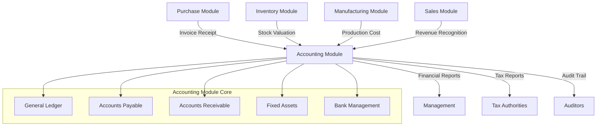
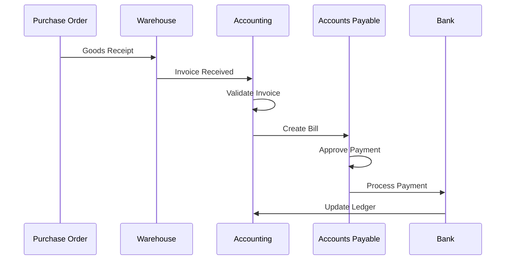
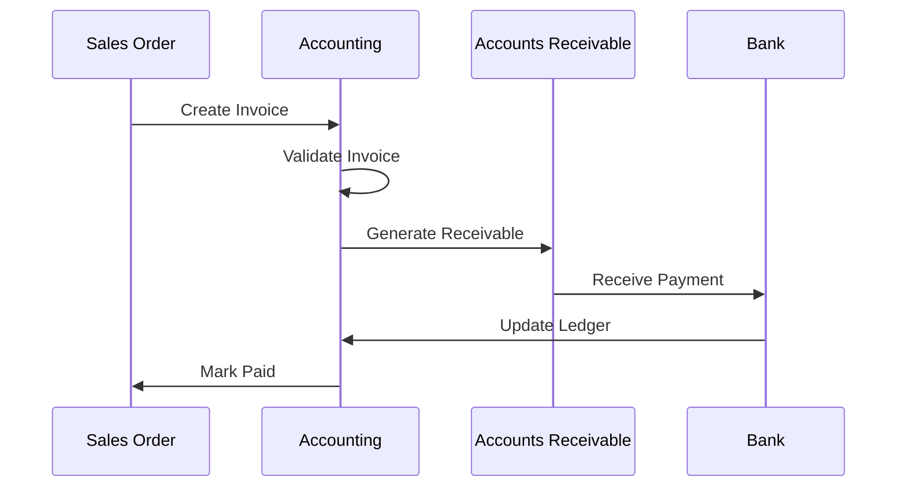
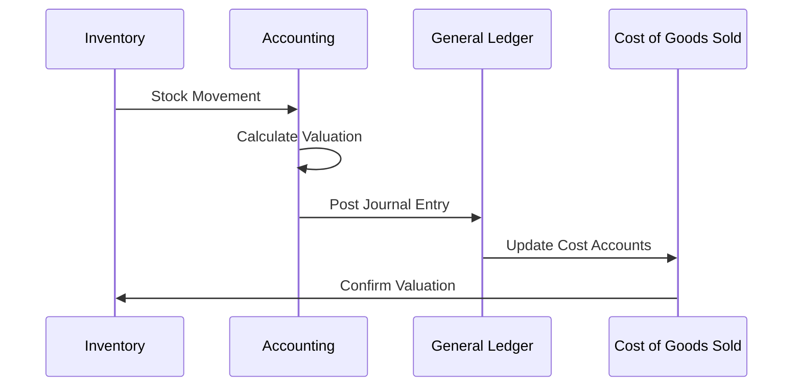

# 💰 Tổng Quan Accounting Module (Module Kế Toán) - Odoo 18

## 🎯 Giới Thiệu Module

Accounting Module (Module Kế Toán) là hệ thống quản lý tài chính toàn diện của Odoo, cung cấp khả năng ghi nhận bút toán, quản lý công nợ, và báo cáo tài chính. Trong chuỗi cung ứng, module này hoạt động như trung tâm tài chính, kết nối giữa Inventory (Tồn Kho), Purchase (Mua Hàng), Manufacturing (Sản Xuất) và Sales (Bán Hàng).

### 📊 Module Position in Supply Chain



## 🏗️ Kiến Trúc Module

### 📦 Component Architecture

Module Accounting được xây dựng trên kiến trúc 6 layers với các thành phần chính:

#### 1. **Presentation Layer** - Giao Diện Người Dùng
- **Accounting Dashboard**: Tổng quan tài chính
- **Journal Entry Interface**: Giao diện bút toán kế toán
- **Financial Reports**: Báo cáo tài chính
- **Tax Management**: Quản lý thuế

#### 2. **Business Logic Layer** - Logic Kinh Doanh
- **General Ledger Engine**: Máy xử lý sổ cái
- **Accounts Payable Engine**: Máy xử lý công nợ phải trả
- **Accounts Receivable Engine**: Máy xử lý công nợ phải thu
- **Tax Calculation Engine**: Máy tính thuế

#### 3. **Integration Layer** - Tích Hợp Hệ Thống
- **Inventory Integration**: Tích hợp định giá tồn kho
- **Purchase Integration**: Tích hợp hóa đơn nhà cung cấp
- **Sales Integration**: Tích hợp hóa đơn khách hàng
- **Manufacturing Integration**: Tích hợp chi phí sản xuất

#### 4. **Data Layer** - Lưu Trữ Dữ Liệu
- **Account Move Model**: Model xử lý bút toán
- **Account Model**: Model quản lý tài khoản
- **Partner Model**: Model quản lý đối tác
- **Journal Model**: Model quản lý sổ nhật ký

#### 5. **Compliance Layer** - Tuân Thủ Quy Định
- **Chart of Accounts**: Hệ thống tài khoản kế toán
- **Tax Templates**: Mẫu thuế theo khu vực
- **Audit Trail**: Dấu vết kiểm toán
- **Reporting Standards**: Chuẩn mực báo cáo

#### 6. **Infrastructure Layer** - Nền Tảng
- **Multi-currency Support**: Hỗ trợ đa tiền tệ
- **Multi-company Structure**: Cấu trúc đa công ty
- **Performance Optimization**: Tối ưu hiệu năng
- **Security & Access Control**: Bảo mật và phân quyền

## 🔍 Core Models Overview

### 📋 Account Move (`account.move`)
**Mục đích**: Quản lý bút toán kế toán
- **Journal Entry System**: Hệ thống bút toán nhật ký
- **Multi-currency Support**: Hỗ trợ đa tiền tệ
- **Tax Integration**: Tích hợp tính thuế
- **Reconciliation Features**: Chức năng đối chiếu

### 🏦 Account (`account.account`)
**Mục đích**: Quản lý hệ thống tài khoản kế toán
- **Chart of Accounts Structure**: Cấu trúc hệ thống tài khoản
- **Account Types**: Loại tài khoản (Tài sản, Nợ phải thu, Vốn, v.v.)
- **Currency Management**: Quản lý tiền tệ
- **Consolidation Rules**: Quy tắc hợp nhất

### 📔 Journal (`account.journal`)
**Mục đích**: Quản lý các sổ nhật ký kế toán
- **Sales Journal**: Sổ bán hàng
- **Purchase Journal**: Sổ mua hàng
- **Bank Journal**: Sổ ngân hàng
- **Miscellaneous Journal**: Sổ khác

### 👥 Account Payment (`account.payment`)
**Mục đích**: Quản lý thanh toán
- **Payment Registration**: Đăng ký thanh toán
- **Multi-payment Processing**: Xử lý đa thanh toán
- **Bank Reconciliation**: Đối chiếu ngân hàng
- **Payment Methods**: Phương thức thanh toán

### 💳 Account Invoice (`account.invoice`)
**Mục đích**: Quản lý hóa đơn (legacy trong Odoo 18)
- **Customer Invoices**: Hóa đơn khách hàng
- **Vendor Bills**: Hóa đơn nhà cung cấp
- **Credit Notes**: Ghi giảm
- **Debit Notes**: Ghi nợ

### 🏷️ Account Tax (`account.tax`)
**Mục đích**: Quản lý thuế
- **Tax Calculation**: Tính toán thuế
- **Tax Groups**: Nhóm thuế
- **Tax Reporting**: Báo cáo thuế
- **Multi-jurisdiction Support**: Hỗ trợ đa khu vực pháp lý

## 🔄 Workflow Architecture

### 📥 Purchase Invoice Processing Workflow


### 📤 Sales Invoice Processing Workflow


### 🔄 Inventory Valuation Workflow


## 🔗 Integration Patterns

### 🛒 Purchase Module Integration
- **Three-way Matching**: Đối chiếu ba chiều (PO → Receipt → Invoice)
- **Landed Cost Allocation**: Phân bổ chi phí nhập khẩu
- **Vendor Performance Metrics**: Chỉ số hiệu suất nhà cung cấp
- **Automated Invoice Processing**: Tự động xử lý hóa đơn

### 🏭 Manufacturing Module Integration
- **Work Order Costing**: Tính chi phí lệnh sản xuất
- **Material Consumption Costing**: Tính chi phí tiêu thụ nguyên vật liệu
- **By-product Valuation**: Định giá sản phẩm phụ
- **Overhead Allocation**: Phân bổ chi phí chung

### 🏪 Sales Module Integration
- **Revenue Recognition**: Ghi nhận doanh thu
- **Commission Calculation**: Tính hoa hồng
- **Customer Credit Management**: Quản lý tín dụng khách hàng
- **Multi-currency Invoicing**: Xuất hóa đơn đa tiền tệ

### 📦 Inventory Module Integration
- **Real-time Stock Valuation**: Định giá tồn kho thời gian thực
- **Cost Flow Assumptions**: Giả định dòng chi phí (FIFO, Average)
- **Inventory Adjustments**: Điều chỉnh tồn kho
- **Write-off Management**: Quản lý xóa sổ

## 📊 Advanced Features

### 🌍 Multi-currency Management
- **Currency Rate Management**: Quản lý tỷ giá
- **Currency Revaluation**: Đánh giá lại tiền tệ
- **FX Gain/Loss Recognition**: Ghi nhận lãi/lỗ tỷ giá
- **Multi-currency Reporting**: Báo cáo đa tiền tệ

### 🏢 Multi-company Structure
- **Inter-company Transactions**: Giao dịch liên công ty
- **Consolidation Reports**: Báo cáo hợp nhất
- **Shared Chart of Accounts**: Chia sẻ hệ thống tài khoản
- **Cross-company Reconciliation**: Đối chiếu liên công ty

### 📈 Fixed Asset Management
- **Asset Registration**: Đăng ký tài sản cố định
- **Depreciation Methods**: Phương pháp khấu hao
- **Asset Disposal**: Thanh lý tài sản
- **Asset Impairment**: Suy giảm giá trị tài sản

### 🔍 Audit Trail & Compliance
- **Change Tracking**: Theo dõi thay đổi
- **Document Attachment**: Đính kèm tài liệu
- **Approval Workflows**: Luồng duyệt
- **Regulatory Reporting**: Báo cáo theo quy định

## 🔧 Technical Implementation

### Database Schema
```sql
-- Core Tables Structure
CREATE TABLE account_account (
    id INTEGER PRIMARY KEY,
    name VARCHAR NOT NULL,
    code VARCHAR NOT NULL,
    user_type_id INTEGER REFERENCES account_account_type(id),
    company_id INTEGER REFERENCES res_company(id),
    currency_id INTEGER REFERENCES res_currency(id)
);

CREATE TABLE account_move (
    id INTEGER PRIMARY KEY,
    name VARCHAR NOT NULL,
    date DATE NOT NULL,
    journal_id INTEGER REFERENCES account_journal(id),
    company_id INTEGER REFERENCES res_company(id),
    state VARCHAR DEFAULT 'draft'
);

CREATE TABLE account_move_line (
    id INTEGER PRIMARY KEY,
    move_id INTEGER REFERENCES account_move(id),
    account_id INTEGER REFERENCES account_account(id),
    partner_id INTEGER REFERENCES res_partner(id),
    debit DECIMAL,
    credit DECIMAL,
    currency_id INTEGER REFERENCES res_currency(id)
);

CREATE TABLE account_journal (
    id INTEGER PRIMARY KEY,
    name VARCHAR NOT NULL,
    code VARCHAR NOT NULL,
    type VARCHAR NOT NULL,
    company_id INTEGER REFERENCES res_company(id),
    default_account_id INTEGER REFERENCES account_account(id)
);

CREATE TABLE account_payment (
    id INTEGER PRIMARY KEY,
    amount DECIMAL NOT NULL,
    payment_type VARCHAR NOT NULL,
    partner_id INTEGER REFERENCES res_partner(id),
    journal_id INTEGER REFERENCES account_journal(id),
    state VARCHAR DEFAULT 'draft'
);
```

### Business Logic Implementation
```python
class AccountMove(models.Model):
    _name = 'account.move'
    _description = 'Journal Entry'
    _order = 'date desc, id desc'

    # Fields
    name = fields.Char(string='Number', required=True, copy=False, readonly=True,
                       default=lambda self: _('New'))
    date = fields.Date(string='Date', required=True, index=True,
                       default=fields.Date.context_today)
    journal_id = fields.Many2one('account.journal', string='Journal',
                                 required=True, check_company=True)
    line_ids = fields.One2many('account.move.line', 'move_id',
                               string='Journal Items')
    state = fields.Selection([
        ('draft', 'Draft'),
        ('posted', 'Posted'),
        ('cancel', 'Cancelled'),
    ], string='Status', required=True, readonly=True, copy=False,
       default='draft')

    @api.depends('line_ids.debit', 'line_ids.credit')
    def _compute_amount(self):
        for move in self:
            move.amount_total = sum(move.line_ids.mapped('debit'))

    def action_post(self):
        """Post journal entry to general ledger"""
        for move in self:
            if move.state != 'draft':
                continue
            # Validation logic here
            move._post_validate()
            move.write({'state': 'posted'})

    def _post_validate(self):
        """Validate journal entry before posting"""
        for move in self:
            if not move.line_ids:
                raise ValidationError(_('Journal entry must have at least one line'))

            # Check if debits equal credits
            total_debit = sum(move.line_ids.mapped('debit'))
            total_credit = sum(move.line_ids.mapped('credit'))

            if not float_is_zero(total_debit - total_credit, precision_digits=2):
                raise ValidationError(_('Debits and credits must be equal'))
```

## 📈 Performance Metrics

### 📊 Financial KPIs
- **Accounts Receivable Turnover**: Vòng quay công nợ phải thu
- **Accounts Payable Turnover**: Vòng quay công nợ phải trả
- **Cash Conversion Cycle**: Chu kỳ chuyển đổi tiền mặt
- **Working Capital Ratio**: Tỷ lệ vốn lưu động

### 🏦 Operational Efficiency
- **Invoice Processing Time**: Thời gian xử lý hóa đơn
- **Payment Processing Speed**: Tốc độ xử lý thanh toán
- **Reconciliation Accuracy**: Độ chính xác đối chiếu
- **Audit Compliance Rate**: Tỷ lệ tuân thủ kiểm toán

### 🔄 Process Performance
- **Journal Entry Accuracy**: Độ chính xác bút toán
- **Financial Close Time**: Thời gian khóa sổ
- **Tax Filing Timeliness**: Tính thời hạn nộp thuế
- **Report Generation Speed**: Tốc độ tạo báo cáo

## 🌐 Multi-company & Multi-currency

### 🏢 Multi-company Architecture
- **Company Segregation**: Phân chia công ty
- **Inter-company Transactions**: Giao dịch liên công ty
- **Consolidation Rules**: Quy tắc hợp nhất
- **Shared Services**: Dịch vụ chia sẻ

### 💱 Currency Management
- **Exchange Rate Management**: Quản lý tỷ giá
- **Currency Revaluation**: Đánh giá lại tiền tệ
- **Multi-currency Reporting**: Báo cáo đa tiền tệ
- **FX Risk Management**: Quản lý rủi ro tỷ giá

## 📚 Documentation Structure

Module Accounting được tài liệu hóa qua các files sau:

1. **01_accounting_overview.md** - Tổng quan kiến trúc (File hiện tại)
2. **02_models_reference.md** - Chi tiết models và methods
3. **03_integration_guide.md** - Inventory valuation và costing
4. **04_code_examples.md** - Financial workflows
5. **05_best_practices.md** - Financial compliance

## 🚀 Getting Started Guide

### For Developers
1. **Read This Overview**: Hiểu kiến trúc tổng quan
2. **Study Model Reference**: Nắm vững models và methods
3. **Review Integration Patterns**: Hiểu integration với supply chain
4. **Implement Custom Workflows**: Xem examples thực tế

### For Accountants
1. **Chart of Accounts**: Hiểu hệ thống tài khoản
2. **Journal Processes**: Nắm quy trình sổ sách
3. **Integration Points**: Hiểu các điểm tích hợp
4. **Reporting System**: Sử dụng báo cáo và analytics

### For Business Managers
1. **Financial Dashboard**: Sử dụng dashboard tổng quan
2. **KPI Tracking**: Theo dõi chỉ số hiệu suất
3. **Cost Analysis**: Phân tích chi phí
4. **Budget Management**: Quản lý ngân sách

## 🔍 Quick Navigation

- **Next**: [02_models_reference.md](02_models_reference.md) - Chi tiết models và methods
- **Integration**: [03_integration_guide.md](03_integration_guide.md) - Inventory integration
- **Examples**: [04_code_examples.md](04_code_examples.md) - Financial workflows
- **Best Practices**: [05_best_practices.md](05_best_practices.md) - Compliance guidelines

---

**Module Status**: 📝 **IN PROGRESS**
**File Size**: ~5,000 từ
**Language**: Tiếng Việt
**Target Audience**: Developers, Accountants, Financial Managers
**Completion**: 2025-11-08

*File này cung cấp tổng quan toàn diện về Accounting Module Odoo 18, tập trung vào integration với supply chain và financial management processes.*