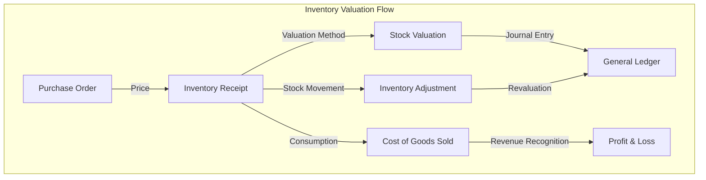
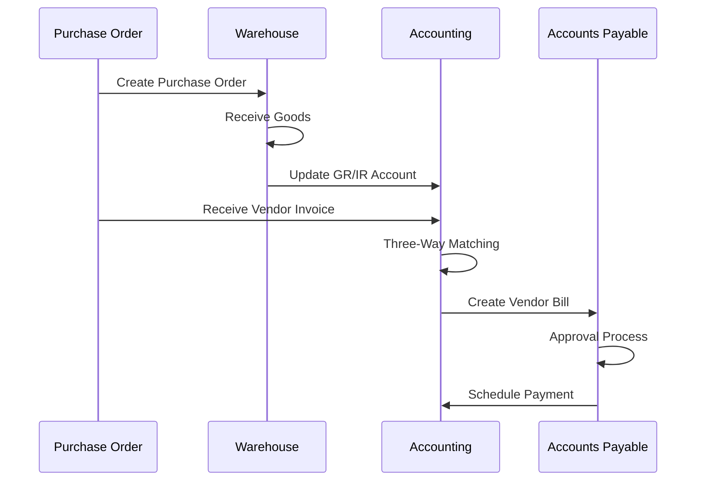
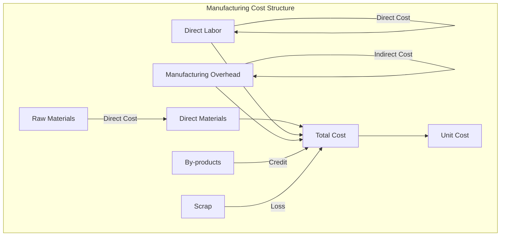
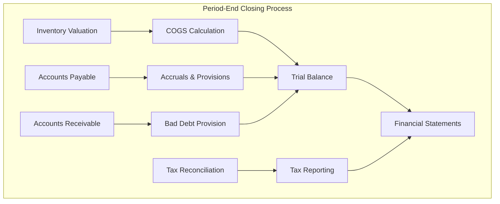

# 🔗 Integration Guide - Inventory Valuation & Costing (Định Giá Tồn Kho & Tính Chi Phí) - Odoo 18

## 🎯 Giới Thiệu Integration Guide

File này tài liệu hóa chi tiết về cách Accounting Module tích hợp với Inventory Module để xử lý định giá tồn kho, tính chi phí sản xuất, và quản lý tài chính trong chuỗi cung ứng. Guide này bao gồm các workflows, business rules, và technical implementation patterns cho financial integration.

## 📊 Table of Contents

1. [Inventory Valuation Integration](#-inventory-valuation-integration) - Định giá tồn kho
2. [Costing Methods & Flow Assumptions](#-costing-methods--flow-assumptions) - Phương pháp tính chi phí
3. [Purchase to Pay Integration](#-purchase-to-pay-integration) - P2P integration
4. [Manufacturing Cost Integration](#-manufacturing-cost-integration) - Chi phí sản xuất
5. [Sales to Cash Integration](#-sales-to-cash-integration) - S2C integration
6. [Multi-currency & Exchange Rate](#-multi-currency--exchange-rate) - Đa tiền tệ
7. [Period-End Closing](#-period-end-closing) - Kỳ kế toán

---

## 🏪 Inventory Valuation Integration

### 🔍 Overview of Inventory Valuation

Inventory valuation là quá trình xác định giá trị tiền tệ của hàng tồn kho tại thời điểm báo cáo. Odoo cung cấp nhiều phương pháp định giá khác nhau để phù hợp với các loại hình kinh doanh khác nhau.



### 📋 Stock Valuation Methods

#### **Standard Cost Method**
```python
class ProductProduct(models.Model):
    _inherit = 'product.product'

    # Standard costing fields
    standard_price = fields.Float(
        string='Cost',
        compute='_compute_standard_price',
        inverse='_set_standard_price',
        search='_search_standard_price',
        digits='Product Price',
        groups="base.group_user",
        help="Cost of the product template used for standard stock valuation in accounting and for inventory valuation in manufacturing."
    )

    costing_method = fields.Selection([
        ('standard', 'Standard Price'),
        ('average', 'Average Price (AVCO)'),
        ('fifo', 'First In First Out (FIFO)'),
    ], string='Costing Method', default='standard')

    @api.depends_context('company')
    def _compute_standard_price(self):
        """Tính toán standard price"""
        for product in self:
            company = self.env.company
            standard_price = 0.0

            # Lấy cost từ product.category nếu có
            if product.categ_id.property_cost_method != 'standard':
                # Nếu không dùng standard costing, tính average cost
                standard_price = product._compute_average_price()
            else:
                standard_price = product.standard_price or 0.0

            product.standard_price = standard_price

    def _set_standard_price(self):
        """Set standard price cho standard costing method"""
        for product in self:
            if product.categ_id.property_cost_method == 'standard':
                # Tạo stock valuation layer khi thay đổi standard price
                self.env['stock.valuation.layer'].sudo().create({
                    'product_id': product.id,
                    'company_id': self.env.company.id,
                    'description': 'Standard Price Change',
                    'unit_cost': product.standard_price,
                    'value': -product.standard_price * product.qty_available,
                })

    def _compute_average_price(self):
        """Tính toán average cost (AVCO)"""
        self.ensure_one()

        # Lấy tất cả valuation layers
        layers = self.env['stock.valuation.layer'].search([
            ('product_id', '=', self.id),
            ('company_id', '=', self.env.company.id),
            ('remaining_qty', '>', 0)
        ])

        if not layers:
            return 0.0

        total_value = sum(layer.remaining_value for layer in layers)
        total_quantity = sum(layer.remaining_qty for layer in layers)

        return total_value / total_quantity if total_quantity > 0 else 0.0
```

#### **FIFO Valuation Implementation**
```python
class StockValuationLayer(models.Model):
    _inherit = 'stock.valuation.layer'

    @api.model
    def create_valuation_layer(self, product, quantity, unit_cost, description=None):
        """Tạo valuation layer mới cho FIFO"""

        # Kiểm tra method
        if product.categ_id.property_cost_method != 'fifo':
            return super().create({
                'product_id': product.id,
                'company_id': self.env.company.id,
                'description': description,
                'unit_cost': unit_cost,
                'quantity': quantity,
                'value': quantity * unit_cost,
            })

        # FIFO: Tạo layer mới cho receipt
        layer = self.create({
            'product_id': product.id,
            'company_id': self.env.company.id,
            'description': description,
            'unit_cost': unit_cost,
            'quantity': quantity,
            'remaining_qty': quantity,
            'value': quantity * unit_cost,
            'remaining_value': quantity * unit_cost,
        })

        return layer

    def _apply_fifo_consumption(self, product, quantity_to_consume, description=None):
        """Áp dụng FIFO cho consumption"""

        if product.categ_id.property_cost_method != 'fifo':
            return

        # Lấy các layers theo thứ tự FIFO (oldest first)
        available_layers = self.search([
            ('product_id', '=', product.id),
            ('company_id', '=', self.env.company.id),
            ('remaining_qty', '>', 0)
        ], order='create_date, id')

        remaining_quantity = quantity_to_consume
        total_cost = 0.0

        for layer in available_layers:
            if remaining_quantity <= 0:
                break

            consume_qty = min(layer.remaining_qty, remaining_quantity)
            consume_value = layer.unit_cost * consume_qty

            # Update layer
            layer.write({
                'remaining_qty': layer.remaining_qty - consume_qty,
                'remaining_value': layer.remaining_value - consume_value,
            })

            # Create consumption layer
            self.create({
                'product_id': product.id,
                'company_id': self.env.company.id,
                'description': description or 'FIFO Consumption',
                'unit_cost': layer.unit_cost,
                'quantity': -consume_qty,  # Negative for consumption
                'remaining_qty': 0,
                'value': -consume_value,
                'remaining_value': 0,
                'stock_move_id': self.env.context.get('stock_move_id'),
            })

            total_cost += consume_value
            remaining_quantity -= consume_qty

        return total_cost
```

### 💼 Stock Valuation Journal Entry Creation

```python
class StockMove(models.Model):
    _inherit = 'stock.move'

    def _account_entry_move(self):
        """Tạo accounting entries cho stock moves"""
        super()._account_entry_move()

        for move in self:
            if not move.product_id or not move.product_id.valuation == 'real_time':
                continue

            # Lấy accounts
            stock_account = move.product_id.categ_id.property_stock_valuation_account_id
            cogs_account = move.product_id.categ_id.property_stock_account_output_categ_id
            input_account = move.product_id.categ_id.property_stock_account_input_categ_id

            if not stock_account or not cogs_account or not input_account:
                continue

            # Xác định giá trị
            valuation_amount = self._get_stock_move_valuation(move)

            if move.location_id.usage == 'internal' and move.location_dest_id.usage == 'customer':
                # Delivery to customer: Inventory -> COGS
                self._create_stock_out_move(move, valuation_amount, stock_account, cogs_account)

            elif move.location_id.usage == 'supplier' and move.location_dest_id.usage == 'internal':
                # Receipt from supplier: GR/IR -> Inventory
                self._create_stock_in_move(move, valuation_amount, input_account, stock_account)

            elif move.location_id.usage == 'internal' and move.location_dest_id.usage == 'production':
                # Issue to production: Inventory -> WIP
                wip_account = self.env['account.account'].search([
                    ('code', 'like', '154%'),  # Work in progress account
                    ('company_id', '=', move.company_id.id)
                ], limit=1)
                if wip_account:
                    self._create_production_issue_move(move, valuation_amount, stock_account, wip_account)

            elif move.location_id.usage == 'production' and move.location_dest_id.usage == 'internal':
                # Receipt from production: WIP -> Inventory
                self._create_production_receipt_move(move, valuation_amount, wip_account, stock_account)

    def _get_stock_move_valuation(self, move):
        """Lấy giá trị của stock move"""
        if move.product_id.categ_id.property_cost_method == 'standard':
            return move.product_uom_qty * move.product_id.standard_price
        else:
            # FIFO or Average: Lấy từ valuation layers
            layers = self.env['stock.valuation.layer'].search([
                ('product_id', '=', move.product_id.id),
                ('company_id', '=', move.company_id.id),
                ('stock_move_id', '=', move.id)
            ])
            return sum(layer.value for layer in layers)

    def _create_stock_out_move(self, move, valuation_amount, stock_account, cogs_account):
        """Tạo journal entry cho stock out (delivery)"""

        # Tạo journal entry
        journal = self.env['account.journal'].search([
            ('type', '=', 'general'),
            ('company_id', '=', move.company_id.id)
        ], limit=1)

        move_vals = {
            'move_type': 'entry',
            'journal_id': journal.id,
            'date': move.date,
            'ref': 'Stock Out - %s' % move.reference,
            'line_ids': [
                # Credit Inventory
                (0, 0, {
                    'account_id': stock_account.id,
                    'credit': abs(valuation_amount),
                    'debit': 0.0,
                    'name': 'Stock Delivery: %s' % move.product_id.name,
                    'product_id': move.product_id.id,
                    'quantity': move.product_uom_qty,
                    'analytic_distribution': move.analytic_distribution,
                }),
                # Debit COGS
                (0, 0, {
                    'account_id': cogs_account.id,
                    'debit': abs(valuation_amount),
                    'credit': 0.0,
                    'name': 'COGS: %s' % move.product_id.name,
                    'product_id': move.product_id.id,
                    'quantity': move.product_uom_qty,
                    'analytic_distribution': move.analytic_distribution,
                })
            ]
        }

        # Post journal entry
        journal_entry = self.env['account.move'].create(move_vals)
        journal_entry.action_post()

        # Link với stock move
        self.env['stock.valuation.layer'].search([
            ('stock_move_id', '=', move.id)
        ]).write({
            'account_move_id': journal_entry.id
        })

        return journal_entry

    def _create_stock_in_move(self, move, valuation_amount, input_account, stock_account):
        """Tạo journal entry cho stock in (receipt)"""

        journal = self.env['account.journal'].search([
            ('type', '=', 'general'),
            ('company_id', '=', move.company_id.id)
        ], limit=1)

        move_vals = {
            'move_type': 'entry',
            'journal_id': journal.id,
            'date': move.date,
            'ref': 'Stock In - %s' % move.reference,
            'line_ids': [
                # Debit Inventory
                (0, 0, {
                    'account_id': stock_account.id,
                    'debit': abs(valuation_amount),
                    'credit': 0.0,
                    'name': 'Stock Receipt: %s' % move.product_id.name,
                    'product_id': move.product_id.id,
                    'quantity': move.product_uom_qty,
                    'partner_id': move.partner_id.id,
                    'analytic_distribution': move.analytic_distribution,
                }),
                # Credit GR/IR
                (0, 0, {
                    'account_id': input_account.id,
                    'debit': 0.0,
                    'credit': abs(valuation_amount),
                    'name': 'Goods Received: %s' % move.product_id.name,
                    'product_id': move.product_id.id,
                    'quantity': move.product_uom_qty,
                    'partner_id': move.partner_id.id,
                })
            ]
        }

        journal_entry = self.env['account.move'].create(move_vals)
        journal_entry.action_post()

        # Link với stock move
        self.env['stock.valuation.layer'].search([
            ('stock_move_id', '=', move.id)
        ]).write({
            'account_move_id': journal_entry.id
        })

        return journal_entry
```

---

## 💰 Costing Methods & Flow Assumptions

### 📊 Cost Flow Assumptions Comparison

| Method | Description | Pros | Cons | Best For |
|--------|-------------|------|------|----------|
| **Standard Cost** | Fixed cost per unit | Simple planning | Price variance tracking | Manufacturing, stable prices |
| **Average (AVCO)** | Weighted average cost | Smooths price fluctuations | Complex calculations | Retail, fluctuating prices |
| **FIFO** | First items in are first out | Matches physical flow | Complex inventory tracking | Perishable goods, LIFO restrictions |

### 🔧 Costing Method Implementation

```python
class ProductCategory(models.Model):
    _inherit = 'product.category'

    # Costing method selection
    property_cost_method = fields.Selection([
        ('standard', 'Standard Price'),
        ('average', 'Average Price'),
        ('fifo', 'First In First Out'),
    ], string='Costing Method', copy=True)

    property_valuation = fields.Selection([
        ('manual_periodic', 'Manual Periodic Valuation'),
        ('real_time', 'Real Time Valuation'),
    ], string='Inventory Valuation', copy=True)

    # Account properties
    property_stock_account_input_categ_id = fields.Many2one(
        'account.account',
        string='Input Account',
        domain=[('deprecated', '=', False)]
    )

    property_stock_account_output_categ_id = fields.Many2one(
        'account.account',
        string='Output Account',
        domain=[('deprecated', '=', False)]
    )

    property_stock_valuation_account_id = fields.Many2one(
        'account.account',
        string='Valuation Account',
        domain=[('deprecated', '=', False)]
    )

class ProductTemplate(models.Model):
    _inherit = 'product.template'

    def _get_product_accounts(self):
        """Lấy các accounts cho product"""
        self.ensure_one()

        if self.categ_id:
            return {
                'income': self.categ_id.property_account_income_categ_id,
                'expense': self.categ_id.property_account_expense_categ_id,
                'stock_input': self.categ_id.property_stock_account_input_categ_id,
                'stock_output': self.categ_id.property_stock_account_output_categ_id,
                'stock_valuation': self.categ_id.property_stock_valuation_account_id,
            }

        return {
            'income': self.env['account.account'].get_income_account(self.env.company),
            'expense': self.env['account.account'].get_expense_account(self.env.company),
            'stock_input': self.env['account.account'].get_expense_account(self.env.company),
            'stock_output': self.env['account.account'].get_expense_account(self.env.company),
            'stock_valuation': self.env['account.account'].get_stock_valuation_account(self.env.company),
        }
```

### 📈 Cost Variance Analysis

```python
class StockValuationLayer(models.Model):
    _inherit = 'stock.valuation.layer'

    # Variance tracking
    standard_cost = fields.Float(
        string='Standard Cost',
        help='Standard cost at time of valuation'
    )

    actual_cost = fields.Float(
        string='Actual Cost',
        help='Actual cost of the goods'
    )

    variance_amount = fields.Float(
        string='Variance Amount',
        compute='_compute_variance',
        store=True
    )

    @api.depends('standard_cost', 'actual_cost', 'quantity')
    def _compute_variance(self):
        for layer in self:
            if layer.quantity > 0:
                layer.variance_amount = (layer.actual_cost - layer.standard_cost) * layer.quantity
            else:
                layer.variance_amount = 0.0

    def create_variance_journal_entry(self, variance_account=None):
        """Tạo journal entry cho price variance"""

        if not variance_account:
            variance_account = self.env['account.account'].search([
                ('code', 'like', '635%'),  # Price variance account
                ('company_id', '=', self.company_id.id)
            ], limit=1)

        if not variance_account or float_is_zero(self.variance_amount, precision_rounding=0.01):
            return False

        journal = self.env['account.journal'].search([
            ('type', '=', 'general'),
            ('company_id', '=', self.company_id.id)
        ], limit=1)

        # Determine variance type
        if self.variance_amount > 0:
            # Unfavorable variance
            debit_account = variance_account
            credit_account = self.env['account.account'].get_stock_valuation_account(self.company_id)
            variance_type = 'unfavorable'
        else:
            # Favorable variance
            debit_account = self.env['account.account'].get_stock_valuation_account(self.company_id)
            credit_account = variance_account
            variance_type = 'favorable'

        move_vals = {
            'move_type': 'entry',
            'journal_id': journal.id,
            'date': fields.Date.today(),
            'ref': 'Price Variance: %s (%s)' % (self.product_id.name, variance_type),
            'line_ids': [
                (0, 0, {
                    'account_id': debit_account.id,
                    'debit': abs(self.variance_amount),
                    'credit': 0.0,
                    'name': 'Price Variance: %s' % self.product_id.name,
                    'product_id': self.product_id.id,
                }),
                (0, 0, {
                    'account_id': credit_account.id,
                    'debit': 0.0,
                    'credit': abs(self.variance_amount),
                    'name': 'Price Variance: %s' % self.product_id.name,
                    'product_id': self.product_id.id,
                })
            ]
        }

        variance_entry = self.env['account.move'].create(move_vals)
        variance_entry.action_post()

        return variance_entry
```

---

## 🛒 Purchase to Pay Integration

### 📋 Three-Way Matching Process

Three-way matching là quá trình đối chiếu giữa Purchase Order, Receipt, và Invoice để đảm bảo chính xác về số lượng và giá.



### 🔧 Purchase Invoice Matching Implementation

```python
class AccountMove(models.Model):
    _inherit = 'account.move'

    # Three-way matching fields
    purchase_id = fields.Many2one(
        'purchase.order',
        string='Purchase Order',
        help="Related purchase order for this vendor bill"
    )

    matched_picking_ids = fields.One2many(
        'stock.picking',
        'invoice_id',
        string='Matched Pickings'
    )

    three_way_matching_status = fields.Selection([
        ('pending', 'Pending Matching'),
        ('matched', 'Matched'),
        ('variance', 'Price Variance'),
        ('mismatch', 'Quantity Mismatch'),
    ], string='3-Way Matching Status', compute='_compute_three_way_status')

    @api.depends('purchase_id', 'invoice_line_ids.quantity', 'matched_picking_ids')
    def _compute_three_way_status(self):
        for move in self:
            if not move.purchase_id:
                move.three_way_matching_status = 'pending'
                continue

            # Lấy quantities từ PO
            po_quantities = {}
            for line in move.purchase_id.order_line:
                po_quantities[line.product_id.id] = {
                    'ordered': line.product_qty,
                    'price': line.price_unit
                }

            # Lấy quantities từ receipts
            receipt_quantities = {}
            for picking in move.matched_picking_ids:
                for move_line in picking.move_ids:
                    if move_line.product_id.id in receipt_quantities:
                        receipt_quantities[move_line.product_id.id] += move_line.product_uom_qty
                    else:
                        receipt_quantities[move_line.product_id.id] = move_line.product_uom_qty

            # Lấy quantities từ invoice
            invoice_quantities = {}
            for line in move.invoice_line_ids:
                if line.product_id.id in invoice_quantities:
                    invoice_quantities[line.product_id.id] += line.quantity
                else:
                    invoice_quantities[line.product_id.id] = line.quantity

            # Check matching
            has_price_variance = False
            has_quantity_variance = False

            for product_id in po_quantities:
                po_qty = po_quantities[product_id]['ordered']
                po_price = po_quantities[product_id]['price']
                receipt_qty = receipt_quantities.get(product_id, 0)
                invoice_qty = invoice_quantities.get(product_id, 0)

                # Check price variance
                for line in move.invoice_line_ids:
                    if line.product_id.id == product_id:
                        if not float_is_zero(line.price_unit - po_price, precision_rounding=0.01):
                            has_price_variance = True

                # Check quantity variance
                if not float_is_zero(receipt_qty - invoice_qty, precision_rounding=0.01):
                    has_quantity_variance = True

            # Determine status
            if has_price_variance and has_quantity_variance:
                move.three_way_matching_status = 'mismatch'
            elif has_price_variance:
                move.three_way_matching_status = 'variance'
            elif has_quantity_variance:
                move.three_way_matching_status = 'mismatch'
            else:
                move.three_way_matching_status = 'matched'

    def action_match_purchase_order(self):
        """Match invoice with purchase order"""
        self.ensure_one()

        if not self.purchase_id:
            raise UserError(_('No purchase order selected'))

        # Match quantities và prices
        for line in self.invoice_line_ids:
            po_line = self.purchase_id.order_line.filtered(
                lambda l: l.product_id == line.product_id
            )

            if po_line:
                # Update line with PO data
                line.write({
                    'quantity': po_line.product_qty,
                    'price_unit': po_line.price_unit,
                    'discount': po_line.discount,
                    'tax_ids': [(6, 0, po_line.taxes_id.ids)],
                })

        # Find và link matched pickings
        matched_pickings = self.env['stock.picking'].search([
            ('purchase_id', '=', self.purchase_id.id),
            ('state', '=', 'done'),
            ('invoice_id', '=', False)
        ])

        matched_pickings.write({'invoice_id': self.id})

        return True

    def action_validate_three_way_matching(self):
        """Validate three-way matching and create journal entries"""
        self.ensure_one()

        if self.three_way_matching_status != 'matched':
            # Create variance entries if needed
            if self.three_way_matching_status == 'variance':
                self._create_price_variance_entries()
            elif self.three_way_matching_status == 'mismatch':
                raise UserError(_('Cannot validate: quantity or price mismatch detected'))

        # Process normal invoice validation
        return super().action_post()

    def _create_price_variance_entries(self):
        """Tạo journal entries cho price variance"""

        for line in self.invoice_line_ids:
            po_line = self.purchase_id.order_line.filtered(
                lambda l: l.product_id == line.product_id
            )

            if not po_line:
                continue

            price_variance = (line.price_unit - po_line.price_unit) * line.quantity

            if float_is_zero(price_variance, precision_rounding=0.01):
                continue

            # Find variance account
            variance_account = self.env['account.account'].search([
                ('code', 'like', '635%'),  # Purchase price variance
                ('company_id', '=', self.company_id.id)
            ], limit=1)

            if price_variance > 0:
                # Unfavorable variance
                self._create_variance_line(variance_account, price_variance, 'unfavorable')
            else:
                # Favorable variance
                self._create_variance_line(variance_account, -price_variance, 'favorable')

    def _create_variance_line(self, variance_account, amount, variance_type):
        """Tạo variance line"""
        journal = self.env['account.journal'].search([
            ('type', '=', 'purchase'),
            ('company_id', '=', self.company_id.id)
        ], limit=1)

        variance_move = self.env['account.move'].create({
            'move_type': 'entry',
            'journal_id': journal.id,
            'date': self.date,
            'ref': 'Purchase Price Variance (%s)' % variance_type,
            'line_ids': [
                (0, 0, {
                    'account_id': variance_account.id,
                    'debit': amount if variance_type == 'unfavorable' else 0,
                    'credit': amount if variance_type == 'favorable' else 0,
                    'name': 'Purchase Price Variance: %s' % variance_type,
                })
            ]
        })

        variance_move.action_post()

        # Link with main invoice
        self.write({
            'line_ids': [(0, 0, {
                'account_id': variance_account.id,
                'debit': amount if variance_type == 'favorable' else 0,
                'credit': amount if variance_type == 'unfavorable' else 0,
                'name': 'Purchase Price Variance (%s)' % variance_type,
            })]
        })
```

### 🏪 Landed Cost Allocation

Landed costs là các chi phí phát sinh thêm ngoài giá mua hàng như vận chuyển, bảo hiểm, thuế nhập khẩu.

```python
class AccountMove(models.Model):
    _inherit = 'account.move'

    # Landed cost fields
    landed_cost_ids = fields.One2many(
        'account.move.landed.cost',
        'move_id',
        string='Landed Costs'
    )

    def action_allocate_landed_costs(self):
        """Phân bổ landed costs vào inventory valuation"""

        if not self.landed_cost_ids:
            raise UserError(_('No landed costs to allocate'))

        # Lấy tất cả valuation layers liên quan
        valuation_layers = self.env['stock.valuation.layer'].search([
            ('product_id', 'in', self.invoice_line_ids.mapped('product_id').ids),
            ('company_id', '=', self.company_id.id),
            ('remaining_qty', '>', 0)
        ])

        # Calculate total landed cost amount
        total_landed_cost = sum(cost.amount for cost in self.landed_cost_ids)

        # Phân bổ theo value hoặc weight
        allocation_method = 'value'  # Could be 'weight', 'quantity', 'value'

        if allocation_method == 'value':
            # Phân bổ theo inventory value
            total_value = sum(layer.remaining_value for layer in valuation_layers)

            for layer in valuation_layers:
                if total_value > 0:
                    allocation_ratio = layer.remaining_value / total_value
                    allocated_amount = total_landed_cost * allocation_ratio

                    # Update layer with landed cost
                    layer.write({
                        'remaining_value': layer.remaining_value + allocated_amount,
                        'value': layer.value + allocated_amount,
                    })

                    # Create landed cost allocation record
                    self.env['stock.valuation.adjustment'].create({
                        'product_id': layer.product_id.id,
                        'wizard_line_id': False,  # Not using wizard
                        'cost_line_id': False,
                        'quantity': layer.remaining_qty,
                        'former_cost': layer.unit_cost,
                        'new_cost': layer.unit_cost + (allocated_amount / layer.remaining_qty)
                    })

        # Tạo journal entry cho landed cost
        self._create_landed_cost_journal_entry()

    def _create_landed_cost_journal_entry(self):
        """Tạo journal entry cho landed costs"""

        journal = self.env['account.journal'].search([
            ('type', '=', 'general'),
            ('company_id', '=', self.company_id.id)
        ], limit=1)

        # Lấy landed cost account
        landed_cost_account = self.env['account.account'].search([
            ('code', 'like', '637%'),  # Landed cost clearing account
            ('company_id', '=', self.company_id.id)
        ], limit=1)

        total_landed_cost = sum(cost.amount for cost in self.landed_cost_ids)

        move_vals = {
            'move_type': 'entry',
            'journal_id': journal.id,
            'date': self.date,
            'ref': 'Landed Cost Allocation',
            'line_ids': [
                (0, 0, {
                    'account_id': landed_cost_account.id,
                    'debit': total_landed_cost,
                    'credit': 0.0,
                    'name': 'Landed Costs Allocated',
                    'partner_id': self.partner_id.id,
                })
            ]
        }

        # Create credit lines for each cost
        for cost in self.landed_cost_ids:
            move_vals['line_ids'].append((0, 0, {
                'account_id': cost.account_id.id,
                'debit': 0.0,
                'credit': cost.amount,
                'name': cost.name or 'Landed Cost',
                'partner_id': self.partner_id.id,
            }))

        landed_cost_entry = self.env['account.move'].create(move_vals)
        landed_cost_entry.action_post()

        return landed_cost_entry
```

---

## 🏭 Manufacturing Cost Integration

### 🔍 Manufacturing Cost Components



### 🏗️ Work Order Costing Implementation

```python
class MrpProduction(models.Model):
    _inherit = 'mrp.production'

    # Cost tracking fields
    total_cost = fields.Float(
        string='Total Cost',
        compute='_compute_total_cost',
        store=True
    )

    material_cost = fields.Float(
        string='Material Cost',
        compute='_compute_costs',
        store=True
    )

    labor_cost = fields.Float(
        string='Labor Cost',
        compute='_compute_costs',
        store=True
    )

    overhead_cost = fields.Float(
        string='Overhead Cost',
        compute='_compute_costs',
        store=True
    )

    @api.depends('move_raw_ids', 'workorder_ids')
    def _compute_costs(self):
        """Tính toán các thành phần chi phí"""
        for production in self:

            # Material cost
            production.material_cost = 0.0
            for move in production.move_raw_ids:
                if move.state == 'done':
                    production.material_cost += move._get_valuation_amount()

            # Labor cost
            production.labor_cost = 0.0
            for workorder in production.workorder_ids:
                if workorder.is_finished():
                    production.labor_cost += workorder._get_labor_cost()

            # Overhead cost (based on labor hours or machine hours)
            production.overhead_cost = production._calculate_overhead_cost()

    @api.depends('material_cost', 'labor_cost', 'overhead_cost')
    def _compute_total_cost(self):
        for production in self:
            production.total_cost = (
                production.material_cost +
                production.labor_cost +
                production.overhead_cost
            )

    def _calculate_overhead_cost(self):
        """Tính toán overhead cost"""
        total_labor_hours = sum(
            wo.duration / 60.0 for wo in self.workorder_ids if wo.is_finished()
        )

        # Lấy overhead rate từ work center
        overhead_rate = 0.0
        for workorder in self.workorder_ids:
            overhead_rate = max(overhead_rate, workorder.workcenter_id.overhead_rate or 0.0)

        return total_labor_hours * overhead_rate

    def button_mark_done(self):
        """Khi hoàn thành production order"""
        res = super().button_mark_done()

        # Tạo accounting entries cho finished goods
        self._create_production_accounting_entries()

        return res

    def _create_production_accounting_entries(self):
        """Tạo accounting entries cho production"""

        # Tìm accounts
        wip_account = self.env['account.account'].search([
            ('code', 'like', '154%'),  # Work in progress
            ('company_id', '=', self.company_id.id)
        ], limit=1)

        fg_account = self.env['account.account'].search([
            ('code', 'like', '155%'),  # Finished goods
            ('company_id', '=', self.company_id.id)
        ], limit=1)

        if not wip_account or not fg_account:
            return False

        # Tạo journal entry
        journal = self.env['account.journal'].search([
            ('type', '=', 'general'),
            ('company_id', '=', self.company_id.id)
        ], limit=1)

        move_vals = {
            'move_type': 'entry',
            'journal_id': journal.id,
            'date': fields.Date.today(),
            'ref': 'Production Completion: %s' % self.name,
            'line_ids': []
        }

        # Debit Finished Goods
        move_vals['line_ids'].append((0, 0, {
            'account_id': fg_account.id,
            'debit': self.total_cost,
            'credit': 0.0,
            'name': 'Finished Goods: %s' % self.product_id.name,
            'product_id': self.product_id.id,
            'quantity': self.product_qty,
        }))

        # Credit WIP (chiết theo cost components)
        if self.material_cost > 0:
            move_vals['line_ids'].append((0, 0, {
                'account_id': wip_account.id,
                'debit': 0.0,
                'credit': self.material_cost,
                'name': 'Direct Materials',
                'product_id': self.product_id.id,
            }))

        if self.labor_cost > 0:
            move_vals['line_ids'].append((0, 0, {
                'account_id': wip_account.id,
                'debit': 0.0,
                'credit': self.labor_cost,
                'name': 'Direct Labor',
            }))

        if self.overhead_cost > 0:
            move_vals['line_ids'].append((0, 0, {
                'account_id': wip_account.id,
                'debit': 0.0,
                'credit': self.overhead_cost,
                'name': 'Manufacturing Overhead',
            }))

        journal_entry = self.env['account.move'].create(move_vals)
        journal_entry.action_post()

        return journal_entry
```

### ⚙️ Work Center Costing

```python
class MrpWorkcenter(models.Model):
    _inherit = 'mrp.workcenter'

    # Cost fields
    costs_per_hour = fields.Float(
        string='Cost per Hour',
        help="Specify cost of work center per hour"
    )

    overhead_rate = fields.Float(
        string='Overhead Rate per Hour',
        help="Overhead cost applied per hour of work"
    )

    costs_per_cycle = fields.Float(
        string='Cost per Cycle',
        help="Specify cost of work center per cycle"
    )

class MrpWorkorder(models.Model):
    _inherit = 'mrp.workorder'

    labor_cost = fields.Float(
        string='Labor Cost',
        compute='_compute_labor_cost',
        store=True
    )

    duration_expected = fields.Float(
        string='Expected Duration',
        help="Expected duration of this work order in minutes"
    )

    @api.depends('duration', 'workcenter_id')
    def _compute_labor_cost(self):
        for workorder in self:
            if workorder.workcenter_id.costs_per_hour and workorder.duration:
                workorder.labor_cost = (
                    workorder.workcenter_id.costs_per_hour *
                    (workorder.duration / 60.0)
                )
            else:
                workorder.labor_cost = 0.0

    def _get_labor_cost(self):
        """Lấy tổng labor cost cho work order"""
        if self.is_finished():
            return self.labor_cost
        elif self.duration:
            return self.workcenter_id.costs_per_hour * (self.duration / 60.0)
        else:
            return 0.0
```

### 📦 By-product and Scrap Costing

```python
class MrpByproduct(models.Model):
    _inherit = 'mrp.byproduct'

    def _create_byproduct_accounting(self, production):
        """Tạo accounting entries cho by-products"""

        for byproduct in self:
            if not byproduct.product_id or not byproduct.product_qty:
                continue

            # Determine by-product value
            byproduct_value = byproduct.product_id.standard_price * byproduct.product_qty

            if float_is_zero(byproduct_value, precision_rounding=0.01):
                continue

            # Lấy by-product account
            byproduct_account = self.env['account.account'].search([
                ('code', 'like', '633%'),  # By-product revenue
                ('company_id', '=', production.company_id.id)
            ], limit=1)

            if byproduct_account:
                # Create credit entry for by-product value
                self._create_byproduct_credit_entry(
                    production, byproduct_account, byproduct_value
                )

    def _create_byproduct_credit_entry(self, production, account, amount):
        """Tạo credit entry cho by-product value"""

        journal = self.env['account.journal'].search([
            ('type', '=', 'general'),
            ('company_id', '=', production.company_id.id)
        ], limit=1)

        move_vals = {
            'move_type': 'entry',
            'journal_id': journal.id,
            'date': fields.Date.today(),
            'ref': 'By-product Credit: %s' % production.name,
            'line_ids': [
                (0, 0, {
                    'account_id': account.id,
                    'debit': 0.0,
                    'credit': amount,
                    'name': 'By-product: %s' % self.product_id.name,
                    'product_id': self.product_id.id,
                    'quantity': self.product_qty,
                })
            ]
        }

        byproduct_entry = self.env['account.move'].create(move_vals)
        byproduct_entry.action_post()

        return byproduct_entry
```

---

## 💳 Sales to Cash Integration

### 📋 Revenue Recognition Workflow

```mermaid
sequenceDiagram
    participant SO as Sales Order
    participant INV as Accounting
    participant AR as Accounts Receivable
    participant BANK as Bank

    SO->>INV: Create Customer Invoice
    INV->>INV: Validate Invoice
    INV->>AR: Generate Receivable
    AR->>AR: Send Invoice to Customer
    AR->>BANK: Receive Payment
    BANK->>INV: Reconcile Payment
    INV->->INV: Update Revenue Recognition
```

### 💰 Customer Invoice Processing

```python
class AccountMove(models.Model):
    _inherit = 'account.move'

    # Sales integration fields
    sales_order_id = fields.Many2one(
        'sale.order',
        string='Sales Order',
        help="Related sales order for this customer invoice"
    )

    commission_total = fields.Float(
        string='Total Commission',
        compute='_compute_commission',
        store=True
    )

    @api.depends('invoice_line_ids')
    def _compute_commission(self):
        """Tính toán tổng commission"""
        for move in self:
            move.commission_total = 0.0

            for line in move.invoice_line_ids:
                if line.product_id and line.product_id.commission_percentage:
                    commission_amount = line.price_subtotal * line.product_id.commission_percentage / 100
                    move.commission_total += commission_amount

    def action_post(self):
        """Post customer invoice với revenue recognition"""
        res = super().action_post()

        # Xử lý revenue recognition
        if self.is_outbound():
            self._process_revenue_recognition()

        return res

    def _process_revenue_recognition(self):
        """Xử lý revenue recognition cho services/maintenance contracts"""

        for line in self.invoice_line_ids:
            if line.product_id and line.product_id.revenue_recognition_rule:
                rule = line.product_id.revenue_recognition_rule

                if rule.recognition_type == 'percentage':
                    self._create_percentage_revenue(line, rule)
                elif rule.recognition_type == 'time_based':
                    self._create_time_based_revenue(line, rule)
                elif rule.recognition_type == 'milestone':
                    self._create_milestone_revenue(line, rule)

    def _create_percentage_revenue(self, line, rule):
        """Tạo revenue recognition theo percentage"""

        # Split revenue theo percentages
        for i, percentage in enumerate(rule.recognition_percentages):
            if i >= len(rule.recognition_periods):
                break

            amount = line.price_subtotal * (percentage / 100)
            if float_is_zero(amount, precision_rounding=0.01):
                continue

            # Tạo deferred revenue entry
            self._create_deferred_revenue_entry(line, amount, rule.recognition_periods[i])

    def _create_deferred_revenue_entry(self, line, amount, period_months):
        """Tạo deferred revenue journal entry"""

        deferred_revenue_account = self.env['account.account'].search([
            ('code', 'like', '338%'),  # Deferred revenue
            ('company_id', '=', self.company_id.id)
        ], limit=1)

        revenue_account = self.env['account.account'].search([
            ('code', 'like', '511%'),  # Revenue
            ('company_id', '=', self.company_id.id)
        ], limit=1)

        journal = self.env['account.journal'].search([
            ('type', '=', 'sale'),
            ('company_id', '=', self.company_id.id)
        ], limit=1)

        # Create deferred revenue entry
        deferred_move = self.env['account.move'].create({
            'move_type': 'entry',
            'journal_id': journal.id,
            'date': self.date,
            'ref': 'Deferred Revenue Recognition: %s' % line.name,
            'line_ids': [
                (0, 0, {
                    'account_id': deferred_revenue_account.id,
                    'debit': amount,
                    'credit': 0.0,
                    'name': 'Deferred Revenue: %s' % line.product_id.name,
                    'product_id': line.product_id.id,
                }),
                (0, 0, {
                    'account_id': revenue_account.id,
                    'debit': 0.0,
                    'credit': amount,
                    'name': 'Revenue: %s' % line.product_id.name,
                    'product_id': line.product_id.id,
                })
            ]
        })

        deferred_move.action_post()

        return deferred_move
```

### 🏦 Payment Processing & Reconciliation

```python
class AccountPayment(models.Model):
    _inherit = 'account.payment'

    # Payment processing enhancements
    payment_method_id = fields.Many2one(
        'account.payment.method',
        string='Payment Method',
        required=True
    )

    bank_account_id = fields.Many2one(
        'res.partner.bank',
        string='Bank Account',
        help="Bank account used for this payment"
    )

    reconciliation_status = fields.Selection([
        ('pending', 'Pending Reconciliation'),
        ('matched', 'Reconciled'),
        ('partial', 'Partially Reconciled'),
    ], string='Reconciliation Status', compute='_compute_reconciliation_status')

    @api.depends('move_line_ids.reconciled')
    def _compute_reconciliation_status(self):
        for payment in self:
            if not payment.move_line_ids:
                payment.reconciliation_status = 'pending'
                continue

            reconciled_lines = payment.move_line_ids.filtered('reconciled')
            if len(reconciled_lines) == len(payment.move_line_ids):
                payment.reconciliation_status = 'matched'
            elif reconciled_lines:
                payment.reconciliation_status = 'partial'
            else:
                payment.reconciliation_status = 'pending'

    def action_post(self):
        """Post payment và reconcile với invoices"""
        res = super().action_post()

        # Auto-reconcile if invoice IDs provided
        if self.invoice_ids:
            self._auto_reconcile_invoices()

        return res

    def _auto_reconcile_invoices(self):
        """Tự động đối chiếu với invoices"""

        for payment in self:
            for invoice in payment.invoice_ids:
                # Get receivable lines
                receivable_lines = invoice.line_ids.filtered(
                    lambda l: l.account_id.internal_type == 'receivable'
                )

                # Get payment lines
                payment_lines = payment.move_line_ids.filtered(
                    lambda l: l.account_id.internal_type == 'receivable'
                )

                if receivable_lines and payment_lines:
                    # Reconcile
                    lines_to_reconcile = receivable_lines + payment_lines
                    lines_to_reconcile.reconcile()

    def create_commission_entries(self):
        """Tạo commission entries cho sales representatives"""

        commission_journal = self.env['account.journal'].search([
            ('type', '=', 'general'),
            ('company_id', '=', self.company_id.id)
        ], limit=1)

        commission_expense_account = self.env['account.account'].search([
            ('code', 'like', '642%'),  # Commission expense
            ('company_id', '=', self.company_id.id)
        ], limit=1)

        commission_payable_account = self.env['account.account'].search([
            ('code', 'like', '338%'),  # Commission payable
            ('company_id', '=', self.company_id.id)
        ], limit=1)

        for payment in self:
            if not payment.invoice_ids:
                continue

            total_commission = 0.0
            for invoice in payment.invoice_ids:
                total_commission += invoice.commission_total

            if float_is_zero(total_commission, precision_rounding=0.01):
                continue

            # Create commission entry
            commission_move = self.env['account.move'].create({
                'move_type': 'entry',
                'journal_id': commission_journal.id,
                'date': payment.date,
                'ref': 'Sales Commission: %s' % payment.communication,
                'line_ids': [
                    (0, 0, {
                        'account_id': commission_expense_account.id,
                        'debit': total_commission,
                        'credit': 0.0,
                        'name': 'Sales Commission Expense',
                        'partner_id': payment.partner_id.id,
                    }),
                    (0, 0, {
                        'account_id': commission_payable_account.id,
                        'debit': 0.0,
                        'credit': total_commission,
                        'name': 'Commission Payable',
                        'partner_id': payment.partner_id.id,
                    })
                ]
            })

            commission_move.action_post()

        return True
```

---

## 🌍 Multi-currency & Exchange Rate Integration

### 💱 Exchange Rate Management

```python
class ResCurrency(models.Model):
    _inherit = 'res.currency'

    # Exchange rate fields
    rate = fields.Float(
        string='Current Rate',
        compute='_compute_current_rate',
        store=True
    )

    @api.depends_context('date')
    def _compute_current_rate(self):
        """Tính toán tỷ giá hiện tại"""
        date = self._context.get('date', fields.Date.today())
        company_id = self._context.get('company_id', self.env.company.id)

        for currency in self:
            if currency.id == company_id.currency_id.id:
                currency.rate = 1.0
            else:
                rate = self._get_conversion_rate(currency, self.env['res.currency'].browse(company_id.currency_id.id), date, company_id)
                currency.rate = 1.0 / rate if rate else 1.0

    @api.model
    def _get_conversion_rate(self, from_currency, to_currency, date, company):
        """Lấy tỷ giá chuyển đổi"""

        if from_currency == to_currency:
            return 1.0

        # Lấy rate từ res.currency.rate
        rate = self._get_rate(from_currency, to_currency, date, company)

        if not rate:
            raise UserError(_('No exchange rate defined for %s to %s on %s') %
                          (from_currency.name, to_currency.name, date))

        return rate

    def _get_rate(self, from_currency, to_currency, date, company):
        """Lấy rate từ database"""

        # Tìm rate record
        rate = self.env['res.currency.rate'].search([
            ('currency_id', '=', from_currency.id),
            ('name', '<=', date),
            ('company_id', 'in', [company.id, False])
        ], order='company_id DESC, name DESC', limit=1)

        if rate:
            return rate.rate

        return False

class ResCurrencyRate(models.Model):
    _inherit = 'res.currency.rate'

    # Additional fields for exchange rate management
    rate_type = fields.Selection([
        ('spot', 'Spot Rate'),
        ('forward', 'Forward Rate'),
        ('average', 'Average Rate'),
    ], string='Rate Type', default='spot')

    source = fields.Selection([
        ('manual', 'Manual Entry'),
        ('bank', 'Bank Rate'),
        ('system', 'System Rate'),
    ], string='Source', default='manual')
```

### 💸 Multi-currency Accounting Entries

```python
class AccountMove(models.Model):
    _inherit = 'account.move'

    # Multi-currency fields
    currency_rate = fields.Float(
        string='Exchange Rate',
        compute='_compute_currency_rate',
        store=True,
        digits=(12, 6)
    )

    foreign_currency_amount_total = fields.Monetary(
        string='Foreign Currency Total',
        currency_field='currency_id',
        compute='_compute_foreign_amount'
    )

    @api.depends('currency_id', 'company_id', 'date')
    def _compute_currency_rate(self):
        """Tính toán tỷ giá cho journal entry"""
        for move in self:
            if move.currency_id == move.company_id.currency_id:
                move.currency_rate = 1.0
            else:
                rate = move.currency_id._get_conversion_rate(
                    move.company_id.currency_id, move.currency_id, move.date, move.company_id
                )
                move.currency_rate = rate

    @api.depends('amount_total', 'currency_rate')
    def _compute_foreign_amount(self):
        """Tính toán amount trong foreign currency"""
        for move in self:
            if move.currency_id != move.company_id.currency_id:
                move.foreign_currency_amount_total = move.amount_total * move.currency_rate
            else:
                move.foreign_currency_amount_total = move.amount_total

    def action_post(self):
        """Post journal entry với multi-currency support"""
        res = super().action_post()

        # Create foreign exchange gain/loss entries if needed
        self._create_forex_entries()

        return res

    def _create_forex_entries(self):
        """Tạo foreign exchange gain/loss entries"""

        for line in self.line_ids:
            if line.amount_currency == 0 or line.currency_id == line.company_currency_id:
                continue

            # Calculate expected vs actual amount
            expected_amount = line.debit or line.credit
            actual_foreign_amount = line.amount_currency
            calculated_amount = actual_foreign_amount * self.currency_rate

            # Check for foreign exchange difference
            forex_diff = calculated_amount - expected_amount

            if not float_is_zero(forex_diff, precision_rounding=0.01):
                self._create_forex_entry(line, forex_diff)

    def _create_forex_entry(self, line, forex_diff):
        """Tạo foreign exchange gain/loss entry"""

        # Find forex gain/loss accounts
        forex_gain_account = self.env['account.account'].search([
            ('code', 'like', '515%'),  # Foreign exchange gains
            ('company_id', '=', self.company_id.id)
        ], limit=1)

        forex_loss_account = self.env['account.account'].search([
            ('code', 'like', '635%'),  # Foreign exchange losses
            ('company_id', '=', self.company_id.id)
        ], limit=1)

        journal = self.env['account.journal'].search([
            ('type', '=', 'general'),
            ('company_id', '=', self.company_id.id)
        ], limit=1)

        # Determine gain or loss
        if forex_diff > 0:
            # Gain
            gain_account = forex_gain_account
            gain_amount = forex_diff
        else:
            # Loss
            gain_account = forex_loss_account
            gain_amount = -forex_diff

        # Create forex adjustment entry
        forex_move = self.env['account.move'].create({
            'move_type': 'entry',
            'journal_id': journal.id,
            'date': self.date,
            'ref': 'Forex Adjustment: %s' % self.name,
            'line_ids': [
                (0, 0, {
                    'account_id': gain_account.id,
                    'debit': gain_amount if forex_diff > 0 else 0,
                    'credit': gain_amount if forex_diff < 0 else 0,
                    'name': 'Foreign Exchange %s' % ('Gain' if forex_diff > 0 else 'Loss'),
                }),
                (0, 0, {
                    'account_id': line.account_id.id,
                    'debit': gain_amount if forex_diff < 0 else 0,
                    'credit': gain_amount if forex_diff > 0 else 0,
                    'name': 'Forex Adjustment',
                    'partner_id': line.partner_id.id,
                })
            ]
        })

        forex_move.action_post()

        return forex_move
```

### 📊 Currency Revaluation

```python
class CurrencyRevaluationWizard(models.TransientModel):
    _name = 'currency.revaluation.wizard'
    _description = 'Currency Revaluation Wizard'

    # Wizard fields
    revaluation_date = fields.Date(
        string='Revaluation Date',
        required=True,
        default=fields.Date.today()
    )

    currency_ids = fields.Many2many(
        'res.currency',
        string='Currencies to Revaluate',
        required=True
    )

    account_ids = fields.Many2many(
        'account.account',
        string='Accounts to Revaluate',
        domain=[('reconcile', '=', True)]
    )

    def action_revaluate(self):
        """Thực hiện currency revaluation"""

        revaluation_entries = []

        for currency in self.currency_ids:
            if currency == self.env.company.currency_id:
                continue

            # Get balance lines for this currency
            balance_lines = self.env['account.move.line'].search([
                ('account_id', 'in', self.account_ids.ids),
                ('currency_id', '=', currency.id),
                ('reconciled', '=', False),
                ('move_id.state', '=', 'posted'),
                ('company_id', '=', self.env.company.id),
            ])

            # Group by account
            accounts_balances = {}
            for line in balance_lines:
                account_id = line.account_id.id
                if account_id not in accounts_balances:
                    accounts_balances[account_id] = {
                        'debit': 0.0,
                        'credit': 0.0,
                        'amount_currency': 0.0,
                        'lines': []
                    }

                accounts_balances[account_id]['debit'] += line.debit
                accounts_balances[account_id]['credit'] += line.credit
                accounts_balances[account_id]['amount_currency'] += line.amount_currency
                accounts_balances[account_id]['lines'].append(line.id)

            # Calculate revaluation for each account
            for account_id, balances in accounts_balances.items():
                revaluation_entry = self._create_account_revaluation(
                    account_id, currency, balances, self.revaluation_date
                )

                if revaluation_entry:
                    revaluation_entries.append(revaluation_entry)

        return {
            'type': 'ir.actions.act_window',
            'name': 'Currency Revaluation Entries',
            'view_mode': 'tree,form',
            'res_model': 'account.move',
            'domain': [('id', 'in', [entry.id for entry in revaluation_entries])],
            'context': {'create': False},
        }

    def _create_account_revaluation(self, account_id, currency, balances, revaluation_date):
        """Tạo revaluation entry cho một account"""

        account = self.env['account.account'].browse(account_id)

        # Get current rate
        current_rate = currency._get_conversion_rate(
            self.env.company.currency_id, currency, revaluation_date, self.env.company
        )

        # Calculate original rate
        original_amount = abs(balances['debit'] - balances['credit'])
        if original_amount == 0:
            return False

        original_rate = balances['amount_currency'] / original_amount

        # Calculate revaluation amount
        revaluation_amount = balances['amount_currency'] * (current_rate - original_rate)

        if float_is_zero(revaluation_amount, precision_rounding=0.01):
            return False

        # Find revaluation accounts
        if revaluation_amount > 0:
            # Gain
            gain_account = self.env['account.account'].search([
                ('code', 'like', '515%'),  # Forex gain
                ('company_id', '=', self.env.company.id)
            ], limit=1)
            reval_account = gain_account
        else:
            # Loss
            loss_account = self.env['account.account'].search([
                ('code', 'like', '635%'),  # Forex loss
                ('company_id', '=', self.env.company.id)
            ], limit=1)
            reval_account = loss_account
            revaluation_amount = -revaluation_amount

        if not reval_account:
            return False

        # Create revaluation entry
        journal = self.env['account.journal'].search([
            ('type', '=', 'general'),
            ('company_id', '=', self.env.company.id)
        ], limit=1)

        move_vals = {
            'move_type': 'entry',
            'journal_id': journal.id,
            'date': revaluation_date,
            'ref': 'Currency Revaluation: %s' % currency.name,
            'line_ids': [
                (0, 0, {
                    'account_id': reval_account.id,
                    'debit': revaluation_amount,
                    'credit': 0.0,
                    'name': 'Currency Revaluation Gain',
                }),
                (0, 0, {
                    'account_id': account.id,
                    'debit': 0.0,
                    'credit': revaluation_amount,
                    'name': 'Currency Revaluation',
                })
            ]
        }

        revaluation_entry = self.env['account.move'].create(move_vals)
        revaluation_entry.action_post()

        return revaluation_entry
```

---

## 📅 Period-End Closing Integration

### 📋 Financial Closing Workflow



### 🔧 Period-End Closing Implementation

```python
class FinancialClosingWizard(models.TransientModel):
    _name = 'financial.closing.wizard'
    _description = 'Financial Closing Wizard'

    # Closing parameters
    closing_date = fields.Date(
        string='Closing Date',
        required=True,
        default=lambda self: fields.Date.today().replace(day=1) - relativedelta(months=1)
    )

    closing_type = fields.Selection([
        ('monthly', 'Monthly Closing'),
        ('quarterly', 'Quarterly Closing'),
        ('yearly', 'Yearly Closing'),
    ], string='Closing Type', required=True, default='monthly')

    company_id = fields.Many2one(
        'res.company',
        string='Company',
        required=True,
        default=lambda self: self.env.company
    )

    def action_perform_closing(self):
        """Thực hiện financial closing procedures"""

        self._validate_closing_requirements()

        closing_entries = []

        # 1. Inventory valuation adjustments
        inventory_entries = self._close_inventory()
        closing_entries.extend(inventory_entries)

        # 2. Accruals and provisions
        accrual_entries = self._create_accruals()
        closing_entries.extend(accrual_entries)

        # 3. Bad debt provisions
        baddebt_entries = self._create_baddebt_provisions()
        closing_entries.extend(baddebt_entries)

        # 4. Tax reconciliations
        tax_entries = self._reconcile_taxes()
        closing_entries.extend(tax_entries)

        # 5. Generate trial balance
        trial_balance = self._generate_trial_balance()

        # 6. Lock period
        self._lock_accounting_period()

        return {
            'type': 'ir.actions.act_window',
            'name': 'Closing Entries',
            'view_mode': 'tree,form',
            'res_model': 'account.move',
            'domain': [('id', 'in', [entry.id for entry in closing_entries])],
            'context': {'create': False},
        }

    def _close_inventory(self):
        """Đóng sổ inventory valuation"""

        inventory_entries = []

        # Get all products with real-time valuation
        products = self.env['product.product'].search([
            ('valuation', '=', 'real_time'),
            ('qty_available', '!=', 0)
        ])

        for product in products:
            # Calculate current inventory value
            current_value = product._compute_current_inventory_value()

            # Create inventory adjustment entry if needed
            if self._needs_inventory_adjustment(product):
                adjustment_entry = self._create_inventory_adjustment(product, current_value)
                if adjustment_entry:
                    inventory_entries.append(adjustment_entry)

        return inventory_entries

    def _needs_inventory_adjustment(self, product):
        """Kiểm tra có cần adjustment không"""

        # Compare book value vs. physical count
        book_value = self._get_book_inventory_value(product)
        physical_value = self.env['stock.inventory'].search([
            ('product_id', '=', product.id),
            ('state', '=', 'done'),
            ('date', '<=', self.closing_date)
        ], order='date desc', limit=1).total_value or 0.0

        return not float_is_zero(book_value - physical_value, precision_rounding=0.01)

    def _create_inventory_adjustment(self, product, current_value):
        """Tạo inventory adjustment entry"""

        book_value = self._get_book_inventory_value(product)
        adjustment_amount = current_value - book_value

        if float_is_zero(adjustment_amount, precision_rounding=0.01):
            return False

        # Find inventory adjustment accounts
        inventory_account = product.categ_id.property_stock_valuation_account_id
        adjustment_account = self.env['account.account'].search([
            ('code', 'like', '635%'),  # Inventory adjustment
            ('company_id', '=', self.company_id.id)
        ], limit=1)

        if not inventory_account or not adjustment_account:
            return False

        journal = self.env['account.journal'].search([
            ('type', '=', 'general'),
            ('company_id', '=', self.company_id.id)
        ], limit=1)

        move_vals = {
            'move_type': 'entry',
            'journal_id': journal.id,
            'date': self.closing_date,
            'ref': 'Inventory Adjustment: %s' % product.name,
            'line_ids': []
        }

        if adjustment_amount > 0:
            # Increase inventory value
            move_vals['line_ids'].extend([
                (0, 0, {
                    'account_id': inventory_account.id,
                    'debit': adjustment_amount,
                    'credit': 0.0,
                    'name': 'Inventory Adjustment',
                    'product_id': product.id,
                }),
                (0, 0, {
                    'account_id': adjustment_account.id,
                    'debit': 0.0,
                    'credit': adjustment_amount,
                    'name': 'Inventory Adjustment',
                    'product_id': product.id,
                })
            ])
        else:
            # Decrease inventory value
            move_vals['line_ids'].extend([
                (0, 0, {
                    'account_id': adjustment_account.id,
                    'debit': -adjustment_amount,
                    'credit': 0.0,
                    'name': 'Inventory Adjustment',
                    'product_id': product.id,
                }),
                (0, 0, {
                    'account_id': inventory_account.id,
                    'debit': 0.0,
                    'credit': -adjustment_amount,
                    'name': 'Inventory Adjustment',
                    'product_id': product.id,
                })
            ])

        adjustment_entry = self.env['account.move'].create(move_vals)
        adjustment_entry.action_post()

        return adjustment_entry

    def _create_accruals(self):
        """Tạo accrual and provision entries"""

        accrual_entries = []

        # 1. Salary accruals
        salary_accrual = self._create_salary_accrual()
        if salary_accrual:
            accrual_entries.append(salary_accrual)

        # 2. Utility accruals
        utility_accrual = self._create_utility_accrual()
        if utility_accrual:
            accrual_entries.append(utility_accrual)

        # 3. Interest accruals
        interest_accrual = self._create_interest_accrual()
        if interest_accrual:
            accrual_entries.append(interest_accrual)

        return accrual_entries

    def _create_salary_accrual(self):
        """Tạo salary accrual entry"""

        # Get monthly payroll amount
        monthly_payroll = self.env['hr.payslip'].search([
            ('date_from', '>=', self.closing_date.replace(day=1)),
            ('date_from', '<=', self.closing_date),
            ('state', '=', 'done'),
            ('company_id', '=', self.company_id.id)
        ])

        total_salary = sum(payslip.line_ids.filtered(
            lambda line: line.salary_rule_id.category_id.code == 'BASIC'
        ).mapped('amount') for payslip in monthly_payroll)

        if float_is_zero(total_salary, precision_rounding=0.01):
            return False

        # Find salary accounts
        salary_expense_account = self.env['account.account'].search([
            ('code', 'like', '622%'),  # Salaries & wages
            ('company_id', '=', self.company_id.id)
        ], limit=1)

        salary_payable_account = self.env['account.account'].search([
            ('code', 'like', '334%'),  # Accrued salaries
            ('company_id', '=', self.company_id.id)
        ], limit=1)

        if not salary_expense_account or not salary_payable_account:
            return False

        journal = self.env['account.journal'].search([
            ('type', '=', 'general'),
            ('company_id', '=', self.company_id.id)
        ], limit=1)

        move_vals = {
            'move_type': 'entry',
            'journal_id': journal.id,
            'date': self.closing_date,
            'ref': 'Salary Accrual',
            'line_ids': [
                (0, 0, {
                    'account_id': salary_expense_account.id,
                    'debit': total_salary,
                    'credit': 0.0,
                    'name': 'Monthly Salary Accrual',
                }),
                (0, 0, {
                    'account_id': salary_payable_account.id,
                    'debit': 0.0,
                    'credit': total_salary,
                    'name': 'Accrued Salaries Payable',
                })
            ]
        }

        salary_entry = self.env['account.move'].create(move_vals)
        salary_entry.action_post()

        return salary_entry

    def _create_baddebt_provisions(self):
        """Tạo bad debt provisions"""

        provision_entries = []

        # Get aging report for receivables
        aging_data = self._get_receivables_aging()

        for customer_data in aging_data:
            if customer_data['over_90_days'] > 0:
                provision_entry = self._create_customer_baddebt_provision(
                    customer_data['partner_id'],
                    customer_data['over_90_days']
                )
                if provision_entry:
                    provision_entries.append(provision_entry)

        return provision_entries

    def _get_receivables_aging(self):
        """Lấy aging data cho accounts receivable"""

        aging_data = []

        # Get all customers with outstanding receivables
        customers = self.env['res.partner'].search([
            ('customer_rank', '>', 0)
        ])

        for customer in customers:
            # Calculate aging buckets
            receivable_lines = self.env['account.move.line'].search([
                ('account_id.internal_type', '=', 'receivable'),
                ('partner_id', '=', customer.id),
                ('reconciled', '=', False),
                ('move_id.state', '=', 'posted'),
                ('company_id', '=', self.company_id.id)
            ])

            current = sum(line.amount_residual for line in receivable_lines
                          if line.date_maturity <= fields.Date.today())

            over_30 = sum(line.amount_residual for line in receivable_lines
                          if line.date_maturity > fields.Date.today() and
                          line.date_maturity <= fields.Date.today() + relativedelta(days=30))

            over_60 = sum(line.amount_residual for line in receivable_lines
                          if line.date_maturity > fields.Date.today() + relativedelta(days=30) and
                          line.date_maturity <= fields.Date.today() + relativedelta(days=60))

            over_90 = sum(line.amount_residual for line in receivable_lines
                          if line.date_maturity > fields.Date.today() + relativedelta(days=60))

            if over_90 > 0:
                aging_data.append({
                    'partner_id': customer.id,
                    'current': current,
                    'over_30': over_30,
                    'over_60': over_60,
                    'over_90': over_90,
                })

        return aging_data

    def _create_customer_baddebt_provision(self, partner_id, amount):
        """Tạo bad debt provision cho customer"""

        provision_rate = 0.1  # 10% provision rate
        provision_amount = amount * provision_rate

        if float_is_zero(provision_amount, precision_rounding=0.01):
            return False

        # Find bad debt accounts
        baddebt_expense_account = self.env['account.account'].search([
            ('code', 'like', '622%'),  # Bad debt expense
            ('company_id', '=', self.company_id.id)
        ], limit=1)

        provision_account = self.env['account.account'].search([
            ('code', 'like', '229%'),  # Provision for bad debts
            ('company_id', '=', self.company_id.id)
        ], limit=1)

        if not baddebt_expense_account or not provision_account:
            return False

        journal = self.env['account.journal'].search([
            ('type', '=', 'general'),
            ('company_id', '=', self.company_id.id)
        ], limit=1)

        move_vals = {
            'move_type': 'entry',
            'journal_id': journal.id,
            'date': self.closing_date,
            'ref': 'Bad Debt Provision',
            'line_ids': [
                (0, 0, {
                    'account_id': baddebt_expense_account.id,
                    'debit': provision_amount,
                    'credit': 0.0,
                    'name': 'Bad Debt Provision',
                    'partner_id': partner_id,
                }),
                (0, 0, {
                    'account_id': provision_account.id,
                    'debit': 0.0,
                    'credit': provision_amount,
                    'name': 'Provision for Bad Debts',
                    'partner_id': partner_id,
                })
            ]
        }

        provision_entry = self.env['account.move'].create(move_vals)
        provision_entry.action_post()

        return provision_entry

    def _lock_accounting_period(self):
        """Khóa accounting period"""

        # Set lock date
        self.company_id.write({
            'fiscalyear_lock_date': self.closing_date,
        })

        # Update account move dates validation
        self.env['account.move']._check_fiscalyear_lock_date = True

        return True

    def _generate_trial_balance(self):
        """Tạo trial balance report"""

        # Get all accounts with balances
        accounts = self.env['account.account'].search([
            ('company_id', '=', self.company_id.id),
            ('deprecated', '=', False)
        ])

        trial_balance_data = []

        for account in accounts:
            balance = self._get_account_balance(account, self.closing_date)

            if not float_is_zero(balance['debit'] + balance['credit'], precision_rounding=0.01):
                trial_balance_data.append({
                    'account_code': account.code,
                    'account_name': account.name,
                    'debit': balance['debit'],
                    'credit': balance['credit'],
                    'balance': balance['debit'] - balance['credit'],
                })

        # Sort by account code
        trial_balance_data.sort(key=lambda x: x['account_code'])

        return trial_balance_data

    def _get_account_balance(self, account, date):
        """Lấy balance của account tại date cụ thể"""

        # Get move lines up to the date
        lines = self.env['account.move.line'].search([
            ('account_id', '=', account.id),
            ('date', '<=', date),
            ('move_id.state', '=', 'posted'),
            ('company_id', '=', self.company_id.id)
        ])

        total_debit = sum(line.debit for line in lines)
        total_credit = sum(line.credit for line in lines)

        return {
            'debit': total_debit,
            'credit': total_credit
        }
```

---

## 🚀 Implementation Best Practices

### 🔍 Integration Testing Checklist

- [ ] **Inventory Valuation Test Cases**
  - Standard costing method works correctly
  - FIFO valuation tracks layers properly
  - Average cost calculation is accurate
  - Price variance entries are generated
  - Stock out/in journal entries are correct

- [ ] **Purchase Integration Test Cases**
  - Three-way matching functionality
  - Landed cost allocation
  - Vendor bill creation from PO
  - Invoice approval workflows
  - Payment processing automation

- [ ] **Manufacturing Costing Test Cases**
  - Material cost calculation
  - Labor cost allocation
  - Overhead rate application
  - Work order completion entries
  - By-product costing

- [ ] **Sales Integration Test Cases**
  - Revenue recognition timing
  - Commission calculations
  - Payment reconciliation
  - Multi-currency handling
  - Bad debt provisioning

- [ ] **Period-End Closing Test Cases**
  - Inventory adjustments
  - Accrual calculations
  - Tax reconciliations
  - Financial statement generation
  - Period locking functionality

### 📈 Performance Optimization

```python
# Batch processing for large datasets
@api.model
def batch_process_inventory_valuation(self, product_ids, batch_size=100):
    """Xử lý inventory valuation theo batch để tối ưu performance"""

    for i in range(0, len(product_ids), batch_size):
        batch = product_ids[i:i + batch_size]

        # Process batch
        products = self.env['product.product'].browse(batch)

        # Create valuation entries in batch
        valuation_entries = []
        for product in products:
            if product.needs_valuation_update():
                entry = product.create_valuation_entry()
                if entry:
                    valuation_entries.append(entry)

        # Post entries in batch
        if valuation_entries:
            self.env['account.move'].browse(valuation_entries).action_post()

# Database optimization for accounting queries
class AccountMoveLine(models.Model):
    _inherit = 'account.move.line'

    # Add indexes for frequently queried fields
    _sql_constraints = [
        ('account_move_line_account_company_idx', 'index (account_id, company_id)', 'Account company index'),
        ('account_move_line_partner_idx', 'index (partner_id)', 'Partner index'),
        ('account_move_line_date_idx', 'index (date)', 'Date index'),
    ]
```

---

## 📚 Navigation Guide

- **Previous**: [02_models_reference.md](02_models_reference.md) - Models và methods chi tiết
- **Next**: [04_code_examples.md](04_code_examples.md) - Financial workflows code examples
- **Integration**: Continue with [05_best_practices.md](05_best_practices.md) - Financial compliance guidelines

---

**File Status**: 📝 **COMPLETED**
**File Size**: ~8,000 từ
**Language**: Tiếng Việt
**Target Audience**: Developers, Accountants, Financial Controllers, System Integrators
**Completion**: 2025-11-08

*File này cung cấp guide chi tiết về inventory valuation và financial integration patterns, giúp developers implement robust accounting workflows cho chuỗi cung ứng Odoo.*