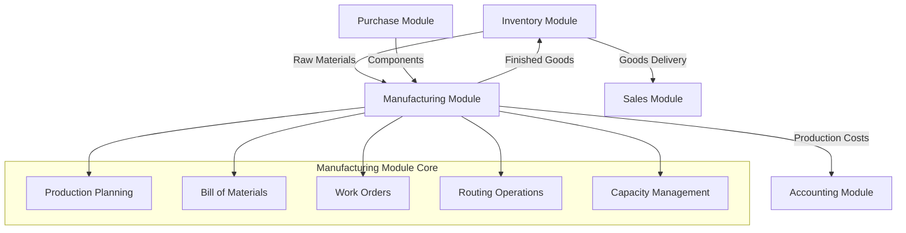
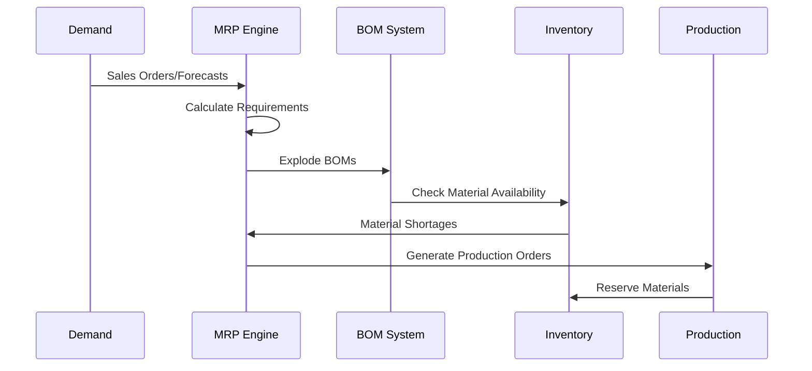
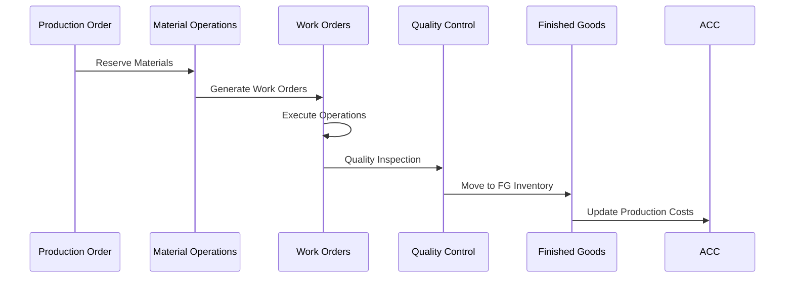
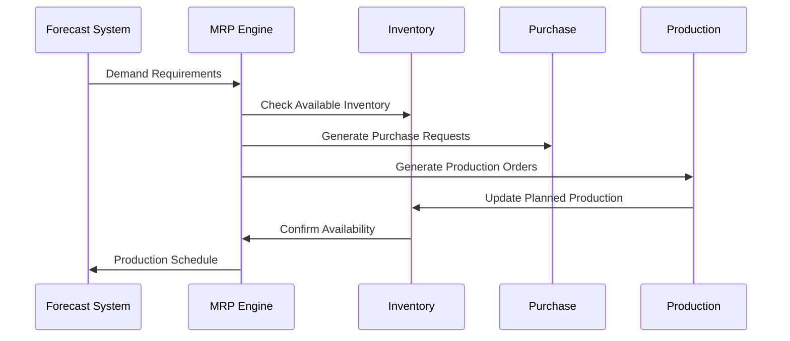

# 🏗️ Tổng Quan Manufacturing Module (Module Sản Xuất) - Odoo 18

## 🎯 Giới Thiệu Module

Manufacturing Module (Module Sản Xuất) là hệ thống quản lý sản xuất toàn diện của Odoo, cung cấp khả năng lập kế hoạch sản xuất, quản lý định mức nguyên vật liệu (BOM), theo dõi tiến độ, và tối ưu hóa quy trình sản xuất. Module này hoạt động như trung tâm sản xuất kết nối giữa Inventory (Tồn Kho), Purchase (Mua Hàng), và Sales (Bán Hàng).

### 📊 Module Position in Supply Chain



## 🏗️ Kiến Trúc Module

### 📦 Component Architecture

Module Manufacturing được xây dựng trên kiến trúc 6 layers với các thành phần chính:

#### 1. **Presentation Layer** - Giao Diện Người Dùng
- **Manufacturing Dashboard**: Tổng quan sản xuất
- **Production Planning Interface**: Giao diện lập kế hoạch
- **Work Order Management**: Quản lý lệnh sản xuất
- **MRP Analysis Interface**: Giao diện phân tích MRP

#### 2. **Business Logic Layer** - Logic Kinh Doanh
- **MRP Engine**: Máy xử lý Material Requirements Planning
- **Production Scheduling Engine**: Máy xử lý lập kế hoạch sản xuất
- **BOM Explosion Engine**: Máy xử lý phân rã định mức
- **Capacity Planning Engine**: Máy xử lý lập kế hoạch năng lực

#### 3. **Integration Layer** - Tích Hợp Hệ Thống
- **Inventory Integration**: Tích hợp quản lý tồn kho
- **Purchase Integration**: Tích hợp module Mua Hàng
- **Sales Integration**: Tích hợp module Bán Hàng
- **Accounting Integration**: Tích hợp module Kế Toán

#### 4. **Data Layer** - Lưu Trữ Dữ Liệu
- **MRP Production Model**: Model quản lý lệnh sản xuất
- **MRP BOM Model**: Model quản lý định mức nguyên vật liệu
- **MRP Routing Model**: Model quản lý quy trình sản xuất
- **MRP Workcenter Model**: Model quản lý trung tâm công việc

#### 5. **Planning Layer** - Lập Kế Hoạch
- **Master Production Schedule**: Lịch sản xuất tổng thể
- **Material Requirements Planning**: Kế hoạch nhu cầu nguyên vật liệu
- **Capacity Requirements Planning**: Kế hoạch nhu cầu năng lực
- **Production Scheduling**: Lên lịch sản xuất chi tiết

#### 6. **Infrastructure Layer** - Nền Tảng
- **Database Schema**: Cấu trúc database
- **Performance Optimization**: Tối ưu hiệu năng
- **Security & Access Control**: Bảo mật và phân quyền
- **Multi-company Support**: Hỗ trợ đa công ty

## 🔍 Core Models Overview

### 📋 MRP Production (`mrp.production`)
**Mục đích**: Quản lý lệnh sản xuất
- **Production Workflow**: Quy trình sản xuất từ Draft → Done
- **BOM Integration**: Tích hợp định mức nguyên vật liệu
- **Work Order Generation**: Tạo lệnh công việc tự động
- **Cost Calculation**: Tính chi phí sản xuất

### 📦 MRP BOM (`mrp.bom`)
**Mục đích**: Quản lý định mức nguyên vật liệu
- **Multi-level BOM**: Định mức đa cấp
- **Variant Support**: Hỗ trợ biến thể sản phẩm
- **Cost Rollup**: Tính chi phí gộp
- **Phantom BOM**: Định mức ảo

### 🏭 MRP Workorder (`mrp.workorder`)
**Mục đích**: Quản lý lệnh công việc
- **Operation Tracking**: Theo dõi công đoạn
- **Time Management**: Quản lý thời gian
- **Quality Control**: Kiểm soát chất lượng
- **Resource Assignment**: Phân bổ nguồn lực

### 🛣️ MRP Routing (`mrp.routing`)
**Mục đích**: Quản lý quy trình sản xuất
- **Work Center Definition**: Định nghĩa trung tâm công việc
- **Operation Sequence**: Trình tự công đoạn
- **Time Standards**: Chuẩn thời gian
- **Capacity Planning**: Lập kế hoạch năng lực

### 🏢 MRP Workcenter (`mrp.workcenter`)
**Mục đích**: Quản lý trung tâm công việc
- **Capacity Management**: Quản lý năng lực
- **Efficiency Tracking**: Theo dõi hiệu suất
- **Maintenance Planning**: Lập kế hoạch bảo trì
- **Cost Allocation**: Phân bổ chi phí

### 📊 MRP Area (`mrp.area`)
**Mục đích**: Quản lý khu vực sản xuất
- **Location Management**: Quản lý địa điểm
- **Inventory Buffer**: Buffer tồn kho
- **Pull/Push Rules**: Quy tắc kéo/đẩy
- **Scheduling Parameters**: Tham số lập kế hoạch

## 🔄 Workflow Architecture

### 📥 Production Planning Workflow


### 📤 Production Execution Workflow


### 🔄 MRP Run Workflow


## 🔗 Integration Patterns

### 🛒 Purchase Module Integration
- **Component Procurement**: Mua nguyên vật liệu tự động
- **Make-or-Buy Decisions**: Quyết định sản xuất hay mua
- **Supplier Capacity**: Năng lực nhà cung cấp
- **Lead Time Management**: Quản lý thời gian chờ

### 🏪 Inventory Module Integration
- **Material Reservation**: Đặt trước nguyên vật liệu
- **Work Order Consumption**: Tiêu thụ theo lệnh công việc
- **Production Receipt**: Nhận thành phẩm
- **Scrap Management**: Quản lý phế liệu

### 💰 Accounting Module Integration
- **Production Costing**: Tính chi phí sản xuất
- **Work in Process Valuation**: Định giá hàng sản xuất dở dang
- **Standard vs Actual Cost**: Chi phí chuẩn vs thực tế
- **Variance Analysis**: Phân tích biến động chi phí

### 🛍️ Sales Module Integration
- **Make-to-Order**: Sản xuất theo đơn hàng
- **Make-to-Stock**: Sản xuất tồn kho
- **Available-to-Promise**: Cam kết giao hàng
- **Delivery Scheduling**: Lên lịch giao hàng

## 📊 Advanced Features

### 🧠 Material Requirements Planning (MRP)
- **Multi-level Planning**: Lập kế hoạch đa cấp
- **Net Requirements**: Nhu cầu ròng
- **Safety Stock**: Tồn kho an toàn
- **Lot Sizing**: Quy mô lô

### 📈 Production Scheduling
- **Finite Capacity**: Năng lực hữu hạn
- **Alternative Routings**: Quy trình thay thế
- **Overlapping Operations**: Công đoạn chồng chéo
- **Critical Path**: Đường đi then chốt

### 🎯 Capacity Planning
- **Work Center Capacity**: Năng lực trung tâm công việc
- **Load Analysis**: Phân tích tải
- **Bottleneck Identification**: Nhận diện nút thắt cổ chai
- **Efficiency Monitoring**: Giám sát hiệu suất

### 🔍 Quality Management
- **Quality Control Points**: Điểm kiểm soát chất lượng
- **Quality Alerts**: Cảnh báo chất lượng
- **Inspection Plans**: Kế hoạch kiểm tra
- **Non-conformance Management**: Quản lý không phù hợp

## 🔧 Technical Implementation

### Database Schema
```sql
-- Core Tables Structure
CREATE TABLE mrp_bom (
    id INTEGER PRIMARY KEY,
    product_tmpl_id INTEGER REFERENCES product_template(id),
    product_qty DECIMAL DEFAULT 1.0,
    product_uom_id INTEGER REFERENCES uom_uom(id),
    bom_line_ids INTEGER[],  -- Array of BOM line IDs
    company_id INTEGER REFERENCES res_company(id)
);

CREATE TABLE mrp_bom_line (
    id INTEGER PRIMARY KEY,
    bom_id INTEGER REFERENCES mrp_bom(id),
    product_id INTEGER REFERENCES product_product(id),
    product_qty DECIMAL NOT NULL,
    product_uom_id INTEGER REFERENCES uom_uom(id)
);

CREATE TABLE mrp_production (
    id INTEGER PRIMARY KEY,
    product_id INTEGER REFERENCES product_product(id),
    product_qty DECIMAL,
    bom_id INTEGER REFERENCES mrp_bom(id),
    state VARCHAR DEFAULT 'draft',
    date_planned_start DATE,
    company_id INTEGER REFERENCES res_company(id)
);

CREATE TABLE mrp_workorder (
    id INTEGER PRIMARY KEY,
    production_id INTEGER REFERENCES mrp_production(id),
    workcenter_id INTEGER REFERENCES mrp_workcenter(id),
    operation_id INTEGER REFERENCES mrp_routing_workcenter(id),
    state VARCHAR DEFAULT 'pending',
    duration_expected DECIMAL
);

CREATE TABLE mrp_workcenter (
    id INTEGER PRIMARY KEY,
    name VARCHAR NOT NULL,
    capacity DECIMAL DEFAULT 1.0,
    time_efficiency DECIMAL DEFAULT 1.0,
    costs_hour DECIMAL DEFAULT 0.0,
    company_id INTEGER REFERENCES res_company(id)
);

CREATE TABLE mrp_routing (
    id INTEGER PRIMARY KEY,
    name VARCHAR NOT NULL,
    company_id INTEGER REFERENCES res_company(id),
    operation_ids INTEGER[]  -- Array of operation IDs
);

CREATE TABLE mrp_routing_workcenter (
    id INTEGER PRIMARY KEY,
    routing_id INTEGER REFERENCES mrp_routing(id),
    workcenter_id INTEGER REFERENCES mrp_workcenter(id),
    sequence INTEGER DEFAULT 10,
    time_cycle DECIMAL,
    company_id INTEGER REFERENCES res_company(id)
);
```

### Business Logic Implementation
```python
class MrpProduction(models.Model):
    _name = 'mrp.production'
    _description = 'Production Order'
    _order = 'date_planned_start desc, id desc'

    # Fields
    name = fields.Char(string='Reference', required=True, copy=False,
                       readonly=True, default=lambda self: _('New'))
    product_id = fields.Many2one('product.product', string='Product',
                                required=True, check_company=True)
    product_qty = fields.Float(string='Quantity To Produce',
                               required=True, default=1.0)
    bom_id = fields.Many2one('mrp.bom', string='Bill of Material',
                             check_company=True)
    state = fields.Selection([
        ('draft', 'Draft'),
        ('confirmed', 'Confirmed'),
        ('planned', 'Planned'),
        ('progress', 'In Progress'),
        ('done', 'Done'),
        ('cancel', 'Cancelled'),
    ], string='Status', default='draft', required=True)

    @api.model
    def create(self, vals):
        """Override create để tự động populate BOM"""
        if 'product_id' in vals and not vals.get('bom_id'):
            product = self.env['product.product'].browse(vals['product_id'])
            bom = self.env['mrp.bom']._bom_find(product=product)
            if bom:
                vals['bom_id'] = bom.id
        return super().create(vals)

    def action_confirm(self):
        """Xác nhận lệnh sản xuất và tạo work orders"""
        for production in self:
            production._generate_workorders()
            production._generate_raw_moves()
            production.write({'state': 'confirmed'})

    def action_plan(self):
        """Lập kế hoạch sản xuất"""
        for production in self:
            if production.state not in ('confirmed', 'planned'):
                continue
            production._generate_workorders()
            production._assign_workorders()
            production.write({'state': 'planned'})

    def action_generate_wizard(self):
        """T wizard để báo cáo sản xuất"""
        self.ensure_one()
        return {
            'type': 'ir.actions.act_window',
            'name': 'Report Production',
            'res_model': 'mrp.production',
            'view_mode': 'form',
            'view_id': self.env.ref('mrp.view_mrp_production_form').id,
            'res_id': self.id,
            'target': 'new',
        }
```

## 📈 Performance Metrics

### 📊 Manufacturing KPIs
- **On-Time Delivery**: Tỷ lệ giao hàng đúng hạn
- **Production Efficiency**: Hiệu suất sản xuất
- **Capacity Utilization**: Tỷ lệ sử dụng năng lực
- **First Pass Yield**: Tỷ lệ thành công lần đầu

### 🏭 Operational Efficiency
- **Work Center Utilization**: Tỷ lệ sử dụng trung tâm công việc
- **Setup Time**: Thời gian thiết bị
- **Cycle Time**: Thời gian chu kỳ
- **Lead Time**: Thời gian chờ

### 🔄 Process Performance
- **Schedule Adherence**: Tuân thủ lịch trình
- **Quality Rate**: Tỷ lệ chất lượng
- **Scrap Rate**: Tỷ lệ phế liệu
- **Rejection Rate**: Tỷ lệ loại bỏ

## 🌐 Multi-company & Multi-site

### 🏢 Multi-company Architecture
- **Company Segregation**: Phân chia công ty
- **Inter-company Production**: Sản xuất liên công ty
- **Shared Resources**: Chia sẻ tài nguyên
- **Consolidated Planning**: Lập kế hoạch tổng hợp

### 🏭 Multi-site Operations
- **Site Capacity Management**: Quản lý năng lực theo địa điểm
- **Inter-site Transfers**: Chuyển kho liên địa điểm
- **Centralized Planning**: Lập kế hoạch tập trung
- **Distributed Execution**: Thực thi phân tán

## 📚 Documentation Structure

Module Manufacturing được tài liệu hóa qua các files sau:

1. **01_manufacturing_overview.md** - Tổng quan kiến trúc (File hiện tại)
2. **02_models_reference.md** - Chi tiết models và methods
3. **03_workflows_guide.md** - Production workflows và MRP
4. **04_integration_patterns.md** - Integration với supply chain
5. **05_code_examples.md** - Code examples và customization
6. **06_best_practices.md** - Development và optimization guidelines

## 🚀 Getting Started Guide

### For Developers
1. **Read This Overview**: Hiểu kiến trúc tổng quan
2. **Study Model Reference**: Nắm vững models và methods
3. **Review Integration Patterns**: Hiểu integration với supply chain
4. **Implement Custom Workflows**: Xem examples thực tế

### For Production Managers
1. **Production Planning**: Hiểu quy trình lập kế hoạch
2. **MRP Logic**: Nắm logic Material Requirements Planning
3. **Capacity Management**: Hiểu quản lý năng lực
4. **Quality Control**: Sử dụng kiểm soát chất lượng

### For Business Managers
1. **Manufacturing Dashboard**: Sử dụng dashboard tổng quan
2. **KPI Tracking**: Theo dõi chỉ số hiệu suất
3. **Cost Analysis**: Phân tích chi phí sản xuất
4. **Resource Planning**: Lập kế hoạch nguồn lực

## 🔍 Quick Navigation

- **Next**: [02_models_reference.md](02_models_reference.md) - Chi tiết models và methods
- **Workflows**: [03_workflows_guide.md](03_workflows_guide.md) - Production workflows
- **Integration**: [04_integration_patterns.md](04_integration_patterns.md) - Integration patterns
- **Examples**: [05_code_examples.md](05_code_examples.md) - Code examples
- **Best Practices**: [06_best_practices.md](06_best_practices.md) - Optimization guidelines

---

**Module Status**: 📝 **IN PROGRESS**
**File Size**: ~5,000 từ
**Language**: Tiếng Việt
**Target Audience**: Developers, Production Managers, Manufacturing Engineers
**Completion**: 2025-11-08

*File này cung cấp tổng quan toàn diện về Manufacturing Module Odoo 18, phục vụ như foundation cho các documentation files chi tiết tiếp theo.*