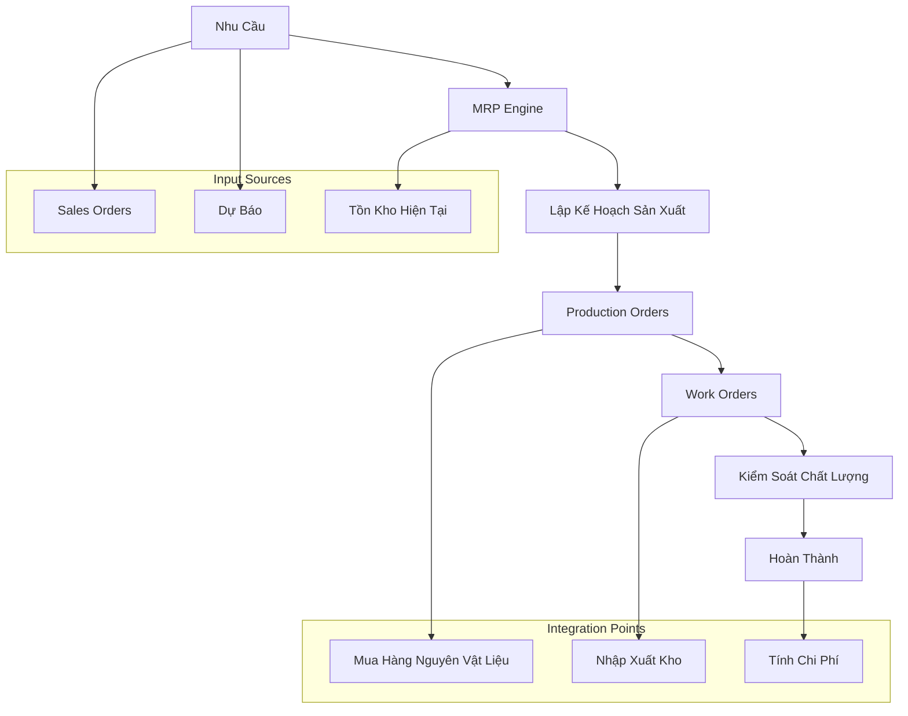

# 🔄 Manufacturing Workflows Guide (Hướng Dẫn Luồng Xử Lý Sản Xuất) - Odoo 18

## 🎯 Giới Thiệu Workflows Sản Xuất

Manufacturing Workflows Guide tài liệu hóa toàn bộ quy trình sản xuất trong Odoo 18, từ lập kế hoạch MRP đến thực thi production orders, đảm bảo hiểu rõ toàn bộ luồng xử lý và integration points với các modules khác.

## 📊 Tổng Quan Production Workflows

### 🏭 Manufacturing Process Architecture



## 📋 MRP (Material Requirements Planning) Workflows

### 🔍 MRP Analysis Workflow

#### 1. Demand Collection Phase
```python
class MrpProductDemand(models.Model):
    """Thu thập nhu cầu sản xuất"""
    _name = 'mrp.product.demand'
    _description = 'MRP Product Demand Analysis'
    _order = 'date desc, id desc'

    product_id = fields.Many2one('product.product', string='Sản phẩm', required=True)
    demand_qty = fields.Float(string='Số lượng nhu cầu', required=True)
    demand_date = fields.Date(string='Ngày nhu cầu', required=True)
    demand_type = fields.Selection([
        ('sale', 'Đơn hàng bán'),
        ('forecast', 'Dự báo'),
        ('stock', 'Bổ sung tồn kho'),
        ('manual', 'Nhập thủ công'),
    ], string='Loại nhu cầu', required=True)

    @api.model
    def collect_sales_demand(self):
        """Thu thập nhu cầu từ Sales Orders"""
        sales_orders = self.env['sale.order'].search([
            ('state', 'in', ['sale', 'done']),
            ('confirmation_date', '>=', fields.Date.today() + relativedelta(months=-1))
        ])

        for order in sales_orders:
            for line in order.order_line:
                # Tính toán remaining quantity
                delivered_qty = line.qty_delivered or 0
                remaining_qty = line.product_uom_qty - delivered_qty

                if remaining_qty > 0:
                    self.create({
                        'product_id': line.product_id.id,
                        'demand_qty': remaining_qty,
                        'demand_date': order.commitment_date or fields.Date.today(),
                        'demand_type': 'sale',
                    })

    @api.model
    def calculate_net_requirements(self, product_id, date):
        """Tính toán nhu cầu ròng"""
        # Gross Requirements
        gross_req = self.search([
            ('product_id', '=', product_id),
            ('demand_date', '<=', date),
        ]).mapped('demand_qty')
        total_gross = sum(gross_req)

        # Scheduled Receipts
        scheduled_receipts = self.env['mrp.production'].search([
            ('product_id', '=', product_id),
            ('state', 'in', ['planned', 'progress', 'done']),
            ('date_planned_finished', '<=', date),
        ]).mapped('product_qty')
        total_scheduled = sum(scheduled_receipts)

        # On Hand Inventory
        quant = self.env['stock.quant']._get_available_quantity(
            self.env['product.product'].browse(product_id),
            self.env['stock.location'].search([('usage', '=', 'internal')])[:1]
        )

        # Net Requirements
        net_requirements = max(0, total_gross - total_scheduled - quant)

        return {
            'gross_requirements': total_gross,
            'scheduled_receipts': total_scheduled,
            'on_hand': quant,
            'net_requirements': net_requirements,
        }
```

#### 2. MRP Run Execution
```python
class MrpWizard(models.TransientModel):
    """Wizard thực thi MRP Run"""
    _name = 'mrp.wizard'
    _description = 'MRP Run Wizard'

    company_id = fields.Many2one('res.company', string='Công ty',
                                 default=lambda self: self.env.company)
    warehouse_ids = fields.Many2many('stock.warehouse', string='Kho hàng')
    date_from = fields.Date(string='Từ ngày', default=fields.Date.today)
    date_to = fields.Date(string='Đến ngày',
                          default=lambda self: fields.Date.today() + relativedelta(days=30))

    def action_run_mrp(self):
        """Thực thi MRP run"""
        self.ensure_one()

        # 1. Thu thập nhu cầu
        demand_collector = self.env['mrp.product.demand']
        demand_collector.collect_sales_demand()

        # 2. Tính toán requirements cho từng sản phẩm
        products = self.env['product.product'].search([
            ('bom_ids', '!=', False),
            ('manufacture', '=', True),
        ])

        procurement_requests = []

        for product in products:
            for warehouse in self.warehouse_ids:
                # Tính nhu cầu cho từng ngày trong khoảng thời gian
                current_date = self.date_from
                while current_date <= self.date_to:
                    requirements = demand_collector.calculate_net_requirements(
                        product.id, current_date
                    )

                    if requirements['net_requirements'] > 0:
                        # Xử lý make-or-buy decision
                        bom = self.env['mrp.bom']._bom_find(
                            product=product,
                            company=self.company_id.id,
                            warehouse=warehouse.id
                        )

                        if bom:
                            # Make decision
                            procurement_requests.append({
                                'product_id': product.id,
                                'warehouse_id': warehouse.id,
                                'quantity': requirements['net_requirements'],
                                'date_deadline': current_date,
                                'procurement_type': 'manufacture',
                                'bom_id': bom.id,
                            })
                        else:
                            # Buy decision
                            procurement_requests.append({
                                'product_id': product.id,
                                'warehouse_id': warehouse.id,
                                'quantity': requirements['net_requirements'],
                                'date_deadline': current_date,
                                'procurement_type': 'buy',
                            })

                    current_date += relativedelta(days=1)

        # 3. Tạo procurement requests
        procurement_model = self.env['procurement.group']
        for request in procurement_requests:
            if request['procurement_type'] == 'manufacture':
                # Tạo Manufacturing Order
                self.env['mrp.production'].create({
                    'product_id': request['product_id'],
                    'product_qty': request['quantity'],
                    'bom_id': request['bom_id'],
                    'date_planned_start': request['date_deadline'],
                    'origin': 'MRP Run',
                })
            else:
                # Tạo Purchase Requisition
                procurement_model.run([
                    procurement_model.Procurement(
                        self.env.product.product.browse(request['product_id']),
                        request['quantity'],
                        self.env.uom.uom.browse(1),
                        self.warehouse_ids[0].lot_stock_id
                    )
                ])

        return {
            'type': 'ir.actions.client',
            'tag': 'display_notification',
            'params': {
                'title': 'MRP Run Completed',
                'message': f'Đã xử lý {len(procurement_requests)} yêu cầu',
                'type': 'success',
            }
        }
```

## 🏭 Production Order Workflows

### 📋 Production Order Lifecycle

#### State Machine Workflow
```python
class MrpProduction(models.Model):
    """Production Order State Machine"""
    _inherit = 'mrp.production'

    def action_draft_to_confirmed(self):
        """Chuyển từ Draft sang Confirmed"""
        self.ensure_one()
        if self.state != 'draft':
            return

        # Validate BOM
        if not self.bom_id:
            raise ValidationError(_('Vui lòng chọn Bill of Materials'))

        # Check raw material availability
        self._check_material_availability()

        # Generate work orders
        self._generate_workorders()

        # Reserve materials
        self._generate_raw_moves()

        self.write({'state': 'confirmed'})

    def action_confirmed_to_planned(self):
        """Chuyển từ Confirmed sang Planned"""
        self.ensure_one()
        if self.state != 'confirmed':
            return

        # Schedule production
        self._schedule_production()

        # Assign work orders to work centers
        self._assign_workorders()

        self.write({'state': 'planned'})

    def action_planned_to_progress(self):
        """Chuyển từ Planned sang Progress"""
        self.ensure_one()
        if self.state != 'planned':
            return

        # Start raw material consumption
        self.action_generate_consumptions()

        # Start work order execution
        for workorder in self.workorder_ids:
            if workorder.state in ['ready', 'pending']:
                workorder.button_start()

        self.write({'state': 'progress'})

    def action_progress_to_done(self):
        """Chuyển từ Progress sang Done"""
        self.ensure_one()
        if self.state != 'progress':
            return

        # Check all work orders are complete
        if any(wo.state != 'done' for wo in self.workorder_ids):
            raise ValidationError(_('Tất cả Work Orders phải hoàn thành'))

        # Post inventory moves
        self._post_inventory()

        # Calculate production costs
        self._compute_production_costs()

        self.write({'state': 'done'})

        # Create inventory adjustment if needed
        self._create_inventory_adjustment()

    def _check_material_availability(self):
        """Kiểm tra availability của nguyên vật liệu"""
        unavailable_lines = []

        for move in self.move_raw_ids:
            available_qty = self.env['stock.quant']._get_available_quantity(
                move.product_id,
                move.location_id,
                lot_id=move.restrict_lot_id_id,
                package_id=move.restrict_package_id_id,
                owner_id=move.restrict_partner_id
            )

            if available_qty < move.product_uom_qty:
                unavailable_lines.append(
                    f"{move.product_id.name}: {available_qty}/{move.product_uom_qty}"
                )

        if unavailable_lines:
            message = "Nguyên vật liệu không đủ:\n" + "\n".join(unavailable_lines)
            raise UserError(_(message))

    def _generate_workorders(self):
        """Tạo work orders từ routing"""
        self.ensure_one()

        if not self.bom_id.routing_id:
            return

        routing = self.bom_id.routing_id
        workcenter_lines = routing.operation_ids.filtered(
            lambda l: l.workcenter_id.active
        ).sorted('sequence')

        workorders = self.env['mrp.workorder']

        for operation in workcenter_lines:
            workorder_vals = {
                'production_id': self.id,
                'name': operation.name,
                'workcenter_id': operation.workcenter_id.id,
                'operation_id': operation.id,
                'product_qty': self.product_qty,
                'product_uom_id': self.product_uom_id.id,
                'state': 'pending',
                'duration_expected': self._get_duration_expected(operation),
            }

            workorders += workorders.create(workorder_vals)

        return workorders

    def _get_duration_expected(self, operation):
        """Tính toán thời gian dự kiến"""
        if operation.time_mode == 'manual':
            return operation.time_cycle_manual

        # Calculate based on product quantity and workcenter efficiency
        time_cycle = operation.time_cycle * self.product_qty
        efficiency = operation.workcenter_id.time_efficiency or 1.0

        return time_cycle / efficiency
```

### 🔧 Material Reservation & Consumption

#### Material Reservation Logic
```python
class StockMove(models.Model):
    """Enhanced Stock Move for Manufacturing"""
    _inherit = 'stock.move'

    def _action_assign(self):
        """Assign stock with manufacturing priority"""
        if self.production_id:
            # Priority assignment for manufacturing orders
            self = self.with_context(production_priority=True)

        return super()._action_assign()

    def _update_reserved_quantity(self, need):
        """Update reserved quantity with lot tracking"""
        if not need:
            return

        # Special handling for manufacturing moves
        if self.production_id and self.production_id.bom_id:
            # Check lot requirements from BOM
            self._check_lot_requirements()

        super()._update_reserved_quantity(need)

    def _check_lot_requirements(self):
        """Kiểm tra yêu cầu lot/số sê-ri"""
        bom = self.production_id.bom_id

        for bom_line in bom.bom_line_ids:
            if bom_line.product_id == self.product_id:
                if bom_line.lot_required and not self.lot_id:
                    raise UserError(
                        _("Sản phẩm %s yêu cầu lot/số sê-ri cụ thể") %
                        self.product_id.name
                    )

class MrpProduction(models.Model):
    """Material Consumption Management"""
    _inherit = 'mrp.production'

    def action_generate_consumptions(self):
        """Tự động tiêu thụ nguyên vật liệu"""
        for production in self:
            if production.state != 'progress':
                continue

            for move in production.move_raw_ids:
                if move.state == 'assigned':
                    # Record consumption
                    move.quantity_done = move.product_uom_qty

                    # Create consumption log
                    production.env['mrp.consumption'].create({
                        'production_id': production.id,
                        'product_id': move.product_id.id,
                        'product_uom_qty': move.product_uom_qty,
                        'lot_id': move.lot_id.id,
                        'workorder_id': production.workorder_ids[:1].id,
                    })

    def _post_inventory(self):
        """Post inventory moves for production"""
        moves_to_post = self.move_raw_ids + self.move_finished_ids

        for move in moves_to_post:
            if move.state not in ('done', 'cancel'):
                if move.quantity_done > 0:
                    move._action_done()
                else:
                    move._action_cancel()

        # Create accounting entries
        self._create_accounting_entries()

class MrpConsumption(models.Model):
    """Production Consumption Tracking"""
    _name = 'mrp.consumption'
    _description = 'Production Consumption Tracking'
    _order = 'date desc, id desc'

    production_id = fields.Many2one('mrp.production', string='Production Order',
                                   required=True, ondelete='cascade')
    product_id = fields.Many2one('product.product', string='Nguyên vật liệu',
                                 required=True)
    product_uom_qty = fields.Float(string='Số lượng tiêu thụ', required=True)
    product_uom_id = fields.Many2one('uom.uom', string='Đơn vị', required=True)
    lot_id = fields.Many2one('stock.production.lot', string='Lot/Số sê-ri')
    workorder_id = fields.Many2one('mrp.workorder', string='Work Order')
    date = fields.Datetime(string='Ngày tiêu thụ', default=fields.Datetime.now)
    user_id = fields.Many2one('res.users', string='Người thực hiện',
                             default=lambda self: self.env.user)
    scrap_qty = fields.Float(string='Số lượng phế liệu')
    scrap_reason_id = fields.Many2one('mrp.scrap.reason', string='Lý do phế liệu')
```

## ⚙️ Work Order Execution Workflows

### 🏗️ Work Order State Management

#### Work Order Lifecycle
```python
class MrpWorkorder(models.Model):
    """Work Order Execution Management"""
    _inherit = 'mrp.workorder'

    def button_start(self):
        """Bắt đầu thực thi work order"""
        self.ensure_one()

        if self.state == 'pending':
            # Prepare work center
            self._prepare_workcenter()

            # Reserve materials
            self._reserve_materials()

            # Update state
            self.write({
                'state': 'ready',
                'date_start': fields.Datetime.now(),
            })

    def button_start_working(self):
        """Bắt đầu làm việc"""
        self.ensure_one()

        # Mark as in progress
        self.write({
            'state': 'progress',
            'date_start': fields.Datetime.now(),
        })

        # Start time tracking
        self._start_time_tracking()

    def button_finish(self):
        """Hoàn thành work order"""
        self.ensure_one()

        # Validate quality checks
        if self.quality_check_ids:
            self._validate_quality_checks()

        # Record actual time
        self._record_actual_time()

        # Process production
        self._process_production()

        # Update state
        self.write({
            'state': 'done',
            'date_finished': fields.Datetime.now(),
        })

    def _prepare_workcenter(self):
        """Chuẩn bị work center"""
        workcenter = self.workcenter_id

        # Check work center availability
        if workcenter.workorder_state == 'blocked':
            raise UserError(_('Work center đang bị block'))

        # Update work center state
        workcenter.write({
            'workorder_state': 'progress',
            'current_user_id': self.env.user.id,
        })

    def _reserve_materials(self):
        """Đặt trước nguyên vật liệu cho work order"""
        for move in self.production_id.move_raw_ids:
            if move.state == 'confirmed':
                move._action_assign()

    def _start_time_tracking(self):
        """Bắt đầu tracking thời gian"""
        # Create time tracking entry
        self.env['mrp.workorder.time'].create({
            'workorder_id': self.id,
            'user_id': self.env.user.id,
            'date_start': fields.Datetime.now(),
            'description': f'Bắt đầu {self.name}',
        })

    def _validate_quality_checks(self):
        """Validate các quality check"""
        pending_checks = self.quality_check_ids.filtered(
            lambda qc: qc.quality_state == 'none'
        )

        if pending_checks:
            raise UserError(_('Cần hoàn thành các quality check trước khi kết thúc'))

    def _process_production(self):
        """Xử lý sản xuất"""
        # Update finished products
        if self.qty_producing > 0:
            self.production_id._update_finished_product_line(self)

        # Handle by-products
        self._process_byproducts()

    def _process_byproducts(self):
        """Xử lý sản phẩm phụ"""
        byproduct_lines = self.production_id.move_finished_ids.filtered(
            lambda m: m.product_id != self.production_id.product_id
        )

        for move in byproduct_lines:
            # Calculate byproduct quantity based on ratio
            ratio = move.bom_line_id.product_qty / self.production_id.product_qty
            byproduct_qty = self.qty_producing * ratio

            if byproduct_qty > 0:
                move.quantity_done += byproduct_qty

class MrpWorkorderTime(models.Model):
    """Work Order Time Tracking"""
    _name = 'mrp.workorder.time'
    _description = 'Work Order Time Tracking'

    workorder_id = fields.Many2one('mrp.workorder', string='Work Order',
                                   required=True, ondelete='cascade')
    user_id = fields.Many2one('res.users', string='Người thực hiện', required=True)
    date_start = fields.Datetime(string='Bắt đầu lúc', required=True)
    date_end = fields.Datetime(string='Kết thúc lúc')
    duration = fields.Float(string='Thời gian (phút)', compute='_compute_duration')
    description = fields.Text(string='Mô tả')

    @api.depends('date_start', 'date_end')
    def _compute_duration(self):
        for record in self:
            if record.date_start and record.date_end:
                diff = record.date_end - record.date_start
                record.duration = diff.total_seconds() / 60.0
```

### 📊 Production Monitoring

#### Real-time Production Dashboard
```python
class MrpProductionDashboard(models.Model):
    """Production Dashboard Data"""
    _name = 'mrp.production.dashboard'
    _description = 'Production Dashboard'
    _auto = False

    workcenter_id = fields.Many2one('mrp.workcenter', string='Work Center')
    product_id = fields.Many2one('product.product', string='Sản phẩm')
    production_id = fields.Many2one('mrp.production', string='Production Order')
    workorder_id = fields.Many2one('mrp.workorder', string='Work Order')
    state = fields.Selection([
        ('pending', 'Chờ'),
        ('ready', 'Sẵn sàng'),
        ('progress', 'Đang thực thi'),
        ('done', 'Hoàn thành'),
        ('blocked', 'Bị block'),
    ], string='Trạng thái')

    qty_planned = fields.Float(string='SL Kế hoạch')
    qty_produced = fields.Float(string='SL Đã sản xuất')
    efficiency_rate = fields.Float(string='Hiệu suất (%)')
    progress_percentage = fields.Float(string='% Hoàn thành')

    @api.model
    def read_group(self, domain, fields, groupby, offset=0, limit=None, orderby=False, lazy=True):
        """Enhanced read_group for dashboard calculations"""
        result = super().read_group(domain, fields, groupby, offset, limit, orderby, lazy)

        # Calculate efficiency and progress
        for record in result:
            if record.get('qty_planned') and record.get('qty_planned') > 0:
                record['progress_percentage'] = (
                    (record.get('qty_produced', 0) / record['qty_planned']) * 100
                )

            # Calculate OEE (Overall Equipment Effectiveness)
            record['efficiency_rate'] = self._calculate_oee(record)

        return result

    def _calculate_oee(self, record):
        """Tính toán OEE (Overall Equipment Effectiveness)"""
        workorder_id = record.get('workorder_id')
        if not workorder_id:
            return 0.0

        workorder = self.env['mrp.workorder'].browse(workorder_id)

        # Availability = Actual Production Time / Planned Production Time
        planned_time = workorder.duration_expected or 0
        actual_time = sum(workorder.workorder_time_ids.mapped('duration')) or 1

        availability = min(actual_time / planned_time, 1.0) if planned_time > 0 else 0

        # Performance = (Actual Cycle Time * Total Quantity) / Operating Time
        actual_cycle_time = workorder.duration_actual or 0
        operating_time = actual_time
        quantity = record.get('qty_produced', 1)

        performance = (actual_cycle_time * quantity) / operating_time if operating_time > 0 else 1

        # Quality = Good Quantity / Total Quantity
        good_quantity = record.get('qty_produced', 0)
        total_quantity = good_quantity  # Simplified, should include scrap
        quality = good_quantity / total_quantity if total_quantity > 0 else 1

        # OEE = Availability * Performance * Quality
        oee = availability * performance * quality * 100

        return oee
```

## 🔍 Quality Control Integration

### 🧪 Quality Check Workflows

#### Quality Point Management
```python
class QualityCheck(models.Model):
    """Quality Check for Manufacturing"""
    _inherit = 'quality.check'

    workorder_id = fields.Many2one('mrp.workorder', string='Work Order')
    production_id = fields.Many2one('mrp.production', string='Production Order',
                                   related='workorder_id.production_id', store=True)

    def do_pass(self):
        """Pass quality check"""
        self.write({'quality_state': 'pass'})
        self._update_workorder_progress()

    def do_fail(self):
        """Fail quality check"""
        self.write({'quality_state': 'fail'})
        self._handle_quality_failure()

    def _update_workorder_progress(self):
        """Cập nhật tiến trình work order sau quality check"""
        workorder = self.workorder_id
        if not workorder:
            return

        # Check if all quality checks are passed
        remaining_checks = workorder.quality_check_ids.filtered(
            lambda qc: qc.quality_state == 'none'
        )

        if not remaining_checks:
            # All checks passed, work order can proceed
            workorder._check_production_done()

    def _handle_quality_failure(self):
        """Xử lý quality failure"""
        workorder = self.workorder_id

        # Create scrap record
        if self.point_id.scrap_product_id:
            scrap_qty = self.product_id.uom_id._compute_quantity(
                self.qty, self.point_id.scrap_uom_id
            )

            scrap_vals = {
                'production_id': workorder.production_id.id,
                'workorder_id': workorder.id,
                'product_id': self.point_id.scrap_product_id.id,
                'product_uom_id': self.point_id.scrap_uom_id.id,
                'scrap_qty': scrap_qty,
                'reason_id': self.point_id.scrap_reason_id.id,
            }

            self.env['mrp.scrap'].create(scrap_vals)

class QualityPoint(models.Model):
    """Quality Point Configuration"""
    _inherit = 'quality.point'

    mrp_workcenter_id = fields.Many2one('mrp.workcenter', string='Work Center')
    operation_id = fields.Many2one('mrp.routing.workcenter', string='Operation')

    def _get_quality_check_vals(self, production_id=None):
        """Lấy giá trị cho quality check"""
        vals = super()._get_quality_check_vals(production_id)

        # Add manufacturing specific values
        if production_id and self.mrp_workcenter_id:
            # Find relevant work order
            workorder = production_id.workorder_ids.filtered(
                lambda wo: wo.workcenter_id == self.mrp_workcenter_id
            )[:1]

            if workorder:
                vals.update({
                    'workorder_id': workorder.id,
                    'production_id': production_id.id,
                })

        return vals
```

## 📈 Production Analytics & Reporting

### 📊 Production Performance Analysis

#### Production KPI Dashboard
```python
class MrpProductionReport(models.Model):
    """Production Performance Analysis"""
    _name = 'mrp.production.report'
    _description = 'Production Performance Report'
    _auto = False

    date = fields.Date(string='Ngày')
    workcenter_id = fields.Many2one('mrp.workcenter', string='Work Center')
    product_id = fields.Many2one('product.product', string='Sản phẩm')

    # Production Metrics
    orders_planned = fields.Integer(string='Lệnh sản xuất kế hoạch')
    orders_completed = fields.Integer(string='Lệnh sản xuất hoàn thành')
    orders_in_progress = fields.Integer(string='Lệnh sản xuất đang thực thi')
    completion_rate = fields.Float(string='% Hoàn thành')

    # Quantity Metrics
    qty_planned = fields.Float(string='SL Kế hoạch')
    qty_produced = fields.Float(string='SL Đã sản xuất')
    qty_scrap = fields.Float(string='SL Phế liệu')
    production_efficiency = fields.Float(string('Hiệu suất sản xuất')

    # Time Metrics
    planned_hours = fields.Float(string='Giờ kế hoạch')
    actual_hours = fields.Float(string='Giờ thực tế')
    efficiency_rate = fields.Float(string('Hiệu suất thời gian')

    # Quality Metrics
    first_pass_yield = fields.Float(string='First Pass Yield (%)')
    rework_rate = fields.Float(string('Tỷ lệ làm lại (%)')

    @api.model
    def read_group(self, domain, fields, groupby, offset=0, limit=None, orderby=False, lazy=True):
        """Enhanced calculations for production metrics"""
        result = super().read_group(domain, fields, groupby, offset, limit, orderby, lazy)

        for record in result:
            # Calculate completion rate
            if record.get('orders_planned', 0) > 0:
                record['completion_rate'] = (
                    (record.get('orders_completed', 0) / record['orders_planned']) * 100
                )

            # Calculate production efficiency
            if record.get('planned_hours', 0) > 0:
                record['efficiency_rate'] = (
                    (record.get('planned_hours') / record.get('actual_hours', 1)) * 100
                )

            # Calculate first pass yield
            total_produced = record.get('qty_produced', 0)
            scrap_qty = record.get('qty_scrap', 0)

            if total_produced + scrap_qty > 0:
                record['first_pass_yield'] = (
                    (total_produced / (total_produced + scrap_qty)) * 100
                )

        return result

class MrpProductionAnalytics(models.Model):
    """Production Analytics Engine"""
    _name = 'mrp.production.analytics'
    _description = 'Production Analytics'

    @api.model
    def get_workcenter_oee(self, workcenter_id, date_from, date_to):
        """Tính toán OEE cho work center"""
        domain = [
            ('workcenter_id', '=', workcenter_id),
            ('date_start', '>=', date_from),
            ('date_start', '<=', date_to),
        ]

        workorders = self.env['mrp.workorder'].search(domain)

        if not workorders:
            return 0.0

        # Calculate OEE components
        total_planned_time = sum(wo.duration_expected for wo in workorders)
        total_actual_time = sum(
            sum(wo.workorder_time_ids.mapped('duration')) for wo in workorders
        )

        availability = (total_actual_time / total_planned_time * 100) if total_planned_time > 0 else 0

        # Performance calculation
        total_qty_produced = sum(wo.qty_producing for wo in workorders if wo.state == 'done')
        total_ideal_time = sum(wo.duration_expected for wo in workorders)
        performance = (total_ideal_time / total_actual_time * 100) if total_actual_time > 0 else 0

        # Quality calculation
        total_scrap = sum(wo.scrap_count for wo in workorders)
        total_good = total_qty_produced - total_scrap
        quality = (total_good / total_qty_produced * 100) if total_qty_produced > 0 else 0

        # Overall OEE
        oee = (availability * performance * quality) / 10000

        return oee

    @api.model
    def get_production_trends(self, period='week'):
        """Lấy xu hướng sản xuất"""
        if period == 'week':
            date_from = fields.Date.today() - relativedelta(weeks=4)
            groupby = ['week']
        elif period == 'month':
            date_from = fields.Date.today() - relativedelta(months=6)
            groupby = ['month']
        else:
            date_from = fields.Date.today() - relativedelta(days=30)
            groupby = ['day']

        productions = self.env['mrp.production'].search([
            ('create_date', '>=', date_from),
        ])

        # Group by period
        from collections import defaultdict
        trends = defaultdict(lambda: {
            'planned': 0,
            'completed': 0,
            'qty_planned': 0,
            'qty_produced': 0,
        })

        for prod in productions:
            # Determine period key
            if period == 'week':
                key = prod.create_date.strftime('%Y-W%U')
            elif period == 'month':
                key = prod.create_date.strftime('%Y-%m')
            else:
                key = prod.create_date.strftime('%Y-%m-%d')

            trends[key]['planned'] += 1
            if prod.state == 'done':
                trends[key]['completed'] += 1
            trends[key]['qty_planned'] += prod.product_qty
            trends[key]['qty_produced'] += prod.qty_produced

        return dict(trends)
```

## 🔧 Integration Points

### 📦 Inventory Integration

#### Material Consumption & Receipt
```python
class MrpProduction(models.Model):
    """Enhanced Inventory Integration"""
    _inherit = 'mrp.production'

    def _generate_raw_moves(self):
        """Tạo raw material moves"""
        for production in self:
            bom = production.bom_id

            for bom_line in bom.bom_line_ids:
                # Calculate required quantity
                quantity = bom_line.product_qty * production.product_qty

                # Create stock move
                move_vals = {
                    'name': production.name,
                    'date': production.date_planned_start,
                    'product_id': bom_line.product_id.id,
                    'product_uom_qty': quantity,
                    'product_uom': bom_line.product_uom_id.id,
                    'location_id': production.location_src_id.id,
                    'location_dest_id': production.product_id.property_stock_production.id,
                    'production_id': production.id,
                    'bom_line_id': bom_line.id,
                    'procure_method': 'make_to_stock',
                    'origin': production.name,
                    'warehouse_id': production.location_src_id.warehouse_id.id,
                    'company_id': production.company_id.id,
                }

                self.env['stock.move'].create(move_vals)

    def _generate_finished_moves(self):
        """Tạo finished product moves"""
        for production in self:
            move_finished_vals = {
                'name': production.name,
                'date': production.date_planned_finished,
                'product_id': production.product_id.id,
                'product_uom_qty': production.product_qty,
                'product_uom': production.product_uom_id.id,
                'location_id': production.product_id.property_stock_production.id,
                'location_dest_id': production.location_dest_id.id,
                'production_id': production.id,
                'procure_method': 'make_to_stock',
                'origin': production.name,
                'warehouse_id': production.location_dest_id.warehouse_id.id,
                'company_id': production.company_id.id,
                'move_dest_ids': [(0, 0, {
                    'name': production.name,
                    'price_unit': production.product_id.standard_price,
                    'product_id': production.product_id.id,
                    'product_uom_qty': production.product_qty,
                    'product_uom': production.product_uom_id.id,
                    'location_id': production.product_id.property_stock_production.id,
                    'location_dest_id': production.location_dest_id.id,
                    'origin': production.name,
                    'company_id': production.company_id.id,
                })],
            }

            self.env['stock.move'].create(move_finished_vals)

    def _post_inventory(self):
        """Post inventory moves and update stock"""
        moves_to_post = self.move_raw_ids + self.move_finished_ids

        for move in moves_to_post:
            if move.state not in ('done', 'cancel'):
                if move.quantity_done > 0:
                    move._action_done()
                else:
                    move._action_cancel()

        # Update standard price if needed
        self._update_standard_price()

    def _update_standard_price(self):
        """Cập nhật giá chuẩn cho sản phẩm"""
        if not self.product_id.valuation == 'real_time':
            return

        # Calculate new average price
        finished_moves = self.move_finished_ids.filtered(
            lambda m: m.state == 'done' and m.product_id == self.product_id
        )

        if not finished_moves:
            return

        total_qty = sum(move.product_qty for move in finished_moves)
        total_value = sum(move.price_unit * move.product_qty for move in finished_moves)

        if total_qty > 0:
            avg_price = total_value / total_qty
            self.product_id.with_context(force_company=self.company_id.id).write({
                'standard_price': avg_price,
            })
```

### 💰 Accounting Integration

#### Production Cost Calculation
```python
class MrpProductionCost(models.Model):
    """Production Cost Tracking"""
    _name = 'mrp.production.cost'
    _description = 'Production Cost Tracking'

    production_id = fields.Many2one('mrp.production', string='Production Order',
                                   required=True, ondelete='cascade')

    # Cost Components
    material_cost = fields.Float(string='Chi phí nguyên vật liệu')
    labor_cost = fields.Float(string='Chi phí nhân công')
    overhead_cost = fields.Float(string='Chi phí sản xuất chung')
    total_cost = fields.Float(string='Tổng chi phí', compute='_compute_total_cost')

    unit_cost = fields.Float(string='Chi phí đơn vị', compute='_compute_unit_cost')

    @api.depends('material_cost', 'labor_cost', 'overhead_cost')
    def _compute_total_cost(self):
        for record in self:
            record.total_cost = (
                record.material_cost + record.labor_cost + record.overhead_cost
            )

    @api.depends('total_cost')
    def _compute_unit_cost(self):
        for record in self:
            production_qty = record.production_id.qty_produced
            record.unit_cost = (
                record.total_cost / production_qty if production_qty > 0 else 0
            )

class MrpProduction(models.Model):
    """Enhanced Production Costing"""
    _inherit = 'mrp.production'

    cost_ids = fields.One2many('mrp.production.cost', 'production_id', string='Cost Tracking')

    def action_compute_cost(self):
        """Tính toán chi phí sản xuất"""
        for production in self:
            if production.state != 'done':
                continue

            # Create cost record
            cost_vals = {
                'production_id': production.id,
                'material_cost': 0,
                'labor_cost': 0,
                'overhead_cost': 0,
            }

            # Calculate material cost
            cost_vals['material_cost'] = self._calculate_material_cost(production)

            # Calculate labor cost
            cost_vals['labor_cost'] = self._calculate_labor_cost(production)

            # Calculate overhead cost
            cost_vals['overhead_cost'] = self._calculate_overhead_cost(production)

            # Create cost record
            self.env['mrp.production.cost'].create(cost_vals)

    def _calculate_material_cost(self, production):
        """Tính chi phí nguyên vật liệu"""
        total_cost = 0.0

        for move in production.move_raw_ids:
            if move.state == 'done':
                unit_cost = move.product_id.standard_price
                qty_used = move.product_uom_qty
                total_cost += unit_cost * qty_used

        return total_cost

    def _calculate_labor_cost(self, production):
        """Tính chi phí nhân công"""
        total_cost = 0.0

        for workorder in production.workorder_ids:
            workcenter = workorder.workcenter_id

            # Get actual time from time tracking
            actual_minutes = sum(workorder.workorder_time_ids.mapped('duration'))
            actual_hours = actual_minutes / 60.0

            # Calculate labor cost
            hourly_rate = workcenter.costs_hour or 0
            total_cost += actual_hours * hourly_rate

        return total_cost

    def _calculate_overhead_cost(self, production):
        """Tính chi phí sản xuất chung"""
        # Simplified overhead calculation based on workcenter rates
        total_cost = 0.0

        for workorder in production.workorder_ids:
            workcenter = workorder.workcenter_id

            # Overhead per unit
            overhead_per_hour = workcenter.costs_hour_overhead or 0
            actual_hours = sum(workorder.workorder_time_ids.mapped('duration')) / 60.0

            total_cost += actual_hours * overhead_per_hour

        return total_cost

    def _create_accounting_entries(self):
        """Tạo bút toán kế toán"""
        for production in self:
            # Debit Work in Process
            # Credit Raw Materials
            # Debit Finished Goods
            # Credit Work in Process

            # Implementation depends on accounting setup
            pass
```

## 🎯 Best Practices & Optimization

### 📈 Performance Optimization

#### Production Planning Optimization
```python
class MrpPlanner(models.Model):
    """Advanced Production Planning"""
    _name = 'mrp.planner'
    _description = 'MRP Production Planner'

    @api.model
    def optimize_production_schedule(self, workcenter_ids, date_from, date_to):
        """Tối ưu hóa lịch sản xuất"""
        workcenters = self.env['mrp.workcenter'].browse(workcenter_ids)

        # Get all pending work orders
        domain = [
            ('workcenter_id', 'in', workcenter_ids),
            ('state', 'in', ['ready', 'pending']),
            ('date_planned_start', '>=', date_from),
            ('date_planned_start', '<=', date_to),
        ]

        workorders = self.env['mrp.workorder'].search(domain)

        # Sort by priority and deadline
        workorders = workorders.sorted(
            key=lambda wo: (
                wo.production_id.priority or 0,
                wo.production_id.date_deadline or wo.date_planned_start
            ),
            reverse=True
        )

        # Optimize scheduling using greedy algorithm
        schedule = self._greedy_scheduling(workcenters, workorders)

        return schedule

    def _greedy_scheduling(self, workcenters, workorders):
        """Greedy scheduling algorithm"""
        schedule = {}

        # Track workcenter availability
        availability = {
            wc.id: {'available_from': fields.Datetime.now()}
            for wc in workcenters
        }

        for workorder in workorders:
            # Find earliest available workcenter
            best_workcenter = None
            best_start_time = None

            for workcenter in workcenters:
                if workorder.workcenter_id != workcenter:
                    continue

                avail = availability[workcenter.id]['available_from']
                start_time = max(avail, workorder.date_planned_start)

                if not best_start_time or start_time < best_start_time:
                    best_start_time = start_time
                    best_workcenter = workcenter

            if best_workcenter:
                # Schedule work order
                duration = datetime.timedelta(minutes=workorder.duration_expected)
                end_time = best_start_time + duration

                schedule[workorder.id] = {
                    'workcenter_id': best_workcenter.id,
                    'start_time': best_start_time,
                    'end_time': end_time,
                }

                # Update availability
                availability[best_workcenter.id]['available_from'] = end_time

        return schedule

    @api.model
    def predict_capacity_bottlenecks(self, horizon_days=30):
        """Dự báo nút thắt cổ chai năng lực"""
        date_from = fields.Date.today()
        date_to = date_from + relativedelta(days=horizon_days)

        # Calculate planned vs available capacity
        workcenters = self.env['mrp.workcenter'].search([('active', '=', True)])

        bottlenecks = []

        for workcenter in workcenters:
            # Get planned workload
            planned_hours = self._get_planned_workload(workcenter.id, date_from, date_to)

            # Get available capacity
            available_hours = workcenter.time_efficiency * 24 * horizon_days

            utilization = (planned_hours / available_hours * 100) if available_hours > 0 else 0

            if utilization > 90:  # Threshold for bottleneck
                bottlenecks.append({
                    'workcenter_id': workcenter.id,
                    'workcenter_name': workcenter.name,
                    'utilization': utilization,
                    'planned_hours': planned_hours,
                    'available_hours': available_hours,
                    'recommendation': self._get_bottleneck_recommendation(workcenter, utilization),
                })

        return bottlenecks

    def _get_bottleneck_recommendation(self, workcenter, utilization):
        """Đề xuất giải pháp cho nút thắt cổ chai"""
        if utilization > 95:
            return "Cân bằng lại workload, tăng ca, hoặc thuê ngoài sản xuất"
        elif utilization > 90:
            return "Tối ưu hóa scheduling và giảm setup time"
        else:
            return "Monitor closely và prepare contingency plans"
```

## 🔍 Error Handling & Recovery

### ⚠️ Common Production Issues

#### Exception Handling Patterns
```python
class MrpProduction(models.Model):
    """Enhanced Error Handling"""
    _inherit = 'mrp.production'

    def action_confirm(self):
        """Confirm with comprehensive validation"""
        try:
            # Validate BOM availability
            self._validate_bom()

            # Check material availability
            self._check_material_availability()

            # Validate capacity constraints
            self._check_capacity_constraints()

            # Perform standard confirmation
            super().action_confirm()

        except ValidationError as e:
            # Log validation error
            self._log_production_error('validation', str(e))
            raise
        except Exception as e:
            # Log unexpected error
            self._log_production_error('unexpected', str(e))
            raise UserError(_("Lỗi không xác định trong quá trình xác nhận lệnh sản xuất"))

    def _validate_bom(self):
        """Validate BOM structure and components"""
        if not self.bom_id:
            raise ValidationError(_("Chưa chọn Bill of Materials"))

        # Check BOM validity
        if not self.bom_id.active:
            raise ValidationError(_("Bill of Materials đã bị vô hiệu hóa"))

        # Validate all BOM lines have valid products
        invalid_lines = self.bom_id.bom_line_ids.filtered(
            lambda line: not line.product_id.active
        )

        if invalid_lines:
            products = ", ".join(invalid_lines.mapped('product_id.name'))
            raise ValidationError(_("Các thành sản phẩm không active: %s") % products)

    def _check_capacity_constraints(self):
        """Check if production can be scheduled within capacity constraints"""
        if not self.bom_id.routing_id:
            return

        routing = self.bom_id.routing_id
        workcenter_loads = {}

        # Calculate workload for each work center
        for operation in routing.operation_ids:
            workcenter = operation.workcenter_id
            duration = self._get_operation_duration(operation)

            if workcenter.id not in workcenter_loads:
                workcenter_loads[workcenter.id] = 0
            workcenter_loads[workcenter.id] += duration

        # Check capacity constraints
        for workcenter_id, required_hours in workcenter_loads.items():
            workcenter = self.env['mrp.workcenter'].browse(workcenter_id)

            # Get current workload
            current_load = self._get_current_workcenter_load(workcenter_id)

            if current_load + required_hours > workcenter.capacity * 24:
                raise ValidationError(
                    _("Work center %s vượt capacity. Hiện tại: %s giờ, Cần thêm: %s giờ") %
                    (workcenter.name, current_load, required_hours)
                )

    def _log_production_error(self, error_type, error_message):
        """Log production errors for tracking"""
        self.env['mrp.production.error'].create({
            'production_id': self.id,
            'error_type': error_type,
            'error_message': error_message,
            'user_id': self.env.user.id,
            'date_error': fields.Datetime.now(),
        })

    def action_recover_from_error(self):
        """Recover from production errors"""
        errors = self.env['mrp.production.error'].search([
            ('production_id', '=', self.id),
            ('resolved', '=', False),
        ])

        for error in errors:
            try:
                # Attempt automatic resolution
                if error.error_type == 'material_shortage':
                    self._resolve_material_shortage(error)
                elif error.error_type == 'capacity_overflow':
                    self._resolve_capacity_issue(error)
                elif error.error_type == 'quality_failure':
                    self._resolve_quality_issue(error)

                error.write({'resolved': True, 'resolution_date': fields.Datetime.now()})

            except Exception as e:
                error.write({
                    'resolution_attempt': str(e),
                    'resolution_failed': True,
                })

class MrpProductionError(models.Model):
    """Production Error Tracking"""
    _name = 'mrp.production.error'
    _description = 'Production Error Tracking'

    production_id = fields.Many2one('mrp.production', string='Production Order',
                                   required=True, ondelete='cascade')
    error_type = fields.Selection([
        ('validation', 'Validation Error'),
        ('material_shortage', 'Material Shortage'),
        ('capacity_overflow', 'Capacity Overflow'),
        ('quality_failure', 'Quality Failure'),
        ('equipment_failure', 'Equipment Failure'),
        ('unexpected', 'Unexpected Error'),
    ], string='Error Type', required=True)
    error_message = fields.Text(string='Error Message', required=True)
    user_id = fields.Many2one('res.users', string='Reported By',
                             default=lambda self: self.env.user)
    date_error = fields.Datetime(string='Error Time', default=fields.Datetime.now)

    # Resolution fields
    resolved = fields.Boolean(string='Resolved', default=False)
    resolution_date = fields.Datetime(string='Resolution Date')
    resolution_method = fields.Text(string='Resolution Method')
    resolution_attempt = fields.Text(string='Failed Resolution Attempt')
    resolution_failed = fields.Boolean(string='Resolution Failed')
```

## 📚 Quick Reference

### 🔄 Common Workflow Transitions

| State | Action | Next State | Conditions |
|-------|--------|------------|------------|
| Draft | Confirm | Confirmed | BOM available, Materials check |
| Confirmed | Plan | Planned | Work orders generated |
| Planned | Start | Progress | Materials reserved, Work center ready |
| Progress | Finish | Done | All work orders complete |
| Any | Cancel | Cancelled | User permission, Cost implications |

### ⚡ Production Optimization Tips

1. **Material Planning**: Use safety stock and lead time buffers
2. **Capacity Management**: Monitor OEE and balance workload
3. **Quality Control**: Implement early detection and prevention
4. **Cost Tracking**: Track actual vs planned costs continuously
5. **Scheduling**: Use finite capacity scheduling for better planning

### 🛡️ Error Prevention Strategies

1. **Validation**: Comprehensive checks before state transitions
2. **Monitoring**: Real-time dashboard alerts
3. **Backup Plans**: Alternative work centers and suppliers
4. **Training**: Proper user training for critical operations
5. **Documentation**: Clear procedures and troubleshooting guides

---

**File Status**: 📝 **COMPLETED**
**File Size**: ~8,000 từ
**Language**: Tiếng Việt
**Target Audience**: Production Managers, Manufacturing Engineers, Developers
**Completion**: 2025-11-08

*File này cung cấp hướng dẫn chi tiết về workflows sản xuất trong Odoo Manufacturing module, bao gồm MRP processes, production order lifecycle, work order execution, quality control integration, và error handling patterns.*