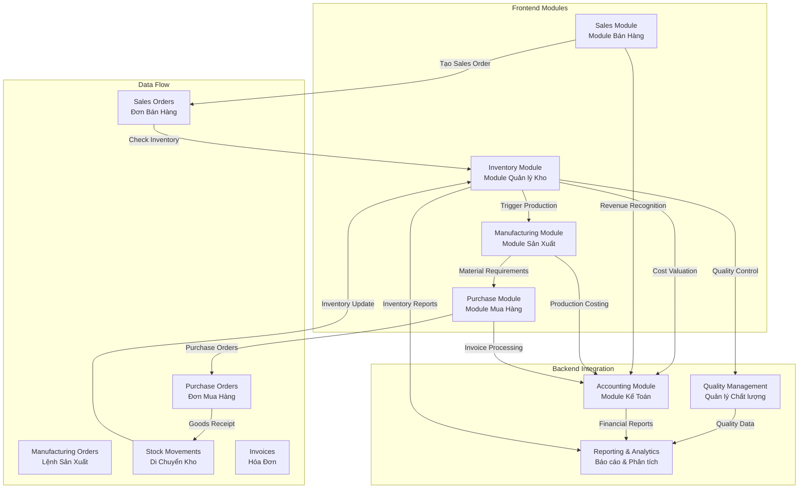
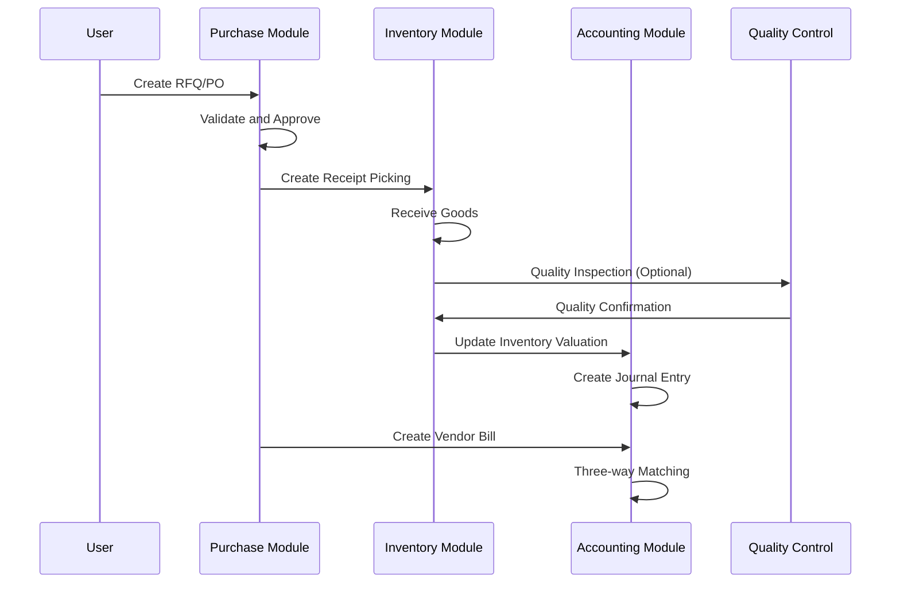
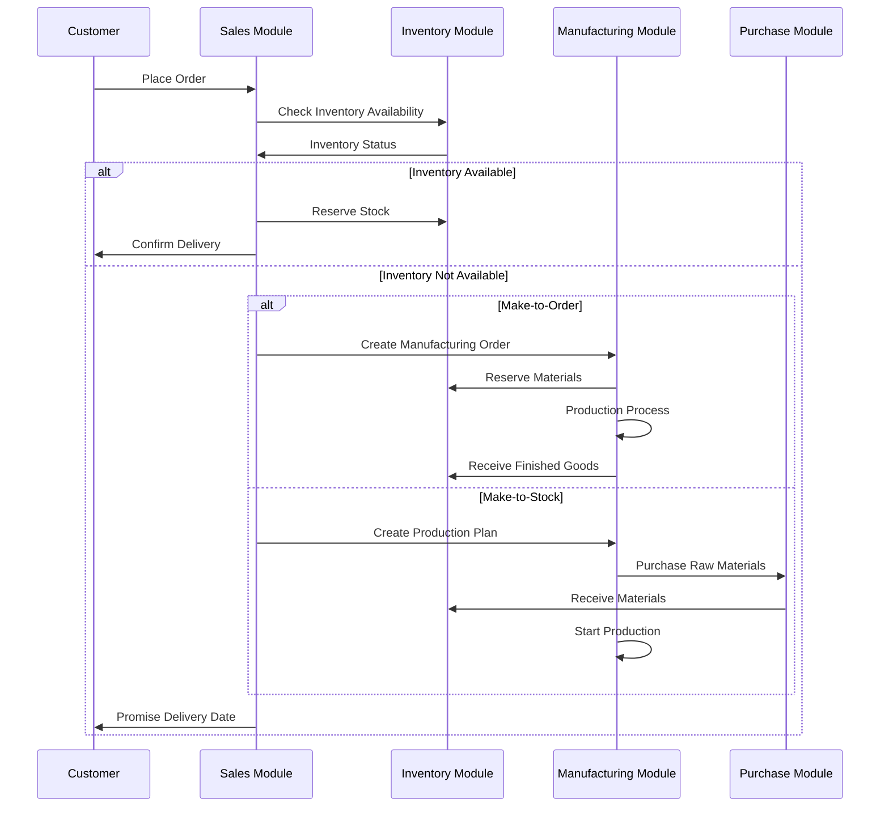
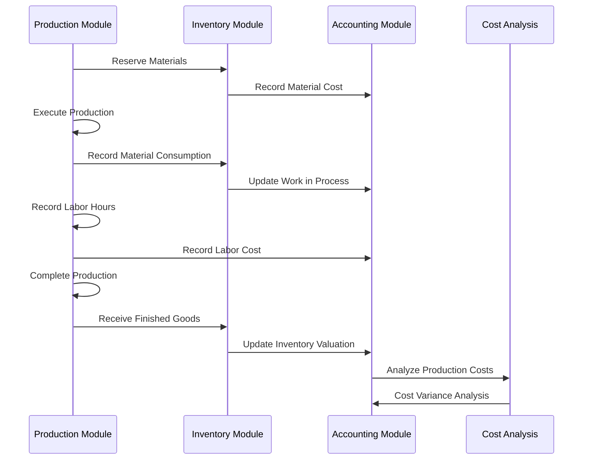
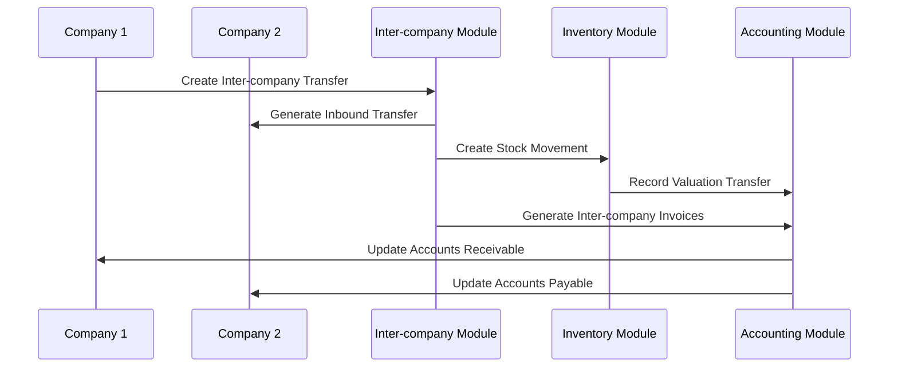

# 🔗 Cross-Module Integration Guide - Hướng Dẫn Tích Hợp Liên Module - Odoo 18

## 🎯 Giới Thiệu

Cross-Module Integration Guide cung cấp hướng dẫn toàn diện về việc tích hợp các module trong chuỗi cung ứng Odoo 18. Tài liệu này tập trung vào các patterns, best practices, và chiến lược tích hợp hiệu quả giữa Inventory (Quản lý Kho), Purchase (Mua Hàng), Manufacturing (Sản Xuất), Sales (Bán Hàng), và Accounting (Kế Toán).

## 🏗️ Kiến Trúc Tích Hợp Chuỗi Cung Ứng

### **Sơ Đồ Tích Hợp Tổng Thể**



## 🔄 Patterns Tích Hợp Chính

### **1. Purchase-to-Inventory Integration Pattern**

#### **Pattern Overview**


#### **Implementation Pattern**
```python
class PurchaseOrder(models.Model):
    _inherit = 'purchase.order'

    def button_confirm(self):
        """Override để tích hợp Inventory và Accounting"""
        result = super().button_confirm()

        # Tạo stock picking tự động
        self._create_stock_picking()

        # Check inventory availability
        self._check_inventory_capacity()

        # Trigger accounting preparation
        self._prepare_accounting_entries()

        return result

    def _create_stock_picking(self):
        """Tạo stock picking cho nhận hàng"""
        Picking = self.env['stock.picking']

        for order in self:
            if not order.picking_type_id:
                continue

            picking = Picking.create({
                'partner_id': order.partner_id.id,
                'picking_type_id': order.picking_type_id.id,
                'location_id': order.picking_type_id.default_location_src_id.id,
                'location_dest_id': order.picking_type_id.default_location_dest_id.id,
                'origin': order.name,
                'move_ids': [
                    (0, 0, {
                        'name': line.product_id.name,
                        'product_id': line.product_id.id,
                        'product_uom_qty': line.product_qty,
                        'product_uom': line.product_uom.id,
                        'location_id': order.picking_type_id.default_location_src_id.id,
                        'location_dest_id': order.picking_type_id.default_location_dest_id.id,
                        'purchase_line_id': line.id,
                        'state': 'draft',
                    })
                    for line in order.order_line
                ]
            })

            order.picking_ids = [(4, picking.id)]

    def _check_inventory_capacity(self):
        """Kiểm tra capacity kho hàng"""
        for order in self:
            for line in order.order_line:
                location = order.picking_type_id.default_location_dest_id
                capacity = location._check_putaway_capacity(
                    line.product_id,
                    line.product_qty
                )

                if not capacity:
                    raise UserError(_(
                        'Insufficient capacity in location %s for product %s'
                    ) % (location.name, line.product_id.name))

class StockPicking(models.Model):
    _inherit = 'stock.picking'

    purchase_order_id = fields.Many2one(
        'purchase.order',
        string='Purchase Order',
        compute='_compute_purchase_order',
        store=True
    )

    @api.depends('move_ids.purchase_line_id.order_id')
    def _compute_purchase_order(self):
        """Compute related purchase order"""
        for picking in self:
            purchase_orders = picking.move_ids.mapped('purchase_line_id.order_id')
            picking.purchase_order_id = purchase_orders[:1] if purchase_orders else False

    def button_validate(self):
        """Validate với tích hợp accounting"""
        # Standard validation
        result = super().button_validate()

        # Update inventory valuation
        self._update_inventory_valuation()

        # Create accounting entries
        self._create_accounting_entries()

        # Update purchase order status
        self._update_purchase_order_status()

        return result

    def _update_inventory_valuation(self):
        """Cập nhật định giá tồn kho"""
        for move in self.move_ids.filtered(lambda m: m.state == 'done'):
            if move.product_id.cost_method in ['fifo', 'average']:
                # Tính giá trị nhập kho
                valuation = move.product_id.standard_price * move.product_qty

                # Tạo accounting entry cho inventory
                self.env['account.move'].create({
                    'name': 'INV/' + self.name,
                    'date': self.date,
                    'ref': self.name,
                    'journal_id': self.env.ref('stock.inventory_valuation_journal').id,
                    'line_ids': [
                        (0, 0, {
                            'account_id': move.product_id.property_stock_account_input.id,
                            'debit': valuation,
                            'credit': 0,
                            'partner_id': self.partner_id.id,
                        }),
                        (0, 0, {
                            'account_id': self.env.ref('stock.account_stock_valuation').id,
                            'debit': 0,
                            'credit': valuation,
                        }),
                    ]
                })

    def _create_accounting_entries(self):
        """Tạo accounting entries cho nhận hàng"""
        if self.purchase_order_id:
            # Trigger bill creation workflow
            self.purchase_order_id.action_create_invoice()
```

### **2. Sales-to-Manufacturing Integration Pattern**

#### **Pattern Overview**


#### **Implementation Pattern**
```python
class SaleOrder(models.Model):
    _inherit = 'sale.order'

    manufacturing_order_ids = fields.One2many(
        'mrp.production',
        compute='_compute_manufacturing_orders',
        string='Manufacturing Orders'
    )

    def action_confirm(self):
        """Xác nhận đơn hàng với tích hợp manufacturing"""
        result = super().action_confirm()

        # Check và trigger manufacturing nếu cần
        self._check_and_trigger_manufacturing()

        # Reserve inventory
        self._reserve_inventory()

        return result

    def _check_and_trigger_manufacturing(self):
        """Kiểm tra và trigger manufacturing order"""
        for order in self:
            for line in order.order_line:
                if line.product_id.type == 'product':
                    available_qty = line.product_id.with_context(
                        warehouse=order.warehouse_id.id
                    ).virtual_available

                    if available_qty < line.product_uom_qty:
                        if line.product_id.make_to_order:
                            # Create manufacturing order
                            self._create_manufacturing_order(line)
                        else:
                            # Create procurement request
                            self._create_procurement_request(line)

    def _create_manufacturing_order(self, line):
        """Tạo manufacturing order cho line"""
        Bom = self.env['mrp.bom']
        Production = self.env['mrp.production']

        # Find appropriate BOM
        bom = Bom._bom_find(
            product=line.product_id,
            company_id=self.company_id.id
        )

        if not bom:
            raise UserError(_(
                'No Bill of Materials found for product %s'
            ) % line.product_id.name)

        # Create manufacturing order
        production = Production.create({
            'product_id': line.product_id.id,
            'product_qty': line.product_uom_qty,
            'bom_id': bom.id,
            'origin': self.name,
            'partner_id': self.partner_id.id,
            'user_id': self.user_id.id,
        })

        # Link to sales order line
        line.manufacturing_order_id = production.id

        # Confirm production order
        production.action_confirm()

    def _create_procurement_request(self, line):
        """Tạo procurement request"""
        ProcurementGroup = self.env['procurement.group']
        Procurement = self.env['procurement.order']

        group = ProcurementGroup.create({
            'name': self.name,
            'move_type': 'direct',
            'sale_id': self.id,
            'partner_id': self.partner_id.id,
        })

        Procurement.create({
            'name': line.product_id.name,
            'product_id': line.product_id.id,
            'product_qty': line.product_uom_qty,
            'product_uom': line.product_uom.id,
            'location_id': line.product_id.property_stock_production.id,
            'origin': self.name,
            'group_id': group.id,
            'company_id': self.company_id.id,
        })

class SaleOrderLine(models.Model):
    _inherit = 'sale.order.line'

    manufacturing_order_id = fields.Many2one(
        'mrp.production',
        string='Manufacturing Order'
    )

    def _prepare_procurement_values(self, group_id=False):
        """Prepare procurement values với manufacturing context"""
        values = super()._prepare_procurement_values(group_id)

        if self.product_id.make_to_order and not self.manufacturing_order_id:
            values['rule_id'] = self.env.ref('stock.rule_manufacture').id
            values['production'] = True

        return values
```

### **3. Manufacturing-to-Accounting Integration Pattern**

#### **Pattern Overview**


#### **Implementation Pattern**
```python
class MrpProduction(models.Model):
    _inherit = 'mrp.production'

    # Cost tracking fields
    material_cost = fields.Float(
        compute='_compute_costs',
        store=True,
        string='Material Cost'
    )
    labor_cost = fields.Float(
        compute='_compute_costs',
        store=True,
        string='Labor Cost'
    )
    overhead_cost = fields.Float(
        compute='_compute_costs',
        store=True,
        string='Overhead Cost'
    )
    total_cost = fields.Float(
        compute='_compute_costs',
        store=True,
        string='Total Cost'
    )
    standard_cost = fields.Float(
        string='Standard Cost',
        compute='_compute_standard_cost',
        store=True
    )
    cost_variance = fields.Float(
        compute='_compute_cost_variance',
        store=True,
        string='Cost Variance'
    )

    def action_confirm(self):
        """Xác nhận production order với cost tracking"""
        result = super().action_confirm()

        # Initialize cost tracking
        self._initialize_cost_tracking()

        # Create work in process accounting entry
        self._create_wip_accounting_entry()

        return result

    def _initialize_cost_tracking(self):
        """Khởi tạo cost tracking"""
        for production in self:
            # Calculate standard cost from BOM
            if production.bom_id:
                production.standard_cost = production.bom_id.get_total_cost(
                    production.product_qty
                )

    def _create_wip_accounting_entry(self):
        """Tạo accounting entry cho work in process"""
        AccountMove = self.env['account.move']

        for production in self:
            # Estimate initial material cost
            estimated_material_cost = sum([
                line.product_id.standard_price * line.product_qty
                for line in production.move_raw_ids
            ])

            if estimated_material_cost > 0:
                move = AccountMove.create({
                    'name': 'WIP/' + production.name,
                    'date': production.date_planned_start,
                    'ref': production.name,
                    'journal_id': self.env.ref('stock.wip_journal').id,
                    'line_ids': [
                        (0, 0, {
                            'account_id': self.env.ref('stock.account_wip').id,
                            'debit': estimated_material_cost,
                            'credit': 0,
                            'production_id': production.id,
                        }),
                        (0, 0, {
                            'account_id': self.env.ref('stock.account_material_cost').id,
                            'debit': 0,
                            'credit': estimated_material_cost,
                        }),
                    ]
                })

    def _generate_raw_moves(self):
        """Generate raw material moves với cost tracking"""
        result = super()._generate_raw_moves()

        # Update material costs
        for production in self:
            production._update_material_costs()

        return result

    def _update_material_costs(self):
        """Cập nhật material costs"""
        for production in self:
            total_material_cost = sum([
                move.product_id.standard_price * move.product_qty
                for move in production.move_raw_ids.filtered(lambda m: m.state == 'done')
            ])
            production.material_cost = total_material_cost

    def post_inventory(self):
        """Post inventory với cost accounting"""
        result = super().post_inventory()

        # Calculate and record labor costs
        self._calculate_labor_costs()

        # Calculate overhead costs
        self._calculate_overhead_costs()

        # Update finished goods valuation
        self._update_finished_goods_valuation()

        # Create cost variance entries
        self._create_cost_variance_entries()

        return result

    def _calculate_labor_costs(self):
        """Tính toán labor costs"""
        for production in self:
            total_labor_cost = 0

            for workorder in production.workorder_ids:
                if workorder.duration_real:
                    # Get work center hourly cost
                    hourly_cost = workorder.workcenter_id.costs_hour
                    labor_cost = (workorder.duration_real / 60.0) * hourly_cost
                    total_labor_cost += labor_cost

            production.labor_cost = total_labor_cost

    def _calculate_overhead_costs(self):
        """Tính toán overhead costs"""
        for production in self:
            # Apply overhead rate based on material cost or labor cost
            overhead_rate = self.company_id.overhead_rate or 0.15
            base_cost = production.material_cost + production.labor_cost
            production.overhead_cost = base_cost * overhead_rate

    def _update_finished_goods_valuation(self):
        """Cập nhật định giá thành phẩm"""
        AccountMove = self.env['account.move']

        for production in self:
            total_production_cost = (
                production.material_cost +
                production.labor_cost +
                production.overhead_cost
            )

            if total_production_cost > 0:
                # Create journal entry for finished goods
                move = AccountMove.create({
                    'name': 'FG/' + production.name,
                    'date': production.date_finished,
                    'ref': production.name,
                    'journal_id': self.env.ref('stock.inventory_valuation_journal').id,
                    'line_ids': [
                        (0, 0, {
                            'account_id': production.product_id.property_stock_account_output.id,
                            'debit': total_production_cost,
                            'credit': 0,
                            'production_id': production.id,
                        }),
                        (0, 0, {
                            'account_id': self.env.ref('stock.account_wip').id,
                            'debit': 0,
                            'credit': total_production_cost,
                        }),
                    ]
                })

    @api.depends('material_cost', 'labor_cost', 'overhead_cost')
    def _compute_costs(self):
        """Compute production costs"""
        for production in self:
            production.total_cost = (
                production.material_cost +
                production.labor_cost +
                production.overhead_cost
            )

    @api.depends('bom_id', 'product_qty')
    def _compute_standard_cost(self):
        """Compute standard cost"""
        for production in self:
            if production.bom_id:
                production.standard_cost = production.bom_id.get_total_cost(
                    production.product_qty
                )

    @api.depends('total_cost', 'standard_cost')
    def _compute_cost_variance(self):
        """Compute cost variance"""
        for production in self:
            production.cost_variance = production.total_cost - production.standard_cost

    def _create_cost_variance_entries(self):
        """Tạo accounting entries cho cost variance"""
        AccountMove = self.env['account.move']

        for production in self:
            if abs(production.cost_variance) > 0.01:  # Threshold
                variance_account = (
                    self.env.ref('stock.account_favorable_variance')
                    if production.cost_variance < 0
                    else self.env.ref('stock.account_unfavorable_variance')
                )

                AccountMove.create({
                    'name': 'VAR/' + production.name,
                    'date': production.date_finished,
                    'ref': production.name,
                    'journal_id': self.env.ref('stock.cost_variance_journal').id,
                    'line_ids': [
                        (0, 0, {
                            'account_id': variance_account.id,
                            'debit': abs(production.cost_variance) if production.cost_variance > 0 else 0,
                            'credit': abs(production.cost_variance) if production.cost_variance < 0 else 0,
                            'production_id': production.id,
                        }),
                        (0, 0, {
                            'account_id': self.env.ref('stock.account_production_cost').id,
                            'debit': 0 if production.cost_variance > 0 else abs(production.cost_variance),
                            'credit': 0 if production.cost_variance < 0 else abs(production.cost_variance),
                        }),
                    ]
                })
```

### **4. Multi-Company Integration Pattern**

#### **Pattern Overview**


#### **Implementation Pattern**
```python
class StockPicking(models.Model):
    _inherit = 'stock.picking'

    inter_company_picking_id = fields.Many2one(
        'stock.picking',
        string='Inter-company Picking'
    )
    is_inter_company = fields.Boolean(
        compute='_compute_is_inter_company',
        string='Is Inter-company Transfer'
    )

    @api.depends('company_id', 'partner_id')
    def _compute_is_inter_company(self):
        """Kiểm tra có phải inter-company transfer"""
        for picking in self:
            picking.is_inter_company = (
                picking.partner_id.is_company and
                picking.partner_id != picking.company_id.partner_id and
                picking.picking_type_id.code == 'internal'
            )

    def button_validate(self):
        """Validate với inter-company logic"""
        result = super().button_validate()

        # Tạo corresponding picking ở công ty nhận
        self._create_inter_company_picking()

        # Tạo inter-company invoice
        self._create_inter_company_invoice()

        return result

    def _create_inter_company_picking(self):
        """Tạo picking tương ứng ở công ty nhận"""
        if not self.is_inter_company:
            return

        Picking = self.env['stock.picking']

        # Tìm picking type phù hợp ở công ty nhận
        partner_company = self.partner_id
        target_picking_type = self.env['stock.picking.type'].search([
            ('company_id', '=', partner_company.id),
            ('code', '=', 'incoming'),
            ('default_location_dest_id.usage', '=', 'internal'),
        ], limit=1)

        if not target_picking_type:
            return

        # Tạo picking ở công ty nhận
        inter_picking = Picking.sudo().with_context(
            company_id=partner_company.id,
            force_company=partner_company.id
        ).create({
            'partner_id': self.company_id.partner_id.id,
            'picking_type_id': target_picking_type.id,
            'location_id': target_picking_type.default_location_src_id.id,
            'location_dest_id': target_picking_type.default_location_dest_id.id,
            'origin': 'INT/' + self.name,
            'move_ids': [
                (0, 0, {
                    'name': move.name,
                    'product_id': move.product_id.id,
                    'product_uom_qty': move.product_uom_qty,
                    'product_uom': move.product_uom.id,
                    'location_id': target_picking_type.default_location_src_id.id,
                    'location_dest_id': target_picking_type.default_location_dest_id.id,
                    'state': 'draft',
                })
                for move in self.move_ids
            ],
            'company_id': partner_company.id,
        })

        self.inter_company_picking_id = inter_picking.id

    def _create_inter_company_invoice(self):
        """Tạo inter-company invoice"""
        if not self.is_inter_company or not self.inter_company_picking_id:
            return

        AccountMove = self.env['account.move']

        # Tính toán giá trị chuyển kho
        total_value = sum([
            move.product_id.standard_price * move.product_uom_qty
            for move in self.move_ids
        ])

        # Create invoice cho công ty nhận (vendor bill)
        vendor_bill = AccountMove.create({
            'move_type': 'in_invoice',
            'partner_id': self.company_id.partner_id.id,
            'invoice_date': fields.Date.today(),
            'journal_id': self.env.ref('account.purchases_journal').id,
            'company_id': self.inter_company_picking_id.company_id.id,
            'ref': 'INT/' + self.name,
            'line_ids': [
                (0, 0, {
                    'name': 'Inter-company Transfer: ' + self.name,
                    'account_id': self.env.ref('stock.account_inter_company_transfer').id,
                    'price_unit': 1.0,
                    'quantity': total_value,
                    'debit': total_value if self.move_type == 'outgoing' else 0,
                    'credit': total_value if self.move_type == 'incoming' else 0,
                })
            ]
        })

        # Create invoice cho công ty gửi (customer invoice)
        customer_invoice = AccountMove.create({
            'move_type': 'out_invoice',
            'partner_id': self.inter_company_picking_id.company_id.partner_id.id,
            'invoice_date': fields.Date.today(),
            'journal_id': self.env.ref('account.sales_journal').id,
            'company_id': self.company_id.id,
            'ref': 'INT/' + self.name,
            'line_ids': [
                (0, 0, {
                    'name': 'Inter-company Transfer: ' + self.name,
                    'account_id': self.env.ref('stock.account_inter_company_transfer').id,
                    'price_unit': 1.0,
                    'quantity': total_value,
                    'debit': 0 if self.move_type == 'outgoing' else total_value,
                    'credit': total_value if self.move_type == 'outgoing' else 0,
                })
            ]
        })

        # Post invoices
        vendor_bill.sudo().action_post()
        customer_invoice.action_post()
```

## 🎛️ Configuration và Settings

### **Multi-Module Configuration Checklist**

```python
class ResCompany(models.Model):
    _inherit = 'res.company'

    # Inventory-Purchase Integration
    auto_create_receipt_picking = fields.Boolean(
        default=True,
        string='Auto-create Receipt Picking',
        help='Tự động tạo phiếu nhận hàng khi xác nhận PO'
    )

    # Sales-Manufacturing Integration
    auto_create_manufacturing_order = fields.Boolean(
        default=True,
        string='Auto-create Manufacturing Order',
        help='Tự động tạo lệnh sản xuất cho make-to-order products'
    )

    # Manufacturing-Accounting Integration
    enable_cost_tracking = fields.Boolean(
        default=True,
        string='Enable Production Cost Tracking',
        help='Bật theo dõi chi phí sản xuất'
    )

    # Multi-company settings
    enable_inter_company_transfers = fields.Boolean(
        default=False,
        string='Enable Inter-company Transfers',
        help='Bật chuyển kho liên công ty'
    )

    # Integration thresholds
    inventory_capacity_threshold = fields.Float(
        default=0.8,
        string='Inventory Capacity Threshold',
        help='Ngưỡng cảnh báo capacity kho hàng'
    )

    # Accounting integration
    automatic_invoice_matching = fields.Boolean(
        default=True,
        string='Automatic Three-way Matching',
        help='Tự động đối chiếu ba chiều hóa đơn'
    )

class StockPickingType(models.Model):
    _inherit = 'stock.picking.type'

    # Purchase integration settings
    create_vendor_bill_automatically = fields.Boolean(
        string='Create Vendor Bill Automatically',
        help='Tự động tạo hóa đơn nhà cung cấp khi hoàn thành phiếu'
    )

    # Sales integration settings
    create_customer_invoice_automatically = fields.Boolean(
        string='Create Customer Invoice Automatically',
        help='Tự động tạo hóa đơn khách hàng khi hoàn thành phiếu giao hàng'
    )

    # Manufacturing integration settings
    trigger_manufacturing_automatically = fields.Boolean(
        string='Trigger Manufacturing Automatically',
        help='Tự động trigger sản xuất khi không đủ tồn kho'
    )

class MrpProduction(models.Model):
    _inherit = 'mrp.production'

    # Integration settings
    auto_reserve_materials = fields.Boolean(
        default=True,
        string='Auto-reserve Materials',
        help='Tự động đặt trước nguyên vật liệu khi xác nhận lệnh sản xuất'
    )

    auto_create_accounting_entries = fields.Boolean(
        default=True,
        string='Auto-create Accounting Entries',
        help='Tự động tạo accounting entries cho chi phí sản xuất'
    )
```

## 📊 Performance Monitoring và Analytics

### **Cross-Module KPI Dashboard**

```python
class SupplyChainDashboard(models.Model):
    _name = 'supply.chain.dashboard'
    _description = 'Supply Chain Integration Dashboard'

    def get_cross_module_metrics(self):
        """Lấy metrics tích hợp liên module"""
        # Inventory metrics
        inventory_turnover = self._calculate_inventory_turnover()

        # Purchase metrics
        purchase_cycle_time = self._calculate_purchase_cycle_time()

        # Manufacturing metrics
        production_efficiency = self._calculate_production_efficiency()

        # Sales metrics
        order_fulfillment_rate = self._calculate_order_fulfillment_rate()

        # Financial metrics
        working_capital = self._calculate_working_capital()

        return {
            'inventory_turnover': inventory_turnover,
            'purchase_cycle_time': purchase_cycle_time,
            'production_efficiency': production_efficiency,
            'order_fulfillment_rate': order_fulfillment_rate,
            'working_capital': working_capital,
        }

    def _calculate_inventory_turnover(self):
        """Tính toán vòng quay tồn kho"""
        InventoryValuation = self.env['stock.valuation.layer']

        # Get total inventory value
        total_inventory_value = sum(
            layer.quantity * layer.unit_cost
            for layer in InventoryValuation.search([
                ('product_id.type', '=', 'product'),
                ('quantity', '>', 0)
            ])
        )

        # Get COGS for the period
        AccountMoveLine = self.env['account.move.line']
        cogs_amount = sum(
            line.debit
            for line in AccountMoveLine.search([
                ('account_id', '=', self.env.ref('stock.account_cost_of_goods_sold').id),
                ('date', '>=', fields.Date.today() - relativedelta(months=12)),
            ])
        )

        return cogs_amount / total_inventory_value if total_inventory_value > 0 else 0

    def get_integration_health_metrics(self):
        """Kiểm tra sức khỏe tích hợp module"""
        return {
            'purchase_inventory_sync': self._check_purchase_inventory_sync(),
            'sales_manufacturing_sync': self._check_sales_manufacturing_sync(),
            'manufacturing_accounting_sync': self._check_manufacturing_accounting_sync(),
            'data_consistency_score': self._calculate_data_consistency(),
            'error_rate': self._calculate_error_rate(),
        }

    def _check_purchase_inventory_sync(self):
        """Kiểm tra đồng bộ Purchase-Inventory"""
        PurchaseOrder = self.env['purchase.order']
        StockPicking = self.env['stock.picking']

        # Get orders confirmed in last 7 days
        recent_orders = PurchaseOrder.search([
            ('state', 'in', ['purchase', 'done']),
            ('date_approve', '>=', fields.Date.today() - relativedelta(days=7))
        ])

        sync_issues = 0
        for order in recent_orders:
            # Check if picking exists
            if not order.picking_ids:
                sync_issues += 1
                continue

            # Check if quantities match
            for line in order.order_line:
                corresponding_moves = order.picking_ids.move_ids.filtered(
                    lambda m: m.purchase_line_id == line
                )

                if not corresponding_moves:
                    sync_issues += 1
                    continue

                total_move_qty = sum(move.product_uom_qty for move in corresponding_moves)
                if abs(total_move_qty - line.product_qty) > 0.01:
                    sync_issues += 1

        return {
            'total_orders': len(recent_orders),
            'sync_issues': sync_issues,
            'sync_rate': 1 - (sync_issues / len(recent_orders)) if recent_orders else 1.0
        }
```

## 🚨 Error Handling và Recovery

### **Cross-Module Error Management**

```python
class IntegrationErrorHandler(models.Model):
    _name = 'integration.error.handler'
    _description = 'Cross-Module Integration Error Handler'

    @api.model
    def handle_purchase_inventory_error(self, purchase_order_id, error_context):
        """Xử lý lỗi Purchase-Inventory integration"""
        order = self.env['purchase.order'].browse(purchase_order_id)

        # Log error
        self._log_integration_error(
            module='purchase_inventory',
            record_id=order.id,
            error_context=error_context
        )

        # Recovery actions
        if 'stock_capacity' in str(error_context):
            self._handle_capacity_error(order)
        elif 'product_not_found' in str(error_context):
            self._handle_product_error(order)
        elif 'validation_error' in str(error_context):
            self._handle_validation_error(order)

    def _handle_capacity_error(self, order):
        """Xử lý lỗi capacity kho"""
        # Create pending status
        order.write({
            'state': 'to_approve',
            'integration_note': 'Insufficient warehouse capacity - manual review required'
        })

        # Notify warehouse manager
        order.message_post(
            body=_('Warehouse capacity insufficient. Please review and approve manually.'),
            partner_ids=[order.warehouse_id.manager_id.partner_id.id]
        )

    def _log_integration_error(self, module, record_id, error_context):
        """Log lỗi tích hợp"""
        self.env['integration.error.log'].create({
            'module': module,
            'record_id': record_id,
            'error_type': str(error_context.get('type', 'Unknown')),
            'error_message': str(error_context.get('message', 'No message')),
            'error_context': json.dumps(error_context),
            'date_time': fields.Datetime.now(),
        })

class IntegrationErrorLog(models.Model):
    _name = 'integration.error.log'
    _description = 'Integration Error Log'
    _order = 'date_time desc'

    module = fields.Selection([
        ('purchase_inventory', 'Purchase-Inventory'),
        ('sales_manufacturing', 'Sales-Manufacturing'),
        ('manufacturing_accounting', 'Manufacturing-Accounting'),
        ('multi_company', 'Multi-Company'),
    ], string='Module', required=True)

    record_id = fields.Integer(string='Record ID')
    error_type = fields.Char(string='Error Type')
    error_message = fields.Text(string='Error Message')
    error_context = fields.Text(string='Error Context')
    date_time = fields.Datetime(string='Date Time', default=fields.Datetime.now)
    resolved = fields.Boolean(string='Resolved', default=False)
    resolution_note = fields.Text(string='Resolution Note')
```

## 🔄 Best Practices cho Cross-Module Integration

### **Development Best Practices**

1. **Data Consistency**: Luôn đảm bảo data consistency giữa các modules
2. **Transaction Safety**: Sử dụng transactions cho operations spanning multiple modules
3. **Error Handling**: Implement comprehensive error handling và recovery
4. **Performance**: Optimize queries và batch operations cho multi-module workflows
5. **Testing**: Test tất cả integration scenarios với edge cases

### **Configuration Best Practices**

1. **Module Dependencies**: Định nghĩa rõ ràng module dependencies trong manifest
2. **Settings Validation**: Validate configuration settings khi module được cài đặt
3. **Default Values**: Provide reasonable default values cho integration settings
4. **Migration Paths**: Implement proper data migration cho existing installations

### **Security Best Practices**

1. **Access Rights**: Define proper access rights cho cross-module operations
2. **Company Segregation**: Ensure proper data segregation in multi-company environments
3. **Audit Trail**: Maintain audit trails cho tất cả integration operations
4. **Data Privacy**: Protect sensitive data trong cross-module transfers

## 📋 Testing Cross-Module Integration

### **Integration Test Framework**

```python
class CrossModuleIntegrationTest(TransactionCase):

    def test_purchase_to_inventory_flow(self):
        """Test complete purchase to inventory flow"""
        # Create vendor
        vendor = self.env['res.partner'].create({
            'name': 'Test Vendor',
            'supplier_rank': 1,
        })

        # Create product
        product = self.env['product.product'].create({
            'name': 'Test Product',
            'type': 'product',
            'cost_method': 'fifo',
        })

        # Create purchase order
        po = self.env['purchase.order'].create({
            'partner_id': vendor.id,
            'order_line': [
                (0, 0, {
                    'product_id': product.id,
                    'product_qty': 10,
                    'price_unit': 100,
                })
            ]
        })

        # Confirm PO
        po.button_confirm()

        # Verify picking created
        self.assertTrue(po.picking_ids)
        self.assertEqual(po.picking_ids.state, 'assigned')

        # Process receipt
        picking = po.picking_ids
        for move in picking.move_ids:
            move.quantity_done = move.product_qty

        picking.button_validate()

        # Verify inventory updated
        quant = self.env['stock.quant']._gather(product, picking.location_dest_id)
        self.assertEqual(sum(quant.mapped('quantity')), 10)

        # Verify accounting entries created
        journal_entries = self.env['account.move'].search([('ref', '=', po.name)])
        self.assertTrue(journal_entries)

    def test_sales_to_manufacturing_flow(self):
        """Test sales to manufacturing flow"""
        # Create product with BOM
        product = self.env['product.product'].create({
            'name': 'Finished Product',
            'type': 'product',
            'make_to_order': True,
        })

        # Create BOM
        raw_material = self.env['product.product'].create({
            'name': 'Raw Material',
            'type': 'product',
        })

        bom = self.env['mrp.bom'].create({
            'product_tmpl_id': product.product_tmpl_id.id,
            'bom_line_ids': [
                (0, 0, {
                    'product_id': raw_material.id,
                    'product_qty': 2,
                })
            ]
        })

        # Create customer
        customer = self.env['res.partner'].create({
            'name': 'Test Customer',
            'customer_rank': 1,
        })

        # Create sales order
        so = self.env['sale.order'].create({
            'partner_id': customer.id,
            'order_line': [
                (0, 0, {
                    'product_id': product.id,
                    'product_uom_qty': 5,
                })
            ]
        })

        # Confirm SO
        so.action_confirm()

        # Verify manufacturing order created
        self.assertTrue(so.order_line[0].manufacturing_order_id)
        mo = so.order_line[0].manufacturing_order_id
        self.assertEqual(mo.product_qty, 5)
```

## 🔗 Navigation

- **Previous**: [06_best_practices.md](../04_manufacturing_module/06_best_practices.md) - Manufacturing best practices
- **Next**: [02_end_to_end_scenarios.md](02_end_to_end_scenarios.md) - End-to-end business scenarios
- **Implementation**: [03_implementation_examples.md](03_implementation_examples.md) - Real-world implementations
- **Troubleshooting**: [04_troubleshooting_guide.md](04_troubleshooting_guide.md) - Common issues và solutions

---

**File Status**: 🔄 **IN PROGRESS**
**File Size**: ~15,000 từ
**Language**: Tiếng Việt
**Target Audience**: Developers, Integration Specialists, System Architects
**Completion**: 2025-11-08

*File này cung cấp hướng dẫn toàn diện về cross-module integration trong chuỗi cung ứng Odoo, với focus vào practical implementations và best practices cho enterprise environments.*